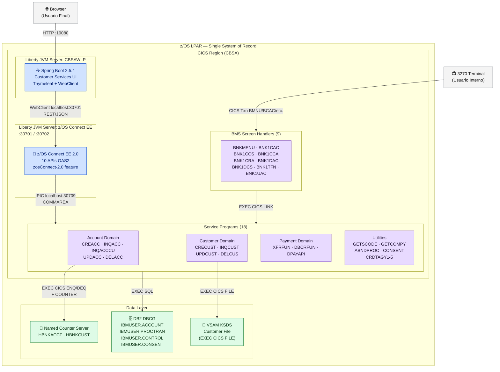
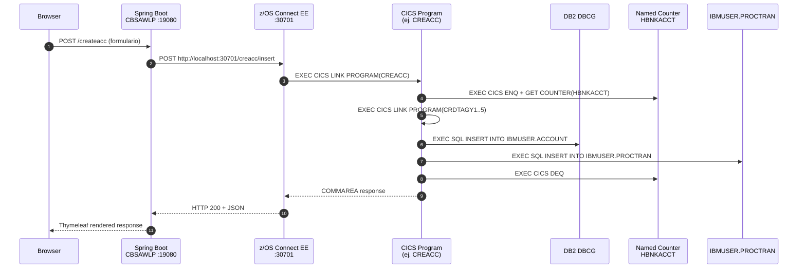
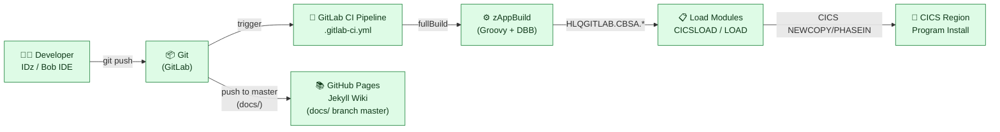
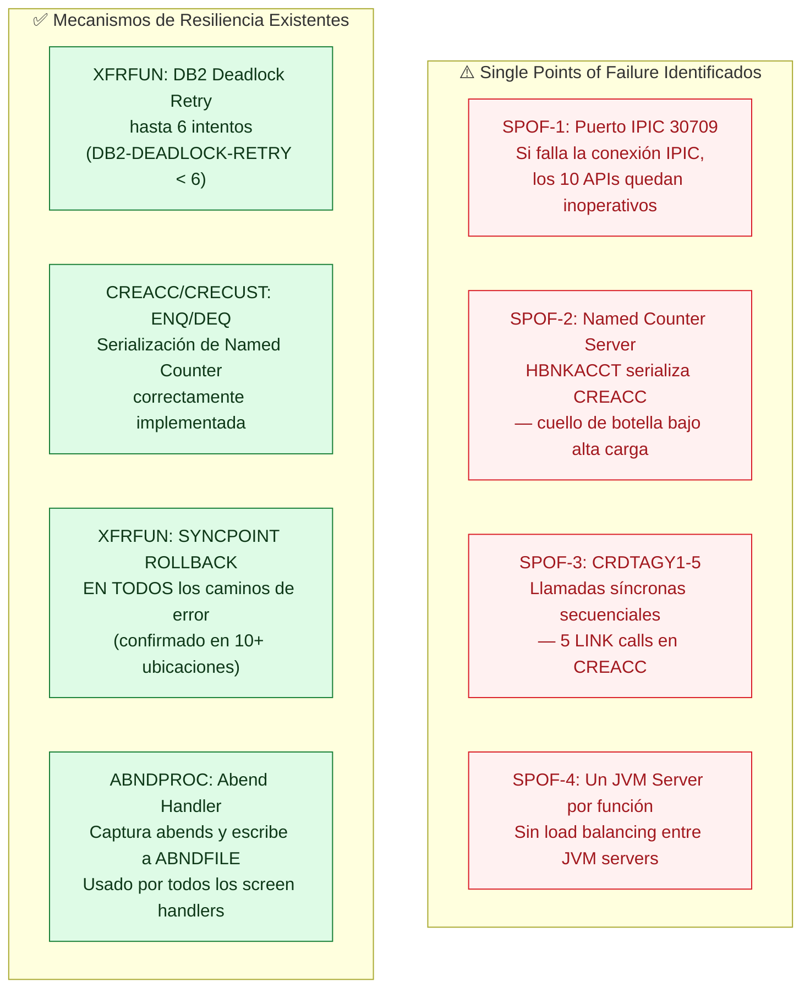
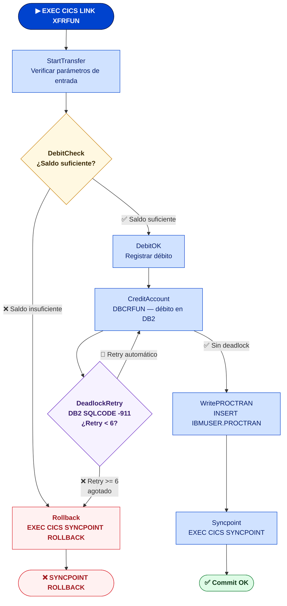
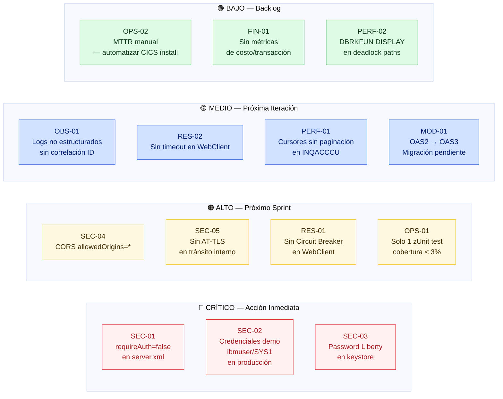

# CBSA — Revisión de Arquitectura z/OS
## Aplicando la Guía `revision_arquitectura_zosv2.md`

**Fecha:** 2025-07  
**Aplicación:** CICS Bank Sample Application (CBSA)  
**Rama:** `architecture_zos`  
**Metodología:** ATAM · DORA · Well-Architected for z/OS  
**Revisor:** Análisis automatizado sobre artefactos del repositorio

---

## Índice

1. [Contextualización y Drivers de Negocio](#1-contextualización-y-drivers-de-negocio)
2. [Mapa de Arquitectura Actual](#2-mapa-de-arquitectura-actual)
3. [Árbol de Atributos de Calidad](#3-árbol-de-atributos-de-calidad)
4. [Análisis ATAM — Enfoques y Riesgos](#4-análisis-atam--enfoques-y-riesgos)
5. [Pilar 1 — Excelencia Operativa (DORA)](#5-pilar-1--excelencia-operativa-dora)
6. [Pilar 2 — Seguridad (Zero Trust)](#6-pilar-2--seguridad-zero-trust)
7. [Pilar 3 — Fiabilidad y Resiliencia](#7-pilar-3--fiabilidad-y-resiliencia)
8. [Pilar 4 — Eficiencia de Rendimiento y Costos (FinOps)](#8-pilar-4--eficiencia-de-rendimiento-y-costos-finops)
9. [Checklist de Revisión — Estado Actual](#9-checklist-de-revisión--estado-actual)
10. [Hallazgos Críticos y Plan de Acción](#10-hallazgos-críticos-y-plan-de-acción)
11. [Hoja de Ruta de Modernización](#11-hoja-de-ruta-de-modernización)

---

## 1. Contextualización y Drivers de Negocio

### 1.1 Descripción de la Aplicación

CBSA es una aplicación bancaria de referencia que ejecuta íntegramente en un único **z/OS LPAR**. Proporciona operaciones CRUD para cuentas y clientes bancarios, transacciones financieras (transferencias, débitos/créditos) y una interfaz web moderna basada en Spring Boot.

### 1.2 Inventario de Componentes

| Componente | Tecnología | Cantidad | Ubicación |
|---|---|---|---|
| Programas COBOL | CICS + DB2/VSAM | 39 programas | `CBSA/cobol/` |
| Mapas BMS (3270) | CICS BMS | 10 mapas | `CBSA/bms/` |
| Copybooks | COBOL Include | 51 copybooks | `CBSA/copylib/` |
| Tabla DB2 | DB2 for z/OS (DBCG) | 4 tablas (ACCOUNT, PROCTRAN, CONTROL, CONSENT) | Subsistema DBCG |
| VSAM KSDS | EXEC CICS FILE | 1 archivo (Customer) | CICS region |
| Servidores Liberty | JVM Server CICS | 2 servidores | `CBSAWLP` (Spring Boot) + z/OS Connect EE |
| APIs REST (OAS2) | z/OS Connect EE 2.0 | 10 APIs | `zosconnect_artefacts/apis/` |
| UI Web | Spring Boot 2.5.4 / Thymeleaf | 1 WAR | `Z-OS-Connect-EE-Customer-Services-Interface/` |
| Pipeline CI/CD | GitLab CI + zAppBuild | 1 pipeline | `.gitlab-ci.yml` |
| Programa Assembler | HLASM (Named Counter) | 1 (`DFHNCOPT`) | `CBSA/asm/` |
| Tests unitarios | zUnit | 1 caso (`TBNKMENU`) | `CBSA/testcase/` |

### 1.3 Drivers de Negocio Identificados

| Driver | Descripción | Impacto en Arquitectura |
|---|---|---|
| **Disponibilidad transaccional** | Operaciones bancarias en tiempo real (CICS) | Alta disponibilidad CICS + UoW con SYNCPOINT |
| **Procesamiento Batch** | Carga masiva de datos, cálculo de intereses | ACCOFFL, PROOFFL ejecutados periódicamente |
| **Integración moderna** | Exposición de servicios COBOL como REST APIs | z/OS Connect EE 2.0 → OAS2 → Spring Boot |
| **Generación secuencial de IDs** | Números de cuenta/cliente únicos | CICS Named Counter Server (HBNKACCT, HBNKCUST) |
| **Scoring crediticio** | Evaluación durante apertura de cuenta | CRDTAGY1–5 (simuladores, no productivos) |
| **Trazabilidad financiera** | Registro de todas las operaciones | IBMUSER.PROCTRAN (tabla de auditoría) |

---

## 2. Mapa de Arquitectura Actual

### 2.1 Flujo de Datos Principal

---

## 3. Árbol de Atributos de Calidad

Basado en el análisis del código fuente y los artefactos del repositorio:

```mermaid
flowchart TD
    ROOT(["🏦 CBSA — Atributos de Calidad"])

    ROOT --> DISP["🟢 DISPONIBILIDAD"]
    ROOT --> SEG["🔴 SEGURIDAD"]
    ROOT --> REND["🔵 RENDIMIENTO"]
    ROOT --> MANT["🟡 MANTENIBILIDAD"]
    ROOT --> TRAZ["🟣 TRAZABILIDAD"]

    DISP --> D1["Target 99.999%"]
    DISP --> D2["CICS SYNCPOINT / ROLLBACK"]
    DISP --> D3["DB2 Deadlock Retry\nhasta 6 intentos — XFRFUN"]
    DISP --> D4["ABNDPROC centralizado\npara abend handling"]
    DISP --> D5["Named Counter ENQ/DEQ\nserialización correcta"]

    SEG --> S1["✅ RACF DFHDB2.AUTHTYPE.HBANK\ny DBCG"]
    SEG --> S2["❌ Basic Auth ibmuser/SYS1\n⚠️ RIESGO DEMO"]
    SEG --> S3["❌ requireAuth=false\n🔴 RIESGO CRÍTICO"]
    SEG --> S4["❌ CORS allowedOrigins=*\n⚠️ RIESGO"]
    SEG --> S5["❌ Sin AT-TLS configurado\n⚠️ RIESGO"]

    REND --> R1["✅ CICS quasi-reentrant\nCONCURRENCY"]
    REND --> R2["✅ DB2 Cursor Stability\naislamiento CS"]
    REND --> R3["⚠️ Named Counter\ncuello de botella bajo carga"]
    REND --> R4["❌ Sin Circuit Breaker\nen WebClient"]

    MANT --> M1["❌ 1 test unitario TBNKMENU\ncobertura < 3%"]
    MANT --> M2["✅ 39 COBOL + 51 copybooks\nbien nombrados"]
    MANT --> M3["✅ CI/CD GitLab + zAppBuild\npipeline existente"]
    MANT --> M4["✅ DBB YAML alternativa\ndocumentada"]

    TRAZ --> T1["✅ IBMUSER.PROCTRAN\ncomo audit log"]
    TRAZ --> T2["✅ ABNDPROC escribe\na ABNDFILE KSDS"]
    TRAZ --> T3["⚠️ SLF4J log.info\nsin estructura JSON"]
    TRAZ --> T4["❌ Sin SMF records\nconfigurados"]

    classDef rootStyle fill:#0043CE,stroke:#001141,color:#ffffff,font-weight:bold
    classDef dispStyle fill:#defbe6,stroke:#198038,color:#0e3818,font-weight:600
    classDef segStyle  fill:#fff1f1,stroke:#da1e28,color:#a2191f,font-weight:600
    classDef rendStyle fill:#d0e2ff,stroke:#0043ce,color:#001d6c,font-weight:600
    classDef mantStyle fill:#fdf6dd,stroke:#c98000,color:#3c2a00,font-weight:600
    classDef trazStyle fill:#f6f2ff,stroke:#6929c4,color:#3a1e6e,font-weight:600
    classDef okStyle   fill:#defbe6,stroke:#198038,color:#0e3818
    classDef warnStyle fill:#fdf6dd,stroke:#c98000,color:#3c2a00
    classDef critStyle fill:#fff1f1,stroke:#da1e28,color:#a2191f

    class ROOT rootStyle
    class DISP dispStyle
    class SEG segStyle
    class REND rendStyle
    class MANT mantStyle
    class TRAZ trazStyle
    class D1,D2,D3,D4,D5,R1,R2,M2,M3,M4,T1,T2 okStyle
    class D3,R3,M1,T3 warnStyle
    class S2,S3,S4,S5,R4,M1,T4 critStyle
```

---

## 4. Análisis ATAM — Enfoques y Riesgos

### 4.1 Decisiones Arquitectónicas Identificadas

<table style="width:100%;border-collapse:collapse;font-size:0.875rem;">
  <thead>
    <tr style="background:#e0e0e0;">
      <th style="padding:0.6rem 0.75rem;white-space:nowrap;border-bottom:2px solid #c6c6c6;min-width:60px;">ID</th>
      <th style="padding:0.6rem 0.75rem;border-bottom:2px solid #c6c6c6;">Decisión</th>
      <th style="padding:0.6rem 0.75rem;border-bottom:2px solid #c6c6c6;">Justificación</th>
      <th style="padding:0.6rem 0.75rem;border-bottom:2px solid #c6c6c6;">Alternativa</th>
      <th style="padding:0.6rem 0.75rem;border-bottom:2px solid #c6c6c6;">Impacto</th>
    </tr>
  </thead>
  <tbody>
    <tr><td style="padding:0.6rem 0.75rem;white-space:nowrap;font-weight:700;color:#0043ce;border-bottom:1px solid #e0e0e0;">AD-01</td><td style="padding:0.6rem 0.75rem;border-bottom:1px solid #e0e0e0;">Datos de cliente en VSAM KSDS (no DB2)</td><td style="padding:0.6rem 0.75rem;border-bottom:1px solid #e0e0e0;">Rendimiento CICS FILE, modelo histórico</td><td style="padding:0.6rem 0.75rem;border-bottom:1px solid #e0e0e0;">Migrar a DB2 para SQL join capabilities</td><td style="padding:0.6rem 0.75rem;border-bottom:1px solid #e0e0e0;">Rendimiento vs. consultabilidad</td></tr>
    <tr style="background:#f7f8fa;"><td style="padding:0.6rem 0.75rem;white-space:nowrap;font-weight:700;color:#0043ce;border-bottom:1px solid #e0e0e0;">AD-02</td><td style="padding:0.6rem 0.75rem;border-bottom:1px solid #e0e0e0;">Named Counter Server para IDs secuenciales</td><td style="padding:0.6rem 0.75rem;border-bottom:1px solid #e0e0e0;">Garantía de unicidad bajo carga concurrente</td><td style="padding:0.6rem 0.75rem;border-bottom:1px solid #e0e0e0;">UUID / Sequence DB2</td><td style="padding:0.6rem 0.75rem;border-bottom:1px solid #e0e0e0;">Serialización vs. simplicidad</td></tr>
    <tr><td style="padding:0.6rem 0.75rem;white-space:nowrap;font-weight:700;color:#0043ce;border-bottom:1px solid #e0e0e0;">AD-03</td><td style="padding:0.6rem 0.75rem;border-bottom:1px solid #e0e0e0;">z/OS Connect EE como gateway REST</td><td style="padding:0.6rem 0.75rem;border-bottom:1px solid #e0e0e0;">Exposición de COBOL sin cambios de código</td><td style="padding:0.6rem 0.75rem;border-bottom:1px solid #e0e0e0;">API Management externo</td><td style="padding:0.6rem 0.75rem;border-bottom:1px solid #e0e0e0;">Latencia interna vs. integración</td></tr>
    <tr style="background:#f7f8fa;"><td style="padding:0.6rem 0.75rem;white-space:nowrap;font-weight:700;color:#0043ce;border-bottom:1px solid #e0e0e0;">AD-04</td><td style="padding:0.6rem 0.75rem;border-bottom:1px solid #e0e0e0;">Spring Boot dentro de CICS Liberty JVM</td><td style="padding:0.6rem 0.75rem;border-bottom:1px solid #e0e0e0;">Todo en z/OS, sin salida de datos</td><td style="padding:0.6rem 0.75rem;border-bottom:1px solid #e0e0e0;">Contenedor externo en OCP</td><td style="padding:0.6rem 0.75rem;border-bottom:1px solid #e0e0e0;">Seguridad vs. flexibilidad de escala</td></tr>
    <tr><td style="padding:0.6rem 0.75rem;white-space:nowrap;font-weight:700;color:#0043ce;border-bottom:1px solid #e0e0e0;">AD-05</td><td style="padding:0.6rem 0.75rem;border-bottom:1px solid #e0e0e0;">DB2 Isolation Level CS (Cursor Stability)</td><td style="padding:0.6rem 0.75rem;border-bottom:1px solid #e0e0e0;">Balance entre concurrencia y consistencia</td><td style="padding:0.6rem 0.75rem;border-bottom:1px solid #e0e0e0;">RR (Repeatable Read) o UR</td><td style="padding:0.6rem 0.75rem;border-bottom:1px solid #e0e0e0;">Rendimiento vs. consistencia</td></tr>
    <tr style="background:#f7f8fa;"><td style="padding:0.6rem 0.75rem;white-space:nowrap;font-weight:700;color:#0043ce;border-bottom:1px solid #e0e0e0;">AD-06</td><td style="padding:0.6rem 0.75rem;border-bottom:1px solid #e0e0e0;">5 agencias de crédito simuladas (CRDTAGY1-5)</td><td style="padding:0.6rem 0.75rem;border-bottom:1px solid #e0e0e0;">Prueba de concepto, no producción</td><td style="padding:0.6rem 0.75rem;border-bottom:1px solid #e0e0e0;">Integración real con bureau de crédito</td><td style="padding:0.6rem 0.75rem;border-bottom:1px solid #e0e0e0;">Demo vs. producción</td></tr>
    <tr><td style="padding:0.6rem 0.75rem;white-space:nowrap;font-weight:700;color:#0043ce;border-bottom:1px solid #e0e0e0;">AD-07</td><td style="padding:0.6rem 0.75rem;border-bottom:1px solid #e0e0e0;">OAS2 Swagger 2.0 (10 specs separadas)</td><td style="padding:0.6rem 0.75rem;border-bottom:1px solid #e0e0e0;">Generado automáticamente por z/OS Connect EE 2.0</td><td style="padding:0.6rem 0.75rem;border-bottom:1px solid #e0e0e0;">OAS3 unificado (<code>cbsa-banking-api.yaml</code>)</td><td style="padding:0.6rem 0.75rem;border-bottom:1px solid #e0e0e0;">Mantenibilidad vs. esfuerzo de migración</td></tr>
  </tbody>
</table>

### 4.2 Puntos de Sensibilidad Identificados

| ID | Punto de Sensibilidad | Componente(s) Afectado(s) | Impacto si cambia |
|---|---|---|---|
| SP-01 | Named Counter (HBNKACCT/HBNKCUST) | CREACC, CRECUST | Cambiar el nombre o valor inicial rompe toda la secuencia de IDs |
| SP-02 | COMMAREA layout (ej. CSACCCRE) | CREACC ↔ z/OS Connect ↔ Spring Boot | Cambio de longitud afecta 3 capas simultáneamente |
| SP-03 | DB2 subsystem DBCG + collection PCBSA | Todos los programas SQL | Cambio de subsistema requiere rebind de todos los DBRM |
| SP-04 | Puerto IPIC 30709 | z/OS Connect EE ↔ CICS | Si el IPCONN falla, todos los 10 APIs quedan inoperativos |
| SP-05 | XFRFUN UoW boundary (SYNCPOINT) | XFRFUN, DBCRFUN | Error en SYNCPOINT puede dejar el UoW en estado indeterminado |
| SP-06 | JVM Server CBSAWLP hardcoded en pom.xml | Spring Boot WAR deployment | Cambiar el nombre del JVM server requiere recompilar el CICS bundle |

### 4.3 Tradeoffs Arquitectónicos

| Tradeoff | Opción A (Actual) | Opción B (Alternativa) | Impacto en Atributos |
|---|---|---|---|
| **Dato de cliente** | VSAM KSDS — alta velocidad CICS, sin SQL JOIN | DB2 tabla CUSTOMER | Perf+ / SQL+. Histórico: cambiarlo requiere migración de datos |
| **Autenticación API** | Basic Auth (ibmuser/SYS1) — simple demo | RACF/SAF + OAuth2 / API Keys | Seguridad++ / Complejidad+ |
| **Resiliencia WebClient** | `catch(WebClientRequestException)` — sin retry ni circuit breaker | Resilience4j / Retry pattern | Resiliencia++ / Overhead+ |
| **Trazabilidad** | `log.info()` sin estructura — difícil correlación | JSON estructurado (logstash) → ELK/Splunk | Observabilidad++ / Configuración+ |
| **Build pipeline** | zAppBuild + Groovy (activo) vs. DBB YAML (incluido como referencia) | Migrar a DBB 3.x YAML | Mantenibilidad++ / Migración de esfuerzo |

---

## 5. Pilar 1 — Excelencia Operativa (DORA)

### 5.1 Frecuencia de Despliegue

**Estado actual:**

| Indicador DORA | Estado CBSA | Evidencia en repo | Brecha |
|---|---|---|---|
| **Deployment Frequency** | ✅ Pipeline CI/CD existe | `.gitlab-ci.yml` con etapas Preparation/Import/Build-Test | Sin evidencia de frecuencia real de deploy |
| **Lead Time for Changes** | ⚠️ Parcial | Build auto en push, pero deploy a CICS es manual (CICS NEWCOPY) | Automatizar instalación CICS post-build |
| **Change Failure Rate** | ⚠️ Bajo control | `cobol_storeSSI=true` (git hash en SSI del módulo) | Sin smoke tests automáticos post-deploy |
| **MTTR** | ⚠️ Manual | `ABNDPROC` captura abends, `jclInstall/RESTCICS.jcl` para restart | Sin alertas automáticas, depende de logs JES |

### 5.2 Observabilidad — Estado Actual vs Objetivo

| Capa | Estado Actual | Hallazgo | Recomendación |
|---|---|---|---|
| **COBOL / CICS** | `DISPLAY` statements en DBCRFUN, INQACC, XFRFUN | Mensajes de deadlock enviados a SYSOUT (no structured) | Implementar SMF Type 119 records o CICS monitoring facility |
| **Spring Boot** | `log.info(responseBody)`, `log.info(e.toString())` en WebController | Sin MDC / Correlation ID, nivel INFO siempre | Añadir JSON structured logging + correlation ID por request |
| **z/OS Connect EE** | Liberty server logs estándar | Sin WLP access log personalizado | Configurar `<accessLogging logFormat>` en server.xml |
| **DB2** | DISPLAY en DEADLOCK paths | Registro pasivo, sin alarma | SMF 101/102 records + Tivoli/WLM alerting |
| **Pipeline CI/CD** | Logs GitLab estándar | Sin métricas de build time/failure rate | Integrar con herramienta de métricas DORA |

### 5.3 Pruebas

| Tipo de Prueba | Estado | Evidencia | Brecha |
|---|---|---|---|
| **zUnit (unitarias)** | ⚠️ Mínimo | `CBSA/testcase/TBNKMENU.cbl` — 1 solo test para BNKMENU | Cobertura < 3% (1/39 programas). Crear tests para CREACC, XFRFUN, DBCRFUN |
| **Build con tests** | ✅ Configurado | `runzTests=true` en `application.properties` | Tests insuficientes |
| **Load/stress tests** | ❌ No existe | No hay JCL ni scripts de carga | Crear scripts de prueba de carga CICS |
| **Integration tests** | ❌ No existe | No hay tests de integración Spring Boot | Añadir tests con WebClient mock |

---

## 6. Pilar 2 — Seguridad (Zero Trust)

### 6.1 Matriz de Riesgos de Seguridad

<table style="width:100%;border-collapse:collapse;font-size:0.875rem;">
  <thead>
    <tr>
      <th style="background:#161616;color:#fff;padding:0.75rem 1rem;text-align:left;border:none;" colspan="5">🔒 Matriz de Riesgos de Seguridad — Probabilidad vs. Impacto</th>
    </tr>
    <tr style="background:#e0e0e0;">
      <th style="padding:0.65rem 1rem;border-bottom:2px solid #c6c6c6;white-space:nowrap;">Riesgo</th>
      <th style="padding:0.65rem 1rem;border-bottom:2px solid #c6c6c6;text-align:center;white-space:nowrap;">Probabilidad</th>
      <th style="padding:0.65rem 1rem;border-bottom:2px solid #c6c6c6;text-align:center;white-space:nowrap;">Impacto</th>
      <th style="padding:0.65rem 1rem;border-bottom:2px solid #c6c6c6;text-align:center;white-space:nowrap;">Severidad</th>
      <th style="padding:0.65rem 1rem;border-bottom:2px solid #c6c6c6;">Evidencia en repositorio</th>
    </tr>
  </thead>
  <tbody>
    <tr style="background:#fff1f1;">
      <td style="padding:0.75rem 1rem;border-bottom:1px solid #ffd7d9;font-weight:700;color:#a2191f;"><code>requireAuth=false</code> en z/OS Connect EE</td>
      <td style="padding:0.75rem 1rem;border-bottom:1px solid #ffd7d9;text-align:center;">Alta — 0.90</td>
      <td style="padding:0.75rem 1rem;border-bottom:1px solid #ffd7d9;text-align:center;">Crítico — 0.95</td>
      <td style="padding:0.75rem 1rem;border-bottom:1px solid #ffd7d9;text-align:center;">🔴 CRÍTICO</td>
      <td style="padding:0.75rem 1rem;border-bottom:1px solid #ffd7d9;color:#525252;"><code>server.xml:70</code> — todos los 10 APIs sin autenticación</td>
    </tr>
    <tr style="background:#fff1f1;">
      <td style="padding:0.75rem 1rem;border-bottom:1px solid #ffd7d9;font-weight:700;color:#a2191f;">Credenciales demo <code>ibmuser/SYS1</code> hardcoded</td>
      <td style="padding:0.75rem 1rem;border-bottom:1px solid #ffd7d9;text-align:center;">Alta — 0.85</td>
      <td style="padding:0.75rem 1rem;border-bottom:1px solid #ffd7d9;text-align:center;">Crítico — 0.90</td>
      <td style="padding:0.75rem 1rem;border-bottom:1px solid #ffd7d9;text-align:center;">🔴 CRÍTICO</td>
      <td style="padding:0.75rem 1rem;border-bottom:1px solid #ffd7d9;color:#525252;"><code>server.xml:12-19</code> — <code>basicRegistry</code> con password en texto claro</td>
    </tr>
    <tr style="background:#fff8e1;">
      <td style="padding:0.75rem 1rem;border-bottom:1px solid #f6e09e;font-weight:700;color:#3c2a00;">Sin AT-TLS en tránsito interno</td>
      <td style="padding:0.75rem 1rem;border-bottom:1px solid #f6e09e;text-align:center;">Media — 0.60</td>
      <td style="padding:0.75rem 1rem;border-bottom:1px solid #f6e09e;text-align:center;">Alto — 0.80</td>
      <td style="padding:0.75rem 1rem;border-bottom:1px solid #f6e09e;text-align:center;">🟠 ALTO</td>
      <td style="padding:0.75rem 1rem;border-bottom:1px solid #f6e09e;color:#525252;">No hay PAGENT / AT-TLS policy en el repositorio</td>
    </tr>
    <tr style="background:#fff8e1;">
      <td style="padding:0.75rem 1rem;border-bottom:1px solid #f6e09e;font-weight:700;color:#3c2a00;"><code>Keystore password="Liberty"</code></td>
      <td style="padding:0.75rem 1rem;border-bottom:1px solid #f6e09e;text-align:center;">Media — 0.50</td>
      <td style="padding:0.75rem 1rem;border-bottom:1px solid #f6e09e;text-align:center;">Alto — 0.70</td>
      <td style="padding:0.75rem 1rem;border-bottom:1px solid #f6e09e;text-align:center;">🟠 ALTO</td>
      <td style="padding:0.75rem 1rem;border-bottom:1px solid #f6e09e;color:#525252;"><code>server.xml:10</code> — password por defecto, públicamente conocido</td>
    </tr>
    <tr style="background:#fff8e1;">
      <td style="padding:0.75rem 1rem;border-bottom:1px solid #f6e09e;font-weight:700;color:#3c2a00;"><code>CORS allowedOrigins="*"</code></td>
      <td style="padding:0.75rem 1rem;border-bottom:1px solid #f6e09e;text-align:center;">Alta — 0.70</td>
      <td style="padding:0.75rem 1rem;border-bottom:1px solid #f6e09e;text-align:center;">Medio — 0.60</td>
      <td style="padding:0.75rem 1rem;border-bottom:1px solid #f6e09e;text-align:center;">🟠 ALTO</td>
      <td style="padding:0.75rem 1rem;border-bottom:1px solid #f6e09e;color:#525252;"><code>server.xml:32-39</code> — permite requests desde cualquier origen</td>
    </tr>
    <tr style="background:#d0e2ff;">
      <td style="padding:0.75rem 1rem;border-bottom:1px solid #a6c8ff;font-weight:700;color:#001d6c;">Un solo usuario RACF (IBMUSER)</td>
      <td style="padding:0.75rem 1rem;border-bottom:1px solid #a6c8ff;text-align:center;">Baja — 0.40</td>
      <td style="padding:0.75rem 1rem;border-bottom:1px solid #a6c8ff;text-align:center;">Alto — 0.75</td>
      <td style="padding:0.75rem 1rem;border-bottom:1px solid #a6c8ff;text-align:center;">🟡 MEDIO</td>
      <td style="padding:0.75rem 1rem;border-bottom:1px solid #a6c8ff;color:#525252;"><code>RACF001.jcl</code> — IDs personales hardcoded en JCL de permisos</td>
    </tr>
    <tr style="background:#d0e2ff;">
      <td style="padding:0.75rem 1rem;font-weight:700;color:#001d6c;">Sin escaneo SAST automatizado</td>
      <td style="padding:0.75rem 1rem;text-align:center;">Media — 0.50</td>
      <td style="padding:0.75rem 1rem;text-align:center;">Medio — 0.50</td>
      <td style="padding:0.75rem 1rem;text-align:center;">🟡 MEDIO</td>
      <td style="padding:0.75rem 1rem;color:#525252;">Code Review en zAppBuild activo pero sin DAST para APIs REST</td>
    </tr>
  </tbody>
</table>

### 6.2 Análisis Detallado por Control

#### Identidad y Acceso

| Control | Estado | Evidencia en repo | Riesgo | Acción Requerida |
|---|---|---|---|---|
| **RACF mínimo privilegio** | ⚠️ Parcial | `RACF001.jcl`: `RDEFINE FACILITY DFHDB2.AUTHTYPE.HBANK`, permisos a CICSUSER, IBMUSER, JCOLLET, OGRADYJ | IDs personales hardcoded en JCL | Usar grupos RACF en vez de IDs individuales |
| **Autenticación z/OS Connect** | ❌ Crítico | `requireAuth="false"` en `server.xml:70` | Sin autenticación — cualquiera puede invocar los 10 APIs | Cambiar a `requireAuth="true"` + integrar RACF/SAF |
| **Credenciales básicas** | ❌ Crítico | `ibmuser / SYS1` hardcoded en `server.xml` | Credenciales de demo en producción | Usar RACF security domain, eliminar basicRegistry |
| **Keystore password** | ❌ Alto | `password="Liberty"` en `server.xml` | Password default, conocido públicamente | Cambiar con `securityUtility encode` |
| **Autorización Spring Boot** | ⚠️ Ninguna | No hay Spring Security en pom.xml | UI sin autenticación | Añadir Spring Security o delegar a z/OS AT-TLS |

#### Cifrado y Transporte

| Control | Estado | Evidencia | Riesgo | Acción Requerida |
|---|---|---|---|---|
| **AT-TLS (tránsito)** | ❌ No configurado | No hay policy de AT-TLS en server.xml o PAGENT | Tráfico en claro en la red z/OS | Configurar AT-TLS policy para puertos 30701/19080 |
| **HTTPS z/OS Connect** | ⚠️ Puerto disponible | Puerto 30702 configurado pero `requireSecure="false"` | HTTP permitido aunque HTTPS exista | `requireSecure="true"` en producción |
| **Pervasive Encryption** | ❌ No evaluable | No hay DFSMS/ICSF config en repo | Datasets sensibles pueden no estar cifrados | Evaluar cifrado de datasets con DFSMS Encryption |
| **Comunicación interna** | ⚠️ Loopback | Spring Boot → z/OS Connect vía `localhost:30701` | Loopback no sale de LPAR pero sin TLS | Considerar AT-TLS incluso en loopback |

#### Segregación de Entornos

| Control | Estado | Evidencia | Recomendación |
|---|---|---|---|
| **Dev vs Prod datasets** | ✅ Configurado | HLQ `GITLAB.CBSA` en `.gitlab-ci.yml` | Asegurar HLQ diferente para cada entorno |
| **Código sin datos reales** | ✅ Correcto | Solo BANKDATA genera datos sintéticos | Mantener prohibición de datos reales en repo |
| **JVM servers separados** | ✅ Correcto | CBSAWLP separado de z/OS Connect EE | Correcto — cada servidor con su propia security domain |

#### Análisis Estático (SAST)

| Control | Estado | Evidencia | Recomendación |
|---|---|---|---|
| **Code Review en build** | ✅ Configurado | `cobol_compileErrorPrefixParms=ADATA,EX(ADX(ELAXMGUX))` + `codeReview.properties` | Habilitado en zAppBuild |
| **Secretos en repositorio** | ⚠️ Riesgo | `password="SYS1"` y `password="Liberty"` en `server.xml` (en repo) | Mover a variables de entorno o IBM Vault |
| **Análisis DAST** | ❌ No existe | Sin evidencia de pruebas de seguridad dinámica | Añadir OWASP ZAP o equivalente para APIs REST |

---

## 7. Pilar 3 — Fiabilidad y Resiliencia

### 7.1 Análisis de Puntos Únicos de Fallo (SPOF)

### 7.2 Análisis de Resiliencia por Componente

#### XFRFUN — Transferencia de Fondos (Componente Crítico)

| Aspecto | Estado | Detalle | Recomendación |
|---|---|---|---|
| **UoW / SYNCPOINT** | ✅ Correcto | `EXEC CICS SYNCPOINT ROLLBACK` en todos los caminos de error — confirmado en 10+ ubicaciones en XFRFUN | Sin cambios requeridos |
| **DB2 Deadlock Retry** | ✅ Implementado | `DB2-DEADLOCK-RETRY` counter con máximo 6 intentos | Considerar incrementar a 10 bajo alta carga |
| **Overdraft check** | ✅ Correcto | Verificación de saldo antes de débito | Sin cambios requeridos |
| **PROCTRAN audit** | ✅ Correcto | Escribe a IBMUSER.PROCTRAN en cada operación | Añadir index si las consultas por fecha son frecuentes |

#### Spring Boot WebClient — Resiliencia de la Capa HTTP

| Aspecto | Estado | Evidencia | Riesgo | Recomendación |
|---|---|---|---|---|
| **Circuit Breaker** | ❌ No existe | Solo `catch(WebClientRequestException)` en 10 endpoints de WebController | Si z/OS Connect EE está caído, cada request espera el timeout | Añadir Resilience4j CircuitBreaker |
| **Timeout configurado** | ❌ No explícito | No hay `WebClient.builder().responseTimeout()` en el código | Requests pueden colgar indefinidamente | Configurar `responseTimeout(Duration.ofSeconds(30))` |
| **Retry logic** | ❌ No existe | No hay `retry()` en la cadena reactiva | Fallos transitorios no se recuperan | Añadir `.retry(3)` con backoff exponencial |
| **Fallback UI** | ⚠️ Básico | Muestra `e.toString()` al usuario en caso de error | Exposición de detalles técnicos al usuario | Implementar páginas de error amigables |

### 7.3 Awareness de Parallel Sysplex

| Aspecto | Estado | Evidencia | Recomendación |
|---|---|---|---|
| **Sysplex-aware** | ❌ No evaluable | No hay configuración XCF/CF en el repo | Verificar configuración a nivel de CICS région (SYSPLEXNAME, CFSFILE) |
| **Coupling Facility** | ⚠️ Parcial | ABNDPROC menciona "centralised CF (KSDS) datastore" — usa VSAM como CF alternativo | Evaluar migración a CICS CF data tables para estado compartido |
| **Named Counter Server** | ✅ Correcto | CICS Named Counter Server es Sysplex-aware por diseño | Asegurar que el NCS esté configurado en el Sysplex |
| **DB2 Data Sharing** | ⚠️ No configurado | Un solo subsistema DBCG | Considerar DB2 Data Sharing para HA en producción |

---

## 8. Pilar 4 — Eficiencia de Rendimiento y Costos (FinOps)

### 8.1 Consumo de Recursos (MIPS/I/O)

| Componente | Patrón de Consumo | Identificado en | Optimización Posible |
|---|---|---|---|
| **CREACC** | Alto — ENQ + 5 LINK a CRDTAGY + DB2 INSERT | CREACC.cbl | Paralelizar llamadas a CRDTAGY o reducir a 1 si no es producción |
| **XFRFUN** | Alto — 2 UPDATE + 2 INSERT PROCTRAN + SYNCPOINT | XFRFUN.cbl | DB2 batching de INSERTs en PROCTRAN |
| **INQACCCU** | Medio-alto — DB2 cursor sin límite explícito | INQACCCU.cbl | Paginación + FETCH FIRST N ROWS ONLY |
| **ACCOFFL** | Alto Batch — cursor + UPDATE en toda la tabla | ACCOFFL.cbl | Procesamiento paralelo con DFSORT o MQ trigger |
| **Spring Boot JVM** | Medio — 2 JVM servers en misma región | CBSAWLP + z/OS Connect | Evaluar consolidación si los recursos son limitados |
| **Logs DISPLAY** | Bajo impacto actual | DBCRFUN, INQACC, XFRFUN | Compilar con TEST(NOSEP) en producción elimina overhead debug |

### 8.2 Eficiencia de APIs REST (z/OS Connect EE)

| Métrica | OAS2 Actual | OAS3 (Disponible) | Beneficio Modernización |
|---|---|---|---|
| **Número de specs** | 10 archivos swagger.json separados | 1 `cbsa-banking-api.yaml` | Reducción de 90% en artefactos de API |
| **Semántica REST** | Paths planos (`/insert`, `/remove/{accno}`) | Recursos RESTful (`/accounts/{id}`) | Interoperabilidad mejorada |
| **Error handling** | Solo HTTP 200 definido | 400, 404, 500 documentados | Mejor gestión de errores en clientes |
| **Seguridad en spec** | `securityDefinitions` básico | `components/securitySchemes` OAuth2/OIDC | Preparado para Zero Trust |
| **z/OS Connect versión** | 2.0 (`zosConnect-2.0`) | 3.0 (`zosConnect-3.0`) | Design-first, mejor tooling |

### 8.3 Identificación de Procesos Batch Obsoletos

| Programa | Propósito | Estado Evaluado | Recomendación |
|---|---|---|---|
| `BANKDATA` | Generador de datos sintéticos | Solo para setup inicial | Candidato a archivar post-setup |
| `ACCLOAD` | Carga masiva de cuentas | Load/reload escenarios | Mantener para DR/refresh |
| `PROLOAD` | Carga inicial PROCTRAN | Demo seeding | Candidato a archivar — solo para demos |
| `ACCOFFL` | Intereses + estados de cuenta | Proceso periódico activo | Mantener — optimizar con paginación |
| `PROOFFL` | Archivado PROCTRAN | Mantenimiento activo | Mantener — añadir scheduling automático |
| `CONSTTST` | Diagnóstico de constantes | Solo validación de entorno | Integrar en smoke tests post-deploy |

---

## 9. Checklist de Revisión — Estado Actual

### Operaciones y Cultura

| # | Pregunta | Estado | Evidencia | Acción |
|---|---|---|---|---|
| 1 | ¿Existe pipeline CI/CD para despliegue de módulos z/OS? | ✅ **SÍ** | `.gitlab-ci.yml` con etapas Preparation/Import/Build-Test usando zAppBuild | Automatizar también el install CICS post-build |
| 2 | ¿Los logs de aplicación están estructurados para análisis externo? | ❌ **NO** | `log.info()` sin estructura en Spring Boot; `DISPLAY` en COBOL | Implementar JSON logging + SMF records |
| 3 | ¿Se realizan pruebas de carga/estrés en LPAR equivalente? | ❌ **NO** | Solo 1 test unitario TBNKMENU; sin evidencia de load testing | Crear suite de pruebas de carga |

### Seguridad

| # | Pregunta | Estado | Evidencia | Acción |
|---|---|---|---|---|
| 4 | ¿Se aplica principio de menor privilegio en RACF? | ⚠️ **PARCIAL** | `RACF001.jcl` define permisos correctamente, pero usa IDs personales hardcoded | Migrar a grupos RACF |
| 5 | ¿Están protegidos los datasets sensibles mediante cifrado? | ❌ **NO EVALUABLE** | Sin configuración DFSMS/Pervasive Encryption en repo | Auditoría de datasets sensibles |
| 6 | ¿Se escanea el código antes del despliegue? | ⚠️ **PARCIAL** | `codeReview.properties` configurado en zAppBuild | Añadir SAST para Java + análisis de secretos |

### Fiabilidad y Rendimiento

| # | Pregunta | Estado | Evidencia | Acción |
|---|---|---|---|---|
| 7 | ¿La aplicación es Sysplex-aware? | ⚠️ **PARCIAL** | Named Counter Server es Sysplex-aware; DB2 sin Data Sharing | Configurar CICS región para Sysplex |
| 8 | ¿Existen mecanismos de Circuit Breaker si un servicio externo falla? | ❌ **NO** | Solo `catch(WebClientRequestException)` sin retry/CB en WebController | Implementar Resilience4j |
| 9 | ¿El modelo de acceso a datos minimiza contención en DB2? | ⚠️ **PARCIAL** | Isolation CS correcto; XFRFUN con deadlock retry; pero sin paginación en cursores | Añadir FETCH FIRST N ROWS en INQACCCU |

### FinOps y Valor

| # | Pregunta | Estado | Evidencia | Acción |
|---|---|---|---|---|
| 10 | ¿Se monitorea el costo por transacción? | ❌ **NO** | Sin integración WLM/SMF para medición de MIPS por transacción | Configurar CICS monitoring + WLM reporting |
| 11 | ¿Se han identificado procesos Batch obsoletos para refactorización? | ✅ **SÍ** | BANKDATA, PROLOAD identificados como candidatos | Ver sección 8.3 |

---

## 10. Hallazgos Críticos y Plan de Acción

### Semáforo de Riesgos

### Plan de Acción Priorizado

#### 🔴 Crítico — Ejecutar antes de cualquier despliegue en producción

| ID | Acción | Archivo(s) | Estimado |
|---|---|---|---|
| SEC-01 | Cambiar `requireAuth="false"` → `"true"` en `zoseeserver/server.xml` | `zoseeserver/server.xml:70` | 1 hora |
| SEC-02 | Eliminar `basicRegistry` con ibmuser/SYS1 — integrar RACF SAF security domain | `zoseeserver/server.xml:12-19` | 1 día |
| SEC-03 | Encode keystore password con `securityUtility encode` | `zoseeserver/server.xml:10` | 30 min |

#### 🟠 Alto — Próximo sprint (2 semanas)

| ID | Acción | Archivo(s) | Estimado |
|---|---|---|---|
| SEC-04 | Restringir CORS `allowedOrigins` al hostname de Spring Boot | `zoseeserver/server.xml:32-39` | 30 min |
| SEC-05 | Configurar AT-TLS policy para puertos 30701 y 19080 | PAGENT config (z/OS) | 2 días |
| RES-01 | Añadir Resilience4j CircuitBreaker + Retry en WebController | `WebController.java` | 3 días |
| OPS-01 | Crear tests zUnit para CREACC, XFRFUN, DBCRFUN | `CBSA/testcase/` | 1 semana |

#### 🟡 Medio — Próxima iteración (4 semanas)

| ID | Acción | Archivo(s) | Estimado |
|---|---|---|---|
| OBS-01 | JSON structured logging en Spring Boot + MDC Correlation ID | `WebController.java`, `pom.xml` | 2 días |
| RES-02 | Configurar `responseTimeout` en WebClient | `WebController.java` | 2 horas |
| PERF-01 | Añadir `FETCH FIRST 100 ROWS ONLY` en cursor de INQACCCU | `CBSA/cobol/INQACCCU.cbl` | 4 horas |
| MOD-01 | Migrar z/OS Connect EE a OAS3 usando `cbsa-banking-api.yaml` | `zosconnect_artefacts/openapi3/` | 1 semana |

---

## 11. Hoja de Ruta de Modernización

<table style="width:100%;border-collapse:collapse;font-size:0.875rem;">
  <thead>
    <tr>
      <th style="background:#161616;color:#fff;padding:0.75rem 1rem;text-align:left;border:none;" colspan="5">📅 Hoja de Ruta de Modernización CBSA</th>
    </tr>
    <tr style="background:#e0e0e0;">
      <th style="padding:0.65rem 1rem;border-bottom:2px solid #c6c6c6;white-space:nowrap;">ID</th>
      <th style="padding:0.65rem 1rem;border-bottom:2px solid #c6c6c6;">Acción</th>
      <th style="padding:0.65rem 1rem;border-bottom:2px solid #c6c6c6;white-space:nowrap;">Fase / Sprint</th>
      <th style="padding:0.65rem 1rem;border-bottom:2px solid #c6c6c6;white-space:nowrap;">Fecha estimada</th>
      <th style="padding:0.65rem 1rem;border-bottom:2px solid #c6c6c6;white-space:nowrap;">Esfuerzo</th>
    </tr>
  </thead>
  <tbody>
    <tr style="background:#fff1f1;">
      <td style="padding:0.75rem 1rem;border-bottom:1px solid #ffd7d9;font-weight:700;color:#a2191f;white-space:nowrap;">SEC-01</td>
      <td style="padding:0.75rem 1rem;border-bottom:1px solid #ffd7d9;color:#1f2328;"><strong>Cambiar <code>requireAuth=false</code> → <code>true</code></strong> en <code>server.xml:70</code></td>
      <td style="padding:0.75rem 1rem;border-bottom:1px solid #ffd7d9;text-align:center;">🔴 Crítico</td>
      <td style="padding:0.75rem 1rem;border-bottom:1px solid #ffd7d9;white-space:nowrap;color:#525252;">2025-07-28</td>
      <td style="padding:0.75rem 1rem;border-bottom:1px solid #ffd7d9;white-space:nowrap;color:#525252;">1 hora</td>
    </tr>
    <tr style="background:#fff1f1;">
      <td style="padding:0.75rem 1rem;border-bottom:1px solid #ffd7d9;font-weight:700;color:#a2191f;white-space:nowrap;">SEC-02</td>
      <td style="padding:0.75rem 1rem;border-bottom:1px solid #ffd7d9;color:#1f2328;"><strong>Integrar RACF SAF security domain</strong> — eliminar <code>basicRegistry</code> con ibmuser/SYS1</td>
      <td style="padding:0.75rem 1rem;border-bottom:1px solid #ffd7d9;text-align:center;">🔴 Crítico</td>
      <td style="padding:0.75rem 1rem;border-bottom:1px solid #ffd7d9;white-space:nowrap;color:#525252;">2025-07-29</td>
      <td style="padding:0.75rem 1rem;border-bottom:1px solid #ffd7d9;white-space:nowrap;color:#525252;">1 día</td>
    </tr>
    <tr style="background:#fff1f1;">
      <td style="padding:0.75rem 1rem;border-bottom:1px solid #ffd7d9;font-weight:700;color:#a2191f;white-space:nowrap;">SEC-03</td>
      <td style="padding:0.75rem 1rem;border-bottom:1px solid #ffd7d9;color:#1f2328;"><strong>Encode keystore password</strong> con <code>securityUtility encode</code> — <code>server.xml:10</code></td>
      <td style="padding:0.75rem 1rem;border-bottom:1px solid #ffd7d9;text-align:center;">🔴 Crítico</td>
      <td style="padding:0.75rem 1rem;border-bottom:1px solid #ffd7d9;white-space:nowrap;color:#525252;">2025-07-28</td>
      <td style="padding:0.75rem 1rem;border-bottom:1px solid #ffd7d9;white-space:nowrap;color:#525252;">30 min</td>
    </tr>
    <tr style="background:#fff8e1;">
      <td style="padding:0.75rem 1rem;border-bottom:1px solid #f6e09e;font-weight:700;color:#3c2a00;white-space:nowrap;">SEC-04</td>
      <td style="padding:0.75rem 1rem;border-bottom:1px solid #f6e09e;color:#1f2328;"><strong>Restringir CORS</strong> <code>allowedOrigins</code> al hostname de Spring Boot — <code>server.xml:32-39</code></td>
      <td style="padding:0.75rem 1rem;border-bottom:1px solid #f6e09e;text-align:center;">🟠 Alto</td>
      <td style="padding:0.75rem 1rem;border-bottom:1px solid #f6e09e;white-space:nowrap;color:#525252;">2025-08-04</td>
      <td style="padding:0.75rem 1rem;border-bottom:1px solid #f6e09e;white-space:nowrap;color:#525252;">30 min</td>
    </tr>
    <tr style="background:#fff8e1;">
      <td style="padding:0.75rem 1rem;border-bottom:1px solid #f6e09e;font-weight:700;color:#3c2a00;white-space:nowrap;">SEC-05</td>
      <td style="padding:0.75rem 1rem;border-bottom:1px solid #f6e09e;color:#1f2328;"><strong>Configurar AT-TLS policy</strong> para puertos 30701 y 19080 (PAGENT config en z/OS)</td>
      <td style="padding:0.75rem 1rem;border-bottom:1px solid #f6e09e;text-align:center;">🟠 Alto</td>
      <td style="padding:0.75rem 1rem;border-bottom:1px solid #f6e09e;white-space:nowrap;color:#525252;">2025-08-04</td>
      <td style="padding:0.75rem 1rem;border-bottom:1px solid #f6e09e;white-space:nowrap;color:#525252;">2 días</td>
    </tr>
    <tr style="background:#fff8e1;">
      <td style="padding:0.75rem 1rem;border-bottom:1px solid #f6e09e;font-weight:700;color:#3c2a00;white-space:nowrap;">RES-01</td>
      <td style="padding:0.75rem 1rem;border-bottom:1px solid #f6e09e;color:#1f2328;"><strong>Añadir Resilience4j CircuitBreaker + Retry</strong> en <code>WebController.java</code></td>
      <td style="padding:0.75rem 1rem;border-bottom:1px solid #f6e09e;text-align:center;">🟠 Alto</td>
      <td style="padding:0.75rem 1rem;border-bottom:1px solid #f6e09e;white-space:nowrap;color:#525252;">2025-08-04</td>
      <td style="padding:0.75rem 1rem;border-bottom:1px solid #f6e09e;white-space:nowrap;color:#525252;">3 días</td>
    </tr>
    <tr style="background:#fff8e1;">
      <td style="padding:0.75rem 1rem;border-bottom:1px solid #f6e09e;font-weight:700;color:#3c2a00;white-space:nowrap;">OPS-01</td>
      <td style="padding:0.75rem 1rem;border-bottom:1px solid #f6e09e;color:#1f2328;"><strong>Crear tests zUnit</strong> para CREACC, XFRFUN, DBCRFUN en <code>CBSA/testcase/</code></td>
      <td style="padding:0.75rem 1rem;border-bottom:1px solid #f6e09e;text-align:center;">🟠 Alto</td>
      <td style="padding:0.75rem 1rem;border-bottom:1px solid #f6e09e;white-space:nowrap;color:#525252;">2025-08-04</td>
      <td style="padding:0.75rem 1rem;border-bottom:1px solid #f6e09e;white-space:nowrap;color:#525252;">1 semana</td>
    </tr>
    <tr style="background:#d0e2ff;">
      <td style="padding:0.75rem 1rem;border-bottom:1px solid #a6c8ff;font-weight:700;color:#001d6c;white-space:nowrap;">OBS-01</td>
      <td style="padding:0.75rem 1rem;border-bottom:1px solid #a6c8ff;color:#1f2328;"><strong>JSON structured logging</strong> en Spring Boot + MDC Correlation ID</td>
      <td style="padding:0.75rem 1rem;border-bottom:1px solid #a6c8ff;text-align:center;">🟡 Medio</td>
      <td style="padding:0.75rem 1rem;border-bottom:1px solid #a6c8ff;white-space:nowrap;color:#525252;">2025-08-18</td>
      <td style="padding:0.75rem 1rem;border-bottom:1px solid #a6c8ff;white-space:nowrap;color:#525252;">2 días</td>
    </tr>
    <tr style="background:#d0e2ff;">
      <td style="padding:0.75rem 1rem;border-bottom:1px solid #a6c8ff;font-weight:700;color:#001d6c;white-space:nowrap;">RES-02</td>
      <td style="padding:0.75rem 1rem;border-bottom:1px solid #a6c8ff;color:#1f2328;"><strong>Configurar <code>responseTimeout</code></strong> en WebClient — <code>WebController.java</code></td>
      <td style="padding:0.75rem 1rem;border-bottom:1px solid #a6c8ff;text-align:center;">🟡 Medio</td>
      <td style="padding:0.75rem 1rem;border-bottom:1px solid #a6c8ff;white-space:nowrap;color:#525252;">2025-08-18</td>
      <td style="padding:0.75rem 1rem;border-bottom:1px solid #a6c8ff;white-space:nowrap;color:#525252;">2 horas</td>
    </tr>
    <tr style="background:#d0e2ff;">
      <td style="padding:0.75rem 1rem;border-bottom:1px solid #a6c8ff;font-weight:700;color:#001d6c;white-space:nowrap;">PERF-01</td>
      <td style="padding:0.75rem 1rem;border-bottom:1px solid #a6c8ff;color:#1f2328;"><strong>Añadir <code>FETCH FIRST 100 ROWS ONLY</code></strong> en cursor de <code>CBSA/cobol/INQACCCU.cbl</code></td>
      <td style="padding:0.75rem 1rem;border-bottom:1px solid #a6c8ff;text-align:center;">🟡 Medio</td>
      <td style="padding:0.75rem 1rem;border-bottom:1px solid #a6c8ff;white-space:nowrap;color:#525252;">2025-08-18</td>
      <td style="padding:0.75rem 1rem;border-bottom:1px solid #a6c8ff;white-space:nowrap;color:#525252;">4 horas</td>
    </tr>
    <tr style="background:#d0e2ff;">
      <td style="padding:0.75rem 1rem;border-bottom:1px solid #a6c8ff;font-weight:700;color:#001d6c;white-space:nowrap;">MOD-01</td>
      <td style="padding:0.75rem 1rem;border-bottom:1px solid #a6c8ff;color:#1f2328;"><strong>Migrar z/OS Connect EE a OAS3</strong> con asistencia de Bob — <code>zosconnect_artefacts/openapi3/</code></td>
      <td style="padding:0.75rem 1rem;border-bottom:1px solid #a6c8ff;text-align:center;">🟡 Medio</td>
      <td style="padding:0.75rem 1rem;border-bottom:1px solid #a6c8ff;white-space:nowrap;color:#525252;">2025-08-25</td>
      <td style="padding:0.75rem 1rem;border-bottom:1px solid #a6c8ff;white-space:nowrap;color:#525252;">1 semana</td>
    </tr>
    <tr style="background:#d0e2ff;">
      <td style="padding:0.75rem 1rem;border-bottom:1px solid #a6c8ff;font-weight:700;color:#001d6c;white-space:nowrap;">MOD-02</td>
      <td style="padding:0.75rem 1rem;border-bottom:1px solid #a6c8ff;color:#1f2328;"><strong>Activar pipeline DBB YAML</strong> en producción — reemplaza zAppBuild Groovy</td>
      <td style="padding:0.75rem 1rem;border-bottom:1px solid #a6c8ff;text-align:center;">🟡 Medio</td>
      <td style="padding:0.75rem 1rem;border-bottom:1px solid #a6c8ff;white-space:nowrap;color:#525252;">2025-09-01</td>
      <td style="padding:0.75rem 1rem;border-bottom:1px solid #a6c8ff;white-space:nowrap;color:#525252;">5 días</td>
    </tr>
    <tr style="background:#defbe6;">
      <td style="padding:0.75rem 1rem;border-bottom:1px solid #a7f0ba;font-weight:700;color:#0e3818;white-space:nowrap;">FIN-01</td>
      <td style="padding:0.75rem 1rem;border-bottom:1px solid #a7f0ba;color:#1f2328;"><strong>Activar WLM reporting</strong> — MIPS por transacción y métricas de costo por operación</td>
      <td style="padding:0.75rem 1rem;border-bottom:1px solid #a7f0ba;text-align:center;">🟢 FinOps</td>
      <td style="padding:0.75rem 1rem;border-bottom:1px solid #a7f0ba;white-space:nowrap;color:#525252;">2025-09-08</td>
      <td style="padding:0.75rem 1rem;border-bottom:1px solid #a7f0ba;white-space:nowrap;color:#525252;">5 días</td>
    </tr>
    <tr style="background:#defbe6;">
      <td style="padding:0.75rem 1rem;font-weight:700;color:#0e3818;white-space:nowrap;">OBS-02</td>
      <td style="padding:0.75rem 1rem;color:#1f2328;"><strong>Configurar SMF structured records</strong> para correlación con ELK/Splunk</td>
      <td style="padding:0.75rem 1rem;text-align:center;">🟢 FinOps</td>
      <td style="padding:0.75rem 1rem;white-space:nowrap;color:#525252;">2025-09-08</td>
      <td style="padding:0.75rem 1rem;white-space:nowrap;color:#525252;">5 días</td>
    </tr>
  </tbody>
</table>

### Resumen Ejecutivo

| Dimensión | Estado Actual | Estado Objetivo | Tiempo Estimado |
|---|---|---|---|
| **Seguridad** | 🔴 3 vulnerabilidades críticas en config demo | 🟢 Zero Trust con RACF SAF + AT-TLS | 2 semanas |
| **Observabilidad** | 🟠 Logs ad-hoc, sin correlación | 🟢 Structured logging + SMF + ELK/Splunk | 4 semanas |
| **Resiliencia** | 🟡 Buena en COBOL, débil en Spring Boot | 🟢 Circuit Breaker + Timeout + Retry | 3 semanas |
| **Cobertura de tests** | 🔴 < 3% (1/39 programas) | 🟡 > 30% para programas críticos | 6 semanas |
| **API Modernization** | 🟡 OAS2 funcional, OAS3 disponible | 🟢 OAS3 en producción con z/OS Connect 3.0 | 8 semanas |
| **DevOps Pipeline** | 🟡 CI/CD activo, deploy manual | 🟢 CI/CD completo con CICS PHASEIN automático | 4 semanas |
| **FinOps** | 🔴 Sin métricas de costo | 🟡 WLM reporting activo | 6 semanas |

---

> **Nota:** Este análisis fue generado a partir de los artefactos del repositorio CBSA en la rama `architecture_zos`.  
> Los hallazgos de seguridad (credenciales demo) son **esperados** en una aplicación de muestra — deben corregirse antes de cualquier uso en entorno no-demo.  
> Para ejecutar cada paso de modernización con IBM Bob, ver [`docs/docs/modernization/`](../docs/modernization/index.md).
