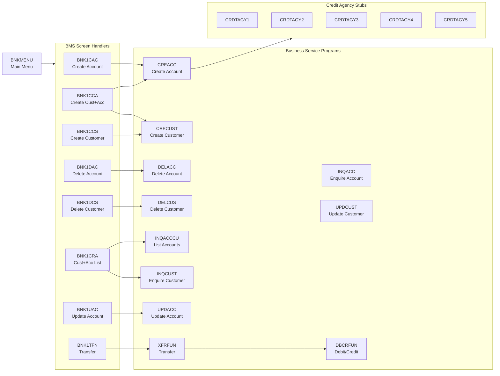

# Component Interactions

## CICS Program Call Graph

The following diagram shows how CICS programs call each other. BMS screen handler programs (BNK1xxx) call the business service programs which in turn perform DB2 operations.

## Copybook Dependencies

All inter-program data contracts are defined in `CBSA/copylib/`. Programs share data layouts through these copybooks — changing a copybook layout impacts every program that includes it.

| Copybook | Used By | Purpose |
|---|---|---|
| ACCOUNT.cpy | CREACC, DELACC, INQACC, UPDACC | Account DB2 row layout |
| CUSTOMER.cpy | CRECUST, DELCUS, INQCUST, UPDCUST | Customer DB2 row layout |
| PROCTRAN.cpy | All state-changing programs | Audit transaction record |
| SORTCODE.cpy | All programs | Bank sort code constant |
| DATASTR.cpy | CREACC, CRECUST | Shared data structures |
| BNK1MAI.cpy | BNKMENU | BMS map DSECT (generated) |
| CREACC.cpy | BNK1CAC, BNK1CCA, z/OS Connect | COMMAREA for CREACC LINK |
| CRECUST.cpy | BNK1CCS, BNK1CCA, z/OS Connect | COMMAREA for CRECUST LINK |
