# Component Interactions

## CICS Program Call Graph

The diagram shows the full call hierarchy from user entry points down to DB2 operations. Each colour represents a different functional layer.

```mermaid
flowchart TD
    subgraph ENTRY ["Entry Points"]
        BNKMENU(["BNKMENU\nMain Menu"])
        ZOSCONN(["z/OS Connect EE\nREST API calls"])
    end

    subgraph BMS ["BMS Screen Handlers  —  purple"]
        BNK1CAC["BNK1CAC\nCreate Account"]
        BNK1CCA["BNK1CCA\nCreate Cust + Acc"]
        BNK1CCS["BNK1CCS\nCreate Customer"]
        BNK1CRA["BNK1CRA\nCust + Acc List"]
        BNK1DAC["BNK1DAC\nDelete Account"]
        BNK1DCS["BNK1DCS\nDelete Customer"]
        BNK1TFN["BNK1TFN\nTransfer"]
        BNK1UAC["BNK1UAC\nUpdate Account"]
    end

    subgraph ACC ["Account Services  —  green"]
        CREACC["CREACC\nCreate Account"]
        INQACC["INQACC\nEnquire Account"]
        INQACCCU["INQACCCU\nList Accounts"]
        UPDACC["UPDACC\nUpdate Account"]
        DELACC["DELACC\nDelete Account"]
    end

    subgraph CUST ["Customer Services  —  teal"]
        CRECUST["CRECUST\nCreate Customer"]
        INQCUST["INQCUST\nEnquire Customer"]
        UPDCUST["UPDCUST\nUpdate Customer"]
        DELCUS["DELCUS\nDelete Customer"]
    end

    subgraph PAY ["Payment Services  —  cyan"]
        DPAYAPI["DPAYAPI\nPayment API"]
        XFRFUN["XFRFUN\nTransfer Function"]
        DBCRFUN["DBCRFUN\nDebit / Credit"]
    end

    subgraph CREDIT ["Credit Agency Stubs  —  yellow"]
        CRDTAGY1["CRDTAGY1"]
        CRDTAGY2["CRDTAGY2"]
        CRDTAGY3["CRDTAGY3"]
        CRDTAGY4["CRDTAGY4"]
        CRDTAGY5["CRDTAGY5"]
    end

    subgraph DB2 ["DB2 Tables  —  red"]
        ACCOUNT[("IBMUSER\n.ACCOUNT")]
        CUSTOMER[("IBMUSER\n.CUSTOMER")]
        PROCTRAN[("IBMUSER\n.PROCTRAN")]
    end

    %% Entry points
    BNKMENU --> BNK1CAC & BNK1CCA & BNK1CCS & BNK1CRA
    BNKMENU --> BNK1DAC & BNK1DCS & BNK1TFN & BNK1UAC

    %% BMS → Services
    BNK1CAC -->|"CICS LINK"| CREACC
    BNK1CCA -->|"CICS LINK"| CREACC
    BNK1CCA -->|"CICS LINK"| CRECUST
    BNK1CCS -->|"CICS LINK"| CRECUST
    BNK1CRA -->|"CICS LINK"| INQCUST
    BNK1CRA -->|"CICS LINK"| INQACCCU
    BNK1DAC -->|"CICS LINK"| DELACC
    BNK1DCS -->|"CICS LINK"| DELCUS
    BNK1TFN -->|"CICS LINK"| XFRFUN
    BNK1UAC -->|"CICS LINK"| UPDACC

    %% z/OS Connect → Services (direct, no BMS)
    ZOSCONN -->|"CICS LINK"| CREACC & INQACC & UPDACC & DELACC & INQACCCU
    ZOSCONN -->|"CICS LINK"| CRECUST & INQCUST & UPDCUST & DELCUS
    ZOSCONN -->|"CICS LINK"| DPAYAPI

    %% Payment chain
    DPAYAPI -->|"CICS LINK"| XFRFUN
    DPAYAPI -->|"CICS LINK"| DBCRFUN
    XFRFUN  -->|"CICS LINK"| DBCRFUN

    %% Credit stubs
    CREACC --> CRDTAGY1 & CRDTAGY2 & CRDTAGY3 & CRDTAGY4 & CRDTAGY5

    %% DB2 writes
    CREACC  -->|"INSERT"| ACCOUNT
    CREACC  -->|"INSERT"| PROCTRAN
    INQACC  -->|"SELECT"| ACCOUNT
    INQACCCU-->|"SELECT"| ACCOUNT
    UPDACC  -->|"UPDATE"| ACCOUNT
    UPDACC  -->|"INSERT"| PROCTRAN
    DELACC  -->|"DELETE"| ACCOUNT
    DELACC  -->|"INSERT"| PROCTRAN
    CRECUST -->|"INSERT"| CUSTOMER
    CRECUST -->|"INSERT"| PROCTRAN
    INQCUST -->|"SELECT"| CUSTOMER
    UPDCUST -->|"UPDATE"| CUSTOMER
    UPDCUST -->|"INSERT"| PROCTRAN
    DELCUS  -->|"DELETE"| CUSTOMER
    DELCUS  -->|"INSERT"| PROCTRAN
    DBCRFUN -->|"UPDATE"| ACCOUNT
    DBCRFUN -->|"INSERT"| PROCTRAN

    classDef entry     fill:#dde1e7,stroke:#697077,color:#161616,font-weight:bold
    classDef bms       fill:#e8daff,stroke:#6929c4,color:#31135e,font-weight:bold
    classDef accsvc    fill:#defbe6,stroke:#198038,color:#0e3818,font-weight:bold
    classDef custsvc   fill:#d9fbfb,stroke:#007d79,color:#004144,font-weight:bold
    classDef paysvc    fill:#bae6ff,stroke:#0072c3,color:#003a6d,font-weight:bold
    classDef credit    fill:#fdf6dd,stroke:#b28600,color:#4d3800,font-style:italic
    classDef database  fill:#fff1f1,stroke:#a2191f,color:#570408,font-weight:bold

    class BNKMENU,ZOSCONN entry
    class BNK1CAC,BNK1CCA,BNK1CCS,BNK1CRA,BNK1DAC,BNK1DCS,BNK1TFN,BNK1UAC bms
    class CREACC,INQACC,INQACCCU,UPDACC,DELACC accsvc
    class CRECUST,INQCUST,UPDCUST,DELCUS custsvc
    class DPAYAPI,XFRFUN,DBCRFUN paysvc
    class CRDTAGY1,CRDTAGY2,CRDTAGY3,CRDTAGY4,CRDTAGY5 credit
    class ACCOUNT,CUSTOMER,PROCTRAN database
```

**Colour legend:**

| Colour | Layer | Programs |
|---|---|---|
| Gray | Entry Points | `BNKMENU`, z/OS Connect |
| Purple | BMS Screen Handlers | `BNK1CAC`, `BNK1CCA`, `BNK1CCS`, `BNK1CRA`, `BNK1DAC`, `BNK1DCS`, `BNK1TFN`, `BNK1UAC` |
| Green | Account Services | `CREACC`, `INQACC`, `INQACCCU`, `UPDACC`, `DELACC` |
| Teal | Customer Services | `CRECUST`, `INQCUST`, `UPDCUST`, `DELCUS` |
| Cyan | Payment Services | `DPAYAPI`, `XFRFUN`, `DBCRFUN` |
| Yellow | Credit Agency Stubs | `CRDTAGY1`–`CRDTAGY5` (simulated, not production) |
| Red | DB2 Tables | `IBMUSER.ACCOUNT`, `IBMUSER.CUSTOMER`, `IBMUSER.PROCTRAN` |

---

## Key Observations

- **Both entry paths call the same programs:** z/OS Connect EE and the BMS 3270 terminal invoke the same COBOL service programs (`CREACC`, `INQCUST`, etc.) — there is no duplicated business logic.
- **PROCTRAN is written by every mutation:** All programs that INSERT, UPDATE, or DELETE also write an audit record to `IBMUSER.PROCTRAN` in the same DB2 unit of work.
- **Credit stubs are only called by CREACC:** `CRDTAGY1`–`CRDTAGY5` are isolated to the account creation flow and return randomised scores. Replace them independently without affecting any other program.
- **Transfer uses a chain:** `XFRFUN` calls `DBCRFUN` twice — once for the debit and once for the credit. Both must succeed within the same CICS unit of work.

---

## Copybook Dependencies

All inter-program data contracts are defined in `CBSA/copylib/`. Changing a copybook layout impacts every program that includes it, plus the z/OS Connect service definitions.

| Copybook | Used By | Change Impact |
|---|---|---|
| `ACCOUNT.cpy` | CREACC, DELACC, INQACC, UPDACC | 4 service programs + z/OS Connect SAR/OAS3 spec |
| `CUSTOMER.cpy` | CRECUST, DELCUS, INQCUST, UPDCUST | 4 service programs + z/OS Connect SAR/OAS3 spec |
| `PROCTRAN.cpy` | All 11 state-changing programs | All mutation programs |
| `SORTCODE.cpy` | All 39 programs | Entire application — avoid changing |
| `CREACC.cpy` | BNK1CAC, BNK1CCA, z/OS Connect | COMMAREA contract — Spring Boot binding must also change |
| `CRECUST.cpy` | BNK1CCS, BNK1CCA, z/OS Connect | COMMAREA contract — Spring Boot binding must also change |
| `BNK1MAI.cpy` | BNKMENU | Generated from BMS — do not hand-edit |
