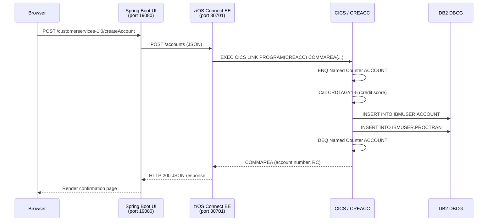

# Data Flow

## End-to-End Request Flow — Create Account Example



## Data Transformation

Data changes format at each layer:

| Layer | Format | Example |
|---|---|---|
| Browser | HTML form fields | `accountType=CURRENT&overdraftLimit=500` |
| Spring Boot | Java POJO → JSON | `{"accountType":"CURRENT","overdraftLimit":500}` |
| z/OS Connect EE | JSON → COMMAREA bytes | Binary COMMAREA layout per `CREACC.cpy` |
| CICS COBOL | COMMAREA working storage | `WS-ACCOUNT-TYPE PIC X(8)` |
| DB2 | SQL INSERT | `INSERT INTO IBMUSER.ACCOUNT (ACCOUNT_TYPE, ...) VALUES (...)` |

## Error Propagation

Errors flow back up the same path:

1. **DB2 error** — CICS program checks `SQLCODE`, sets error flag in COMMAREA, returns to z/OS Connect EE.
2. **z/OS Connect EE** — maps COMMAREA error flag to HTTP 4xx/5xx status code.
3. **Spring Boot** — catches non-2xx response from `WebClient`, renders error page.
4. **Browser** — displays user-friendly error message from Thymeleaf template.

## Audit Trail

Every state-changing operation writes to `IBMUSER.PROCTRAN` **within the same DB2 unit of work** as the primary table change. If the PROCTRAN write fails, the entire transaction is rolled back — no partial updates are possible.

## Named Counter Concurrency

Account and customer number generation is serialized via CICS Named Counters:

```
Thread A: ENQ ACCOUNT → increment → write DB2 → DEQ ACCOUNT
Thread B: ENQ ACCOUNT → (waits) → increment → write DB2 → DEQ ACCOUNT
```

This prevents duplicate numbers under concurrent load without using DB2 locks on the counter.
