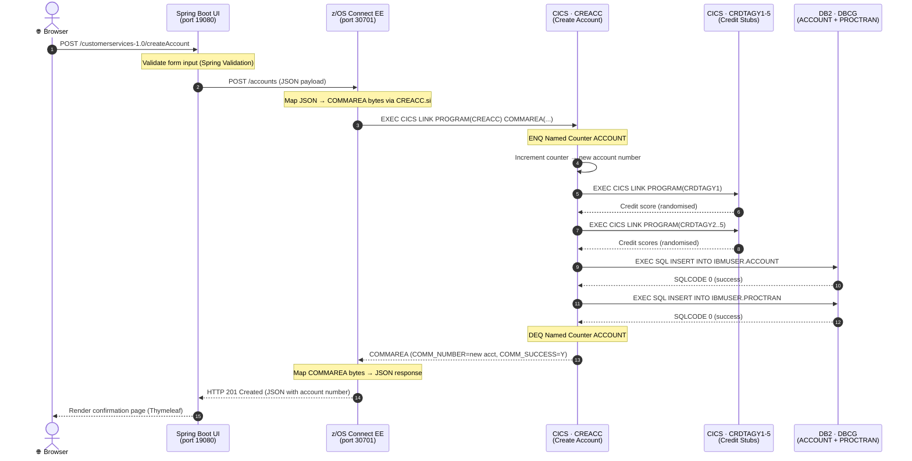
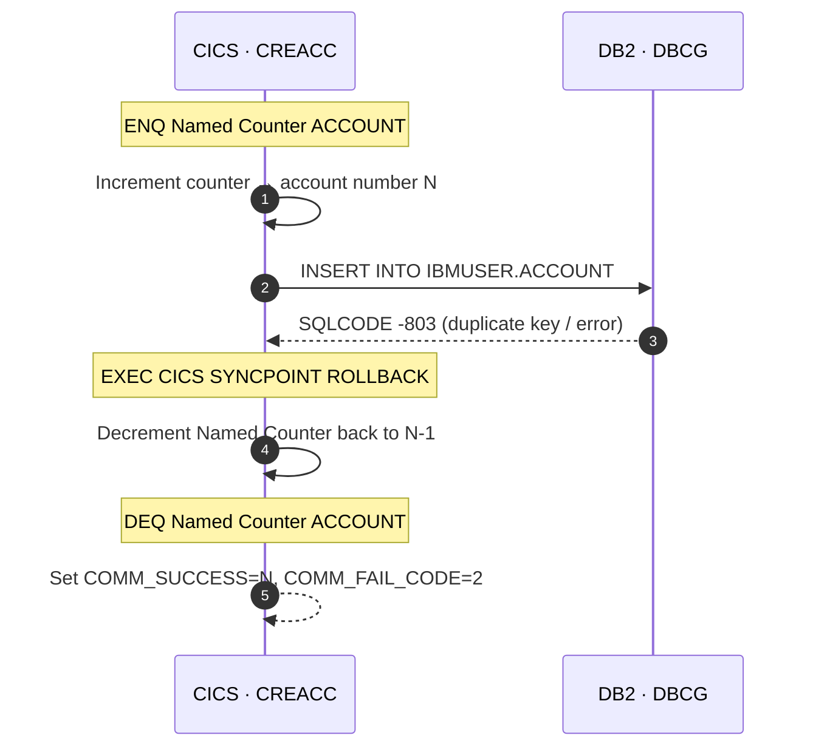
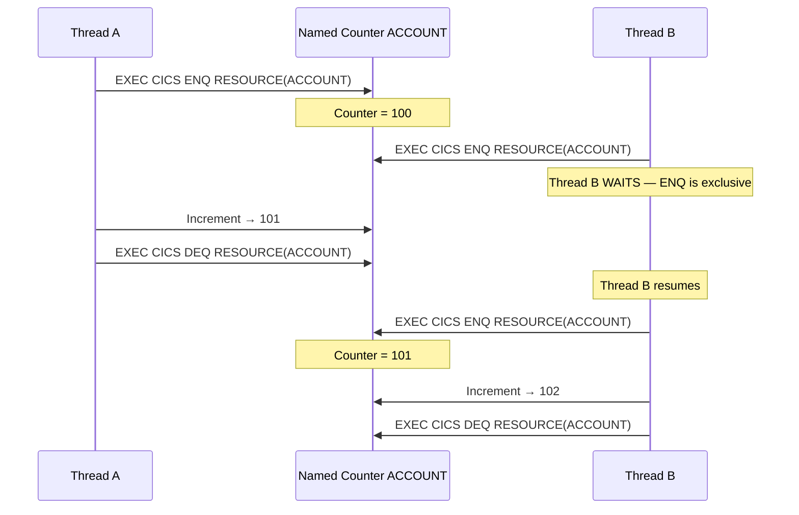
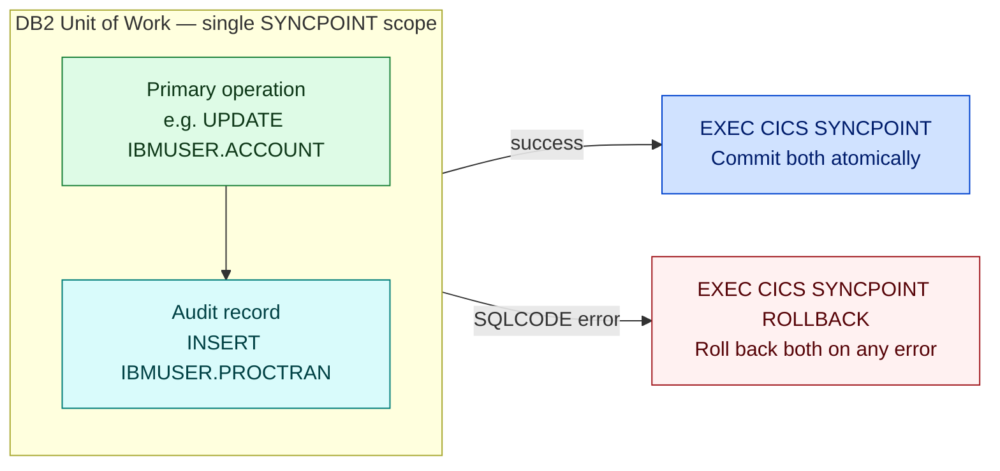

# Data Flow

## End-to-End Request Flow — Create Account

The sequence diagram traces a full `createAccount` request from the browser through every layer, including the Named Counter serialization mechanism.

---

## Error Path — DB2 Failure

<strong>Critical invariant:</strong> If any DB2 write fails, CREACC decrements the Named Counter before DEQ. This prevents account number gaps. The same rollback pattern applies to all mutation programs.

---

## Data Transformation at Each Layer

Data changes representation at every layer boundary:

```mermaid
flowchart LR
    A["Browser\nHTML form\naccountType=CURRENT\noverdraftLimit=500"]
    B["Spring Boot\nJava POJO → JSON\n{accountType: CURRENT\noverdraftLimit: 500}"]
    C["z/OS Connect EE\nJSON → COMMAREA bytes\nper CREACC.si mapping"]
    D["CICS COBOL\nWorking-Storage\nWS-ACCOUNT-TYPE\nPIC X(8)"]
    E["DB2\nSQL INSERT\nACCOUNT_TYPE='CURRENT '"]

    A -->|"HTTP POST"| B
    B -->|"REST JSON"| C
    C -->|"EXEC CICS LINK"| D
    D -->|"EXEC SQL"| E

    classDef browser   fill:#dde1e7,stroke:#697077,color:#161616
    classDef spring    fill:#d0e2ff,stroke:#0043ce,color:#001d6c
    classDef zosconn   fill:#d9fbfb,stroke:#007d79,color:#004144
    classDef cobol     fill:#defbe6,stroke:#198038,color:#0e3818
    classDef db2       fill:#fff1f1,stroke:#a2191f,color:#570408

    class A browser
    class B spring
    class C zosconn
    class D cobol
    class E db2
```

---

## Named Counter Concurrency

Account and customer numbers are generated without DB2 sequence objects — CICS Named Counters with ENQ/DEQ provide serialization:

<strong>Why not DB2 IDENTITY/SEQUENCE?</strong> Named Counters allow the counter to be decremented on rollback — CREACC restores the counter value if the DB2 INSERT fails. A DB2 IDENTITY column cannot be rolled back, which would create gaps in account numbering.

---

## Audit Trail Invariant

Every mutation (INSERT/UPDATE/DELETE) writes to `IBMUSER.PROCTRAN` in the **same DB2 unit of work**:

