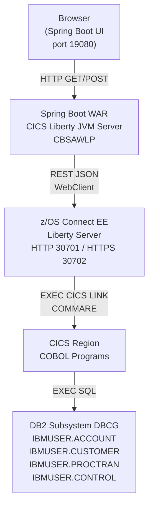

# System Overview

CBSA is a three-tier application running entirely on or connected to IBM Z.

## Tiers

### Tier 1 — Spring Boot Web UI

The user-facing layer. Two Spring Boot WAR applications provide browser interfaces:

- **`Z-OS-Connect-EE-Customer-Services-Interface/`** — Customer and account operations
- **`Z-OS-Connect-EE-Payment-Interface/`** — Payment processing

Both are packaged using `cics-bundle-maven-plugin` targeting CICS JVM server **`CBSAWLP`**. They communicate with z/OS Connect EE via Spring's `WebClient` (reactive HTTP client).

### Tier 2 — z/OS Connect EE API Layer

Exposes 10 REST services that map directly to CICS programs:

| Service Name | CICS Program | Operation |
|---|---|---|
| CSacccre | CREACC | Create account |
| CSaccdel | DELACC | Delete account |
| CSaccenq | INQACC | Enquire account |
| CSaccupd | UPDACC | Update account |
| CScustacc | INQACCCU | List accounts for customer |
| CScustcre | CRECUST | Create customer |
| CScustdel | DELCUS | Delete customer |
| CScustenq | INQCUST | Enquire customer |
| CScustupd | UPDCUST | Update customer |
| Pay | DBCRFUN / XFRFUN | Debit/credit / Transfer |

### Tier 3 — CICS COBOL Programs + DB2

Business logic runs in CICS COBOL programs. All data is stored in four DB2 tables under `IBMUSER`.

## Key Design Decisions

- **Named Counter for account numbering:** `CREACC` uses a CICS Named Counter with `EXEC CICS ENQ` to generate unique, sequential account numbers without gaps.
- **PROCTRAN as audit trail:** Every state-changing transaction writes a record to `IBMUSER.PROCTRAN` within the same DB2 unit of work.
- **Credit agency simulation:** `CRDTAGY1`–`CRDTAGY5` simulate credit agencies with randomized results. They are called during account creation but are not production-grade checks.
