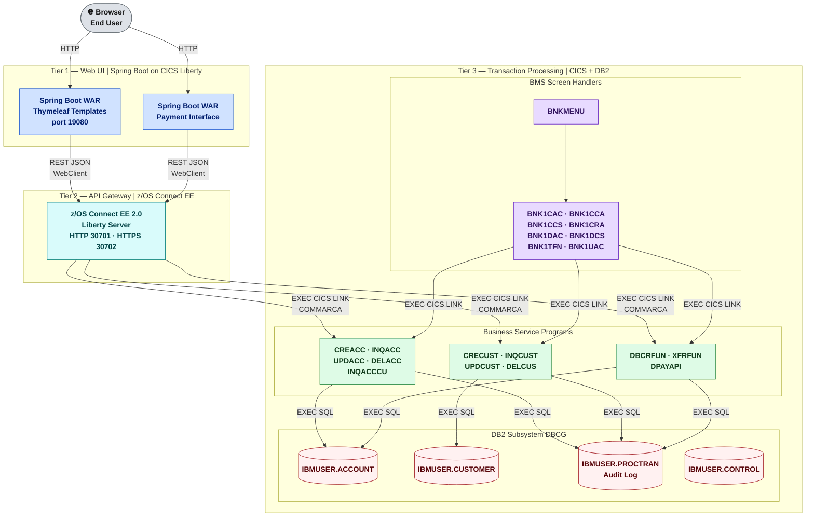

# System Overview

CBSA is a three-tier application running entirely on or connected to IBM Z. Each tier has a distinct technology role — the diagram below uses color-coding to distinguish frontend, API, runtime, and data layers.

**Colour legend:**

| Colour | Layer | Technology |
|---|---|---|
|  Blue | Web UI | Spring Boot on CICS Liberty JVM Server (`CBSAWLP`) |
|  Teal | API Gateway | z/OS Connect EE — JSON ↔ COMMAREA bridge |
|  Purple | BMS Screens | CICS 3270 screen handler programs |
|  Green | Business Logic | CICS COBOL service programs + DB2 SQL |
|  Red | Data | DB2 tables under `IBMUSER` schema |

---

## Tier 1 — Spring Boot Web UI

Two Spring Boot WAR applications provide the browser interface, both deployed to CICS Liberty JVM server **`CBSAWLP`**:

| Application | Directory | Context Path | Purpose |
|---|---|---|---|
| Customer Services | `Z-OS-Connect-EE-Customer-Services-Interface/` | `/customerservices-1.0` | Customer + account operations |
| Payment Interface | `Z-OS-Connect-EE-Payment-Interface/` | Configured separately | Payment processing |

Both use Spring `WebClient` (reactive HTTP) to call z/OS Connect EE. The embedded Tomcat is `provided` scope — production runs on Liberty, not standalone Tomcat.

---

## Tier 2 — z/OS Connect EE API Gateway

Maps 10 REST endpoints to CICS programs via COMMAREA. Each service definition translates JSON request fields to COMMAREA byte positions using `.si` (Service Interface) files.

| Service | CICS Program | HTTP Method | REST Route (OAS3) |
|---|---|---|---|
| CSacccre | CREACC | POST | `/accounts` |
| CSaccenq | INQACC | GET | `/accounts/{id}` |
| CSaccupd | UPDACC | PUT | `/accounts/{id}` |
| CSaccdel | DELACC | DELETE | `/accounts/{id}` |
| CScustacc | INQACCCU | GET | `/customers/{id}/accounts` |
| CScustcre | CRECUST | POST | `/customers` |
| CScustenq | INQCUST | GET | `/customers/{id}` |
| CScustupd | UPDCUST | PUT | `/customers/{id}` |
| CScustdel | DELCUS | DELETE | `/customers/{id}` |
| Pay | DPAYAPI | POST | `/payments` |

---

## Tier 3 — CICS + DB2

Business logic runs exclusively in CICS COBOL programs. There are **two entry paths** into Tier 3:

1. **API path** — z/OS Connect EE calls programs directly via `EXEC CICS LINK` (no BMS involved)
2. **Terminal path** — `BNKMENU` drives BMS screen handlers which then call the same service programs

Both paths reach the **same COBOL service programs** — there is no duplicate business logic.

---

## Key Design Decisions

- **Named Counter for account numbering:** `CREACC` uses `EXEC CICS ENQ` on a Named Counter before incrementing — prevents duplicate account numbers under concurrent load without DB2 table locks.
- **PROCTRAN as audit trail:** Every state-changing program writes to `IBMUSER.PROCTRAN` in the **same DB2 unit of work** as the primary table change. PROCTRAN write failure rolls back the entire transaction.
- **Credit agency simulation:** `CRDTAGY1`–`CRDTAGY5` return randomised scores — not production-grade. The COMMAREA interface must be preserved if replacing them.
- **Shared COBOL, two frontends:** Both the Spring Boot UI and the BMS 3270 terminal use the same COBOL service programs — CBSA runs as a hybrid modern + traditional application simultaneously.
