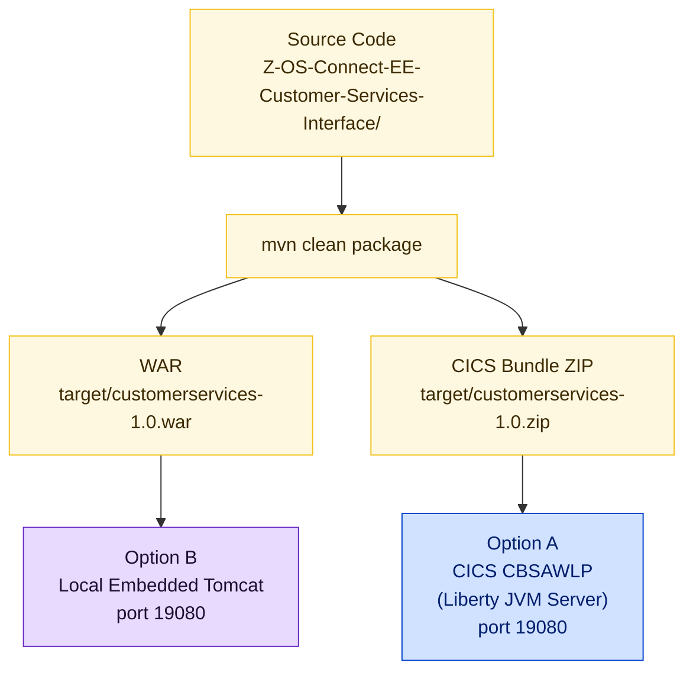

# Spring Boot WAR Build

The Customer Services UI is built with Maven and packaged as a WAR for deployment to a CICS Liberty JVM server. The same build also produces a CICS bundle ZIP that can be deployed directly into CICS.

<div class="callout callout-green">
<strong>One build — two deployment targets.</strong> The Spring Boot WAR is packaged as a CICS bundle for deployment to Liberty JVM server <code>CBSAWLP</code>. The same Maven build produces a standalone WAR that can also run on embedded Tomcat for local development.
</div>

---

## Build Output

<table class="compare-table">
<thead>
<tr>
  <th style="width:35%">Artifact</th>
  <th style="width:20%">Location</th>
  <th style="width:45%">Purpose</th>
</tr>
</thead>
<tbody>
<tr>
  <td><code>customerservices-1.0.war</code></td>
  <td><code>target/</code></td>
  <td>WAR for Liberty / CICS deployment</td>
</tr>
<tr>
  <td><code>customerservices-1.0.zip</code></td>
  <td><code>target/</code></td>
  <td>CICS bundle — the WAR plus a CICS bundle manifest; deploy this to CICS</td>
</tr>
</tbody>
</table>

---

## Build Command

Standard build (skipping tests — recommended for CI and initial setup):

```bash
cd Z-OS-Connect-EE-Customer-Services-Interface
mvn clean package -DskipTests
```

Full build including tests:

```bash
mvn clean package
```

Run locally on embedded Tomcat (development only):

```bash
mvn spring-boot:run
```

Run locally and point at a remote z/OS Connect EE instance:

```bash
mvn spring-boot:run -Dspring-boot.run.arguments="--address myhost.example.com --port 30701"
```

---

## Maven Plugin: cics-bundle-maven-plugin

The `cics-bundle-maven-plugin` runs during the `package` phase, after `spring-boot-maven-plugin` has built the WAR. It wraps the WAR with a CICS bundle manifest and produces the deployable ZIP.

Full configuration from `pom.xml`:

```xml
<plugin>
    <groupId>com.ibm.cics</groupId>
    <artifactId>cics-bundle-maven-plugin</artifactId>
    <version>1.0.4-SNAPSHOT</version>
    <executions>
        <execution>
            <goals>
                <goal>bundle-war</goal>
            </goals>
            <configuration>
                <jvmserver>CBSAWLP</jvmserver>
            </configuration>
        </execution>
    </executions>
</plugin>
```

<div class="callout callout-yellow">
<strong>Hardcoded JVM server name:</strong> <code>CBSAWLP</code> is set in the <code>&lt;jvmserver&gt;</code> element in <code>pom.xml</code>. Change this value before building if your CICS region uses a different Liberty JVM server name.
</div>

---

## Maven Plugin: spring-boot-maven-plugin

The standard Spring Boot plugin repackages the compiled classes and dependencies into an executable WAR. Embedded Tomcat is declared as `provided` scope — it is on the classpath during compilation and local development, but is excluded from the final WAR so that Liberty provides the servlet container in production.

```xml
<plugin>
    <groupId>org.springframework.boot</groupId>
    <artifactId>spring-boot-maven-plugin</artifactId>
</plugin>
```

The `provided`-scope Tomcat dependency:

```xml
<dependency>
    <groupId>org.springframework.boot</groupId>
    <artifactId>spring-boot-starter-tomcat</artifactId>
    <scope>provided</scope>
</dependency>
```

---

## Key Dependencies

<table class="compare-table">
<thead>
<tr>
  <th style="width:35%">Dependency</th>
  <th style="width:15%">Scope</th>
  <th style="width:50%">Purpose</th>
</tr>
</thead>
<tbody>
<tr>
  <td><code>spring-boot-starter-web</code></td>
  <td>compile</td>
  <td>Spring MVC — <code>@Controller</code>, <code>@GetMapping</code>, <code>@PostMapping</code></td>
</tr>
<tr>
  <td><code>spring-boot-starter-thymeleaf</code></td>
  <td>compile</td>
  <td>Thymeleaf template engine for all 11 HTML screens</td>
</tr>
<tr>
  <td><code>spring-boot-starter-webflux</code></td>
  <td>compile</td>
  <td>Reactive <code>WebClient</code> for calls to z/OS Connect EE — <strong>NOT RestTemplate</strong></td>
</tr>
<tr>
  <td><code>spring-boot-starter-tomcat</code></td>
  <td>provided</td>
  <td>Embedded Tomcat — excluded from the WAR; Liberty provides the servlet container in CICS</td>
</tr>
<tr>
  <td><code>spring-boot-starter-validation</code></td>
  <td>provided</td>
  <td>Bean Validation (<code>@Valid</code>) on form objects in <code>WebController</code></td>
</tr>
<tr>
  <td><code>jackson-databind</code></td>
  <td>compile</td>
  <td>JSON serialisation / deserialisation for z/OS Connect EE request and response bodies</td>
</tr>
</tbody>
</table>

---

## Running Locally

Start the application on embedded Tomcat:

```bash
cd Z-OS-Connect-EE-Customer-Services-Interface
mvn spring-boot:run
# Available at: http://localhost:19080/customerservices-1.0
```

By default `ConnectionInfo.java` points to `localhost:30701`. For local development with a remote z/OS Connect EE instance, override the address:

```bash
mvn spring-boot:run \
  -Dspring-boot.run.arguments="--address myhost.example.com --port 30701"
```

<div class="callout callout-yellow">
<strong>A running z/OS Connect EE instance is required.</strong> The UI will start without one, but every form submission will return a connection error until z/OS Connect EE is reachable at the configured host and port.
</div>

---

## Build Pipeline Integration

The Spring Boot WAR build is a prerequisite for the CICS deployment step in the GitLab CI pipeline. The COBOL programs are built separately by zAppBuild on z/OS. See the [GitLab CI Pipeline](./gitlab-ci.md) page for pipeline stage details.

The Spring Boot build is typically run as a local pre-deploy step or as a separate pipeline job on a Linux runner that has Maven installed:

```yaml
# Example GitLab CI fragment (not in the current .gitlab-ci.yml — add as needed)
build-spring-boot:
  stage: build
  script:
    - cd Z-OS-Connect-EE-Customer-Services-Interface
    - mvn clean package -DskipTests
  artifacts:
    paths:
      - Z-OS-Connect-EE-Customer-Services-Interface/target/customerservices-1.0.zip
```

---

## Build Flow



**Legend:** Yellow = build steps and artifacts · Blue = CICS production deployment · Purple = local development
