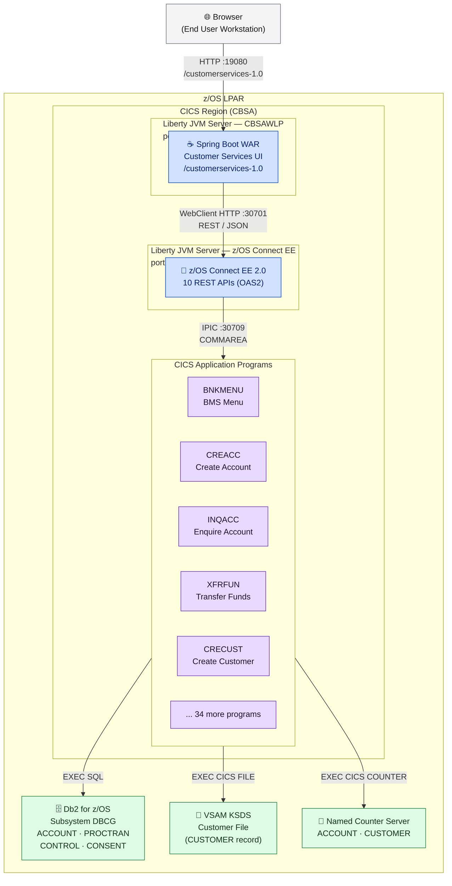
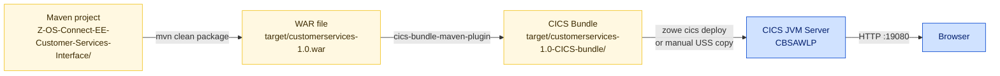
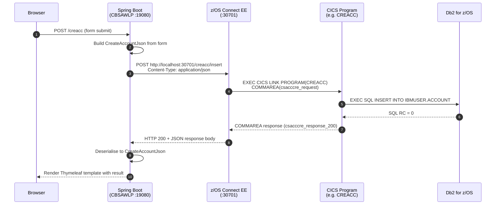

# CICS Region Configuration

CBSA runs entirely inside a single **z/OS LPAR**. The CICS region hosts both the COBOL application programs and the Spring Boot web UI — there is no external application server. The browser connects to a Liberty JVM server running inside CICS.

<div class="callout callout-green">
<strong>Everything is inside z/OS.</strong> The browser → Spring Boot → z/OS Connect → CICS COBOL chain is entirely within z/OS. The only thing that leaves the LPAR is the browser HTTP request from the end user's workstation.
</div>

## CBSA Runtime Architecture



**Legend:** Blue = Liberty JVM servers · Purple = COBOL programs · Green = persistent storage · Gray = external

---

## JVM Server — CBSAWLP (Spring Boot UI)

The Spring Boot Customer Services UI runs as a WAR deployed to a **dedicated Liberty JVM server** named `CBSAWLP` inside the CICS region.

<table class="compare-table">
<thead>
<tr>
  <th style="width:30%">Parameter</th>
  <th style="width:70%">Value / Notes</th>
</tr>
</thead>
<tbody>
<tr>
  <td><strong>JVM server name</strong></td>
  <td><code>CBSAWLP</code> — defined as a CICS JVM server resource</td>
</tr>
<tr>
  <td><strong>HTTP port</strong></td>
  <td><code>19080</code> — configured in <code>application.properties</code></td>
</tr>
<tr>
  <td><strong>Context path</strong></td>
  <td><code>/customerservices-1.0</code> — WAR context root</td>
</tr>
<tr>
  <td><strong>Java version</strong></td>
  <td>Java 8 (source/target in <code>pom.xml</code>) — Java 11+ also supported</td>
</tr>
<tr>
  <td><strong>Liberty features required</strong></td>
  <td><code>servlet-4.0</code>, <code>jaxrs-2.1</code>, <code>webProfile-8.0</code></td>
</tr>
<tr>
  <td><strong>Heap (recommended)</strong></td>
  <td>512 MB minimum — configured in the JVM server profile (<code>.jvmprofile</code>)</td>
</tr>
<tr>
  <td><strong>Deployment artifact</strong></td>
  <td>CICS bundle produced by <code>cics-bundle-maven-plugin 1.0.4</code> — contains the WAR + bundle manifest</td>
</tr>
<tr>
  <td><strong>z/OS Connect target</strong></td>
  <td><code>localhost:30701</code> — configured via <code>ConnectionInfo</code> class (overridable with <code>--address</code> / <code>--port</code> startup arguments)</td>
</tr>
</tbody>
</table>

### How the Spring Boot WAR Is Built and Deployed



### Key Java Classes

| Class | Package | Role |
|---|---|---|
| `CustomerServices.java` | `customerservices` | Spring Boot application entry point — parses `--address` / `--port` startup args |
| `ConnectionInfo.java` | `customerservices` | Holds z/OS Connect EE host and port — default `localhost:30701` |
| `WebController.java` | `controllers` | Handles all `@GetMapping` / `@PostMapping` routes, creates `WebClient` for each operation |
| `ServletInitializer.java` | `customerservices` | Extends `SpringBootServletInitializer` — enables WAR deployment to Liberty |

### Thymeleaf Templates (UI Screens)

| Template | URL Route | Operation |
|---|---|---|
| `customerServices.html` | `/services`, `/` | Main menu — entry point |
| `accountEnquiryForm.html` | `/enqacct` | Enquire account by number |
| `createAccountForm.html` | `/creacc` | Create new account |
| `listAccountsForm.html` | `/listaccts` | List accounts by customer |
| `deleteAccountForm.html` | `/delacct` | Delete account |
| `updateAccountForm.html` | `/updacc` | Update account |
| `customerEnquiryForm.html` | `/enqcust` | Enquire customer by number |
| `createCustomerForm.html` | `/crecust` | Create new customer |
| `deleteCustomerForm.html` | `/delcust` | Delete customer |
| `updateCustomerForm.html` | `/updcust` | Update customer |
| `paymentInterfaceForm.html` | `/payment` | Payment interface |

### Spring Boot → z/OS Connect Call Flow

For every screen action, `WebController` creates a reactive `WebClient` and calls the matching z/OS Connect REST endpoint:



---

## JVM Server — z/OS Connect EE (REST Gateway)

A **separate** Liberty JVM server runs z/OS Connect EE — it is the REST gateway between Spring Boot and the COBOL programs. It is configured by `zoseeserver/server.xml`.

<table class="compare-table">
<thead>
<tr>
  <th style="width:30%">Parameter</th>
  <th style="width:70%">Value</th>
</tr>
</thead>
<tbody>
<tr>
  <td><strong>Liberty features</strong></td>
  <td><code>zosconnect:zosConnect-2.0</code>, <code>zosconnect:cicsService-1.0</code>, <code>zosconnect:zosConnectCommands-1.0</code></td>
</tr>
<tr>
  <td><strong>HTTP port</strong></td>
  <td><code>30701</code></td>
</tr>
<tr>
  <td><strong>HTTPS port</strong></td>
  <td><code>30702</code></td>
</tr>
<tr>
  <td><strong>CICS connection (IPIC)</strong></td>
  <td><code>host=localhost port=30709</code> — IPIC connection to CICS region</td>
</tr>
<tr>
  <td><strong>Auth</strong></td>
  <td>Basic auth — user <code>ibmuser</code> / <code>SYS1</code> (change for production)</td>
</tr>
<tr>
  <td><strong>Config file</strong></td>
  <td><code>zoseeserver/server.xml</code></td>
</tr>
</tbody>
</table>

<div class="callout callout-yellow">
<strong>Two separate Liberty servers:</strong> CBSAWLP (Spring Boot) and the z/OS Connect EE server are two distinct JVM servers, each with their own <code>server.xml</code>. Spring Boot calls z/OS Connect over HTTP — even though both are inside the same LPAR, they communicate over the loopback network interface (<code>localhost</code>).
</div>

---

## CICS Program and Transaction Definitions

### Program Definitions

Define each COBOL load module as a CICS program resource. All programs use these standard attributes:

```
LANGUAGE(COBOL)
EXECKEY(USER)
CONCURRENCY(QUASIRENT)
DATALOCATION(ANY)
```

Programs requiring dynamic storage (DATALOCATION(ANY) and TASKDATAKEY(USER)):
`BNKMENU`, `BNK1CAC`, `BNK1CCA`, `BNK1CCS`, `BNK1CRA`, `BNK1DAC`, `BNK1DCS`, `BNK1TFN`, `BNK1UAC`

### Transaction Definitions

| Transaction | Program | Description | Entry Point |
|---|---|---|---|
| `BMNU` | `BNKMENU` | Main menu | BMS terminal only |
| `BCAC` | `BNK1CAC` | Create account | BMS terminal only |
| `BCCA` | `BNK1CCA` | Create customer + account | BMS terminal only |
| `BCCS` | `BNK1CCS` | Create customer | BMS terminal only |
| `BCRA` | `BNK1CRA` | Customer + accounts list | BMS terminal only |
| `BDAC` | `BNK1DAC` | Delete account | BMS terminal only |
| `BDCS` | `BNK1DCS` | Delete customer | BMS terminal only |
| `BTFN` | `BNK1TFN` | Transfer funds | BMS terminal only |
| `BUAC` | `BNK1UAC` | Update account | BMS terminal only |

<div class="callout">
The z/OS Connect REST APIs invoke the underlying service programs directly (e.g. <code>CREACC</code>, <code>INQACC</code>) via <strong>CICS LINK</strong> — not through the BMS transactions. The BMS transactions are for 3270 terminal users only.
</div>

---

## Named Counter Server

CBSA uses two CICS Named Counters for sequential ID generation:

| Counter Name | Used By | DB2 / VSAM Target | Concurrency |
|---|---|---|---|
| `HBNKACCT` | `CREACC` | `IBMUSER.ACCOUNT` — `ACCOUNT_NUMBER` | ENQ/DEQ guards the Counter + INSERT as an atomic unit |
| `HBNKCUST` | `CRECUST` | VSAM KSDS — `CUSTOMER_NUMBER` | ENQ/DEQ guards the Counter + WRITE as an atomic unit |

Named Counter options (initial values, increment, maximum) are defined in `CBSA/asm/DFHNCOPT.assemble`. Rebuild and reinstall this module if counter values need to be changed.

---

## Install JCL

Sample CICS install JCL is provided in `jclInstall/`. Review and tailor each member to your CICS region SIT and CICSHLQ before submitting:

```jcl
//CICSDEF JOB ...
//PROGDEF EXEC PGM=DFHCSDUP
//DFHCSD   DD DSN=your.CICS.CSD,DISP=SHR
//SYSIN    DD *
  DEFINE PROGRAM(CREACC)
         GROUP(CBSA)
         LANGUAGE(COBOL)
         EXECKEY(USER)
         CONCURRENCY(QUASIRENT)
         DATALOCATION(ANY)
```

<div class="callout callout-yellow">
<strong>Production hardening:</strong> Before deploying to production, change the z/OS Connect basic auth credentials in <code>zoseeserver/server.xml</code>, enable HTTPS-only access on port 30702, and remove <code>requireAuth="false"</code> from the <code>zosConnectManager</code> element.
</div>
