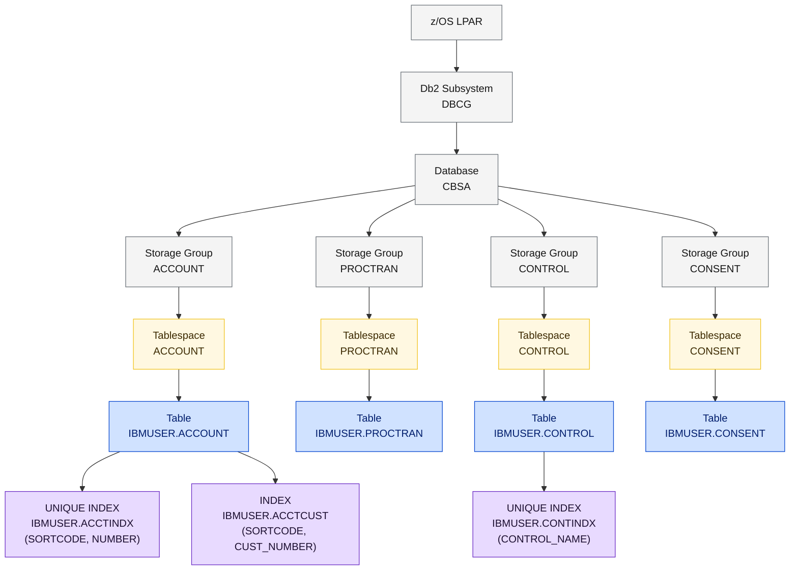
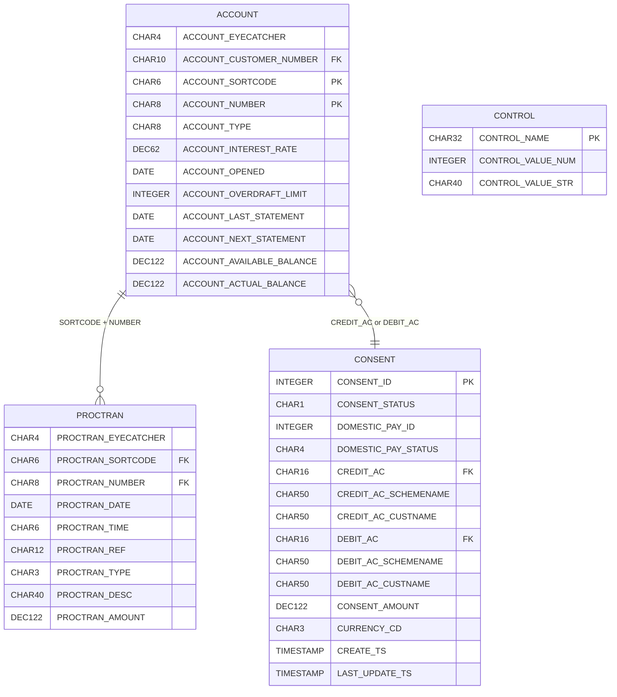
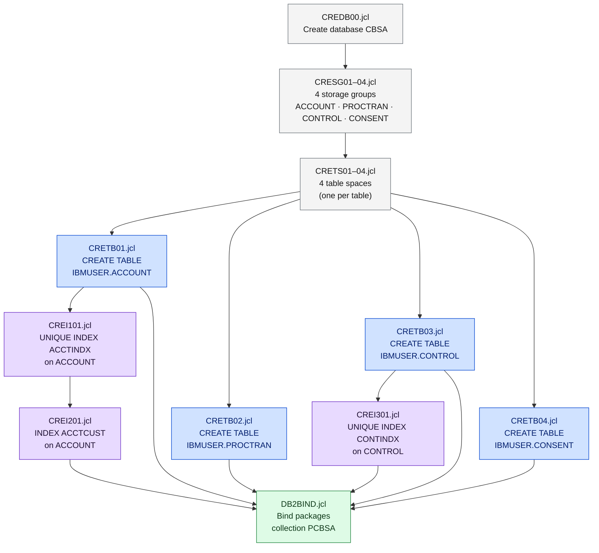

# DB2 Schema Setup

CBSA uses **Db2 for z/OS** to store account transactions, account data, control data, and payment consent records. Customer data is stored separately in a **VSAM KSDS** file — not in DB2. All DB2 setup JCL is in `Db2_jcl_install/`.

<div class="callout callout-green">
<strong>4 Db2 tables + 1 VSAM file.</strong> The ACCOUNT, PROCTRAN, CONTROL, and CONSENT tables live in Db2 subsystem <code>DBCG</code>, database <code>CBSA</code>. Customer records are stored in a VSAM KSDS accessed via <code>EXEC CICS FILE</code> — not SQL.
</div>

## Database Object Hierarchy



**Legend:** Gray = Db2 infrastructure · Yellow = tablespaces · Blue = tables · Purple = indexes

---

## Entity Relationship Diagram



<div class="callout">
<strong>Note on CUSTOMER data:</strong> There is no <code>IBMUSER.CUSTOMER</code> Db2 table. Customer records are stored in a <strong>VSAM KSDS</strong> file. The VSAM record structure is defined in <code>CBSA/copylib/CUSTOMER.cpy</code> and accessed via <code>EXEC CICS FILE</code> commands in programs like <code>CRECUST</code>, <code>INQCUST</code>, <code>UPDCUST</code>, and <code>DELCUST</code>.
</div>

---

## Table Definitions

### IBMUSER.ACCOUNT

Holds all bank account records. Primary key is the composite `(ACCOUNT_SORTCODE, ACCOUNT_NUMBER)`.

<table class="compare-table">
<thead>
<tr>
  <th style="width:35%">Column</th>
  <th style="width:20%">Type</th>
  <th style="width:10%">Key</th>
  <th style="width:35%">Description</th>
</tr>
</thead>
<tbody>
<tr><td><code>ACCOUNT_EYECATCHER</code></td><td><code>CHAR(4)</code></td><td></td><td>Always <code>'ACCT'</code> — record integrity marker</td></tr>
<tr><td><code>ACCOUNT_CUSTOMER_NUMBER</code></td><td><code>CHAR(10)</code></td><td>FK</td><td>Links to VSAM CUSTOMER record</td></tr>
<tr><td><code>ACCOUNT_SORTCODE</code></td><td><code>CHAR(6) NOT NULL</code></td><td>PK</td><td>Bank sort code (e.g. <code>987654</code>)</td></tr>
<tr><td><code>ACCOUNT_NUMBER</code></td><td><code>CHAR(8) NOT NULL</code></td><td>PK</td><td>Unique account number — generated by Named Counter <code>HBNKACCT</code></td></tr>
<tr><td><code>ACCOUNT_TYPE</code></td><td><code>CHAR(8)</code></td><td></td><td>Account type: <code>CURRENT</code>, <code>SAVING</code>, <code>LOAN</code>, <code>MORTGAGE</code>, <code>ISA</code></td></tr>
<tr><td><code>ACCOUNT_INTEREST_RATE</code></td><td><code>DECIMAL(6,2)</code></td><td></td><td>Annual interest rate</td></tr>
<tr><td><code>ACCOUNT_OPENED</code></td><td><code>DATE</code></td><td></td><td>Date account was opened</td></tr>
<tr><td><code>ACCOUNT_OVERDRAFT_LIMIT</code></td><td><code>INTEGER</code></td><td></td><td>Overdraft limit in whole currency units</td></tr>
<tr><td><code>ACCOUNT_LAST_STATEMENT</code></td><td><code>DATE</code></td><td></td><td>Date of last statement</td></tr>
<tr><td><code>ACCOUNT_NEXT_STATEMENT</code></td><td><code>DATE</code></td><td></td><td>Date of next statement</td></tr>
<tr><td><code>ACCOUNT_AVAILABLE_BALANCE</code></td><td><code>DECIMAL(12,2)</code></td><td></td><td>Available balance including overdraft</td></tr>
<tr><td><code>ACCOUNT_ACTUAL_BALANCE</code></td><td><code>DECIMAL(12,2)</code></td><td></td><td>Actual cleared balance</td></tr>
</tbody>
</table>

**Indexes:**
- `IBMUSER.ACCTINDX` — UNIQUE on `(ACCOUNT_SORTCODE, ACCOUNT_NUMBER)` — enforces PK uniqueness
- `IBMUSER.ACCTCUST` — non-unique on `(ACCOUNT_SORTCODE, ACCOUNT_CUSTOMER_NUMBER)` — supports list-all-accounts-for-customer queries

**Programs that access ACCOUNT:** `CREACC`, `INQACC`, `INQACCCU`, `UPDACC`, `DELACC`, `XFRFUN`, `DBCRFUN`, `GETSCODE`, `INQACCCU`

---

### IBMUSER.PROCTRAN

Transaction audit log — one row per financial event (credit, debit, transfer).

<table class="compare-table">
<thead>
<tr>
  <th style="width:35%">Column</th>
  <th style="width:20%">Type</th>
  <th style="width:10%">Key</th>
  <th style="width:35%">Description</th>
</tr>
</thead>
<tbody>
<tr><td><code>PROCTRAN_EYECATCHER</code></td><td><code>CHAR(4)</code></td><td></td><td>Always <code>'PRTR'</code> — record integrity marker</td></tr>
<tr><td><code>PROCTRAN_SORTCODE</code></td><td><code>CHAR(6) NOT NULL</code></td><td>FK</td><td>Sort code of the account involved</td></tr>
<tr><td><code>PROCTRAN_NUMBER</code></td><td><code>CHAR(8) NOT NULL</code></td><td>FK</td><td>Account number of the account involved</td></tr>
<tr><td><code>PROCTRAN_DATE</code></td><td><code>DATE</code></td><td></td><td>Transaction date</td></tr>
<tr><td><code>PROCTRAN_TIME</code></td><td><code>CHAR(6)</code></td><td></td><td>Transaction time (HHMMSS)</td></tr>
<tr><td><code>PROCTRAN_REF</code></td><td><code>CHAR(12)</code></td><td></td><td>Transaction reference number</td></tr>
<tr><td><code>PROCTRAN_TYPE</code></td><td><code>CHAR(3)</code></td><td></td><td>Transaction type: <code>CRE</code>=credit, <code>DEB</code>=debit, <code>TRF</code>=transfer</td></tr>
<tr><td><code>PROCTRAN_DESC</code></td><td><code>CHAR(40)</code></td><td></td><td>Free-text description</td></tr>
<tr><td><code>PROCTRAN_AMOUNT</code></td><td><code>DECIMAL(12,2)</code></td><td></td><td>Transaction amount (always positive — direction in TYPE)</td></tr>
</tbody>
</table>

**Programs that access PROCTRAN:** `XFRFUN`, `DBCRFUN`, `INQTRAN` (written on every financial event; no index — full scan for account history)

---

### IBMUSER.CONTROL

Single-row control table holding bank-wide configuration values.

<table class="compare-table">
<thead>
<tr>
  <th style="width:35%">Column</th>
  <th style="width:20%">Type</th>
  <th style="width:10%">Key</th>
  <th style="width:35%">Description</th>
</tr>
</thead>
<tbody>
<tr><td><code>CONTROL_NAME</code></td><td><code>CHAR(32)</code></td><td>PK</td><td>Control parameter name (unique)</td></tr>
<tr><td><code>CONTROL_VALUE_NUM</code></td><td><code>INTEGER</code></td><td></td><td>Numeric value for numeric parameters</td></tr>
<tr><td><code>CONTROL_VALUE_STR</code></td><td><code>CHAR(40)</code></td><td></td><td>String value for text parameters</td></tr>
</tbody>
</table>

**Index:** `IBMUSER.CONTINDX` — UNIQUE on `(CONTROL_NAME)`

**Programs that access CONTROL:** `GETSCODE` (reads bank sort code from this table)

---

### IBMUSER.CONSENT

Open Banking payment consent records — created by the payment interface flow.

<table class="compare-table">
<thead>
<tr>
  <th style="width:35%">Column</th>
  <th style="width:20%">Type</th>
  <th style="width:10%">Key</th>
  <th style="width:35%">Description</th>
</tr>
</thead>
<tbody>
<tr><td><code>CONSENT_ID</code></td><td><code>INTEGER NOT NULL</code></td><td>PK</td><td>Unique consent identifier</td></tr>
<tr><td><code>CONSENT_STATUS</code></td><td><code>CHAR(1)</code></td><td></td><td>Status: <code>A</code>=Authorised, <code>P</code>=Pending, <code>R</code>=Rejected</td></tr>
<tr><td><code>DOMESTIC_PAY_ID</code></td><td><code>INTEGER NOT NULL</code></td><td></td><td>Domestic payment instruction ID</td></tr>
<tr><td><code>DOMESTIC_PAY_STATUS</code></td><td><code>CHAR(4)</code></td><td></td><td>Payment status code</td></tr>
<tr><td><code>CREDIT_AC</code></td><td><code>CHAR(16) NOT NULL</code></td><td>FK</td><td>Credit (receiving) account identifier</td></tr>
<tr><td><code>CREDIT_AC_SCHEMENAME</code></td><td><code>CHAR(50)</code></td><td></td><td>Credit account scheme (e.g. <code>SortCodeAccountNumber</code>)</td></tr>
<tr><td><code>CREDIT_AC_CUSTNAME</code></td><td><code>CHAR(50)</code></td><td></td><td>Credit account holder name</td></tr>
<tr><td><code>DEBIT_AC</code></td><td><code>CHAR(16) NOT NULL</code></td><td>FK</td><td>Debit (sending) account identifier</td></tr>
<tr><td><code>DEBIT_AC_SCHEMENAME</code></td><td><code>CHAR(50)</code></td><td></td><td>Debit account scheme</td></tr>
<tr><td><code>DEBIT_AC_CUSTNAME</code></td><td><code>CHAR(50)</code></td><td></td><td>Debit account holder name</td></tr>
<tr><td><code>CONSENT_AMOUNT</code></td><td><code>DECIMAL(12,2)</code></td><td></td><td>Payment amount authorised</td></tr>
<tr><td><code>CURRENCY_CD</code></td><td><code>CHAR(3)</code></td><td></td><td>ISO 4217 currency code (e.g. <code>GBP</code>)</td></tr>
<tr><td><code>CREATE_TS</code></td><td><code>TIMESTAMP NOT NULL</code></td><td></td><td>Consent creation timestamp</td></tr>
<tr><td><code>LAST_UPDATE_TS</code></td><td><code>TIMESTAMP NOT NULL</code></td><td></td><td>Last status update timestamp</td></tr>
</tbody>
</table>

---

## VSAM KSDS — Customer File

Customer records are **not** in Db2. They are stored in a VSAM Key-Sequenced Data Set accessed directly by CICS programs.

<table class="compare-table">
<thead>
<tr>
  <th style="width:35%">COBOL Field</th>
  <th style="width:20%">PIC</th>
  <th style="width:10%">Key</th>
  <th style="width:35%">Description</th>
</tr>
</thead>
<tbody>
<tr><td><code>CUSTOMER-EYECATCHER</code></td><td><code>PIC X(4)</code></td><td></td><td>Always <code>'CUST'</code></td></tr>
<tr><td><code>CUSTOMER-SORTCODE</code></td><td><code>PIC 9(6)</code></td><td>PK (part)</td><td>Bank sort code</td></tr>
<tr><td><code>CUSTOMER-NUMBER</code></td><td><code>PIC 9(10)</code></td><td>PK (part)</td><td>Unique customer number — Named Counter <code>HBNKCUST</code></td></tr>
<tr><td><code>CUSTOMER-NAME</code></td><td><code>PIC X(60)</code></td><td></td><td>Full customer name</td></tr>
<tr><td><code>CUSTOMER-ADDRESS</code></td><td><code>PIC X(160)</code></td><td></td><td>Full address</td></tr>
<tr><td><code>CUSTOMER-DATE-OF-BIRTH</code></td><td><code>PIC 9(8)</code></td><td></td><td>Date of birth (DDMMYYYY) — also has REDEFINES group</td></tr>
<tr><td><code>CUSTOMER-CREDIT-SCORE</code></td><td><code>PIC 999</code></td><td></td><td>Credit score (0–999)</td></tr>
<tr><td><code>CUSTOMER-CS-REVIEW-DATE</code></td><td><code>PIC 9(8)</code></td><td></td><td>Next credit score review date — also has REDEFINES group</td></tr>
</tbody>
</table>

**Copybook:** `CBSA/copylib/CUSTOMER.cpy`  
**Programs:** `CRECUST`, `INQCUST`, `UPDCUST`, `DELCUST`, `INQACCCU`

---

## JCL Setup Sequence

Run the JCL jobs in this exact order. Each must complete with return code 0 before the next is submitted.



| Step | JCL Job | Purpose | RC Expected |
|---|---|---|---|
| 1 | `CREDB00.jcl` | Create database `CBSA` in subsystem `DBCG` | 0 |
| 2 | `CRESG01–04.jcl` | Create 4 storage groups | 0 each |
| 3 | `CRETS01–04.jcl` | Create 4 table spaces | 0 each |
| 4 | `CRETB01.jcl` | Create `IBMUSER.ACCOUNT` table | 0 |
| 5 | `CRETB02.jcl` | Create `IBMUSER.PROCTRAN` table | 0 |
| 6 | `CRETB03.jcl` | Create `IBMUSER.CONTROL` table | 0 |
| 7 | `CRETB04.jcl` | Create `IBMUSER.CONSENT` table | 0 |
| 8 | `CREI101.jcl` | Create unique index `ACCTINDX` on ACCOUNT | 0 |
| 9 | `CREI201.jcl` | Create index `ACCTCUST` on ACCOUNT | 0 |
| 10 | `CREI301.jcl` | Create unique index `CONTINDX` on CONTROL | 0 |
| 11 | `DB2BIND.jcl` | Bind DBRM packages — collection `PCBSA`, subsystem `DBCG` | 0 |

---

## JCL Customisation — Replace These Values

Every JCL file in `Db2_jcl_install/` contains these site-specific values. Replace them before submitting:

```jcl
//CRETB01 JOB 'DB2',NOTIFY=&SYSUID,CLASS=A,MSGCLASS=H
//JCLLIB  JCLLIB ORDER=DSNC10.PROCLIB       ← your DB2 PROCLIB HLQ
//JOBLIB  DD DISP=SHR,DSN=DSNC10.SDSNLOAD   ← your DB2 SDSNLOAD dataset
  DSN SYSTEM(DBCG)                           ← your DB2 subsystem ID
  LIB('DSNC10.DBCG.RUNLIB.LOAD')            ← your DB2 RUNLIB
```

---

## DB2 Bind Parameters

After tables and indexes are created and COBOL programs have been compiled, run `DB2BIND.jcl` to bind the DB2 packages:

| Parameter | Value | Source |
|---|---|---|
| **Subsystem** | `DBCG` | `CBSA/application-conf/bind.properties` |
| **Collection** | `PCBSA` | `CBSA/application-conf/bind.properties` |
| **Owner** | `IBMUSER` | `CBSA/application-conf/bind.properties` |
| **Qualifier** | `IBMUSER` | `CBSA/application-conf/bind.properties` |
| **Isolation** | `CS` (Cursor Stability) | Default |

<div class="callout callout-yellow">
<strong>Bind order matters:</strong> Run <code>DB2BIND.jcl</code> only after all COBOL programs have been compiled — the bind job processes the DBRM members generated by the compiler. If you recompile any SQL program, re-run the bind for that package.
</div>

---

## Teardown

To drop all CBSA Db2 objects and start fresh, submit `DROPDB2.jcl`. This drops all tables, indexes, tablespaces, storage groups, and the database.

<div class="callout">
⚠️ <strong>Destructive and irreversible.</strong> All data in ACCOUNT, PROCTRAN, CONTROL, and CONSENT will be permanently lost. Use <code>BTCHSQL.jcl</code> to export data first if needed.
</div>
