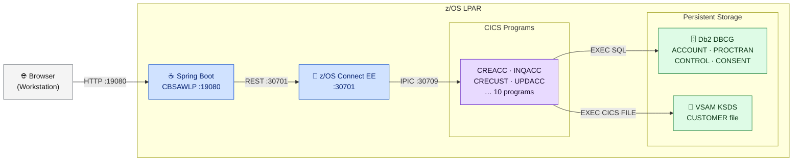

# Prerequisites

<strong>CBSA runs entirely inside a z/OS LPAR.</strong> The only external component is the end-user browser. All components — CICS, Db2, z/OS Connect EE, Spring Boot — run within z/OS.

---

## Architecture Overview

**Legend:** Gray = external · Blue = Liberty JVM servers · Purple = CICS programs · Green = persistent storage

---

## z/OS Software Requirements

<table class="compare-table">
<thead>
<tr>
  <th style="width:20%">Component</th>
  <th style="width:15%">Min Version</th>
  <th style="width:30%">Feature / Config</th>
  <th style="width:35%">Notes</th>
</tr>
</thead>
<tbody>
<tr>
  <td><strong>z/OS</strong></td>
  <td>2.4</td>
  <td>USS (OMVS) required</td>
  <td>Build workspace on USS</td>
</tr>
<tr>
  <td><strong>CICS TS</strong></td>
  <td>5.5</td>
  <td>JVM server support</td>
  <td>CBSAWLP Liberty JVM server</td>
</tr>
<tr>
  <td><strong>Db2 for z/OS</strong></td>
  <td>12</td>
  <td>Subsystem <code>DBCG</code></td>
  <td>4 tables in database <code>CBSA</code></td>
</tr>
<tr>
  <td><strong>z/OS Connect EE</strong></td>
  <td>2.0</td>
  <td>Liberty feature <code>zosConnect-2.0</code></td>
  <td>Port 30701 (HTTP) / 30702 (HTTPS)</td>
</tr>
<tr>
  <td><strong>IBM MQ</strong></td>
  <td>9.2</td>
  <td>Optional</td>
  <td>Not required for core banking</td>
</tr>
<tr>
  <td><strong>Java (z/OS)</strong></td>
  <td>8+</td>
  <td>For CICS Liberty JVM server</td>
  <td>Required by both CBSAWLP and z/OS Connect EE</td>
</tr>
</tbody>
</table>

---

## z/OS Datasets to Allocate

The following datasets must be pre-allocated on z/OS before running the build. Replace `<HLQ>` with your site high-level qualifier — for example `GITLAB.CBSA`.

<table class="compare-table">
<thead>
<tr>
  <th style="width:35%">Dataset pattern</th>
  <th style="width:10%">Org</th>
  <th style="width:10%">LRECL</th>
  <th style="width:45%">Purpose</th>
</tr>
</thead>
<tbody>
<tr>
  <td><code>&lt;HLQ&gt;.COBOL.COPYLIB</code></td>
  <td>PDS</td>
  <td>80</td>
  <td>Copybook library (51 members)</td>
</tr>
<tr>
  <td><code>&lt;HLQ&gt;.CICSLOAD</code></td>
  <td>PDSE</td>
  <td>U</td>
  <td>CICS load module library</td>
</tr>
<tr>
  <td><code>&lt;HLQ&gt;.LOAD</code></td>
  <td>PDSE</td>
  <td>U</td>
  <td>Non-CICS load modules</td>
</tr>
<tr>
  <td><code>&lt;HLQ&gt;.DB2DBRM</code></td>
  <td>PDS</td>
  <td>80</td>
  <td>DBRM members from COBOL compile</td>
</tr>
<tr>
  <td><code>&lt;HLQ&gt;.LISTINGS</code></td>
  <td>PDS</td>
  <td>133</td>
  <td>Compiler listings</td>
</tr>
<tr>
  <td><code>&lt;HLQ&gt;.ZUNIT.PLAYFILES</code></td>
  <td>PDS</td>
  <td>80</td>
  <td>zUnit playback files</td>
</tr>
</tbody>
</table>

---

## Workstation Requirements

These tools are needed on the developer workstation — not on z/OS.

<table class="compare-table">
<thead>
<tr>
  <th style="width:35%">Tool</th>
  <th style="width:15%">Version</th>
  <th style="width:50%">Purpose</th>
</tr>
</thead>
<tbody>
<tr>
  <td><strong>Git</strong></td>
  <td>Any</td>
  <td>Clone repository</td>
</tr>
<tr>
  <td><strong>Java JDK</strong></td>
  <td>8+</td>
  <td>Maven build of Spring Boot WAR</td>
</tr>
<tr>
  <td><strong>Maven</strong></td>
  <td>3.6+</td>
  <td><code>mvn clean package</code> for Spring Boot</td>
</tr>
<tr>
  <td><strong>IBM Developer for z/OS (IDz)</strong></td>
  <td>16+</td>
  <td>Optional — COBOL editing, user builds</td>
</tr>
<tr>
  <td><strong>IBM Bob (IDE)</strong></td>
  <td>1.12+</td>
  <td>AI-assisted modernization</td>
</tr>
<tr>
  <td><strong>z/OS Connect EE Designer</strong></td>
  <td>3.0+</td>
  <td>Optional — OAS3 API design tool</td>
</tr>
</tbody>
</table>

---

## Access and Authority Requirements

- **USS:** Write access to the build workspace directory on USS — the build runs entirely on the z/OS Unix System Services filesystem.
- **Db2:** `SYSADM` authority, or at minimum `CREATE TABLE` authority under the `IBMUSER` schema, to create the four CBSA tables.
- **CICS:** `CEDA` authority to define and install programs and transactions into the CICS region.
- **z/OS Connect EE:** Administrator access to deploy service and API definitions into the Liberty server's watched directories.

---

## Port Requirements

All ports are within z/OS. No ports need to be opened inbound from external networks except for the Spring Boot UI port used by the browser.

<table class="compare-table">
<thead>
<tr>
  <th style="width:15%">Port</th>
  <th style="width:40%">Component</th>
  <th style="width:45%">Direction</th>
</tr>
</thead>
<tbody>
<tr>
  <td><code>19080</code></td>
  <td>Spring Boot UI (CBSAWLP Liberty)</td>
  <td>Browser → z/OS</td>
</tr>
<tr>
  <td><code>30701</code></td>
  <td>z/OS Connect EE HTTP</td>
  <td>Spring Boot → z/OS Connect EE</td>
</tr>
<tr>
  <td><code>30702</code></td>
  <td>z/OS Connect EE HTTPS</td>
  <td>Production HTTPS (Spring Boot → z/OS Connect EE)</td>
</tr>
<tr>
  <td><code>30709</code></td>
  <td>CICS IPIC</td>
  <td>z/OS Connect EE → CICS region</td>
</tr>
</tbody>
</table>
