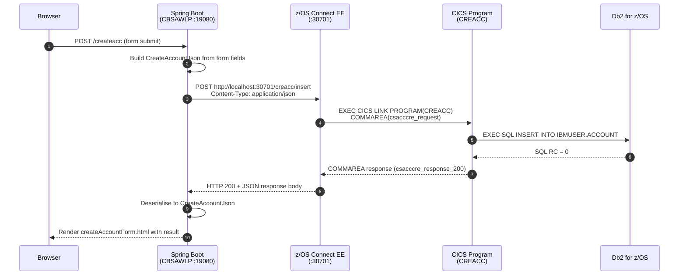

# Spring Boot UI Setup

CBSA's browser interface is provided by a Spring Boot WAR application deployed inside z/OS — there is no external application server. The WAR runs on a CICS Liberty JVM server, and all HTTP traffic between the browser, Spring Boot, and z/OS Connect EE stays within the LPAR.

<div class="callout callout-green">
<strong>Runs inside z/OS.</strong> The Spring Boot Customer Services UI is deployed as a WAR to the CICS Liberty JVM server <code>CBSAWLP</code>. It connects to z/OS Connect EE over <code>localhost</code> HTTP — both servers live inside the same LPAR.
</div>

---

## Application Overview

<table class="compare-table">
<thead>
<tr>
  <th style="width:35%">Attribute</th>
  <th style="width:65%">Value</th>
</tr>
</thead>
<tbody>
<tr>
  <td><strong>Project directory</strong></td>
  <td><code>Z-OS-Connect-EE-Customer-Services-Interface/</code></td>
</tr>
<tr>
  <td><strong>Artifact ID</strong></td>
  <td><code>customerservices</code></td>
</tr>
<tr>
  <td><strong>Version</strong></td>
  <td><code>1.0</code></td>
</tr>
<tr>
  <td><strong>Spring Boot</strong></td>
  <td>2.5.4</td>
</tr>
<tr>
  <td><strong>Java source</strong></td>
  <td>Java 8 (<code>&lt;java.version&gt;8&lt;/java.version&gt;</code> in <code>pom.xml</code>)</td>
</tr>
<tr>
  <td><strong>Packaging</strong></td>
  <td>WAR</td>
</tr>
<tr>
  <td><strong>HTTP port</strong></td>
  <td><code>19080</code></td>
</tr>
<tr>
  <td><strong>Context path</strong></td>
  <td><code>/customerservices-1.0</code></td>
</tr>
<tr>
  <td><strong>z/OS Connect EE target</strong></td>
  <td><code>localhost:30701</code> (overridable via <code>--address</code> / <code>--port</code> startup args)</td>
</tr>
<tr>
  <td><strong>JVM server</strong></td>
  <td><code>CBSAWLP</code></td>
</tr>
</tbody>
</table>

---

## Configuration

### application.properties

`application.properties` sets only the HTTP port and context path. There is no `zosconnect.host` property — the z/OS Connect EE host and port are resolved at runtime by `ConnectionInfo.java`, which reads JVM startup arguments.

```properties
# src/main/resources/application.properties
server.port=19080
server.servlet.context-path=/customerservices-1.0
```

### ConnectionInfo defaults and startup override

`ConnectionInfo.java` holds static fields for the z/OS Connect EE address and port. The entry point `CustomerServices.java` parses command-line arguments using JCommander before starting Spring:

```
# Default — loopback works when both servers are on the same z/OS LPAR
address=localhost  port=30701

# Override at startup (JVM startup arguments in the Liberty JVM server profile,
# or on the command line for local development):
java -jar customerservices.war --address myhost.example.com --port 30701
```

Accepted argument aliases:
- `--address`, `--url`, `-a`, `-u`
- `--port`, `-p`

---

## Key Java Classes

| Class | Package | Role |
|---|---|---|
| `CustomerServices.java` | `customerservices` | Spring Boot entry point — parses `--address` / `--port` startup args via JCommander |
| `ConnectionInfo.java` | `customerservices` | Holds z/OS Connect EE host and port; defaults to `localhost:30701` |
| `WebController.java` | `controllers` | All `@GetMapping` / `@PostMapping` routes; creates a `WebClient` per operation |
| `ServletInitializer.java` | `customerservices` | Extends `SpringBootServletInitializer` — enables WAR deployment to Liberty |

---

## UI Screens and Routes

The 10 active routes are defined in `WebController.java`. An 11th template (`paymentInterfaceForm.html`) exists in the templates folder but is served by the **separate** `Z-OS-Connect-EE-Payment-Interface/` project.

| Screen | URL | z/OS Connect API called |
|---|---|---|
| Main menu | `/services`, `/` | (none — navigation only) |
| Enquire account | `/enqacct` | `GET /inqaccz/enquiry/{accno}` |
| Create account | `/createacc` | `POST /creacc/insert` |
| List accounts | `/listacc` | `GET /inqacccz/list/{custno}` |
| Delete account | `/delacct` | `DELETE /delacc/remove/{accno}` |
| Update account | `/updateacc` | `PUT /updacc/update` |
| Enquire customer | `/enqcust` | `GET /inqcustz/enquiry/{custno}` |
| Create customer | `/createcust` | `POST /crecust/insert` |
| Delete customer | `/delcust` | `DELETE /delcus/remove/{custno}` |
| Update customer | `/updatecust` | `PUT /updcust/update` |

The corresponding Thymeleaf templates are in `src/main/resources/templates/`:

| Template | Served by route |
|---|---|
| `customerServices.html` | `/services`, `/` |
| `accountEnquiryForm.html` | `/enqacct` |
| `createAccountForm.html` | `/createacc` |
| `listAccountsForm.html` | `/listacc` |
| `deleteAccountForm.html` | `/delacct` |
| `updateAccountForm.html` | `/updateacc` |
| `customerEnquiryForm.html` | `/enqcust` |
| `createCustomerForm.html` | `/createcust` |
| `deleteCustomerForm.html` | `/delcust` |
| `updateCustomerForm.html` | `/updatecust` |
| `paymentInterfaceForm.html` | (Payment Interface project only) |

---

## Building

```bash
cd Z-OS-Connect-EE-Customer-Services-Interface
mvn clean package -DskipTests
```

Build outputs:

| Artifact | Location | Purpose |
|---|---|---|
| `customerservices-1.0.war` | `target/` | WAR for Liberty / CICS deployment |
| `customerservices-1.0.zip` | `target/` | CICS bundle (WAR + CICS manifest) produced by `cics-bundle-maven-plugin` |

---

## Deployment — Option A: CICS Liberty JVM Server (Production)

The `cics-bundle-maven-plugin` (version `1.0.4-SNAPSHOT`) packages the WAR into a CICS bundle that targets JVM server `CBSAWLP`:

```xml
<plugin>
    <groupId>com.ibm.cics</groupId>
    <artifactId>cics-bundle-maven-plugin</artifactId>
    <version>1.0.4-SNAPSHOT</version>
    <executions>
        <execution>
            <goals>
                <goal>bundle-war</goal>
            </goals>
            <configuration>
                <jvmserver>CBSAWLP</jvmserver>
            </configuration>
        </execution>
    </executions>
</plugin>
```

Deployment steps:

1. Run `mvn clean package -DskipTests` to produce `target/customerservices-1.0.zip`.
2. Copy the CICS bundle ZIP to USS on your z/OS system.
3. Unzip it into a directory visible to CICS (e.g. `/u/ibmuser/bundles/customerservices-1.0/`).
4. Define or update a CICS `BUNDLE` resource pointing to that directory.
5. Install and enable the BUNDLE resource — CICS will deploy the WAR to `CBSAWLP`.

<div class="callout callout-yellow">
<strong>JVM server name:</strong> <code>CBSAWLP</code> is hardcoded in <code>pom.xml</code>. If your Liberty JVM server has a different name, update the <code>&lt;jvmserver&gt;</code> element before building.
</div>

---

## Deployment — Option B: Local Embedded Tomcat (Development)

```bash
cd Z-OS-Connect-EE-Customer-Services-Interface
mvn spring-boot:run
```

The UI will be available at `http://localhost:19080/customerservices-1.0`.

<div class="callout callout-yellow">
<strong>Connecting to z/OS Connect EE:</strong> When running locally, pass startup arguments so the UI can reach a running z/OS Connect EE instance:<br/>
<code>mvn spring-boot:run -Dspring-boot.run.arguments="--address myhost.example.com --port 30701"</code>
</div>

---

## Dependencies

<table class="compare-table">
<thead>
<tr>
  <th style="width:35%">Dependency</th>
  <th style="width:15%">Scope</th>
  <th style="width:50%">Purpose</th>
</tr>
</thead>
<tbody>
<tr>
  <td><code>spring-boot-starter-web</code></td>
  <td>compile</td>
  <td>Spring MVC — <code>@Controller</code>, <code>@GetMapping</code>, <code>@PostMapping</code></td>
</tr>
<tr>
  <td><code>spring-boot-starter-thymeleaf</code></td>
  <td>compile</td>
  <td>Thymeleaf template engine for all 11 HTML screens</td>
</tr>
<tr>
  <td><code>spring-boot-starter-webflux</code></td>
  <td>compile</td>
  <td>Reactive <code>WebClient</code> for HTTP calls to z/OS Connect EE — NOT RestTemplate</td>
</tr>
<tr>
  <td><code>spring-boot-starter-tomcat</code></td>
  <td>provided</td>
  <td>Embedded Tomcat — excluded from the WAR; Liberty provides the servlet container</td>
</tr>
<tr>
  <td><code>spring-boot-starter-validation</code></td>
  <td>provided</td>
  <td>Bean Validation (<code>@Valid</code>) for form input checking</td>
</tr>
<tr>
  <td><code>jackson-databind</code></td>
  <td>compile</td>
  <td>JSON serialisation / deserialisation for z/OS Connect EE request and response bodies</td>
</tr>
</tbody>
</table>

---

## Request Flow: Create Account

The sequence below shows every hop for a "Create Account" form submission — the same pattern applies to all 9 mutating operations.


