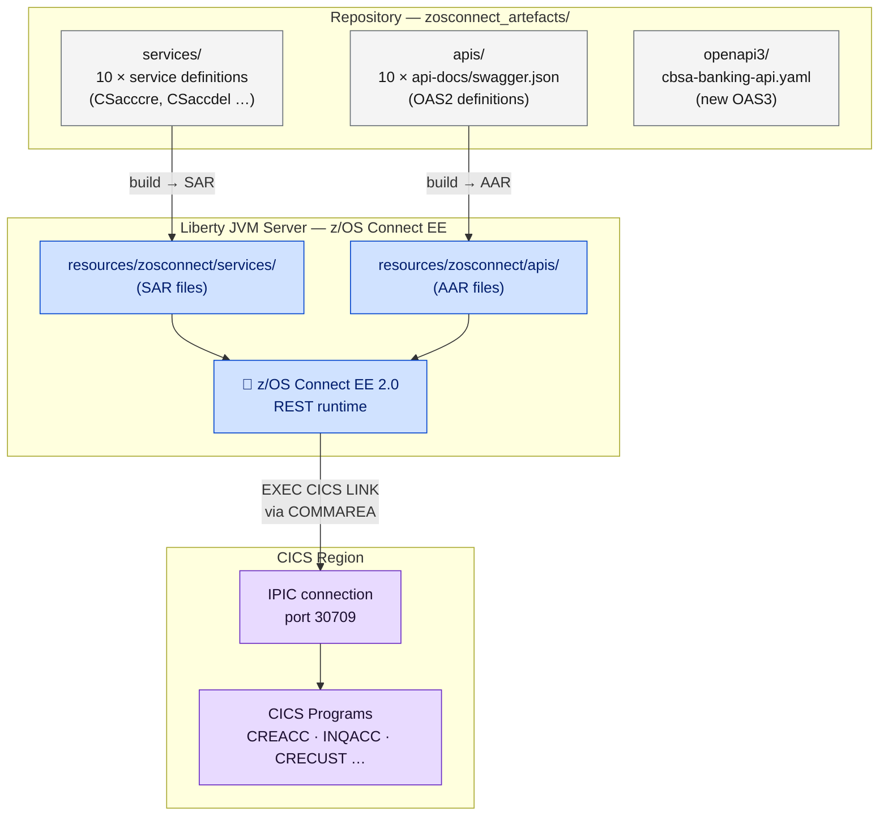

# z/OS Connect EE Deployment

<div class="callout callout-green">
<strong>z/OS Connect EE is the REST gateway inside z/OS.</strong> It runs as a Liberty JVM server, exposes 10 CICS programs as REST APIs over OAS2 (Swagger 2.0), and connects to the CICS region via IPIC on port 30709.
</div>

---

## Deployment Architecture

The artefacts in `zosconnect_artefacts/` are the source definitions for all 10 APIs. SAR/AAR files compiled from those definitions are deployed into the Liberty server's watched directories, where the z/OS Connect EE runtime reads them and exposes them as live REST endpoints.



**Legend:** Gray = source artefacts in repo · Blue = running Liberty server · Purple = CICS

---

## The 10 REST APIs

Each of the 10 banking operations is exposed as a discrete OAS2 API. The table below maps the repository directory to the HTTP verb, OAS2 path, the CICS program that is invoked, and the equivalent OAS3 path from `openapi3/cbsa-banking-api.yaml`.

<table class="compare-table">
<thead>
<tr>
  <th>API Directory</th>
  <th>HTTP Method</th>
  <th>OAS2 Path</th>
  <th>CICS Program</th>
  <th>OAS3 Equivalent</th>
</tr>
</thead>
<tbody>
<tr>
  <td><code>creacc</code></td>
  <td><code>POST</code></td>
  <td><code>/creacc/insert</code></td>
  <td><code>CREACC</code></td>
  <td><code>POST /accounts</code></td>
</tr>
<tr>
  <td><code>crecust</code></td>
  <td><code>POST</code></td>
  <td><code>/crecust/insert</code></td>
  <td><code>CRECUST</code></td>
  <td><code>POST /customers</code></td>
</tr>
<tr>
  <td><code>delacc</code></td>
  <td><code>DELETE</code></td>
  <td><code>/delacc/remove/{accno}</code></td>
  <td><code>DELACC</code></td>
  <td><code>DELETE /accounts/{id}</code></td>
</tr>
<tr>
  <td><code>delcus</code></td>
  <td><code>DELETE</code></td>
  <td><code>/delcus/remove/{custno}</code></td>
  <td><code>DELCUS</code></td>
  <td><code>DELETE /customers/{id}</code></td>
</tr>
<tr>
  <td><code>inqacccz</code></td>
  <td><code>GET</code></td>
  <td><code>/inqacccz/list/{custno}</code></td>
  <td><code>INQACCCU</code></td>
  <td><code>GET /customers/{id}/accounts</code></td>
</tr>
<tr>
  <td><code>inqaccz</code></td>
  <td><code>GET</code></td>
  <td><code>/inqaccz/enquiry/{accno}</code></td>
  <td><code>INQACC</code></td>
  <td><code>GET /accounts/{id}</code></td>
</tr>
<tr>
  <td><code>inqcustz</code></td>
  <td><code>GET</code></td>
  <td><code>/inqcustz/enquiry/{custno}</code></td>
  <td><code>INQCUST</code></td>
  <td><code>GET /customers/{id}</code></td>
</tr>
<tr>
  <td><code>makepayment</code></td>
  <td><code>PUT</code></td>
  <td><code>/makepayment/dbcr</code></td>
  <td><code>DPAYAPI</code></td>
  <td><code>POST /payments</code></td>
</tr>
<tr>
  <td><code>updacc</code></td>
  <td><code>PUT</code></td>
  <td><code>/updacc/update</code></td>
  <td><code>UPDACC</code></td>
  <td><code>PUT /accounts/{id}</code></td>
</tr>
<tr>
  <td><code>updcust</code></td>
  <td><code>PUT</code></td>
  <td><code>/updcust/update</code></td>
  <td><code>UPDCUST</code></td>
  <td><code>PUT /customers/{id}</code></td>
</tr>
</tbody>
</table>

<div class="callout">
<strong>SAR/AAR files are not stored in the repository.</strong> The <code>zosconnect_artefacts/services/</code> and <code>zosconnect_artefacts/apis/</code> directories contain the source definitions (XML, JSON schemas, <code>swagger.json</code>). You build the SAR and AAR deployment archives from these definitions using z/OS Connect EE Designer or the command-line tooling, then deploy the resulting archives to the Liberty server.
</div>

---

## Liberty Server Configuration

The Liberty JVM server that hosts z/OS Connect EE is configured by `zoseeserver/server.xml`. The key parameters are:

<table class="compare-table">
<thead>
<tr>
  <th style="width:30%">Parameter</th>
  <th style="width:70%">Value / Notes</th>
</tr>
</thead>
<tbody>
<tr>
  <td><strong>Config file</strong></td>
  <td><code>zoseeserver/server.xml</code></td>
</tr>
<tr>
  <td><strong>Liberty features</strong></td>
  <td><code>zosconnect:zosConnect-2.0</code>, <code>zosconnect:cicsService-1.0</code>, <code>zosconnect:zosConnectCommands-1.0</code></td>
</tr>
<tr>
  <td><strong>HTTP port</strong></td>
  <td><code>30701</code></td>
</tr>
<tr>
  <td><strong>HTTPS port</strong></td>
  <td><code>30702</code></td>
</tr>
<tr>
  <td><strong>CICS IPIC connection</strong></td>
  <td><code>host=localhost port=30709</code> — IPIC connection to CICS region</td>
</tr>
<tr>
  <td><strong>Basic auth (demo only)</strong></td>
  <td>User <code>ibmuser</code> / password <code>SYS1</code> — <strong>change before any shared deployment</strong></td>
</tr>
<tr>
  <td><strong>CORS</strong></td>
  <td><code>allowedOrigins="*"</code> — development only; restrict to Spring Boot hostname in production</td>
</tr>
</tbody>
</table>

---

## Deployment Steps

**Step 1 — Verify CICS IPIC connection**

Confirm the CICS region has an IPIC connection defined and enabled on port `30709`. z/OS Connect EE cannot link to CICS programs until this connection is active.

**Step 2 — Deploy service definitions**

Copy the service definition directories from `zosconnect_artefacts/services/` (or the SAR archives built from them) into the Liberty server's watched directory:

```
resources/zosconnect/services/
```

The 10 service names are: `CSacccre`, `CSaccdel`, `CSaccenq`, `CSaccupd`, `CScustacc`, `CScustcre`, `CScustdel`, `CScustenq`, `CScustupd`, `Pay`.

**Step 3 — Deploy API definitions**

Copy the API definition directories from `zosconnect_artefacts/apis/` (or the AAR archives) into:

```
resources/zosconnect/apis/
```

**Step 4 — Start or restart the Liberty server**

If the server is already running, z/OS Connect EE performs a dynamic refresh when it detects new files in the watched directories. A full restart is always safe.

**Step 5 — Verify**

Call the z/OS Connect EE admin endpoint to confirm all 10 services are registered:

```
GET http://<host>:30701/zosConnect/services
```

Each of the 10 service names (`CSacccre`, `CSaccdel`, etc.) should appear in the JSON response. To check APIs:

```
GET http://<host>:30701/zosConnect/apis
```

---

## Spring Boot Integration

The Spring Boot Customer Services UI calls z/OS Connect EE using a reactive `WebClient`. The connection target is managed by [`ConnectionInfo.java`](../../../Z-OS-Connect-EE-Customer-Services-Interface/src/main/java/com/ibm/cics/cip/bank/springboot/customerservices/ConnectionInfo.java).

**Default connection:** `localhost:30701`

**Override at startup:**

```
java -jar customerservices-1.0.war --address <host> --port <port>
```

The `--address` (`-a`, `--url`, `-u`) and `--port` (`-p`) arguments are parsed by [JCommander](http://jcommander.org/) in [`CustomerServices.java`](../../../Z-OS-Connect-EE-Customer-Services-Interface/src/main/java/com/ibm/cics/cip/bank/springboot/customerservices/CustomerServices.java) and stored in `ConnectionInfo` static fields.

**WebClient call pattern** (from [`WebController.java`](../../../Z-OS-Connect-EE-Customer-Services-Interface/src/main/java/com/ibm/cics/cip/bank/springboot/customerservices/controllers/WebController.java)):

```java
// Build the target URL from ConnectionInfo — e.g. "localhost:30701/inqaccz/enquiry/12345"
WebClient client = WebClient.create(
    ConnectionInfo.getAddressAndPort() + "/inqaccz/enquiry/" + acctNumber);

// Reactive GET — blocked here because the call is synchronous within a page load
ResponseSpec response = client.get().retrieve();
String responseBody = response.bodyToMono(String.class).block();

// Deserialise JSON response into a typed Java class
AccountEnquiryJson responseObj =
    new ObjectMapper().readValue(responseBody, AccountEnquiryJson.class);
```

Every one of the 10 operations follows this same pattern: construct a `WebClient` with the correct z/OS Connect EE URL, call the appropriate HTTP verb, block for the response, and deserialise the JSON body.

---

<div class="callout callout-yellow">
<strong>Production hardening — before going live:</strong>
<ul>
  <li>Replace the default basic auth credentials (<code>ibmuser</code> / <code>SYS1</code>) in <code>zoseeserver/server.xml</code>.</li>
  <li>Switch to HTTPS-only access on port <code>30702</code> and disable the plain HTTP port.</li>
  <li>Replace <code>allowedOrigins="*"</code> with the specific hostname of the Spring Boot CBSAWLP server.</li>
  <li>Set <code>requireAuth="true"</code> on the <code>zosConnectManager</code> element to enforce authentication on all API calls.</li>
</ul>
</div>

---

<div class="callout">
<strong>Migrating to OAS3?</strong> The consolidated OAS3 specification is already available at <code>zosconnect_artefacts/openapi3/cbsa-banking-api.yaml</code>. See <a href="../modernization/oas3-migration-with-bob.html">Step 4 — API: z/OS Connect OAS2 → OAS3</a> for the full migration walkthrough.
</div>
