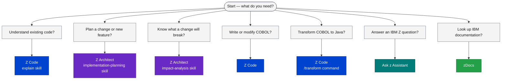

# IBM Bob Premium Z — Skills and Modes Reference

<div class="callout callout-green">
<strong>Complete reference:</strong> This page is the complete reference for Bob's specialized Z modes and skills as configured for this workspace. Bookmark it — every modernization step references these capabilities.
</div>

## The Four Modes

Bob Premium Z ships with four modes, each purpose-built for a distinct role in the IBM Z development lifecycle. Select the mode from the mode picker in your IDE before issuing a prompt.

<table class="compare-table">
<thead>
<tr>
  <th style="width:5%">Icon</th>
  <th style="width:18%">Mode</th>
  <th style="width:22%">Focus</th>
  <th style="width:30%">Key Capabilities</th>
  <th style="width:12%">Slash Commands</th>
  <th style="width:13%">Skills</th>
</tr>
</thead>
<tbody>
<tr>
  <td style="font-size:1.5rem;text-align:center;">🏛️</td>
  <td><strong>Z Architect</strong><br><code>z-architect</code></td>
  <td>Architecture planning and documentation — no code changes produced</td>
  <td>
    Implementation planning · Impact analysis · System diagrams · Technical documentation · Data dictionaries
  </td>
  <td><em>None</em></td>
  <td>
    <code>explain</code><br>
    <code>implementation-planning</code><br>
    <code>impact-analysis</code><br>
    <code>data-dictionary-management</code>
  </td>
</tr>
<tr>
  <td style="font-size:1.5rem;text-align:center;">💻</td>
  <td><strong>Z Code</strong><br><code>z-code</code></td>
  <td>Developer-level explanation and code changes — reads and writes source files</td>
  <td>
    Explain COBOL at developer level · Write/modify COBOL programs · COBOL→Java transformation · Validate transformations · Refactor service extraction
  </td>
  <td>
    <code>/init</code><br>
    <code>/transform</code><br>
    <code>/transform-snippet</code><br>
    <code>/validate</code><br>
    <code>/refactor</code>
  </td>
  <td>
    <code>explain</code><br>
    <code>validate</code><br>
    <code>cobol-transformation</code><br>
    <code>data-dictionary-management</code><br>
    <code>coding-standards-skill-builder</code><br>
    <code>refactor-report-generation</code>
  </td>
</tr>
<tr>
  <td style="font-size:1.5rem;text-align:center;">❓</td>
  <td><strong>Ask z Assistant</strong><br><code>ask-z-assistant</code></td>
  <td>IBM Z technical Q&amp;A and IBM Cloud IAM token management</td>
  <td>
    Answer Z questions via z MCP server · Generate IAM tokens via SSO · Query IBM documentation
  </td>
  <td><em>None</em></td>
  <td><em>None — uses z MCP server directly</em></td>
</tr>
<tr>
  <td style="font-size:1.5rem;text-align:center;">📚</td>
  <td><strong>zDocs</strong><br><code>zdocs</code></td>
  <td>IBM Z research and documentation lookup</td>
  <td>
    Search IBM docs · Fetch documentation pages · Synthesize IBM Redbooks content · Answer architecture questions from official sources
  </td>
  <td><em>None</em></td>
  <td><em>None — uses IBM docs MCP tools directly</em></td>
</tr>
</tbody>
</table>

---

## When to Use Which Mode

Use this flowchart to pick the right mode before you start a task. The decision is based on **what you need as output**, not the topic you are asking about.



**Quick rule of thumb:** If you need a document or diagram → **Z Architect**. If you need working code → **Z Code**. If you need a factual answer about IBM Z technology → **Ask z Assistant**. If you need an IBM publication → **zDocs**.

---

## The Eight Skills

Skills are invocable capabilities that extend what each mode can do. They activate automatically based on keyword recognition in your prompt, or can be requested explicitly by name.

---

### `explain`

**Available in:** Z Architect (architectural view) · Z Code (developer view)

**Trigger phrase:** *"Explain [file]"* or *"Explain [file] — focus on [topic]"*

Bob reads the named source file — or all files in scope — and produces a structured explanation at the appropriate level of detail for the active mode.

**Output includes:**
- Business purpose and system context
- Data structures (COMMAREs, copybooks, working-storage)
- Control flow narrative and paragraph-by-paragraph walkthrough
- DB2, CICS, and MQ interactions
- Error handling and abend paths
- Mermaid flowchart of the main processing logic

| Mode | Perspective |
|---|---|
| **Z Architect** | Focuses on system boundaries, integration points, and business capabilities — suitable for architects and pre-sales |
| **Z Code** | Focuses on implementation detail, variable usage, and code-level logic — suitable for developers making changes |

**CBSA example prompt:**
```
Mode: Z Code
Prompt: "Explain CREACC.cbl — focus on the Named Counter mechanism
         and why it needs ENQ/DEQ for account number generation"
```

---

### `implementation-planning`

**Available in:** Z Architect

**Trigger phrase:** *"Create an implementation plan for [description of change]"*

Bob analyzes the workspace, traces all dependency chains from the affected program outward through copybooks, callers, z/OS Connect service descriptors, and Spring Boot REST models, then produces a structured, step-by-step implementation plan saved to `bobz/implementation-plans/`.

**Output includes:**
- Summary of the change and its scope
- Ordered list of files to modify with rationale
- COMMAREA / copybook delta specifications
- z/OS Connect and API layer impacts
- Test and validation checklist
- Risk and complexity assessment

**Output location:** `bobz/implementation-plans/<plan-name>.md`

**CBSA example prompt:**
```
Mode: Z Architect
Prompt: "Create an implementation plan to add transaction limits
         to XFRFUN.cbl — maximum transfer amount of $10,000 per day"
```

---

### `impact-analysis`

**Available in:** Z Architect

**Trigger phrase:** *"Analyze the impact of [change description]"*

Bob traces all components that reference the changed artifact — programs, copybooks, z/OS Connect service definitions, Spring Boot models, and test suites — and produces a risk-rated impact report with a Mermaid propagation diagram saved to `bobz/impact-analysis/`.

**Output includes:**
- Direct callers (programs that CALL or LINK the changed program)
- Indirect callers (programs that use the changed copybook)
- z/OS Connect service definitions referencing the changed COMMAREA
- Spring Boot JSON models that map to the affected fields
- Mermaid dependency propagation diagram
- Risk rating per component (High / Medium / Low)

**Output location:** `bobz/impact-analysis/<report-name>.md`

**CBSA example prompt:**
```
Mode: Z Architect
Prompt: "Analyze the impact of adding a new field COMM-ACCOUNT-CATEGORY
         (PIC X(4)) to the ACCTDAT copybook"
```

---

### `data-dictionary-management`

**Available in:** Z Architect · Z Code

This skill has three operational sub-modes that share a common output file:

<table class="compare-table">
<thead>
<tr>
  <th style="width:20%">Sub-mode</th>
  <th style="width:40%">Trigger</th>
  <th style="width:40%">Effect</th>
</tr>
</thead>
<tbody>
<tr>
  <td><strong>Generate</strong></td>
  <td><em>"Generate a data dictionary for all COBOL programs"</em></td>
  <td>Scans <code>CBSA/cobol/</code> and <code>CBSA/copybook/</code>, decodes 8-character names, creates <code>bobz/DD.json</code></td>
</tr>
<tr>
  <td><strong>Update</strong></td>
  <td><em>"Update the data dictionary with NEWPROG.cbl"</em></td>
  <td>Merges new program/field entries into the existing <code>bobz/DD.json</code></td>
</tr>
<tr>
  <td><strong>Use</strong></td>
  <td>Implicit — loaded automatically by <code>explain</code>, <code>implementation-planning</code>, and <code>impact-analysis</code></td>
  <td>Provides human-readable name expansions during all other skill outputs</td>
</tr>
</tbody>
</table>

`bobz/DD.json` maps every 8-character COBOL identifier (`CREACC`, `ACCTDAT`, `COMM-ACCNO`) to its full business name and description. Once generated, all other skills read it automatically to produce more readable output.

**Output location:** `bobz/DD.json`

**CBSA example prompt:**
```
Mode: Z Architect
Prompt: "Generate a data dictionary for all COBOL programs
         and copybooks in the CBSA workspace"
```

---

### `validate`

**Available in:** Z Code

**Trigger:** Run after `/transform` or explicitly via `/validate [file]`

The validate skill executes a four-phase workflow to confirm that a COBOL→Java transformation is functionally correct:

<table class="compare-table">
<thead>
<tr>
  <th style="width:10%">Phase</th>
  <th style="width:25%">Name</th>
  <th style="width:65%">What Happens</th>
</tr>
</thead>
<tbody>
<tr>
  <td style="text-align:center;font-weight:700;">1</td>
  <td><strong>Data Preparation</strong></td>
  <td>Extracts COMMAREA field definitions and DB2 table schemas from the original COBOL. Builds a test-data manifest used in subsequent phases.</td>
</tr>
<tr>
  <td style="text-align:center;font-weight:700;">2</td>
  <td><strong>Resource Mapping</strong></td>
  <td>Maps COBOL data structures to their Java equivalents — WORKING-STORAGE variables to class fields, COPY members to nested POJOs, DB2 host variables to JDBC parameters.</td>
</tr>
<tr>
  <td style="text-align:center;font-weight:700;">3</td>
  <td><strong>JUnit Generation</strong></td>
  <td>Generates a JUnit 5 test class covering happy-path, boundary, and error-path scenarios derived from the COBOL paragraph logic and data ranges.</td>
</tr>
<tr>
  <td style="text-align:center;font-weight:700;">4</td>
  <td><strong>Test Execution</strong></td>
  <td>Runs the generated tests against the transformed Java class. Reports pass/fail per test case with a mapping back to the originating COBOL paragraph.</td>
</tr>
</tbody>
</table>

**Output location:** `.validate/<program-name>/` (test sources and results)

**CBSA example prompt:**
```
Mode: Z Code
Prompt: "/validate CBSA/cobol/INQACC.cbl"
```

---

### `cobol-transformation`

**Available in:** Z Code

**Activation:** Activated automatically during `/transform` and `/transform-snippet`. Can also be invoked explicitly for rule explanation.

This skill encodes the precise set of rules Bob applies when converting CBSA COBOL programs to Java. The rules handle the idiomatic COBOL patterns that appear throughout the CBSA codebase:

<table class="compare-table">
<thead>
<tr>
  <th style="width:25%">COBOL Pattern</th>
  <th style="width:75%">Java Transformation Rule</th>
</tr>
</thead>
<tbody>
<tr>
  <td><strong>FILLER fields</strong></td>
  <td>Mapped to <code>byte[]</code> fields with a generated name (<code>filler1</code>, <code>filler2</code>…). Size is preserved exactly to maintain COMMAREA alignment. Documented with a <code>// FILLER</code> comment.</td>
</tr>
<tr>
  <td><strong>REDEFINES — Scenario 1</strong><br>Simple type alias</td>
  <td>Both the original field and the REDEFINES field are emitted as separate Java fields. A comment links them: <code>// REDEFINES originalField</code>.</td>
</tr>
<tr>
  <td><strong>REDEFINES — Scenario 2</strong><br>Union of structures</td>
  <td>An inner static class is generated for each structure. A single <code>byte[]</code> field holds the raw bytes; accessor methods convert on demand.</td>
</tr>
<tr>
  <td><strong>REDEFINES — Scenario 3</strong><br>Condition names (88-level)</td>
  <td>Generated as Java <code>enum</code> with a factory method <code>from(String code)</code> that maps COBOL literal values to enum constants.</td>
</tr>
<tr>
  <td><strong>REDEFINES — Scenario 4</strong><br>Numeric/character overlay</td>
  <td>Both interpretations are generated as typed fields. A conversion utility method handles encoding between <code>BigDecimal</code> and packed-decimal <code>byte[]</code>.</td>
</tr>
<tr>
  <td><strong>Lombok annotations</strong></td>
  <td>All generated POJOs receive <code>@Data</code>, <code>@NoArgsConstructor</code>, and <code>@AllArgsConstructor</code>. Builder pattern added for COMMAREs with more than 10 fields.</td>
</tr>
<tr>
  <td><strong>IMS special handling</strong></td>
  <td>IMS PCB masks and SSA structures are converted to annotated interfaces. DL/I calls (<code>GU</code>, <code>ISRT</code>, <code>DLET</code>) are mapped to a generated <code>ImsRepository</code> abstraction with a <code>// TODO: verify IMS mapping</code> marker.</td>
</tr>
</tbody>
</table>

Any CICS-specific code that has no direct Java equivalent (EXEC CICS commands, EIB access) is preserved as a commented block with a `// CICS: review required` marker so the developer can implement the appropriate Spring integration.

---

### `refactor-report-generation`

**Available in:** Z Code

**Trigger phrase:** *"Identify service extraction candidates in [file]"* or via `/refactor [file]`

Bob reads the named COBOL program and identifies paragraphs or sections that are strong candidates for extraction as independent microservices or reusable Java components. The analysis applies cohesion, coupling, and line-of-code heuristics.

**Output includes:**
- List of candidate paragraphs with cohesion score and extraction rationale
- Recommended Java service interface for each candidate
- Dependencies the candidate has on working-storage or COMMAREA fields
- Risk level for extraction (High / Medium / Low)
- Mermaid diagram of current paragraph call graph vs. proposed service boundaries

**Output location:** `bobz/<program-name>-refactor-report.md`

**CBSA example prompt:**
```
Mode: Z Code
Prompt: "Identify service extraction candidates in CREACC.cbl —
         focus on the account creation and Named Counter paragraphs"
```

---

### `coding-standards-skill-builder`

**Available in:** Z Code

**Trigger phrase:** *"Create coding standards based on existing CBSA programs"*

Bob scans a set of COBOL or PL/I source files, derives the naming conventions and formatting rules that are already in use, and produces a coding standards document that new developers — and Bob itself — can follow when writing new code.

**Output includes:**
- Program naming conventions (prefix rules, 8-char truncation patterns)
- Data name conventions (COMM- prefixes, level-number patterns)
- Paragraph naming and numbering style
- WORKING-STORAGE layout conventions
- Copybook usage patterns
- Comment header standards

**Output location:** `bobz/coding-standards.md`

**CBSA example prompt:**
```
Mode: Z Code
Prompt: "Create coding standards based on the existing CBSA COBOL
         programs in CBSA/cobol/ — focus on naming, paragraph style,
         and copybook usage conventions"
```

---

## Slash Commands Reference

Slash commands are typed directly in the chat prompt and activate a specific multi-step workflow. They are only available in **Z Code** mode.

<table class="compare-table">
<thead>
<tr>
  <th style="width:25%">Command</th>
  <th style="width:55%">Description</th>
  <th style="width:20%">Mode</th>
</tr>
</thead>
<tbody>
<tr>
  <td><code>/init</code></td>
  <td>Initializes the workspace for Bob Z workflows. Reads the project structure, generates <code>bobz/DD.json</code> if absent, and indexes all COBOL programs and copybooks for subsequent commands.</td>
  <td>Z Code</td>
</tr>
<tr>
  <td><code>/transform [file]</code></td>
  <td>Transforms the specified COBOL source file to Java using the <code>cobol-transformation</code> skill rules. Produces an annotated Java class alongside the original COBOL. Automatically chains to <code>/validate</code> unless <code>--no-validate</code> is passed.</td>
  <td>Z Code</td>
</tr>
<tr>
  <td><code>/transform-snippet</code></td>
  <td>Transforms the COBOL code that is currently selected in the editor (a paragraph, section, or data division extract) rather than an entire file. Useful for testing transformation rules before running a full <code>/transform</code>.</td>
  <td>Z Code</td>
</tr>
<tr>
  <td><code>/validate [file]</code></td>
  <td>Executes the four-phase validation workflow against the Java output for the specified COBOL file. Runs Data Preparation → Resource Mapping → JUnit Generation → Test Execution. Results written to <code>.validate/</code>.</td>
  <td>Z Code</td>
</tr>
<tr>
  <td><code>/refactor [file]</code></td>
  <td>Runs the <code>refactor-report-generation</code> skill against the specified COBOL file. Produces a Markdown report identifying paragraphs that are candidates for service extraction, saved to <code>bobz/</code>.</td>
  <td>Z Code</td>
</tr>
</tbody>
</table>

---

## Output Locations

All Bob-generated artefacts are written to well-known locations so they can be shared, reviewed, and version-controlled alongside the source.

<table class="compare-table">
<thead>
<tr>
  <th style="width:35%">Location</th>
  <th style="width:65%">What Is Stored Here</th>
</tr>
</thead>
<tbody>
<tr>
  <td><code>bobz/implementation-plans/</code></td>
  <td>One Markdown file per implementation plan produced by the <code>implementation-planning</code> skill. Each file contains the full step-by-step plan, affected-files list, COMMAREA delta specs, and risk assessment.</td>
</tr>
<tr>
  <td><code>bobz/impact-analysis/</code></td>
  <td>One Markdown file per impact analysis produced by the <code>impact-analysis</code> skill. Each file contains the propagation diagram, per-component risk ratings, and recommended mitigations.</td>
</tr>
<tr>
  <td><code>bobz/documentation/</code></td>
  <td>Explanations and technical documentation produced by the <code>explain</code> skill when run in documentation-save mode (e.g., <code>"Explain and save documentation for CREACC.cbl"</code>).</td>
</tr>
<tr>
  <td><code>bobz/DD.json</code></td>
  <td>The workspace data dictionary produced by the <code>data-dictionary-management</code> skill. Maps every 8-character COBOL identifier to its full business name, data type, and description. Read automatically by all other skills.</td>
</tr>
<tr>
  <td><code>.validate/</code></td>
  <td>JUnit test sources and test execution results produced by the <code>validate</code> skill. One subdirectory per transformed program (e.g., <code>.validate/INQACC/</code>). Contains generated test class, test data fixtures, and pass/fail report.</td>
</tr>
<tr>
  <td><code>bobz/</code> (root)</td>
  <td>Refactor reports produced by <code>refactor-report-generation</code> (<code>&lt;program&gt;-refactor-report.md</code>), coding standards (<code>coding-standards.md</code>), and any other skill output not placed in a dedicated subdirectory.</td>
</tr>
</tbody>
</table>

<div class="callout">
<strong>Output directory:</strong> All Bob output is saved to the <code>bobz/</code> directory in the workspace root. This directory is excluded from git tracking by default — add it to <code>.gitignore</code> if it is not already present, or commit selectively when artefacts are ready to share with the team.
</div>
