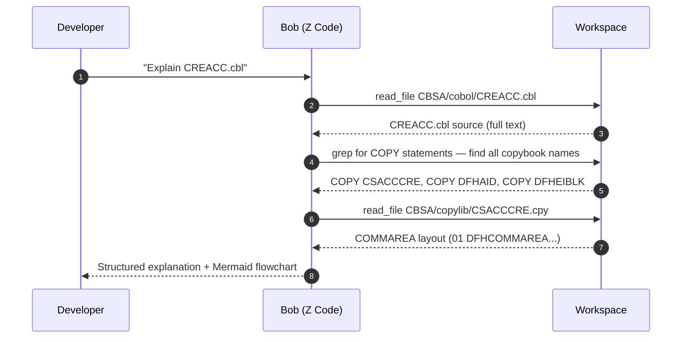

# Step 1 — Understanding COBOL with IBM Bob

<div class="callout callout-green">
<strong>This is always the first step in any modernization workflow.</strong> Before planning changes, running impact analysis, or transforming code — you need to understand what the program does. Bob compresses this from weeks to minutes.
</div>

## Two Explanation Perspectives

Bob offers two complementary modes for understanding COBOL programs. Choosing the right one sharpens the output significantly.

<table class="compare-table">
<thead>
<tr>
  <th style="width:20%">Dimension</th>
  <th class="col-legacy" style="width:40%">Z Architect Mode</th>
  <th class="col-modern" style="width:40%">Z Code Mode</th>
</tr>
</thead>
<tbody>
<tr>
  <td><strong>Perspective</strong></td>
  <td class="col-legacy">Architectural — the system view</td>
  <td class="col-modern">Developer — the implementation view</td>
</tr>
<tr>
  <td><strong>Focus</strong></td>
  <td class="col-legacy">Business purpose, how the program fits the system, component interactions, integration points, impact scope</td>
  <td class="col-modern">Code structure, algorithms, data structures, control flow, DB2 operations, CICS calls, error handling, screen handling</td>
</tr>
<tr>
  <td><strong>Typical output</strong></td>
  <td class="col-legacy">Caller/dependency map, Mermaid component diagram, risk assessment, documentation-ready prose</td>
  <td class="col-modern">Paragraph-level walkthrough, data layout, SQL explained, Mermaid flowchart of logic</td>
</tr>
<tr>
  <td><strong>Use when</strong></td>
  <td class="col-legacy">Planning changes, writing documentation, impact analysis prep</td>
  <td class="col-modern">Implementing changes, debugging, COBOL→Java transformation</td>
</tr>
</tbody>
</table>

## Running Your First Explanation

Follow these steps to get Bob to explain any CBSA program from inside VS Code or IDz:

**Step 1 — Open the Bob chat panel**

Press <kbd>Cmd</kbd>+<kbd>Shift</kbd>+<kbd>P</kbd> and type **Bob: Open Chat**, then press Enter. The Bob panel opens on the right side of the editor.

**Step 2 — Select your mode**

Use the mode dropdown at the top of the Bob panel. Choose **Z Code** for a developer-level breakdown or **Z Architect** for a system-level view.

**Step 3 — Type your prompt**

Reference the file by its workspace-relative path. Bob automatically reads the source, follows all `COPY` statements into the copylib, and produces a structured explanation.

Example prompts for [`CREACC.cbl`](../../../CBSA/cobol/CREACC.cbl):

```
Mode: Z Code
Prompt: "Explain CBSA/cobol/CREACC.cbl — focus on the Named Counter mechanism
         for account number generation and why it needs ENQ/DEQ"
```

```
Mode: Z Architect
Prompt: "What is the architectural role of CREACC in the CBSA system?
         What calls it and what does it depend on?"
```

---

## CBSA Program Explanations — Demo Prompts

Ready-to-run prompts for the five key CBSA programs. Paste these directly into the Bob chat panel.

### CREACC.cbl — Create Account

<div class="callout">
<strong>File:</strong> <code>CBSA/cobol/CREACC.cbl</code> — Creates a new bank account record, generates a unique account number via the Named Counter service, and inserts a row into the DB2 <code>ACCOUNT</code> table.
</div>

**Z Code prompt:**
```
Explain CBSA/cobol/CREACC.cbl — focus on the Named Counter mechanism
for account number generation and why it needs ENQ/DEQ
```

**Z Architect prompt:**
```
What is the architectural role of CREACC in the CBSA system?
What calls it and what does it depend on?
```

**Key output points Bob will cover:**

| Topic | What to expect |
|---|---|
| Named Counter mechanism | How `EXEC CICS GET COUNTER` generates a unique sequential account number |
| ENQ/DEQ concurrency guard | Why `EXEC CICS ENQ` wraps the counter increment to prevent duplicate account numbers under concurrent load |
| DB2 INSERT | The `INSERT INTO ACCOUNT` statement, bound columns, and error handling via `SQLCODE` |
| COMMAREA structure | Input fields (customer number, sort code, account type, opening balance) vs output fields (assigned account number, return code) |
| Error codes | `CREACC-SUCCESS`, `CREACC-FAIL`, and the DB2 error passback path |

---

### INQACC.cbl — Enquire Account

<div class="callout">
<strong>File:</strong> <code>CBSA/cobol/INQACC.cbl</code> — Retrieves a single account record by account number from the DB2 <code>ACCOUNT</code> table and returns it in the COMMAREA.
</div>

**Z Code prompt:**
```
Explain CBSA/cobol/INQACC.cbl — what DB2 operations does it perform
and what does it return in the COMMAREA?
```

**Key output points Bob will cover:**

| Topic | What to expect |
|---|---|
| DB2 SELECT | The `SELECT` from `ACCOUNT` table, cursor vs singleton fetch, `SQLCODE` checking |
| COMMAREA fields populated | Every output field mapped to its DB2 column: account number, sort code, account type, available balance, actual balance, interest rate, overdraft limit |
| Not-found handling | The `NOT FOUND` path that sets the COMMAREA return code and clears output fields |

---

### XFRFUN.cbl — Transfer Funds

<div class="callout">
<strong>File:</strong> <code>CBSA/cobol/XFRFUN.cbl</code> — Transfers a specified amount between two accounts. The most complex transaction in CBSA — involves two DB2 read/update operations within a single CICS unit of work.
</div>

**Z Code prompt:**
```
Explain XFRFUN.cbl — how does the funds transfer work?
What is the unit of work boundary?
```

**Key output points Bob will cover:**

| Topic | What to expect |
|---|---|
| Two-account read/update | Debit account read → balance check → update, then credit account read → update — sequential within the same UoW |
| UoW boundary | `EXEC CICS SYNCPOINT` placement — how DB2 changes are committed atomically or rolled back on error |
| Overdraft checking | The conditional logic that tests available balance before applying the debit, and the `INSUFFICIENT-FUNDS` return code path |

---

### UPDCUST.cbl — Update Customer

<div class="callout">
<strong>File:</strong> <code>CBSA/cobol/UPDCUST.cbl</code> — Updates customer demographic fields (name, address, date of birth, credit score) in the DB2 <code>CUSTOMER</code> table.
</div>

**Z Code prompt:**
```
Explain UPDCUST.cbl — what fields can be updated and what are the validation rules?
```

---

### BNKMENU.cbl — BMS Menu Handler

<div class="callout">
<strong>File:</strong> <code>CBSA/cobol/BNKMENU.cbl</code> — The main BMS menu screen handler. Receives PF key input from the terminal operator and routes to the appropriate service program via <code>EXEC CICS XCTL</code>.
</div>

**Z Code prompt:**
```
Explain BNKMENU.cbl — how does it handle each PF key?
What CICS XCTL calls does it make?
```

**Key output points Bob will cover:**

| Topic | What to expect |
|---|---|
| BMS map handling | `EXEC CICS RECEIVE MAP` and `EXEC CICS SEND MAP` calls and the map/mapset names |
| EIBAID checking | The `EVALUATE EIBAID` block — each `WHEN DFHPF*` branch and the program it routes to |
| XCTL to service programs | The full table of PF key → `EXEC CICS XCTL PROGRAM(...)` mappings across the CBSA menu |

---

## Understanding the COMMAREA Pattern

CBSA uses a consistent COMMAREA convention across all service programs. Ask Bob to decode it:

```
Explain the COMMAREA structure used by CREACC.cbl.
What fields are input vs output? What are the return codes?
```

<div class="callout callout-green">
<strong>Automatic copybook resolution:</strong> Bob reads the <code>COPY</code> member (e.g., <code>CSACCCRE.cpy</code>) automatically from the <code>CBSA/copylib/</code> directory when it processes the <code>COPY CSACCCRE</code> statement in the COBOL source. You do not need to open the copybook separately — the full COMMAREA layout is included in the explanation.
</div>

The COMMAREA pattern Bob will identify across all CBSA programs:

| Convention | Description |
|---|---|
| Input fields prefix | Fields at the top of the COMMAREA that the caller must populate before the `EXEC CICS LINK` |
| Output fields | Fields populated by the program on return — balance values, assigned IDs, response text |
| Return code field | Always present — `0` for success, non-zero values are program-specific error codes |
| COMMAREA length | Passed as `LENGTH OF WS-COMMAREA` — Bob flags if the caller and callee definitions differ |

---

## Building a Data Dictionary

CBSA uses 8-character COBOL variable names (`COMM-ACNO`, `COMM-SORT`, `CUST-DOB`) that carry no obvious business meaning. The `data-dictionary-management` skill generates a persistent dictionary that enriches all subsequent explanations.

```
Generate a data dictionary for CBSA that maps the 8-character variable names
to their business meanings. Start with CREACC.cbl and INQACC.cbl
```

<div class="callout">
<strong>Output location:</strong> <code>bobz/DD.json</code> in the workspace root. Once generated, Bob reads this file at the start of every explanation and substitutes business-readable labels alongside the COBOL names throughout its output.
</div>

The dictionary accumulates across sessions. Run the prompt again naming additional programs to extend coverage:

```
Extend the data dictionary in bobz/DD.json — add XFRFUN.cbl, UPDCUST.cbl, and BNKMENU.cbl
```

---

## Generating Program Documentation

Use Z Architect mode to produce publishable Markdown documentation directly from source — no manual writing required:

```
Generate technical documentation for CREACC.cbl in Markdown format.
Include: purpose, inputs, outputs, DB2 tables accessed, CICS commands,
error codes, and a Mermaid flowchart.
```

<div class="callout callout-green">
<strong>Output:</strong> Bob saves the generated document to <code>bobz/documentation/CREACC.md</code>. The file is ready to commit to the repository and render as a wiki page. Re-running the prompt after a code change regenerates the doc automatically.
</div>

The generated document follows this structure:

| Section | Content |
|---|---|
| Purpose | One-paragraph business description |
| Inputs | COMMAREA input fields with types and valid ranges |
| Outputs | COMMAREA output fields with types and meaning |
| DB2 tables | Tables accessed, operation type (SELECT / INSERT / UPDATE / DELETE), key columns |
| CICS commands | Every `EXEC CICS` command used, with purpose explained |
| Error codes | All return code values and their meaning |
| Mermaid flowchart | Logic flow from entry through DB2 operation to return |

---

## Bob Explain Workflow

The sequence below shows exactly what Bob does when you ask it to explain a CBSA program:



This means Bob always reads live source from your working copy — if you have made local edits, the explanation reflects your current state, not the last committed version.

---

## Next Steps

With a thorough understanding of the COBOL programs established, you are ready to move to the next phase of the modernization workflow.

<div class="callout callout-green">
<strong>Step 2 — Impact Analysis:</strong> Now that you understand what each program does, use Bob to trace dependencies and quantify the blast radius before making any change. <a href="impact-analysis-with-bob.html">→ Step 2: Impact Analysis with IBM Bob</a>
</div>
