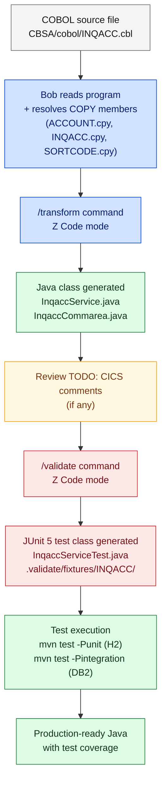

# Step 5 — COBOL to Java Transformation with IBM Bob

<div class="callout callout-green">
<strong>COBOL→Java transformation is the most ambitious step in the modernization journey.</strong> Bob doesn't just translate syntax — it applies precise rules for FILLER fields, REDEFINES scenarios, DB2 SQL mapping, CICS command handling, and Lombok annotations. The result is idiomatic, production-ready Java.
</div>

<div class="callout callout-yellow">
<strong>Prerequisites:</strong> Complete Step 1 (explanation) and Step 2 (impact analysis) before transforming. Understanding the program fully reduces surprises during transformation.
</div>

## What Bob Transforms

<table class="compare-table">
<thead>
<tr>
  <th style="width:35%">COBOL Construct</th>
  <th style="width:65%">Java Equivalent</th>
</tr>
</thead>
<tbody>
<tr>
  <td><strong>DATA DIVISION</strong></td>
  <td>Java class with <code>@Data</code> Lombok annotations (auto-generates getters, setters, <code>equals</code>, <code>hashCode</code>, <code>toString</code>)</td>
</tr>
<tr>
  <td><strong>FILLER fields</strong></td>
  <td><code>private byte[] filler_N</code> sized to match the original PIC clause byte length</td>
</tr>
<tr>
  <td><strong>REDEFINES</strong></td>
  <td>Accessor methods (Scenarios 1–3) or class inheritance (Scenario 4: group-to-group)</td>
</tr>
<tr>
  <td><strong>DB2 EXEC SQL</strong></td>
  <td>JDBC calls — <code>PreparedStatement</code>, <code>ResultSet</code>, <code>DataSource</code> injection</td>
</tr>
<tr>
  <td><strong>CICS EXEC CICS</strong></td>
  <td>Flagged for manual review with <code>// TODO: CICS —</code> comments explaining the required Java equivalent</td>
</tr>
<tr>
  <td><strong>PIC X(n)</strong></td>
  <td><code>String</code> with correct length constant or validation annotation</td>
</tr>
<tr>
  <td><strong>PIC 9(n)V9(d)</strong></td>
  <td><code>BigDecimal</code> with matching scale</td>
</tr>
<tr>
  <td><strong>COMP-3 / PACKED-DECIMAL</strong></td>
  <td><code>BigDecimal</code> — storage encoding is irrelevant in Java</td>
</tr>
<tr>
  <td><strong>OCCURS n TIMES</strong></td>
  <td><code>ArrayList&lt;T&gt;</code> or <code>T[]</code> depending on whether the size is fixed or variable</td>
</tr>
<tr>
  <td><strong>COPY member</strong></td>
  <td>Separate Java class per copybook — each COPY becomes its own DTO</td>
</tr>
</tbody>
</table>

## Running the Transformation

Follow these steps in sequence for any CBSA program:

**Step 1 — Ensure you have a data dictionary.** Run `/init` first if you haven't already. Bob reads `bobz/DD.json` to resolve CBSA's 8-character naming conventions (e.g., `INQACC-ACCNO` → `accountNumber`).

**Step 2 — Switch to Z Code mode.** The `/transform` command is only available in Z Code mode. Select it from the mode selector in the IDE.

**Step 3 — Run the transform command.**
```
/transform CBSA/cobol/INQACC.cbl
```

**Step 4 — Bob reads the file and its COPY members.** Bob automatically resolves all `COPY` statements in the program — `CBSA/copylib/ACCOUNT.cpy`, `CBSA/copylib/SORTCODE.cpy`, `CBSA/copylib/INQACC.cpy`, and the INCLUDE'd SQL copybooks — before generating Java.

**Step 5 — Review the output.** Look specifically for `// TODO: CICS —` comments that mark commands with no direct Java equivalent. These require manual resolution before the class is production-ready.

**Step 6 — Run /validate to generate JUnit tests.**
```
/validate CBSA/cobol/INQACC.cbl
```

---

## Demo: Transforming INQACC.cbl

### Why INQACC is a good starting point

`INQACC.cbl` is the cleanest transformation target in CBSA:

- **No CICS I/O** — `EXEC CICS` appears only for abend handling and SYNCPOINT ROLLBACK in the error path, not for the main business logic.
- **Single DB2 SELECT** — one cursor (`ACC-CURSOR`) over the `ACCOUNT` table, joined on sort code and account number.
- **Clear COMMAREA** — `CBSA/copylib/INQACC.cpy` defines a flat structure with date REDEFINES (Scenario 3).
- **Well-bounded scope** — the program does exactly one thing: look up an account by number and return it.

### Prompt

```
/transform CBSA/cobol/INQACC.cbl
```

### Expected output

Bob generates an `InqaccService.java` class. The DB2 cursor declaration:

```cobol
EXEC SQL DECLARE ACC-CURSOR CURSOR FOR
   SELECT ACCOUNT_EYECATCHER,
          ACCOUNT_CUSTOMER_NUMBER,
          ACCOUNT_SORTCODE,
          ACCOUNT_NUMBER,
          ACCOUNT_TYPE,
          ACCOUNT_INTEREST_RATE,
          ACCOUNT_OPENED,
          ACCOUNT_OVERDRAFT_LIMIT,
          ACCOUNT_LAST_STATEMENT,
          ACCOUNT_NEXT_STATEMENT,
          ACCOUNT_AVAILABLE_BALANCE,
          ACCOUNT_ACTUAL_BALANCE
          FROM ACCOUNT
          WHERE ACCOUNT_SORTCODE = :HV-ACCOUNT-SORTCODE AND
                ACCOUNT_NUMBER   = :HV-ACCOUNT-ACC-NO
          FOR FETCH ONLY
END-EXEC.
```

becomes idiomatic JDBC:

```java
@Service
@RequiredArgsConstructor
public class InqaccService {

    private final DataSource dataSource;

    private static final String SELECT_ACCOUNT =
        "SELECT ACCOUNT_EYECATCHER, ACCOUNT_CUSTOMER_NUMBER, " +
        "ACCOUNT_SORTCODE, ACCOUNT_NUMBER, ACCOUNT_TYPE, " +
        "ACCOUNT_INTEREST_RATE, ACCOUNT_OPENED, ACCOUNT_OVERDRAFT_LIMIT, " +
        "ACCOUNT_LAST_STATEMENT, ACCOUNT_NEXT_STATEMENT, " +
        "ACCOUNT_AVAILABLE_BALANCE, ACCOUNT_ACTUAL_BALANCE " +
        "FROM ACCOUNT " +
        "WHERE ACCOUNT_SORTCODE = ? AND ACCOUNT_NUMBER = ?";

    public InqaccCommarea inquireAccount(String sortCode, String accountNumber) {
        InqaccCommarea result = new InqaccCommarea();
        try (Connection conn = dataSource.getConnection();
             PreparedStatement ps = conn.prepareStatement(SELECT_ACCOUNT)) {

            ps.setString(1, sortCode);
            ps.setString(2, accountNumber);

            try (ResultSet rs = ps.executeQuery()) {
                if (rs.next()) {
                    result.setInqaccEye(rs.getString("ACCOUNT_EYECATCHER"));
                    result.setInqaccCustno(rs.getLong("ACCOUNT_CUSTOMER_NUMBER"));
                    result.setInqaccScode(rs.getString("ACCOUNT_SORTCODE"));
                    result.setInqaccAccno(rs.getString("ACCOUNT_NUMBER"));
                    result.setInqaccAccType(rs.getString("ACCOUNT_TYPE"));
                    result.setInqaccIntRate(rs.getBigDecimal("ACCOUNT_INTEREST_RATE"));
                    result.setInqaccOpened(rs.getString("ACCOUNT_OPENED"));
                    result.setInqaccOverdraft(rs.getInt("ACCOUNT_OVERDRAFT_LIMIT"));
                    result.setInqaccAvailBal(rs.getBigDecimal("ACCOUNT_AVAILABLE_BALANCE"));
                    result.setInqaccActualBal(rs.getBigDecimal("ACCOUNT_ACTUAL_BALANCE"));
                    result.setInqaccSuccess("Y");
                } else {
                    result.setInqaccSuccess("N");
                }
            }
        } catch (SQLException e) {
            result.setInqaccSuccess("N");
            throw new InqaccServiceException("DB2 error during account inquiry", e);
        }
        return result;
    }
}
```

### COMMAREA copybook mapped to a Java DTO

The `CBSA/copylib/INQACC.cpy` copybook — which includes date REDEFINES for opened, last-statement, and next-statement dates — becomes:

```java
@Data
public class InqaccCommarea {

    private String inqaccEye;        // PIC X(4)
    private long   inqaccCustno;     // PIC 9(10)
    private String inqaccScode;      // PIC 9(6)
    private String inqaccAccno;      // PIC 9(8)
    private String inqaccAccType;    // PIC X(8)
    private BigDecimal inqaccIntRate;// PIC 9(4)V99

    // PIC 9(8) — raw storage
    private String inqaccOpened;

    // REDEFINES INQACC-OPENED (Scenario 3: group redefines elementary)
    public int getInqaccOpenedDay()   { return Integer.parseInt(inqaccOpened.substring(0, 2)); }
    public int getInqaccOpenedMonth() { return Integer.parseInt(inqaccOpened.substring(2, 4)); }
    public int getInqaccOpenedYear()  { return Integer.parseInt(inqaccOpened.substring(4, 8)); }

    private int    inqaccOverdraft;  // PIC 9(8)
    private String inqaccLastStmtDt; // PIC 9(8)  — REDEFINES group omitted for brevity
    private String inqaccNextStmtDt; // PIC 9(8)  — REDEFINES group omitted for brevity
    private BigDecimal inqaccAvailBal;  // PIC S9(10)V99
    private BigDecimal inqaccActualBal; // PIC S9(10)V99
    private String inqaccSuccess;    // PIC X
    // INQACC-PCB1-POINTER (POINTER type) → omitted; DLI pointer has no Java equivalent
}
```

---

## Demo: Transforming CREACC.cbl

### Why CREACC is a harder case

`CREACC.cbl` creates a new bank account. It is more complex than `INQACC` because:

- **Named Counter (`HBNKACCT`)** — CICS-specific sequential number generator. Java has no direct equivalent. Must be replaced with a database sequence or a distributed counter (Redis, ZooKeeper, etc.).
- **ENQ / DEQ** — CICS resource locking around the Named Counter access. Java equivalents are `synchronized` blocks or a distributed lock.
- **CICS LINK to `ABNDPROC`** — abend propagation via CICS LINK has no Java equivalent; exception chaining or a Spring AOP error handler replaces it.
- **Multiple DB2 writes** — inserts to both `ACCOUNT` and `PROCTRAN` tables within a single unit of work.

### Prompt

```
/transform CBSA/cobol/CREACC.cbl
```

### Expected output

Bob generates a `CreaccService.java` class with full DB2 INSERT logic and annotates unresolvable CICS constructs:

```java
// TODO: CICS ENQ — EXEC CICS ENQ RESOURCE(NCS-ACC-NO-NAME) LENGTH(16)
// The Named Counter 'HBNKACCT' is a CICS-managed sequential counter used
// for account number generation. In Java, replace with one of:
//   (a) DB2 IDENTITY column / SEQUENCE object
//   (b) Redis INCR command for distributed environments
//   (c) java.util.concurrent.AtomicLong for single-JVM deployments
// Ensure the replacement is thread-safe: the ENQ/DEQ pattern here
// serialises access across all CICS tasks — your Java solution must do the same.

// TODO: CICS DEQ — EXEC CICS DEQ RESOURCE(NCS-ACC-NO-NAME) LENGTH(16)
// Release the Named Counter lock after account number is committed.
// In Java: release the lock in a finally block to match the COBOL DEQ semantics.

// TODO: CICS UPDATE DCOUNTER — EXEC CICS UPDATE DCOUNTER(NCS-ACC-NO-NAME) VALUE(...)
// Decrement the Named Counter on rollback path (RESTORE-NCS section).
// If using a DB2 SEQUENCE, use ROLLBACK to restore; if using Redis, issue DECR.
```

### Resolving CICS-specific TODOs

Bob's guidance for each TODO:

| CICS Construct | Bob's Recommended Java Pattern |
|---|---|
| `EXEC CICS ENQ` | `ReentrantLock.lock()` or distributed lock (Redisson, Curator) |
| `EXEC CICS DEQ` | `lock.unlock()` in `finally` block |
| `EXEC CICS UPDATE DCOUNTER` | DB2 `SEQUENCE` `NEXTVAL` — rollback is automatic on transaction failure |
| `EXEC CICS LINK PROGRAM(ABNDPROC)` | Spring `@ExceptionHandler` or AOP `@AfterThrowing` advice |

---

## Demo: Transforming XFRFUN.cbl

### Why XFRFUN covers transaction handling

`XFRFUN.cbl` transfers funds between two accounts. It is the richest example of CICS Unit of Work (UoW) management in CBSA:

- `EXEC CICS SYNCPOINT` appears **15 times** across the program — both `SYNCPOINT` (commit) and `SYNCPOINT ROLLBACK` (rollback) variants.
- Two separate account rows in the `ACCOUNT` DB2 table are updated atomically.
- The overdraft check (`IF COMM-AMT <= ZERO`) is pure business logic — Bob preserves it exactly.
- No Named Counter, no BMS — this is a clean service-layer program.

### Prompt

```
/transform CBSA/cobol/XFRFUN.cbl
```

### Expected output

Bob generates a `XfrfunService.java` with `@Transactional` controlling the unit of work that previously used `EXEC CICS SYNCPOINT`:

```java
@Service
@RequiredArgsConstructor
public class XfrfunService {

    private final AccountRepository accountRepo;
    private final ProctranRepository proctranRepo;

    @Transactional(rollbackFor = XfrfunServiceException.class)
    public XfrfunCommarea transferFunds(XfrfunCommarea commarea) {

        // Business rule: reject negative or zero amounts — preserved from COBOL
        if (commarea.getCommAmt().compareTo(BigDecimal.ZERO) <= 0) {
            commarea.setCommSuccess("N");
            commarea.setCommFailCode("4");
            return commarea;
        }

        // Debit source account
        Account fromAccount = accountRepo.findBySortcodeAndNumber(
            commarea.getCommFscode(), commarea.getCommFaccno())
            .orElseThrow(() -> new XfrfunServiceException("Source account not found"));

        // Credit destination account
        Account toAccount = accountRepo.findBySortcodeAndNumber(
            commarea.getCommTscode(), commarea.getCommTaccno())
            .orElseThrow(() -> new XfrfunServiceException("Destination account not found"));

        fromAccount.setAccountAvailableBalance(
            fromAccount.getAccountAvailableBalance().subtract(commarea.getCommAmt()));
        fromAccount.setAccountActualBalance(
            fromAccount.getAccountActualBalance().subtract(commarea.getCommAmt()));

        toAccount.setAccountAvailableBalance(
            toAccount.getAccountAvailableBalance().add(commarea.getCommAmt()));
        toAccount.setAccountActualBalance(
            toAccount.getAccountActualBalance().add(commarea.getCommAmt()));

        accountRepo.save(fromAccount);
        accountRepo.save(toAccount);

        // TODO: CICS SYNCPOINT — replaced by @Transactional commit on method exit.
        // EXEC CICS SYNCPOINT ROLLBACK is replaced by exception-triggered rollback.
        // Spring will commit on normal return and rollback on XfrfunServiceException.

        proctranRepo.recordTransfer(fromAccount, toAccount, commarea.getCommAmt());

        commarea.setCommFavbal(fromAccount.getAccountAvailableBalance());
        commarea.setCommFactbal(fromAccount.getAccountActualBalance());
        commarea.setCommTavbal(toAccount.getAccountAvailableBalance());
        commarea.setCommTactbal(toAccount.getAccountActualBalance());
        commarea.setCommSuccess("Y");
        return commarea;
    }
}
```

The `XFRFUN.cpy` COMMAREA maps directly to the `XfrfunCommarea` DTO:

```java
@Data
public class XfrfunCommarea {
    private String     commFaccno;   // PIC 9(8)   — from-account number
    private String     commFscode;   // PIC 9(6)   — from-account sort code
    private String     commTaccno;   // PIC 9(8)   — to-account number
    private String     commTscode;   // PIC 9(6)   — to-account sort code
    private BigDecimal commAmt;      // PIC S9(10)V99 — transfer amount
    private BigDecimal commFavbal;   // PIC S9(10)V99 — from available balance (out)
    private BigDecimal commFactbal;  // PIC S9(10)V99 — from actual balance (out)
    private BigDecimal commTavbal;   // PIC S9(10)V99 — to available balance (out)
    private BigDecimal commTactbal;  // PIC S9(10)V99 — to actual balance (out)
    private String     commFailCode; // PIC X
    private String     commSuccess;  // PIC X
}
```

---

## The 4-Phase Validation Workflow

After `/transform`, run `/validate` to generate a complete JUnit test suite. Bob executes four phases automatically:

### Phase 1 — Data Preparation

Bob prepares test data matching the CBSA account and customer structure. For `INQACC`, it creates:
- A synthetic `ACCOUNT` row with sort code `987654` (from `CBSA/copylib/SORTCODE.cpy`) and a known account number.
- An H2 in-memory schema that mirrors the DB2 `ACCOUNT` table column names and types.
- Test fixtures stored in `.validate/fixtures/INQACC/`.

### Phase 2 — Resource Mapping

Bob maps:
- DB2 table names from `EXEC SQL DECLARE CURSOR` statements → H2 DDL equivalents.
- DB2 column names and types from host variable declarations (`HOST-ACCOUNT-ROW`) → JDBC type mappings.
- JDBC driver configuration → `application-test.properties` with H2 in-memory URL.

### Phase 3 — JUnit Generation

Bob generates a JUnit 5 test class covering:
- **Happy path** — account found, all fields returned correctly, `INQACC-SUCCESS = 'Y'`.
- **Not-found case** — account number not in DB, `INQACC-SUCCESS = 'N'`.
- **Error condition** — SQL exception simulation, confirm service handles gracefully.

### Phase 4 — Test Execution

Bob guides you through running the generated tests:

```bash
# Against H2 in-memory (no z/OS required)
mvn test -Dtest=InqaccServiceTest -Punit

# Against actual DB2 (requires connectivity to z/OS)
mvn test -Dtest=InqaccServiceTest -Pintegration -Ddb2.url=jdbc:db2://...
```

### Running /validate

```
/validate CBSA/cobol/INQACC.cbl
```

Bob reads the same COPY members as `/transform` and cross-checks the generated Java class against the original COBOL logic before producing the test suite.

---

## FILLER and REDEFINES Rules

CBSA uses REDEFINES extensively — particularly in date fields across `ACCOUNT.cpy`, `CREACC.cpy`, `INQACC.cpy`, and `CUSTOMER.cpy`. Bob applies four distinct scenarios:

### Scenario 1 — PIC FILLER (no OCCURS)

A standalone `FILLER` with no group parent becomes a `byte[]` field sized to the PIC byte length.

```cobol
* INQACC.cbl WORKING-STORAGE — copyright literals
77 FILLER PIC X(80) VALUE 'Licensed Materials - Property of IBM'.
```
```java
// Generated — copyright fillers in WORKING-STORAGE are retained as padding
private byte[] filler_1 = new byte[80];
```

### Scenario 2 — Elementary REDEFINES elementary

A PIC field that redefines another PIC field of the same length generates a pair of accessor methods that read/write the same underlying byte storage.

```cobol
01 WS-POINTER        USAGE POINTER.
01 WS-POINTER-BYTES  REDEFINES WS-POINTER  PIC X(8).
01 WS-POINTER-NUMBER REDEFINES WS-POINTER  PIC 9(8) BINARY.
```
```java
private byte[] wsPointer = new byte[8];

public String getWsPointerBytes() { return new String(wsPointer, StandardCharsets.ISO_8859_1); }
public void   setWsPointerBytes(String v) { System.arraycopy(v.getBytes(...), 0, wsPointer, 0, 8); }

public long   getWsPointerNumber() { return ByteBuffer.wrap(wsPointer).getLong(); }
public void   setWsPointerNumber(long v) { ByteBuffer.wrap(wsPointer).putLong(v); }
```

### Scenario 3 — Group REDEFINES elementary

A group structure that redefines a single elementary field — the most common pattern in CBSA's date fields — generates accessor-only methods that slice the underlying field. The redefined field holds raw storage; the group gives structured access.

```cobol
* ACCOUNT.cpy — date stored as YYYYMMDD, accessed as DD/MM/YYYY
05 ACCOUNT-OPENED                    PIC 9(8).
05 ACCOUNT-OPENED-GROUP REDEFINES ACCOUNT-OPENED.
   07 ACCOUNT-OPENED-DAY             PIC 99.
   07 ACCOUNT-OPENED-MONTH           PIC 99.
   07 ACCOUNT-OPENED-YEAR            PIC 9999.
```
```java
// accountOpened holds the raw 8-digit string, e.g. "01052025"
private String accountOpened;  // PIC 9(8) raw storage

// REDEFINES accessors — slice the raw string
public int getAccountOpenedDay()   { return Integer.parseInt(accountOpened.substring(0, 2)); }
public int getAccountOpenedMonth() { return Integer.parseInt(accountOpened.substring(2, 4)); }
public int getAccountOpenedYear()  { return Integer.parseInt(accountOpened.substring(4, 8)); }

public void setAccountOpenedDay(int d) {
    accountOpened = String.format("%02d", d) + accountOpened.substring(2);
}
// ... setAccountOpenedMonth, setAccountOpenedYear follow the same pattern
```

### Scenario 4 — Group REDEFINES group (class inheritance)

When a group-level structure redefines another group-level structure — the most complex scenario — Bob generates a base class and a subclass. This is rare in CBSA but can appear in COMMAREA extension patterns.

```cobol
01 BASE-RECORD.
   03 FIELD-A  PIC X(10).
   03 FIELD-B  PIC 9(5).

01 EXTENDED-RECORD REDEFINES BASE-RECORD.
   03 FIELD-X  PIC X(4).
   03 FIELD-Y  PIC X(6).
   03 FIELD-Z  PIC 9(5).
```
```java
// Base class maps the original group
@Data
public class BaseRecord {
    protected byte[] storage = new byte[15]; // total length of BASE-RECORD
    public String getFieldA() { return new String(storage, 0, 10, ...); }
    public int    getFieldB() { return Integer.parseInt(new String(storage, 10, 5, ...)); }
}

// Subclass reuses the same byte[] — different view of identical memory
public class ExtendedRecord extends BaseRecord {
    public String getFieldX() { return new String(storage, 0, 4, ...); }
    public String getFieldY() { return new String(storage, 4, 6, ...); }
    public int    getFieldZ() { return Integer.parseInt(new String(storage, 10, 5, ...)); }
}
```

---

## Programs Suitable for Transformation

| Program | DB2 | CICS | Named Counter | Suitability | Notes |
|---|---|---|---|---|---|
| `INQACC.cbl` | ✅ SELECT only | Abend / SYNCPOINT ROLLBACK only | ❌ | **HIGH** | Best starting point — clean DB2, no CICS business logic |
| `INQCUST.cbl` | ✅ SELECT only | Abend / SYNCPOINT ROLLBACK only | ❌ | **HIGH** | Same profile as INQACC; maps `CUSTOMER` copybook |
| `CREACC.cbl` | ✅ INSERT (ACCOUNT + PROCTRAN) | ENQ / DEQ / LINK | ✅ `HBNKACCT` | **MEDIUM** | Named Counter requires DB2 SEQUENCE or distributed counter |
| `XFRFUN.cbl` | ✅ UPDATE (two accounts + PROCTRAN) | SYNCPOINT / ROLLBACK | ❌ | **MEDIUM** | `@Transactional` handles the UoW; no unresolvable CICS |
| `BNKMENU.cbl` | ❌ | BMS SEND/RECEIVE | ❌ | **LOW** | BMS terminal I/O has no direct Java equivalent — requires UI rewrite |
| `DBCRFUN.cbl` | ✅ UPDATE + INSERT | SYNCPOINT / ROLLBACK | ❌ | **MEDIUM** | Similar to XFRFUN; debit/credit logic is portable |

---

## Transformation Flow



---

<div class="callout">
<strong>Transformation output is saved to the workspace.</strong> The <code>.validate/</code> directory (read-only) holds test fixtures — do not edit these directly. Review all <code>// TODO: CICS —</code> comments before deploying transformed Java to a production environment. Each TODO includes Bob's recommended Java pattern for the specific CICS construct.
</div>

---

## Navigation

← Previous: [Step 4 — OAS3 Migration with IBM Bob](oas3-migration-with-bob.html)

This completes the 5-step CBSA modernization workflow:

1. **[AI-Assisted Development with IBM Bob](ai-assisted-development.html)** — Overview of Bob's capabilities on the CBSA codebase
2. **Explain** — Use `/explain` (Z Code mode) to understand any program before modifying it
3. **Impact Analysis** — Use Z Architect mode to trace COMMAREA dependencies across all callers
4. **OAS3 Migration** — Migrate per-service OAS2 Swagger specs to a unified OpenAPI 3.0 contract
5. **COBOL→Java Transformation** ← *You are here* — `/transform` + `/validate` for production Java
