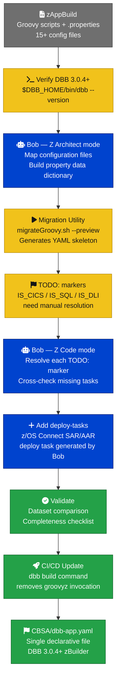

# Step 3 — DevOps Modernization: zAppBuild → DBB YAML with Bob

<div class="callout callout-green">
<strong>Key message:</strong> The COBOL source does not change. Only the build toolchain evolves. Bob accelerates the migration by reading the existing <code>.properties</code> files and generating equivalent DBB YAML — then explaining every difference.
</div>

## What This Step Achieves

<table class="compare-table">
<thead>
<tr>
  <th style="width:30%">Dimension</th>
  <th class="col-legacy" style="width:35%">Before — zAppBuild</th>
  <th class="col-modern" style="width:35%">After — DBB YAML</th>
</tr>
</thead>
<tbody>
<tr>
  <td><strong>Build configuration</strong></td>
  <td class="col-legacy">15+ <code>.properties</code> files in <code>CBSA/application-conf/</code></td>
  <td class="col-modern">Single <code>CBSA/dbb-app.yaml</code></td>
</tr>
<tr>
  <td><strong>Build scripts</strong></td>
  <td class="col-legacy">zAppBuild Groovy scripts (<code>Cobol.groovy</code>, <code>BMS.groovy</code>…)</td>
  <td class="col-modern">Declarative YAML tasks — no Groovy required</td>
</tr>
<tr>
  <td><strong>DBB version</strong></td>
  <td class="col-legacy">DBB 1.x / 2.x</td>
  <td class="col-modern">DBB 3.0.4+ zBuilder</td>
</tr>
<tr>
  <td><strong>z/OS Connect deploy</strong></td>
  <td class="col-legacy">Manual SAR/AAR file copy via separate script</td>
  <td class="col-modern">z/OS Connect deploy task built-in to the pipeline</td>
</tr>
</tbody>
</table>

## Understanding the Current Build with Bob

Before migrating, use Bob in **Z Architect** mode to build a complete picture of what `CBSA/application-conf/` controls. These prompts are designed to run in sequence.

### Prompt 1 — Map the Configuration Files

```
Mode: Z Architect
Prompt: "Explain the CBSA build configuration in CBSA/application-conf/ —
         what does each .properties file control?"
```

**Expected output:** Bob returns a structured inventory of all files in `application-conf/` — `Cobol.properties`, `BMS.properties`, `Assembler.properties`, `LinkEdit.properties`, `file.properties`, `datasets.properties`, and others. For each file, Bob describes which compiler options it governs, which zAppBuild Groovy script reads it, and whether its settings have a direct YAML equivalent in DBB 3.x.

---

### Prompt 2 — Identify CICS Programs

```
Mode: Z Architect
Prompt: "What are all the COBOL programs that require CICS compilation?
         Scan CBSA/application-conf/file.properties"
```

**Expected output:** Bob scans `file.properties` for all lines matching the pattern `isCICS=true :: **/cobol/*.cbl` and produces a table: program name, source path, whether it also has `isSQL=true`, and the resulting compile parms that would apply. This becomes the authoritative checklist for resolving `IS_CICS` markers in the generated YAML.

---

### Prompt 3 — Generate a Property-to-YAML Data Dictionary

```
Mode: Z Architect
Prompt: "Generate a data dictionary for the build configuration —
         map each property to its DBB YAML equivalent"
```

**Expected output:** Bob produces a cross-reference table with columns: `.properties` key, file it appears in, current value in CBSA, DBB YAML equivalent key, and any behavioral notes (e.g., `cobol_compileCICSParms` maps to `options.cics-compile-params` and is only applied when `IS_CICS == true`). This dictionary is the foundation for the manual review phase.

---

## Running the DBB Migration Utility

DBB 3.0.4+ ships a migration utility that can listen to a live zAppBuild execution and generate an equivalent YAML skeleton. Follow these steps on z/OS:

**Step 1** — Verify your DBB version is 3.0.4 or later:

```sh
$DBB_HOME/bin/dbb --version
```

Expected output: `IBM Dependency Based Build 3.0.4` or higher. If you see a lower version, the migration utility is not available.

**Step 2** — Run the migration utility in preview mode against the CBSA build script:

```sh
$DBB_HOME/migration/bin/migrateGroovy.sh \
  --script build.groovy \
  --preview
```

The `--preview` flag runs the analysis without modifying any files. The utility inspects `build.groovy`, traces its calls to zAppBuild language scripts, and reads the corresponding `.properties` files.

**Step 3** — The utility writes a preliminary YAML to stdout (or `--output dbb-app.yaml`). It translates all recognized patterns automatically and inserts `TODO:` markers wherever it encounters logic that requires a human decision.

**Step 4** — Review every `TODO:` marker. These are conditions the utility could not resolve automatically — typically per-file flags in `file.properties` that translate to `when:` conditions in YAML.

Example of a generated YAML block with `TODO:` markers:

```yaml
language-tasks:
  - name: cobol-compile
    type: cobol
    source-files:
      - pattern: "CBSA/cobol/*.cbl"
    options:
      compiler-version: V6
      compile-params: LIB
      # TODO: Determine if BNKMENU.cbl requires CICS compilation
      #       Check isCICS setting in CBSA/application-conf/file.properties
      cics-compile-params: CICS
      # TODO: Confirm which programs have isSQL=true — verify cobol_compileSQLParms applies
      sql-compile-params: SQL
      # TODO: Confirm which programs have isDLI=true — verify cobol_compileDLIParms applies
      dli-compile-params: DLI
      link-edit-params: "MAP,RENT,COMPAT(PM5)"
      store-ssi: true
    max-rc:
      compile: 4
      link-edit: 0
```

---

## Using Bob to Complete the Migration

With the generated YAML in hand, switch to **Z Code** mode and use Bob to resolve every `TODO:` marker systematically.

### Prompt 1 — Resolve a Specific TODO: Marker

```
Mode: Z Code
Prompt: "I have a generated dbb-app.yaml with TODO: markers. Help me resolve:
         TODO: Determine if BNKMENU.cbl requires CICS compilation"
```

**Expected output:** Bob reads `CBSA/application-conf/file.properties`, locates the line `isCICS=true :: **/cobol/BNKMENU.cbl`, and confirms the flag is set. It then shows the correct YAML — the `cobol-compile` task already includes `cics-compile-params: CICS` globally, and `BNKMENU.cbl` will automatically receive CICS compilation because the `IS_CICS` variable is resolved per-file by zBuilder. Bob removes the `TODO:` comment and adds an explanatory inline note.

---

### Prompt 2 — Cross-Check for Missing Language Tasks

```
Mode: Z Code
Prompt: "Review CBSA/dbb-app.yaml against CBSA/application-conf/ and
         identify any missing language tasks"
```

**Expected output:** Bob cross-checks the `buildOrder` property in `application-conf/build-conf/build.properties` against the `language-tasks` list in `dbb-app.yaml`. It produces a gap analysis: which languages are defined in zAppBuild but not yet in the YAML, which tasks have no `source-files` patterns, and whether the BMS compile task is declared before the COBOL compile task (required because BMS generates copybooks that COBOL programs include).

---

### Prompt 3 — Add the z/OS Connect Deploy Task

```
Mode: Z Code
Prompt: "Add a z/OS Connect deploy task to CBSA/dbb-app.yaml that copies
         SAR/AAR files to the z/OS Connect EE resources directory"
```

**Expected output:** Bob generates the `deploy-tasks` section shown in the [Resulting dbb-app.yaml Structure](#the-resulting-dbb-appyaml-structure) section below, referencing the correct USS path for z/OS Connect EE resources. Bob also explains that SAR files are Service Archive Records (the CICS service binding) and AAR files are API Archive Records (the REST API binding), and that both must be present for z/OS Connect to expose a program as a REST API.

---

## The Resulting `dbb-app.yaml` Structure

After running the migration utility and resolving all `TODO:` markers with Bob, `CBSA/dbb-app.yaml` has this layout:

```
CBSA/dbb-app.yaml
├── application:    name, hlq, workspace
├── datasets:       copylib, load, cicsload, dbrm, zunit, listings
├── language-tasks:
│   ├── bms-compile     BMS maps → load modules + DSECT copybooks
│   ├── cobol-compile   COBOL → load (IS_CICS / IS_SQL / IS_DLI aware)
│   ├── asm-compile     Assembler → DFHNCOPT
│   ├── link-edit       Link-only programs
│   └── zunit-run       zUnit test execution
└── deploy-tasks:
    └── zosconnect-deploy  SAR/AAR → z/OS Connect EE resources/
```

### Key YAML Snippets

**BMS Compile Task** — maps BMS source to load modules and generates DSECT copybooks:

```yaml
language-tasks:
  - name: bms-compile
    type: bms
    source-files:
      - pattern: "CBSA/bms/*.bms"
    options:
      compile-params: "SYSPARM(DSECT)"
    datasets:
      syslib:
        - "%{HLQ}.SDFHSAMP"
      syslmod:
        - "%{HLQ}.LOAD"
      sysprint:
        - "%{HLQ}.LISTINGS"
    max-rc:
      compile: 4
```

**COBOL Compile Task** — `IS_CICS`, `IS_SQL`, and `IS_DLI` are resolved per-file by zBuilder using the flags migrated from `file.properties`:

```yaml
  - name: cobol-compile
    type: cobol
    dependsOn: bms-compile
    source-files:
      - pattern: "CBSA/cobol/*.cbl"
    options:
      compiler-version: V6
      compile-params: LIB
      cics-compile-params: CICS       # applied when IS_CICS == true
      sql-compile-params: SQL         # applied when IS_SQL == true
      dli-compile-params: DLI         # applied when IS_DLI == true
      link-edit-params: "MAP,RENT,COMPAT(PM5)"
      store-ssi: true
    datasets:
      syslib:
        - "%{HLQ}.COBOL.COPYLIB"
        - "%{HLQ}.SDFHCOB"            # CICS copybooks
        - "%{HLQ}.SDSNLOAD"           # DB2 precompiler
      syslmod:
        - "%{HLQ}.CICSLOAD"           # IS_CICS == true
        - "%{HLQ}.LOAD"               # IS_CICS == false
      sysprint:
        - "%{HLQ}.LISTINGS"
    max-rc:
      compile: 4
      link-edit: 0
```

**z/OS Connect Deploy Task** — copies SAR and AAR files to the z/OS Connect EE resources directory as part of the build pipeline:

```yaml
deploy-tasks:
  - name: zosconnect-deploy
    type: copy
    dependsOn: cobol-compile
    source-files:
      - pattern: "zosconnect_artefacts/**/*.sar"
      - pattern: "zosconnect_artefacts/**/*.aar"
    target:
      uss-path: "%{ZOSCONNECT_RESOURCES_DIR}"
      # e.g. /var/zosconnect/v3r0/servers/defaultServer/resources/zosConnect/
    options:
      overwrite: true
```

---

## Validating the Migration

Use Bob to build a validation checklist before cutting the pipeline over.

### Prompt 1 — Dataset Output Comparison

```
Mode: Z Code
Prompt: "Compare the outputs of a zAppBuild run vs a DBB YAML run for CREACC.cbl —
         what datasets should be identical?"
```

**Expected output:** Bob explains that both pipelines must produce the same members in the same target datasets. For `CREACC.cbl` (which has `isCICS=true` and `isSQL=true`): the object module in `HLQ.OBJ`, the load module in `HLQ.CICSLOAD(CREACC)`, the DBRM in `HLQ.DBRM(CREACC)`, and the listing in `HLQ.LISTINGS`. Bob also notes that the SSI (System Status Indicator) stored in the load module should match if `store-ssi: true` is set in both pipelines.

---

### Prompt 2 — Migration Completeness Checklist

```
Mode: Z Code
Prompt: "Create a checklist for validating that the DBB YAML migration
         is complete for CBSA"
```

**Expected output:** Bob generates a structured checklist covering: all 39 COBOL programs compile without RC > 4, all 9 BMS maps produce load modules and DSECT copybooks, the DFHNCOPT assembler module is present in LOAD, all IS_CICS programs land in CICSLOAD (not LOAD), all IS_SQL programs have a corresponding DBRM, zUnit tests pass, and SAR/AAR files are present in the z/OS Connect resources directory.

---

## CI/CD Pipeline Update

The only change required in the GitLab CI pipeline is replacing the zAppBuild invocation with the DBB 3.x `dbb build` command:

```yaml
# BEFORE (zAppBuild)
script:
  - groovyz build.groovy --sourceDir /var/jenkins/workspace/cbsa --workDir /var/build --hlq CBSA.BUILD

# AFTER (DBB YAML)
script:
  - dbb build --application-descriptor CBSA/dbb-app.yaml --workspace /var/build --hlq CBSA.BUILD
```

The workspace layout, HLQ convention, and source directories remain identical. The pipeline stage structure (`Preparation → Import → Build and Test`) does not need to change — only the `Build and Test` job's `script:` block is updated, and the `Import zAppBuild` stage can be removed once the migration is confirmed stable.

---

## Migration Journey



---

<div class="callout callout-yellow">
<strong>Migration utility note:</strong> The generated YAML contains <code>TODO:</code> markers for <code>IS_CICS</code>, <code>IS_SQL</code>, <code>IS_DLI</code> conditions. Bob can resolve all of them by reading <code>CBSA/application-conf/file.properties</code>.
</div>

---

<div style="display:flex; justify-content:space-between; margin-top:3rem; padding-top:1.5rem; border-top:1px solid #e0e0e0;">
  <a href="impact-analysis-with-bob.html">← Previous: Impact Analysis with Bob</a>
  <a href="oas3-migration-with-bob.html">Next: OAS3 Migration with Bob →</a>
</div>
