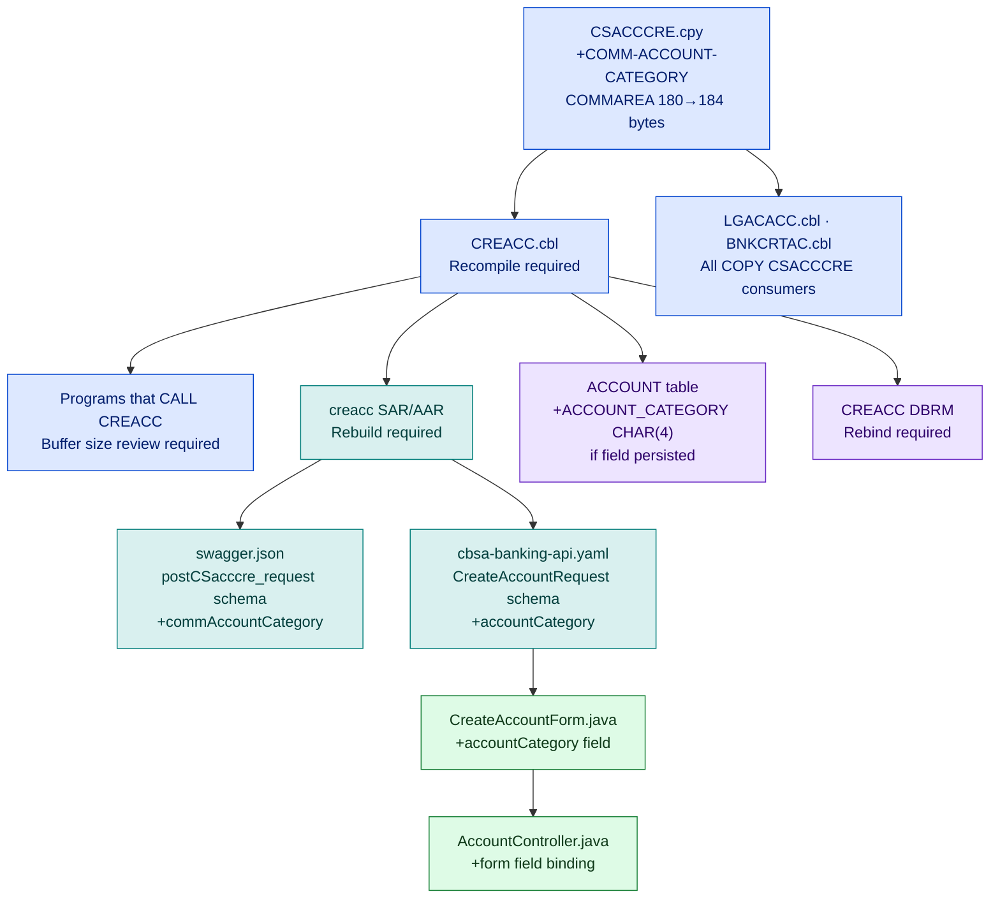
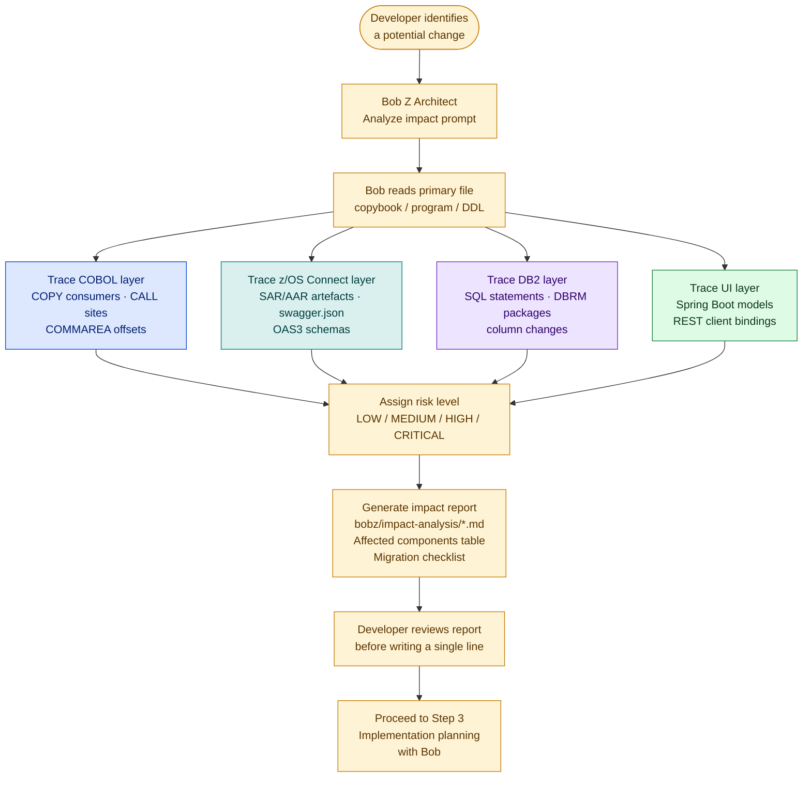

# Step 2 — Impact Analysis with IBM Bob

<div class="callout callout-green">
<strong>Never make a change without running impact analysis first.</strong> Bob traces the full dependency chain — copybooks, calling programs, z/OS Connect services, Spring Boot models — and produces a risk-rated report before you touch a single line.
</div>

## What Impact Analysis Covers

<div class="value-cards">
  <div class="value-card">
    <div class="value-card-icon">
      <svg viewBox="0 0 32 32" fill="none"><rect x="4" y="4" width="24" height="24" rx="2" stroke="#0043CE" stroke-width="2"/><path d="M9 11h14M9 16h10M9 21h12" stroke="#0043CE" stroke-width="2" stroke-linecap="round"/></svg>
    </div>
    <h3>COBOL Layer</h3>
    <p>Programs that <code>CALL</code> or <code>LINK</code> to the changed program. All programs that <code>COPY</code> the changed copybook. COMMAREA length and offset impacts across all callers.</p>
  </div>
  <div class="value-card">
    <div class="value-card-icon">
      <svg viewBox="0 0 32 32" fill="none"><path d="M4 16h6l4-8 4 16 4-10 3 2h3" stroke="#007d79" stroke-width="2" stroke-linecap="round" stroke-linejoin="round"/></svg>
    </div>
    <h3>z/OS Connect Layer</h3>
    <p>SAR/AAR services that expose the program as REST. The <code>swagger.json</code> or OAS3 fields that would change as a result of a COMMAREA or struct modification.</p>
  </div>
  <div class="value-card">
    <div class="value-card-icon">
      <svg viewBox="0 0 32 32" fill="none"><ellipse cx="16" cy="10" rx="12" ry="4" stroke="#6929c4" stroke-width="2"/><path d="M4 10v6c0 2.2 5.4 4 12 4s12-1.8 12-4v-6" stroke="#6929c4" stroke-width="2"/><path d="M4 16v6c0 2.2 5.4 4 12 4s12-1.8 12-4v-6" stroke="#6929c4" stroke-width="2"/></svg>
    </div>
    <h3>Data Layer</h3>
    <p>DB2 tables accessed by the changed program. DBRM packages that need rebind after a DB2 column change. DB2 column additions or type changes that propagate to host variable declarations.</p>
  </div>
  <div class="value-card">
    <div class="value-card-icon">
      <svg viewBox="0 0 32 32" fill="none"><rect x="6" y="4" width="20" height="24" rx="2" stroke="#198038" stroke-width="2"/><path d="M10 10h12M10 15h8M10 20h10" stroke="#198038" stroke-width="2" stroke-linecap="round"/></svg>
    </div>
    <h3>UI Layer</h3>
    <p>Spring Boot JSON models and REST clients that consume the changed API. Java classes such as <code>CreateAccountForm.java</code> and <code>AccountController.java</code> that bind to the API response schema.</p>
  </div>
</div>

## Running Impact Analysis on CBSA

Switch to **Z Architect** mode and use this prompt pattern:

```
Mode: Z Architect
Pattern: "Analyze the impact of [change description] in CBSA.
          Start by reading the affected file, then trace all dependencies."
```

Bob will:
1. Read the primary changed file (copybook, COBOL program, or DB2 DDL)
2. Search the workspace for all consumers — `COPY`, `CALL`, `EXEC SQL`, REST service artefacts
3. Cross-reference the z/OS Connect service definitions in `zosconnect_artefacts/`
4. Identify Spring Boot models in the UI layer
5. Produce a risk-rated impact report saved to `bobz/impact-analysis/`

---

## Demo: Adding a Field to CREACC COMMAREA

**Prompt:**

```
Mode: Z Architect

"Analyze the impact of adding a new field COMM-ACCOUNT-CATEGORY (PIC X(4))
 to the CREACC COMMAREA (CSACCCRE.cpy). What programs need to change?
 What z/OS Connect services are affected? What needs to be rebuilt?"
```

**Expected output structure:**

| Component | Impact |
|---|---|
| **Primary change** | `CSACCCRE.cpy` — add field at offset 180, COMMAREA length changes from 180 to 184 bytes |
| **Programs — direct** | `CREACC.cbl` (owns the COMMAREA, must be recompiled) |
| **Programs — COPY consumers** | All programs that `COPY CSACCCRE` must be recompiled with the new copybook |
| **Programs — CALL consumers** | Any program that `CALL 'CREACC'` passing the COMMAREA must be reviewed for buffer size |
| **z/OS Connect** | `creacc` SAR/AAR needs rebuilding; `swagger.json` `postCSacccre_request` schema adds `commAccountCategory` field; OAS3 `CreateAccountRequest` schema adds field |
| **DB2** | `ACCOUNT` table if the field needs to be persisted — new column `ACCOUNT_CATEGORY CHAR(4)` |
| **Spring Boot** | `CreateAccountForm.java`, `AccountController.java` — add field binding and form input |
| **Risk rating** | **HIGH** — COMMAREA length change affects binary interface between all callers |

**Propagation diagram Bob would generate:**



---

## Demo: Changing the ACCOUNT DB2 Table

**Prompt:**

```
Mode: Z Architect

"Analyze the impact of adding a column ACCT_CREDIT_LIMIT DECIMAL(10,2)
 to the ACCOUNT DB2 table. What programs would need to change?"
```

**Expected output:**

- **Programs that access the ACCOUNT table** (via `EXEC SQL SELECT/INSERT/UPDATE`):
  - `INQACC.cbl` — account inquiry, SELECT
  - `CREACC.cbl` — create account, INSERT
  - `UPDACC.cbl` — update account, UPDATE
  - `DELACC.cbl` — delete account, DELETE
  - `INQACCCU.cbl` — inquiry by customer, SELECT
  - `XFRFUN.cbl` — funds transfer, SELECT + UPDATE
  - `DBCRFUN.cbl` — debit/credit, SELECT + UPDATE
  - `GETSCODE.cbl` — sort code lookup, SELECT

- **DBRM packages** — each of the above programs has a DBRM that must be rebound against the new table definition before any SQL will execute against the updated schema.

- **z/OS Connect response schemas** — any SAR/AAR that exposes account data (`inqacc`, `creacc`, `updacc`) may need schema updates if `ACCT_CREDIT_LIMIT` is surfaced in the JSON response. The corresponding `swagger.json` response objects and OAS3 schemas would gain an `acctCreditLimit` field.

- **Risk rating: HIGH** — DB2 schema change requires a bind/rebind window and coordinated deployment of all affected load modules.

---

## Demo: Upgrading the OAS2 Spec to OAS3

**Prompt:**

```
Mode: Z Architect

"Analyze the impact of migrating the creacc service from OAS2
 (zosconnect_artefacts/apis/creacc/api-docs/swagger.json) to the OAS3 spec
 (zosconnect_artefacts/openapi3/cbsa-banking-api.yaml).
 What changes are required in the Spring Boot UI?"
```

**Expected output:**

| Layer | Change Required |
|---|---|
| **Liberty server.xml** | Replace `zosConnect-2.0` with `zosConnect-3.0` feature; update `<zosConnectService>` element to reference new service definition format |
| **z/OS Connect Designer** | Import `cbsa-banking-api.yaml`; map OAS3 `CreateAccountRequest` to CREACC COMMAREA fields; regenerate SAR/AAR |
| **Spring Boot base URL** | Update `application.properties` `zosconnect.base-url` — OAS3 services typically run under a new context root |
| **JSON field mapping** | OAS3 uses `camelCase` field names aligned to the unified spec; verify all `@JsonProperty` annotations in `CreateAccountForm.java`, `InquireAccountForm.java`, and their controllers match the new field names |
| **OpenAPI client generation** | If the UI uses a generated client (e.g., OpenAPI Generator), regenerate from `cbsa-banking-api.yaml` and replace the legacy Feign/RestTemplate stubs |
| **Risk rating: MEDIUM** | Interface is additive; existing OAS2 services remain operational during transition — dual-stack deployment is viable |

---

## Reading the Impact Report

Bob saves impact reports to `bobz/impact-analysis/`. Each report is a Markdown file structured as:

```
bobz/impact-analysis/
└── creacc-commarea-change.md
```

**Sample report structure — `creacc-commarea-change.md`:**

```markdown
# Impact Analysis: Add COMM-ACCOUNT-CATEGORY to CREACC COMMAREA

**Date:** 2025-07-14
**Analyst:** Bob (Z Architect)
**Risk Level:** HIGH

## Summary

Adding `COMM-ACCOUNT-CATEGORY PIC X(4)` to `CSACCCRE.cpy` changes the CREACC
COMMAREA length from 180 to 184 bytes. This is a binary interface change that
affects every program that passes this COMMAREA.

## Affected Components

| Component | Type | Change Required | Priority |
|---|---|---|---|
| `CSACCCRE.cpy` | Copybook | Add field at offset 180 | 1 — PRIMARY |
| `CREACC.cbl` | COBOL program | Recompile, handle new field | 2 — HIGH |
| `BNKCRTAC.cbl` | COBOL program | Recompile (COPY consumer) | 2 — HIGH |
| `LGACACC.cbl` | COBOL program | Recompile (COPY consumer) | 2 — HIGH |
| `creacc` SAR/AAR | z/OS Connect | Rebuild service artefact | 3 — HIGH |
| `swagger.json` (creacc) | API spec | Add commAccountCategory to request schema | 3 — MEDIUM |
| `cbsa-banking-api.yaml` | OAS3 spec | Add accountCategory to CreateAccountRequest | 3 — MEDIUM |
| `ACCOUNT` table | DB2 | Add ACCOUNT_CATEGORY CHAR(4) if persisted | 4 — MEDIUM |
| `CREACC DBRM` | DB2 package | Rebind after DB2 schema change | 4 — MEDIUM |
| `CreateAccountForm.java` | Spring Boot | Add accountCategory field + @JsonProperty | 5 — LOW |
| `AccountController.java` | Spring Boot | Add form field binding | 5 — LOW |

## Propagation Diagram

[Mermaid flowchart — see above]

## Migration Checklist

1. Update `CSACCCRE.cpy` — add `COMM-ACCOUNT-CATEGORY PIC X(4)` after last field
2. Recompile `CREACC.cbl` with updated copybook
3. Recompile all programs that `COPY CSACCCRE` (run: `grep -r "COPY CSACCCRE" CBSA/cobol/`)
4. Run zUnit tests for CREACC to verify COMMAREA handling
5. If persisting the field: `ALTER TABLE ACCOUNT ADD COLUMN ACCOUNT_CATEGORY CHAR(4)`
6. Rebind DBRM packages for all programs that access ACCOUNT
7. Rebuild `creacc` SAR/AAR in z/OS Connect Designer
8. Update `swagger.json` (or regenerate from SAR)
9. Update `cbsa-banking-api.yaml` — add field to `CreateAccountRequest`
10. Update `CreateAccountForm.java` and `AccountController.java`
11. Run Spring Boot integration tests against the updated API
12. Deploy in order: DB2 schema → load modules → z/OS Connect services → Spring Boot
```

---

## Risk Levels

Bob assigns one of four risk levels to every impact analysis:

<table class="compare-table">
<thead>
<tr>
  <th style="width:15%">Risk Level</th>
  <th style="width:25%">Definition</th>
  <th style="width:35%">Examples in CBSA</th>
  <th style="width:25%">Deployment Window</th>
</tr>
</thead>
<tbody>
<tr>
  <td><strong style="color:#198038">LOW</strong></td>
  <td>No interface change; internal logic only</td>
  <td>Fixing a calculation inside a single paragraph of <code>XFRFUN.cbl</code> that does not change COMMAREA or SQL</td>
  <td>Standard deployment, no coordination required</td>
</tr>
<tr>
  <td><strong style="color:#f1c21b">MEDIUM</strong></td>
  <td>Interface change but backwards compatible; additive schema change</td>
  <td>Adding an optional field to the OAS3 spec; adding a new paragraph to <code>CREACC.cbl</code> without changing COMMAREA length</td>
  <td>Coordinated deployment — notify API consumers</td>
</tr>
<tr>
  <td><strong style="color:#da1e28">HIGH</strong></td>
  <td>COMMAREA length change, DB2 schema change, or breaking API change</td>
  <td>Adding a field to <code>CSACCCRE.cpy</code> (length change); adding a column to <code>ACCOUNT</code> table; renaming a REST field in the OAS spec</td>
  <td>Planned outage window; all affected load modules deployed atomically</td>
</tr>
<tr>
  <td><strong style="color:#a2191f">CRITICAL</strong></td>
  <td>Shared copybook change affecting 10+ programs; DB2 table restructure (reorg required)</td>
  <td>Changing <code>CSUTXWDP.cpy</code> (used by XFRFUN, DBCRFUN and others); dropping and recreating the <code>ACCOUNT</code> or <code>CUSTOMER</code> table</td>
  <td>Full regression test cycle; staged rollout with fallback plan</td>
</tr>
</tbody>
</table>

---

## Impact Analysis Workflow



---

<div style="display:flex; justify-content:space-between; align-items:center; margin-top:3rem; padding-top:1.5rem; border-top:1px solid #e0e0e0;">
  <a href="cobol-explanation-with-bob.html" style="display:inline-flex; align-items:center; gap:0.5rem; padding:0.75rem 1.25rem; background:#f4f4f4; color:#161616; font-size:0.9rem; font-weight:600; text-decoration:none; border:1px solid #e0e0e0;">
    ← Previous: Step 1 — COBOL Explanation with Bob
  </a>
  <a href="dbb-migration-with-bob.html" style="display:inline-flex; align-items:center; gap:0.5rem; padding:0.75rem 1.25rem; background:#0043CE; color:#ffffff; font-size:0.9rem; font-weight:600; text-decoration:none; border:1px solid #0043CE;">
    Next: Step 3 — DBB Migration with Bob →
  </a>
</div>
