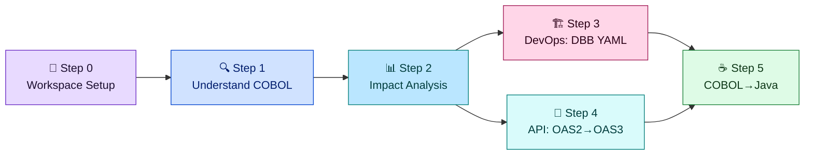

# Modernization Journey

CBSA is designed as a **living reference** for IBM Z modernization. It preserves both the traditional and modern approaches side-by-side — the message is not "replace what you have" but "evolve from where you are."

<strong>This section is the technical pitch.</strong> Each page shows a concrete before/after comparison using real artefacts from this repository, so architects and pre-sales can demonstrate the migration path with working code — all powered by IBM Bob Premium Z.

## Three Dimensions of Modernization

  

    

      <svg viewBox="0 0 32 32" fill="none"><path d="M4 6h24v4H4zm0 8h16v4H4zm0 8h20v4H4z" stroke="#0043CE" stroke-width="2"/></svg>
    

    <h3>API Layer</h3>
    
From 10 per-service OAS2 Swagger definitions to a single unified OpenAPI 3.0 spec — design-first, z/OS Connect 3.0. <a href="oas2-vs-oas3.html">Deep dive →</a>

  

  

    

      <svg viewBox="0 0 32 32" fill="none"><path d="M6 4h20v24H6z" stroke="#0043CE" stroke-width="2"/><path d="M10 10h12M10 16h8M10 22h10" stroke="#0043CE" stroke-width="2" stroke-linecap="round"/></svg>
    

    <h3>Build System</h3>
    
From zAppBuild Groovy scripts and 15 .properties files to a single declarative <code>dbb-app.yaml</code> — DBB 3.x zBuilder, no Groovy. <a href="zappbuild-vs-dbb-yaml.html">Deep dive →</a>

  

  

    

      <svg viewBox="0 0 32 32" fill="none"><path d="M16 4C9.4 4 4 9.4 4 16s5.4 12 12 12 12-5.4 12-12S22.6 4 16 4z" stroke="#0043CE" stroke-width="2"/><path d="M12 16l3 3 5-6" stroke="#0043CE" stroke-width="2" stroke-linecap="round"/></svg>
    

    <h3>Developer Tooling</h3>
    
From manual COBOL editing and JCL submission to AI-assisted workflows with IBM Bob — explain, plan, transform, and validate from the IDE. <a href="ai-assisted-development.html">Overview →</a>

  

## The 5-Step Modernization Workflow with Bob

IBM Bob Premium Z drives every step of the modernization journey. Each step builds on the previous — start with Step 0 and work forward.

<table class="compare-table">
<thead>
<tr>
  <th style="width:8%">Step</th>
  <th style="width:24%">What You Do</th>
  <th style="width:22%">Bob Mode</th>
  <th style="width:22%">Key Skill</th>
  <th style="width:24%">Output</th>
</tr>
</thead>
<tbody>
<tr>
  <td><strong><a href="workspace-setup-with-bob.html">Step 0</a></strong></td>
  <td>Configure Bob for this workspace — verify modes, skills, AGENTS.md, run <code>/init</code></td>
  <td>Z Code (<code>/init</code>)</td>
  <td><code>data-dictionary-management</code></td>
  <td>Updated AGENTS.md, <code>bobz/DD.json</code></td>
</tr>
<tr>
  <td><strong><a href="cobol-explanation-with-bob.html">Step 1</a></strong></td>
  <td>Explain every COBOL program before touching it — architecture or developer view</td>
  <td>Z Architect / Z Code</td>
  <td><code>explain</code></td>
  <td><code>bobz/documentation/</code> — per-program Markdown docs</td>
</tr>
<tr>
  <td><strong><a href="impact-analysis-with-bob.html">Step 2</a></strong></td>
  <td>Run impact analysis on every proposed change — COMMAREA, DB2, API, UI</td>
  <td>Z Architect</td>
  <td><code>impact-analysis</code></td>
  <td><code>bobz/impact-analysis/</code> — risk-rated reports</td>
</tr>
<tr>
  <td><strong><a href="dbb-migration-with-bob.html">Step 3</a></strong></td>
  <td>Migrate build pipeline from zAppBuild to DBB 3.x YAML — Bob resolves all TODO: markers</td>
  <td>Z Code / Z Architect</td>
  <td><code>implementation-planning</code></td>
  <td><code>CBSA/dbb-app.yaml</code> — complete build definition</td>
</tr>
<tr>
  <td><strong><a href="oas3-migration-with-bob.html">Step 4</a></strong></td>
  <td>Migrate z/OS Connect from OAS2 to OAS3 — Bob designs the spec and plans the Liberty migration</td>
  <td>Z Architect / Ask z Assistant</td>
  <td><code>impact-analysis</code></td>
  <td><code>zosconnect_artefacts/openapi3/cbsa-banking-api.yaml</code></td>
</tr>
<tr>
  <td><strong><a href="cobol-to-java-with-bob.html">Step 5</a></strong></td>
  <td>Transform COBOL programs to Java — Bob applies precise FILLER/REDEFINES/Lombok rules and generates JUnit tests</td>
  <td>Z Code</td>
  <td><code>cobol-transformation</code> + <code>validate</code></td>
  <td>Java classes + JUnit tests in <code>.validate/</code></td>
</tr>
</tbody>
</table>

## The Journey at a Glance

```mermaid
flowchart LR
    subgraph S1 ["Stage 1 — Traditional z/OS"]
        direction TB
        A1["COBOL + CICS + DB2\nCore platform"]
        A2["zAppBuild\nGroovy Scripts"]
        A3["OAS2 Swagger\n10 per-service files"]
        A4["Manual COBOL editing\nJCL submission"]
    end
    subgraph S2 ["Stage 2 — Hybrid Modernization"]
        direction TB
        B1["COBOL unchanged\nCICS + DB2 preserved"]
        B2["DBB YAML\ndbb-app.yaml"]
        B3["Unified OAS3\ncbsa-banking-api.yaml"]
        B4["CI/CD pipeline\nGitLab + DBB 3.x"]
    end
    subgraph S3 ["Stage 3 — AI-Accelerated Z"]
        direction TB
        C1["COBOL preserved\nor transformed to Java"]
        C2["DBB YAML +\ncontainerized tooling"]
        C3["OAS3 design-first\nAPI governance"]
        C4["Bob AI\nexplain / plan / transform"]
    end

    S1 -->|"Add API layer\nNo COBOL changes"| S2
    S2 -->|"Add AI tooling\nNo pipeline changes"| S3

    classDef stage1 fill:#f4f4f4,stroke:#697077,color:#161616
    classDef stage2 fill:#d0e2ff,stroke:#0043ce,color:#001d6c
    classDef stage3 fill:#defbe6,stroke:#198038,color:#0e3818

    class A1,A2,A3,A4 stage1
    class B1,B2,B3,B4 stage2
    class C1,C2,C3,C4 stage3
```

**Legend:** Gray = existing today · Blue = modernization artefacts in this repo · Green = AI-accelerated future state

## What Exists in This Repository

| Artefact | Location | Stage |
|---|---|---|
| COBOL programs (39) | `CBSA/cobol/` | Stage 1 — unchanged across all stages |
| zAppBuild properties | `CBSA/application-conf/*.properties` | Stage 1 — current pipeline |
| OAS2 Swagger specs (10) | `zosconnect_artefacts/apis/*/api-docs/swagger.json` | Stage 1 — current APIs |
| **DBB YAML** | `CBSA/dbb-app.yaml` | **Stage 2 — reference implementation** |
| **Unified OAS3 spec** | `zosconnect_artefacts/openapi3/cbsa-banking-api.yaml` | **Stage 2 — reference implementation** |
| Bob AI modes | `~/.bob/settings/custom_modes.yaml` (global) | Stage 3 — active in any workspace |
| Bob AI skills | `~/.bob/skills/` (global) | Stage 3 — active in any workspace |

<strong>Reference implementations:</strong> The DBB YAML and OAS3 spec are reference artefacts demonstrating the migration path. They coexist with the working OAS2/zAppBuild pipeline — both generations are intentionally preserved side-by-side.

## All Pages in This Section

  

    

      <svg viewBox="0 0 32 32" fill="none"><circle cx="16" cy="16" r="12" stroke="#6929C4" stroke-width="2"/><path d="M11 16h10M16 11v10" stroke="#6929C4" stroke-width="2" stroke-linecap="round"/></svg>
    

    <h3><a href="bob-skills-and-modes.html">Bob Skills &amp; Modes Reference</a></h3>
    
Complete reference for all 4 modes and 8 skills. Start here to understand what Bob can do before following the step-by-step workflow.

  

  

    

      <svg viewBox="0 0 32 32" fill="none"><path d="M6 4h20v4H6zm0 8h20v4H6zm0 8h14v4H6z" stroke="#0043CE" stroke-width="2"/></svg>
    

    <h3><a href="workspace-setup-with-bob.html">Step 0 — Workspace Setup</a></h3>
    
Configure Bob for CBSA: verify modes and skills, review AGENTS.md project context, run <code>/init</code>.

  

  

    

      <svg viewBox="0 0 32 32" fill="none"><path d="M8 8h16v16H8z" stroke="#0043CE" stroke-width="2"/><path d="M12 14h8M12 18h5" stroke="#0043CE" stroke-width="2" stroke-linecap="round"/></svg>
    

    <h3><a href="cobol-explanation-with-bob.html">Step 1 — Understand COBOL</a></h3>
    
Use Bob to explain any CBSA program in minutes — architectural view (Z Architect) or developer view (Z Code). Includes demo prompts for 5 key programs.

  

  

    

      <svg viewBox="0 0 32 32" fill="none"><path d="M16 4l3 9h9l-7 5 3 9-8-6-8 6 3-9-7-5h9z" stroke="#007D79" stroke-width="2"/></svg>
    

    <h3><a href="impact-analysis-with-bob.html">Step 2 — Impact Analysis</a></h3>
    
Before any change — trace every dependency across COBOL, z/OS Connect, DB2, and Spring Boot. Risk-rated reports saved to <code>bobz/impact-analysis/</code>.

  

  

    

      <svg viewBox="0 0 32 32" fill="none"><path d="M4 28V10l8-6h16v24H4z" stroke="#9F1853" stroke-width="2"/><path d="M12 4v6H4" stroke="#9F1853" stroke-width="2"/></svg>
    

    <h3><a href="dbb-migration-with-bob.html">Step 3 — DevOps: DBB YAML</a></h3>
    
Migrate from zAppBuild Groovy to DBB 3.x declarative YAML. Bob reads <code>application-conf/</code> and resolves all <code>TODO:</code> markers from the migration utility.

  

  

    

      <svg viewBox="0 0 32 32" fill="none"><path d="M4 6h24v4H4zm0 8h16v4H4zm0 8h20v4H4z" stroke="#007D79" stroke-width="2"/></svg>
    

    <h3><a href="oas3-migration-with-bob.html">Step 4 — API: OAS2 → OAS3</a></h3>
    
Migrate z/OS Connect from OAS2 to OAS3. Bob designs the unified spec, plans the Liberty migration, and maps all 10 services to RESTful routes.

  

  

    

      <svg viewBox="0 0 32 32" fill="none"><path d="M10 6h12v4l4 4v12H6V14l4-4V6z" stroke="#198038" stroke-width="2"/><path d="M13 20l2 2 4-4" stroke="#198038" stroke-width="2" stroke-linecap="round"/></svg>
    

    <h3><a href="cobol-to-java-with-bob.html">Step 5 — COBOL → Java</a></h3>
    
Transform COBOL programs to idiomatic Java with <code>/transform</code> — precise FILLER/REDEFINES rules, DB2→JDBC, Lombok annotations, auto-generated JUnit tests via <code>/validate</code>.

  

  

    

      <svg viewBox="0 0 32 32" fill="none"><path d="M4 6h24v4H4zm0 8h16v4H4zm0 8h20v4H4z" stroke="#0043CE" stroke-width="2"/></svg>
    

    <h3><a href="oas2-vs-oas3.html">OAS2 vs OAS3 — Deep Dive</a></h3>
    
Technical side-by-side comparison of Swagger 2.0 and OpenAPI 3.0 using real CBSA API definitions. Includes the full migration flowchart.

  

  

    

      <svg viewBox="0 0 32 32" fill="none"><path d="M6 4h20v24H6z" stroke="#0043CE" stroke-width="2"/><path d="M10 10h12M10 16h8M10 22h10" stroke="#0043CE" stroke-width="2" stroke-linecap="round"/></svg>
    

    <h3><a href="zappbuild-vs-dbb-yaml.html">zAppBuild vs DBB YAML — Deep Dive</a></h3>
    
Technical side-by-side comparison of Groovy/properties and declarative YAML using real CBSA build configuration. Includes the migration flowchart.

  

  

    

      <svg viewBox="0 0 32 32" fill="none"><circle cx="16" cy="16" r="12" stroke="#0043CE" stroke-width="2"/><path d="M12 16l3 3 5-6" stroke="#0043CE" stroke-width="2" stroke-linecap="round"/></svg>
    

    <h3><a href="ai-assisted-development.html">AI-Assisted Development (Overview)</a></h3>
    
Overview of what IBM Bob can do with CBSA — demo scenarios, modes table, and the full skills list with CBSA-specific example prompts.

  

