# Modernization Journey

CBSA is designed as a **living reference** for IBM Z modernization. It preserves both the traditional and modern approaches side-by-side — the message is not "replace what you have" but "evolve from where you are."

<strong>This section is the technical pitch.</strong> Each page shows a concrete before/after comparison using real artefacts from this repository, so architects and pre-sales can demonstrate the migration path with working code.

## Three Dimensions of Modernization

  

    

      <svg viewBox="0 0 32 32" fill="none"><path d="M4 6h24v4H4zm0 8h16v4H4zm0 8h20v4H4z" stroke="#0043CE" stroke-width="2"/></svg>
    

    <h3>API Layer</h3>
    
From per-service OAS2 Swagger definitions to a single unified OpenAPI 3.0 spec — designed first, implemented second. <a href="oas2-vs-oas3.html">Compare OAS2 vs OAS3 →</a>

  

  

    

      <svg viewBox="0 0 32 32" fill="none"><path d="M6 4h20v24H6z" stroke="#0043CE" stroke-width="2"/><path d="M10 10h12M10 16h8M10 22h10" stroke="#0043CE" stroke-width="2" stroke-linecap="round"/></svg>
    

    <h3>Build System</h3>
    
From zAppBuild Groovy scripts and .properties files to declarative DBB YAML — no Groovy required, compatible with DBB 3.x zBuilder. <a href="zappbuild-vs-dbb-yaml.html">Compare zAppBuild vs DBB YAML →</a>

  

  

    

      <svg viewBox="0 0 32 32" fill="none"><path d="M16 4C9.4 4 4 9.4 4 16s5.4 12 12 12 12-5.4 12-12S22.6 4 16 4z" stroke="#0043CE" stroke-width="2"/><path d="M12 16l3 3 5-6" stroke="#0043CE" stroke-width="2" stroke-linecap="round"/></svg>
    

    <h3>Developer Tooling</h3>
    
From manual COBOL editing and JCL submission to AI-assisted workflows with IBM Bob — explain, plan, transform, and validate from the IDE. <a href="ai-assisted-development.html">Explore AI-Assisted Development →</a>

  

## The Journey at a Glance

```mermaid
flowchart LR
    subgraph S1 ["Stage 1 — Traditional z/OS"]
        A1["COBOL + CICS + DB2"]
        A2["zAppBuild\nGroovy Scripts"]
        A3["OAS2 Swagger\nper service"]
        A4["Manual development\nJCL submission"]
    end
    subgraph S2 ["Stage 2 — Hybrid Modernization"]
        B1["COBOL unchanged\nCICS + DB2"]
        B2["DBB YAML\nDeclarative build"]
        B3["Unified OAS3\nAPI spec"]
        B4["CI/CD pipeline\nGitLab + DBB"]
    end
    subgraph S3 ["Stage 3 — AI-Accelerated Z"]
        C1["COBOL preserved\nor transformed to Java"]
        C2["DBB YAML +\ncontainerized tooling"]
        C3["OAS3 design-first\nAPI governance"]
        C4["Bob AI\nexplain/plan/transform"]
    end
    S1 --> S2 --> S3
```

## What Exists in This Repository

| Artefact | Location | Stage |
|---|---|---|
| COBOL programs (39) | `CBSA/cobol/` | Stage 1 — unchanged across all stages |
| zAppBuild properties | `CBSA/application-conf/*.properties` | Stage 1 — current pipeline |
| OAS2 Swagger specs (10) | `zosconnect_artefacts/apis/*/api-docs/swagger.json` | Stage 1 — current APIs |
| **DBB YAML skeleton** | `CBSA/dbb-app.yaml` | **Stage 2 — new, illustrative** |
| **Unified OAS3 spec** | `zosconnect_artefacts/openapi3/cbsa-banking-api.yaml` | **Stage 2 — new, illustrative** |
| Bob AI skills | `~/.bob/skills/` (global) | Stage 3 — active in any workspace |

<strong>Illustrative artefacts:</strong> The DBB YAML and OAS3 spec are reference implementations created to demonstrate the migration path. They do not replace the working OAS2/zAppBuild pipeline — both generations coexist intentionally.

## Topics in This Section

- [OAS2 vs OAS3 — API Modernization](oas2-vs-oas3.html)
- [zAppBuild vs DBB YAML — Build Modernization](zappbuild-vs-dbb-yaml.html)
- [AI-Assisted Development with IBM Bob](ai-assisted-development.html)
