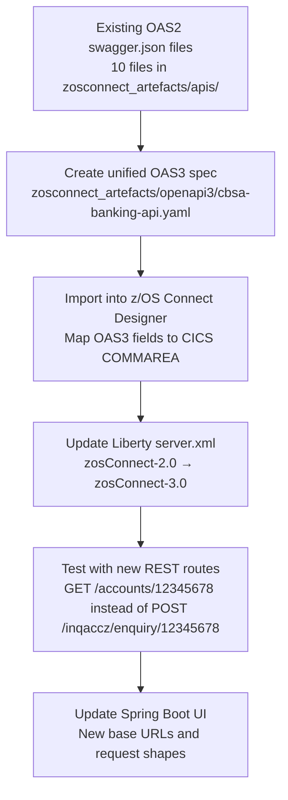

# OAS2 vs OAS3 — API Modernization

CBSA currently exposes 10 CICS programs as REST APIs using **Swagger 2.0 (OAS2)** — one `swagger.json` file per API. This page shows how the same APIs would be defined using **OpenAPI 3.0 (OAS3)**, which is the standard supported by z/OS Connect 3.0.

<div class="callout callout-green">
<strong>Key message:</strong> The COBOL programs do not change. The API layer evolves. z/OS Connect acts as the bridge — OAS3 simply gives you a richer, more standards-compliant contract for that bridge.
</div>

## What Changes, What Stays the Same

<table class="compare-table">
<thead>
<tr>
  <th style="width:30%">Dimension</th>
  <th class="col-legacy" style="width:35%">OAS2 / Swagger 2.0 (Current)</th>
  <th class="col-modern" style="width:35%">OAS3 / OpenAPI 3.0 (Modern)</th>
</tr>
</thead>
<tbody>
<tr>
  <td><strong>Spec format</strong></td>
  <td class="col-legacy">JSON only, one file per API</td>
  <td class="col-modern">YAML or JSON, single unified spec for all APIs</td>
</tr>
<tr>
  <td><strong>API structure</strong></td>
  <td class="col-legacy">Flat paths like <code>/insert</code>, <code>/remove/{accno}</code></td>
  <td class="col-modern">RESTful resources: <code>/accounts/{id}</code>, <code>/customers/{id}</code></td>
</tr>
<tr>
  <td><strong>Request/Response</strong></td>
  <td class="col-legacy">Single <code>parameters</code> array with <code>in: body</code></td>
  <td class="col-modern">Dedicated <code>requestBody</code> object with content-type negotiation</td>
</tr>
<tr>
  <td><strong>Reuse</strong></td>
  <td class="col-legacy"><code>$ref</code> to <code>#/definitions</code></td>
  <td class="col-modern"><code>$ref</code> to <code>#/components/schemas</code> — shared across all paths</td>
</tr>
<tr>
  <td><strong>Error responses</strong></td>
  <td class="col-legacy">Only HTTP 200 defined</td>
  <td class="col-modern">Full HTTP response codes (400, 404, 500) with schemas</td>
</tr>
<tr>
  <td><strong>Security</strong></td>
  <td class="col-legacy"><code>securityDefinitions</code> (basic auth only)</td>
  <td class="col-modern"><code>components/securitySchemes</code> — OAuth 2.0, OIDC, API keys</td>
</tr>
<tr>
  <td><strong>z/OS Connect version</strong></td>
  <td class="col-legacy">z/OS Connect EE 2.0 (<code>zosConnect-2.0</code> Liberty feature)</td>
  <td class="col-modern">z/OS Connect 3.0 (<code>zosConnect-3.0</code> Liberty feature)</td>
</tr>
<tr>
  <td><strong>Design approach</strong></td>
  <td class="col-legacy">Implementation-first: generate spec from existing CICS service</td>
  <td class="col-modern">Design-first: write OAS3 spec, import into z/OS Connect Designer, map to CICS</td>
</tr>
</tbody>
</table>

## Side-by-Side: Create Account

The same "create account" operation defined in both formats:

### OAS2 (current — `zosconnect_artefacts/apis/creacc/api-docs/swagger.json`)

```json
{
  "swagger": "2.0",
  "info": { "title": "creacc", "version": "1.0.0" },
  "host": "localhost:8080",
  "basePath": "/creacc",
  "paths": {
    "/insert": {
      "post": {
        "operationId": "postCSacccre",
        "parameters": [{
          "in": "body",
          "name": "postCSacccre_request",
          "schema": { "$ref": "#/definitions/postCSacccre_request" }
        }],
        "responses": {
          "200": { "schema": { "$ref": "#/definitions/postCSacccre_response_200" } }
        }
      }
    }
  }
}
```

### OAS3 (modern — `zosconnect_artefacts/openapi3/cbsa-banking-api.yaml`)

```yaml
openapi: 3.0.3
info:
  title: CBSA Banking API
  version: 2.0.0
paths:
  /accounts:
    post:
      operationId: createAccount
      summary: Create a new bank account
      requestBody:
        required: true
        content:
          application/json:
            schema:
              $ref: '#/components/schemas/CreateAccountRequest'
      responses:
        '201':
          description: Account created successfully
          content:
            application/json:
              schema:
                $ref: '#/components/schemas/Account'
        '400':
          $ref: '#/components/responses/BadRequest'
        '500':
          $ref: '#/components/responses/InternalError'
```

## What You Gain with OAS3

1. **Single spec, 10 operations** — instead of 10 separate files, one `cbsa-banking-api.yaml` describes the entire banking API surface
2. **Proper REST semantics** — `GET /accounts/{id}` instead of `POST /creacc/insert`
3. **Reusable components** — `Account`, `Customer`, `Payment` schemas defined once, referenced everywhere
4. **Full error contracts** — 400, 404, 500 responses documented and enforceable
5. **z/OS Connect Designer integration** — import the OAS3 YAML directly into the visual designer to map fields to the COMMAREA

## Migration Path



<div class="callout">
The full OAS3 spec for CBSA is at <code>zosconnect_artefacts/openapi3/cbsa-banking-api.yaml</code>. It covers all 10 banking operations with proper REST routes, shared schemas, and error responses.
</div>
