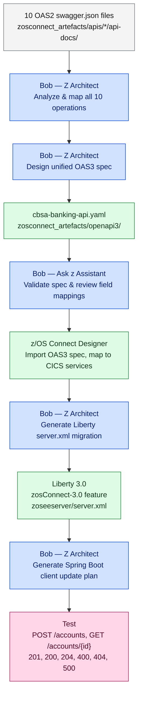

# Step 4 — API Modernization: z/OS Connect OAS2 → OAS3 with Bob

<div class="callout callout-green">
<strong>Key message:</strong> The COBOL programs do not change. The API contract evolves. z/OS Connect acts as the bridge — Bob helps you design the OAS3 spec, validate it, and plan the migration of every service without touching a single line of COBOL.
</div>

---

## What This Step Achieves

<table class="compare-table">
<thead>
<tr>
  <th style="width:30%">Dimension</th>
  <th class="col-legacy" style="width:35%">Before (Current State)</th>
  <th class="col-modern" style="width:35%">After (Target State)</th>
</tr>
</thead>
<tbody>
<tr>
  <td><strong>z/OS Connect version</strong></td>
  <td class="col-legacy">z/OS Connect EE 2.0</td>
  <td class="col-modern">z/OS Connect 3.0</td>
</tr>
<tr>
  <td><strong>API specification files</strong></td>
  <td class="col-legacy">10 separate <code>swagger.json</code> files — one per API in <code>zosconnect_artefacts/apis/*/api-docs/</code></td>
  <td class="col-modern">Single unified <code>cbsa-banking-api.yaml</code> in <code>zosconnect_artefacts/openapi3/</code></td>
</tr>
<tr>
  <td><strong>URL paths</strong></td>
  <td class="col-legacy">Flat, non-RESTful: <code>/insert</code>, <code>/remove/{accno}</code>, <code>/enquiry/{accno}</code></td>
  <td class="col-modern">Resource-oriented: <code>/accounts/{id}</code>, <code>/customers/{id}</code>, <code>/payments</code></td>
</tr>
<tr>
  <td><strong>Design approach</strong></td>
  <td class="col-legacy">Implementation-first — spec generated from existing CICS service</td>
  <td class="col-modern">Design-first — OAS3 spec written first, imported into z/OS Connect Designer</td>
</tr>
<tr>
  <td><strong>Liberty feature</strong></td>
  <td class="col-legacy"><code>zosconnect:zosConnect-2.0</code> (see <code>zoseeserver/server.xml</code>)</td>
  <td class="col-modern"><code>zosconnect:zosConnect-3.0</code></td>
</tr>
<tr>
  <td><strong>Deployment artefacts</strong></td>
  <td class="col-legacy">SAR (Service ARchive) and AAR (API ARchive) files deployed to Liberty dropins</td>
  <td class="col-modern">OAS3 spec imported via z/OS Connect Designer; no separate SAR/AAR packaging</td>
</tr>
</tbody>
</table>

---

## Understanding the Current APIs with Bob

Before designing the new spec, use Bob to build a complete picture of what exists. The following prompts give you authoritative, grounded analysis without manual file-reading.

### Prompt 1 — Ask z Assistant mode

```
Mode: Ask z Assistant
Prompt: "What are the key differences between zosConnect-2.0 and
         zosConnect-3.0 Liberty features? What does the migration require
         in terms of Liberty configuration, deployment artefacts, and
         API design approach?"
```

**Expected output:** A structured comparison covering Liberty feature names, the removal of SAR/AAR packaging in favour of Designer-imported OAS3 specs, the change from `zosconnect_zosConnectAPIs` / `zosconnect_services` config elements to the unified `zosConnect` element, and the minimum Liberty version required for 3.0.

---

### Prompt 2 — Z Architect mode

```
Mode: Z Architect
Prompt: "Analyze the 10 swagger.json files in zosconnect_artefacts/apis/
         — summarize all operations, their paths, request/response schemas,
         and map them to RESTful equivalents suitable for OpenAPI 3.0."
```

**Expected output:** A table mapping each existing `operationId` (e.g. `postCSacccre`, `getCSaccenq`) to the CICS program it backs, the current OAS2 path, and the recommended OAS3 RESTful route. Bob will note shared schema fields across the 10 files (e.g. `COMM_SORTCODE`, `COMM_CUSTNO`) that are candidates for `components/schemas` consolidation.

---

### Prompt 3 — Z Architect mode

```
Mode: Z Architect
Prompt: "Generate a data dictionary for the z/OS Connect services mapping
         cryptic operation names (postCSacccre, getCSaccenq, putCSaccupd,
         deleteCSaccdel, postCScreCust, getCSinqCust, putCSupdCust,
         deleteCSdelCust, getCSinqAccCu, postCSPayInt) to their business
         meanings, CICS program names, and COMMAREA copybooks."
```

**Expected output:** A `bobz/DD.json` fragment or markdown table decoding each operation name — e.g. `postCSacccre` → "Create Account" → `CREACC.cbl` → `DFHCOMMAREA` as defined in `CBSA/copylib/CREACC.cpy`.

---

## The Existing OAS2 APIs

CBSA currently deploys 10 separate `swagger.json` files, each in its own API project directory under [`zosconnect_artefacts/apis/`](../../../zosconnect_artefacts/apis/). The actual directory names and service names differ slightly from the logical names — the table below is grounded in the real filesystem:

| API directory | Service name | OAS2 `operationId` | Current OAS2 path | RESTful OAS3 equivalent |
|---|---|---|---|---|
| `creacc` | `CSacccre` | `postCSacccre` | `POST /creacc/insert` | `POST /accounts` |
| `inqaccz` | `CSaccenq` | `getCSaccenq` | `GET /inqaccz/enquiry/{accno}` | `GET /accounts/{id}` |
| `updacc` | `CSaccupd` | `putCSaccupd` | `PUT /updacc/update` | `PUT /accounts/{id}` |
| `delacc` | `CSaccdel` | `deleteCSaccdel` | `DELETE /delacc/remove/{accno}` | `DELETE /accounts/{id}` |
| `crecust` | `CScustcre` | `postCScreCust` | `POST /crecust/insert` | `POST /customers` |
| `inqcustz` | `CScustenq` | `getCSinqCust` | `GET /inqcustz/enquiry/{custno}` | `GET /customers/{id}` |
| `updcust` | `CScustupd` | `putCSupdCust` | `PUT /updcust/update` | `PUT /customers/{id}` |
| `delcus` | `CScustdel` | `deleteCSdelCust` | `DELETE /delcus/remove/{custno}` | `DELETE /customers/{id}` |
| `inqacccz` | `CScustacc` | `getCSinqAccCu` | `GET /inqacccz/list/{custno}` | `GET /customers/{id}/accounts` |
| `makepayment` | `Pay` | `postCSPayInt` | `PUT /makepayment/dbcr` | `POST /payments` |

> **Note:** `makepayment` uses a `PUT` at `/dbcr` in OAS2 — a non-RESTful choice driven by the CICS COMMAREA structure. The OAS3 spec corrects this to `POST /payments`.

---

## Designing the OAS3 Spec with Bob

The unified OAS3 spec already exists at [`zosconnect_artefacts/openapi3/cbsa-banking-api.yaml`](../../../zosconnect_artefacts/openapi3/cbsa-banking-api.yaml). The prompts below show how Bob was used to produce it, and how to validate and refine it.

### Prompt 1 — Initial design (Z Architect mode)

```
Mode: Z Architect
Prompt: "Design an OpenAPI 3.0 specification for the CBSA banking API.
         Base it on the 10 swagger.json files in zosconnect_artefacts/apis/
         but use RESTful paths and proper HTTP semantics. Include shared
         components/schemas to replace the duplicated per-file definitions.
         The result should go to zosconnect_artefacts/openapi3/cbsa-banking-api.yaml"
```

**Expected output:** A complete `cbsa-banking-api.yaml` with:
- `openapi: 3.0.3` header and unified `info` block
- `servers` stanza pointing at the existing Liberty ports (HTTP 30701, HTTPS 30702, from `zoseeserver/server.xml`)
- Six resource paths: `/accounts`, `/accounts/{accountId}`, `/customers`, `/customers/{customerId}`, `/customers/{customerId}/accounts`, `/payments`
- `components/schemas` containing `Account`, `CreateAccountRequest`, `UpdateAccountRequest`, `Customer`, `CreateCustomerRequest`, `UpdateCustomerRequest`, `PaymentRequest`, `PaymentResponse`, and `Error`
- `components/responses` for reusable `BadRequest`, `NotFound`, and `InternalError` responses
- `components/parameters` for reusable `AccountId` and `CustomerId` path parameters

---

### Prompt 2 — Validation (Z Architect mode)

```
Mode: Z Architect
Prompt: "Review zosconnect_artefacts/openapi3/cbsa-banking-api.yaml and
         validate it follows OpenAPI 3.0.3 best practices. Check for:
         missing error responses, incomplete schemas, inconsistent field
         naming, missing security definitions, and any fields from the
         original COMMAREA that have been dropped."
```

**Expected output:** A diff-style review noting issues such as missing `required` arrays, fields where OAS2 used raw integers for dates (e.g. `COMM_OPENED: integer`) that should become `format: date` strings in OAS3, and confirmation that all 10 OAS2 operations are accounted for in the new spec.

---

### Prompt 3 — z/OS Connect Designer workflow (Ask z Assistant mode)

```
Mode: Ask z Assistant
Prompt: "What is the z/OS Connect Designer workflow for importing an OAS3
         spec and mapping fields to a CICS COMMAREA? Walk through the
         specific steps for the createAccount operation backed by CREACC.cbl."
```

**Expected output:** A step-by-step walkthrough: open z/OS Connect Designer → New API from OpenAPI → select `cbsa-banking-api.yaml` → choose `POST /accounts` → link to `CSacccre` service → map `customerId` → `COMM_CUSTNO`, `accountType` → `COMM_ACC_TYPE`, etc. — matching the field names in [`zosconnect_artefacts/apis/creacc/services/CSacccre/schemas/CSacccreRequest.json`](../../../zosconnect_artefacts/apis/creacc/services/CSacccre/schemas/CSacccreRequest.json).

---

## Side-by-Side: Create Account Operation

The same "create account" operation as it exists today in OAS2 and as it is defined in the new OAS3 spec.

<div style="display:grid; grid-template-columns:1fr 1fr; gap:1.5rem;">
<div>

**OAS2 — [`zosconnect_artefacts/apis/creacc/api-docs/swagger.json`](../../../zosconnect_artefacts/apis/creacc/api-docs/swagger.json)**

```json
{
  "swagger": "2.0",
  "info": {
    "title": "creacc",
    "version": "1.0.0",
    "description": "Creates an account on the CSacccre Service"
  },
  "host": "localhost:8080",
  "basePath": "/creacc",
  "paths": {
    "/insert": {
      "post": {
        "operationId": "postCSacccre",
        "parameters": [
          {
            "in": "body",
            "name": "postCSacccre_request",
            "required": true,
            "schema": {
              "$ref": "#/definitions/postCSacccre_request"
            }
          }
        ],
        "responses": {
          "200": {
            "schema": {
              "$ref": "#/definitions/postCSacccre_response_200"
            }
          }
        }
      }
    }
  },
  "definitions": {
    "postCSacccre_request": {
      "type": "object",
      "properties": {
        "CREACC": {
          "type": "object",
          "properties": {
            "COMM_CUSTNO":   { "type": "integer", "maximum": 9999999999 },
            "COMM_ACC_TYPE": { "type": "string",  "maxLength": 8 },
            "COMM_INT_RT":   { "type": "number",  "format": "decimal" },
            "COMM_OVERDR_LIM":{ "type": "integer","maximum": 99999999 }
          }
        }
      }
    }
  }
}
```

</div>
<div>

**OAS3 — [`zosconnect_artefacts/openapi3/cbsa-banking-api.yaml`](../../../zosconnect_artefacts/openapi3/cbsa-banking-api.yaml)**

```yaml
openapi: 3.0.3
info:
  title: CBSA Banking API
  version: 2.0.0
servers:
  - url: https://{host}:30702
    description: z/OS Connect 3.0 HTTPS endpoint

paths:
  /accounts:
    post:
      tags: [Accounts]
      operationId: createAccount
      summary: Create a new bank account
      description: >
        Backed by CICS program CREACC.
        Uses Named Counter ENQ/DEQ for account number generation.
      requestBody:
        required: true
        content:
          application/json:
            schema:
              $ref: '#/components/schemas/CreateAccountRequest'
            example:
              customerId: "1234567890"
              sortCode: "987654"
              accountType: "CURRENT"
              interestRate: 2.50
              overdraftLimit: 500
      responses:
        '201':
          description: Account created successfully
          content:
            application/json:
              schema:
                $ref: '#/components/schemas/Account'
        '400':
          $ref: '#/components/responses/BadRequest'
        '404':
          $ref: '#/components/responses/NotFound'
        '500':
          $ref: '#/components/responses/InternalError'

components:
  schemas:
    CreateAccountRequest:
      type: object
      required: [customerId, sortCode, accountType]
      properties:
        customerId:
          type: string
          maxLength: 10
        sortCode:
          type: string
          maxLength: 6
        accountType:
          type: string
          maxLength: 8
        interestRate:
          type: number
          format: decimal
          default: 0.00
        overdraftLimit:
          type: integer
          default: 0
```

</div>
</div>

**What changed:**

| Dimension | OAS2 | OAS3 |
|---|---|---|
| Path | `POST /creacc/insert` | `POST /accounts` |
| Body container | Wrapped in `CREACC` object with COMMAREA field names | Flat, camelCase business fields (`customerId`, `accountType`) |
| Success response | HTTP 200 only | HTTP 201 with full `Account` schema |
| Error responses | None defined | 400, 404, 500 via `$ref` to shared `components/responses` |
| Schema reuse | Per-file `definitions` | Shared `components/schemas` across all 10 operations |

---

## Liberty `server.xml` Migration

The current [`zoseeserver/server.xml`](../../../zoseeserver/server.xml) uses the `zosConnect-2.0` feature. The migration to z/OS Connect 3.0 requires updating the feature set and the API/service configuration elements.

### Bob prompt

```
Mode: Z Architect
Prompt: "Update the Liberty server.xml to migrate from zosConnect-2.0 to
         zosConnect-3.0. The server.xml is at zoseeserver/server.xml.
         Show what changes and what stays the same. The new API spec is
         at zosconnect_artefacts/openapi3/cbsa-banking-api.yaml."
```

### Before and after

<div style="display:grid; grid-template-columns:1fr 1fr; gap:1.5rem;">
<div>

**Before — `zoseeserver/server.xml` (current)**

```xml
<!-- Feature manager -->
<featureManager>
  <feature>zosconnect:zosConnect-2.0</feature>
  <feature>zosconnect:cicsService-1.0</feature>
  <feature>zosconnect:zosConnectCommands-1.0</feature>
</featureManager>

<!-- Per-type deployment directories -->
<zosconnect_zosConnectAPIs
  updateTrigger="disabled"
  pollingRate="5s"/>

<zosconnect_services
  updateTrigger="disabled"
  pollingRate="5s"/>

<!-- CICS connection -->
<zosconnect_cicsIpicConnection
  id="cicsConn"
  host="localhost"
  port="30709"/>
```

</div>
<div>

**After — migrated to z/OS Connect 3.0**

```xml
<!-- Feature manager -->
<featureManager>
  <feature>zosconnect:zosConnect-3.0</feature>
  <feature>zosconnect:cicsService-1.0</feature>
</featureManager>

<!-- Unified z/OS Connect element referencing
     the OAS3 spec imported via Designer -->
<zosConnect id="cbsa"
  configRef="cbsaConfig"/>

<zosConnectApi id="cbsaApi"
  apiPath="${server.config.dir}/apis/
           cbsa-banking-api.yaml"/>

<!-- CICS connection — unchanged -->
<zosconnect_cicsIpicConnection
  id="cicsConn"
  host="localhost"
  port="30709"/>
```

</div>
</div>

**Key differences:**

- `zosConnect-2.0` → `zosConnect-3.0` in `<featureManager>`
- The separate `zosconnect_zosConnectAPIs` and `zosconnect_services` polling elements are replaced by a single `<zosConnectApi>` element pointing at the Designer-exported spec
- `zosConnectCommands-1.0` is removed — its functionality is absorbed into `zosConnect-3.0`
- The CICS IPIC connection (`zosconnect_cicsIpicConnection`) and HTTP endpoint config are **unchanged**

---

## Migration Plan Generated by Bob

Use Z Architect mode to generate a complete, ordered migration plan that covers every file that needs to change.

### Bob prompt

```
Mode: Z Architect
Prompt: "Create a complete implementation plan for migrating all 10 CBSA
         z/OS Connect services from OAS2 to OAS3 using the spec at
         zosconnect_artefacts/openapi3/cbsa-banking-api.yaml. Include
         pre-migration validation steps, the z/OS Connect Designer import
         procedure, Liberty server.xml changes, Spring Boot client
         URL updates, and a test checklist. Save the plan to
         bobz/implementation-plans/oas3-migration.md"
```

### Structure of the generated plan

Bob produces a numbered plan of this shape:

```
# OAS3 Migration Plan — CBSA z/OS Connect Services

## Pre-migration checklist
1. Confirm z/OS Connect 3.0 is available on the target system
2. Validate cbsa-banking-api.yaml with `openapi-generator validate`
3. Snapshot current OAS2 artefacts (git tag: pre-oas3-migration)

## Phase 1 — z/OS Connect Designer import
4. Open z/OS Connect Designer → File → New API from OpenAPI Specification
5. Select zosconnect_artefacts/openapi3/cbsa-banking-api.yaml
6. For each of the 10 operations, link the OAS3 operation to its CICS service:
   - POST /accounts       → CSacccre  (maps to CREACC.cbl)
   - GET  /accounts/{id}  → CSaccenq  (maps to INQACC.cbl)
   - PUT  /accounts/{id}  → CSaccupd  (maps to UPDACC.cbl)
   - DELETE /accounts/{id}→ CSaccdel  (maps to DELACC.cbl)
   - POST /customers      → CScustcre (maps to CRECUST.cbl)
   - GET  /customers/{id} → CScustenq (maps to INQCUST.cbl)
   - PUT  /customers/{id} → CScustupd (maps to UPDCUST.cbl)
   - DELETE /customers/{id}→CScustdel (maps to DELCUST.cbl)
   - GET  /customers/{id}/accounts → CScustacc (maps to INQACCCU.cbl)
   - POST /payments       → Pay       (maps to DPAYAPI → DBCRFUN/XFRFUN)
7. Map each OAS3 field to the COMMAREA field (e.g. customerId → COMM_CUSTNO)
8. Export the Designer project and commit to zosconnect_artefacts/openapi3/designer/

## Phase 2 — Liberty server.xml update
9.  Replace zosConnect-2.0 with zosConnect-3.0 in featureManager
10. Replace zosconnect_zosConnectAPIs / zosconnect_services elements
    with <zosConnectApi> pointing at the Designer export

## Phase 3 — Spring Boot client update
11. Update base URLs in src/main/java/.../ZosConnectConfig.java
    - /creacc/insert        → /accounts
    - /inqaccz/enquiry/{id} → /accounts/{id}
    - /updacc/update        → /accounts/{id}
    - /delacc/remove/{id}   → /accounts/{id}
    ... (full list for all 10 operations)
12. Update request body shapes: unwrap the COMMAREA envelope,
    use camelCase field names from the OAS3 schemas

## Phase 4 — Testing
13. Run z/OS Connect API unit tests (POST /accounts with valid payload)
14. Run Spring Boot integration tests against the migrated endpoints
15. Verify HTTP response codes: 201 for creates, 200 for reads,
    204 for deletes, 400/404/500 for error paths
16. Compare responses: OAS2 returns COMMAREA-wrapped JSON;
    OAS3 returns clean Account/Customer/PaymentResponse objects

## Files changed
- zoseeserver/server.xml                          (Phase 2)
- zosconnect_artefacts/openapi3/designer/         (Phase 1)
- src/main/java/.../ZosConnectConfig.java         (Phase 3)
- src/main/java/.../model/Account.java            (Phase 3)
- src/main/java/.../model/Customer.java           (Phase 3)
- src/main/java/.../model/PaymentRequest.java     (Phase 3)
```

---

## Validating the Migration

### Prompt 1 — Spec conformance (Ask z Assistant mode)

```
Mode: Ask z Assistant
Prompt: "What tools can I use to validate cbsa-banking-api.yaml against
         the OpenAPI 3.0.3 specification? Show the command for
         openapi-generator-cli and Spectral."
```

**Expected output:** Commands such as:
```bash
# Using openapi-generator-cli
openapi-generator-cli validate \
  -i zosconnect_artefacts/openapi3/cbsa-banking-api.yaml

# Using Spectral with IBM ruleset
spectral lint zosconnect_artefacts/openapi3/cbsa-banking-api.yaml \
  --ruleset @stoplight/spectral-owasp-ruleset
```

---

### Prompt 2 — End-to-end test generation (Z Architect mode)

```
Mode: Z Architect
Prompt: "Generate a test plan for the migrated CBSA OAS3 API covering
         all 10 operations. Include happy-path cases and error cases.
         Reference the actual field names from
         zosconnect_artefacts/openapi3/cbsa-banking-api.yaml."
```

**Expected output:** A table or test-case list covering: create account (valid customer, invalid customer → 404), get account (known account number, unknown → 404), update account (valid fields, balance field attempt → 400), delete account (zero balance → 204, non-zero balance → 400), and payment (valid debit/credit, mismatched sort code → 400).

---

### Prompt 3 — Response shape diff (Z Code mode)

```
Mode: Z Code
Prompt: "Show me the difference between the JSON response shape returned
         by POST /creacc/insert (OAS2) and POST /accounts (OAS3) for the
         same create account operation. Which Spring Boot model class
         needs to change?"
```

**Expected output:** Side-by-side JSON showing the OAS2 `CREACC`-wrapped response (with `COMM_CUSTNO`, `COMM_ACC_TYPE` etc.) versus the OAS3 flat `Account` object (with `customerId`, `accountType` etc.), and identification of the Spring Boot `Account.java` model as the file requiring changes.

---

## Migration Flow



---

<div class="callout callout-green">
<strong>Ready to import:</strong> The unified OAS3 spec is already at <code>zosconnect_artefacts/openapi3/cbsa-banking-api.yaml</code> — it covers all 10 operations with RESTful paths, shared <code>components/schemas</code>, and full error responses. You can import it directly into z/OS Connect Designer without any further changes.
</div>

---

<div style="display:flex; justify-content:space-between; margin-top:2rem; padding-top:1rem; border-top:1px solid #e0e0e0;">
  <a href="dbb-migration-with-bob.html">← Step 3: DBB Build Migration with Bob</a>
  <a href="cobol-to-java-with-bob.html">Step 5: COBOL to Java with Bob →</a>
</div>
