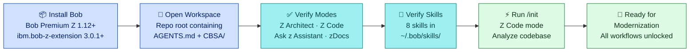

# Step 0 — Workspace Setup with IBM Bob

<div class="callout callout-green">
<strong>Starting point:</strong> This is the starting point for all Bob-assisted modernization workflows on CBSA. Complete these steps once per workspace before using any of the Bob-guided walkthroughs in this section.
</div>

## What You Need

| Requirement | Detail |
|---|---|
| **Bob Premium Z** | IBM Bob IDE — version **1.12** or later required |
| **ibm.bob-z-extension** | VS Code extension — version **3.0.1** or later |
| **IBM Bob z extension installed** | Install from the VS Code Extensions marketplace (`ibm.bob-z-extension`) |
| **Workspace opened at repo root** | Open the folder containing `AGENTS.md`, `CBSA/`, and `zosconnect_artefacts/` as the workspace root |

Bob Premium Z is available through IBM's internal tooling portal. The `ibm.bob-z-extension` provides the Z Architect, Z Code, and Ask z Assistant modes on top of the base Bob IDE. Without it, the Z-specific modes and COBOL-aware skills will not appear.

## Bob Configuration in This Workspace

Bob's modes and skills are configured globally in your home directory. When you open this workspace, Bob automatically reads [`AGENTS.md`](../../../AGENTS.md) at the repo root for project-specific context.

### Modes — `~/.bob/settings/custom_modes.yaml`

Four custom modes are defined for IBM Z work. This file lives at `~/.bob/settings/custom_modes.yaml` and is shared across all workspaces on your machine:

```yaml
customModes:
  - slug: ask-z-assistant
    name: "❓ Ask z Assistant"
    roleDefinition: >
      You are an IBM Z technical assistant. You answer questions about
      z/OS, CICS, DB2, COBOL, IBM tooling, and z/OS Connect. You search
      IBM documentation and provide precise, cited answers.
    groups:
      - read
      - browser

  - slug: z-architect
    name: "🏛️ Z Architect"
    roleDefinition: >
      You are an IBM Z solution architect. You produce impact analyses,
      implementation plans, architecture diagrams, and migration guidance
      for COBOL/CICS/DB2 applications. You do not write code — you plan.
    groups:
      - read
      - edit
      - browser
      - mcp

  - slug: z-code
    name: "💻 Z Code"
    roleDefinition: >
      You are an IBM Z developer. You explain COBOL programs, write and
      modify COBOL/CICS/DB2 source, and transform COBOL to Java following
      CBSA project conventions defined in AGENTS.md.
    groups:
      - read
      - edit
      - command
      - mcp

  - slug: zdocs
    name: "📚 zDocs"
    roleDefinition: >
      You are a technical writer for IBM Z projects. You generate and
      update documentation, data dictionaries, refactor reports, and
      coding standards artefacts for the CBSA codebase.
    groups:
      - read
      - edit
```

### Skills — `~/.bob/skills/`

Eight skills are registered in `~/.bob/skills/`. Each skill is a YAML file that defines a reusable workflow Bob can invoke automatically or on demand:

| Skill file | Purpose |
|---|---|
| `explain.yaml` | Whole-program explanation with Mermaid diagram |
| `implementation-planning.yaml` | Spec-driven implementation plan from a change description |
| `impact-analysis.yaml` | Dependency trace with risk-rated impact report |
| `data-dictionary-management.yaml` | Generates/updates `bobz/DD.json` to decode 8-char naming |
| `validate.yaml` | 4-phase COBOL→Java validation pipeline |
| `cobol-transformation.yaml` | FILLER/REDEFINES/Lombok rules for COBOL→Java generation |
| `refactor-report-generation.yaml` | Identifies paragraphs that are candidates for service extraction |
| `coding-standards-skill-builder.yaml` | Builds and enforces CBSA-specific coding standards |

## Verifying the Modes

After installing `ibm.bob-z-extension` 3.0.1+ and opening the workspace, confirm all four modes are available:

1. Open the **Bob chat panel** — click the Bob icon in the Activity Bar (left sidebar), or use the keyboard shortcut `Ctrl+Shift+B` / `Cmd+Shift+B`.
2. Click the **mode selector dropdown** at the top of the chat panel (it shows the currently active mode name).
3. Confirm these four modes appear in the list:

   - 🏛️ **Z Architect**
   - 💻 **Z Code**
   - ❓ **Ask z Assistant**
   - 📚 **zDocs**

<div class="callout callout-yellow">
<strong>Modes missing?</strong> If <code>z-architect</code> or <code>z-code</code> are absent from the mode selector, verify that <code>ibm.bob-z-extension</code> version 3.0.1 is installed (check <strong>Extensions → IBM Bob z</strong>), then run <strong>Developer: Reload Window</strong> from the Command Palette (<code>Ctrl+Shift+P</code> / <code>Cmd+Shift+P</code>).
</div>

## Verifying the Skills

Skills are surfaced in the Bob panel's Skills tab. To confirm all eight are loaded:

1. In the Bob panel, click the **Skills** tab (next to Chat).
2. Confirm the following eight skills appear:

| Skill | What it does |
|---|---|
| `explain` | Produces a structured explanation of any COBOL program — business purpose, data structures, DB2 operations, CICS calls, error handling, and a Mermaid flowchart |
| `implementation-planning` | Takes a natural-language description of a change and produces a full implementation plan: which programs to modify, copybook impacts, COMMAREA changes, and test requirements |
| `impact-analysis` | Traces all callers, copybook consumers, and z/OS Connect service bindings affected by a proposed change; outputs a risk-rated impact report to `bobz/impact-reports/` |
| `data-dictionary-management` | Reads CBSA's 8-character program and copybook names against project conventions and generates or updates `bobz/DD.json` with human-readable descriptions |
| `validate` | Runs a 4-phase validation pipeline for COBOL→Java output: data structure preparation, resource mapping, JUnit test generation, and test execution |
| `cobol-transformation` | Applies CBSA-specific transformation rules for FILLER fields, REDEFINES scenarios, Lombok annotations, and DB2/CICS mapping during COBOL→Java generation |
| `refactor-report-generation` | Scans programs such as `CREACC`, `XFRFUN`, and `DBCRFUN` for paragraphs that are candidates for extraction into discrete microservices or Java methods |
| `coding-standards-skill-builder` | Builds a living coding-standards document from existing CBSA source patterns and validates new code contributions against those standards |

If a skill is absent, check that the corresponding YAML file exists in `~/.bob/skills/` and that the file is valid YAML (no syntax errors).

## AGENTS.md — Project Context for Bob

Bob reads [`AGENTS.md`](../../../AGENTS.md) automatically whenever you open this workspace. This file gives Bob project-specific context it cannot infer from the source files alone — COBOL naming conventions, key programs, COMMAREA patterns, build system quirks, and architectural constraints.

The root `AGENTS.md` covers the full repository. Three additional AGENTS files in `.bob/rules-*/` provide mode-specific context loaded when you switch modes:

| File | Loaded by |
|---|---|
| [`AGENTS.md`](../../../AGENTS.md) | All modes — project overview, conventions, build system |
| [`.bob/rules-agent/AGENTS.md`](.bob/rules-agent/AGENTS.md) | Z Code mode — non-obvious coding rules, silent build failure traps |
| [`.bob/rules-plan/AGENTS.md`](.bob/rules-plan/AGENTS.md) | Z Architect mode — architectural constraints, COMMAREA coupling, ENQ rules |
| [`.bob/rules-ask/AGENTS.md`](.bob/rules-ask/AGENTS.md) | Ask z Assistant mode — documentation context, naming decoder |

Here is an excerpt from the root [`AGENTS.md`](../../../AGENTS.md) that illustrates the CBSA-specific guidance Bob receives:

```markdown
## Critical COBOL Conventions

**Compiler options are declared at the top of each `.cbl` file:**
- All CICS programs: `PROCESS CICS,NODYNAM,NSYMBOL(NATIONAL),TRUNC(STD)` + `CBL CICS('SP,EDF')`
- Programs with DB2: `CBL SQL`

**Naming conventions:**
- COBOL programs: 8-char uppercase (e.g. `BNKMENU`, `CREACC`, `INQACC`)
- BMS maps: `BNK1xxx` prefix
- Working-storage: `WS-` prefix; Linkage: `LS-` prefix
- Copyright 77-level FILLER literals are required at the top of
  Working-Storage in every program

## z/OS Connect EE

10 services map to CICS programs via COMMAREA:
  CSacccre, CSaccdel, CSaccenq, CSaccupd, CScustacc,
  CScustcre, CScustdel, CScustenq, CScustupd, Pay
```

Bob uses this context to avoid generic COBOL advice and give answers that are grounded in CBSA's specific patterns — for example, it will never suggest removing the copyright FILLER, and it will always flag that a COMMAREA change in one program requires a matching z/OS Connect service update.

## Initializing Bob for CBSA

The `/init` command asks Bob to analyze the open workspace and create or update `AGENTS.md` with program-specific guidance it discovers from the source. Run this once when you first open the workspace, and again after adding new programs.

**Steps:**

1. Switch to **Z Code** mode using the mode selector.
2. In the chat input, type:

```
/init
```

Bob will scan `CBSA/cobol/`, `CBSA/copylib/`, and `CBSA/application-conf/`, then produce a summary of what it has learned and update (or confirm) `AGENTS.md`. The output looks like:

```
✔ Analyzed 39 COBOL programs
✔ Mapped 51 copybooks
✔ Identified 10 z/OS Connect service bindings
✔ AGENTS.md updated with program-specific guidance

Ready. Switch to Z Architect or Z Code to begin.
```

After `/init` completes, Bob has a working model of the entire CBSA program inventory and can answer questions about any program without needing the file to be open.

## Next Steps

Once your workspace is set up and verified, proceed through the Bob-assisted modernization workflows in order:

1. [Step 1 — COBOL Explanation with Bob](cobol-explanation-with-bob.html)
2. [Step 2 — Impact Analysis with Bob](impact-analysis-with-bob.html)
3. [Step 3 — DBB Migration with Bob](dbb-migration-with-bob.html)
4. [Step 4 — OAS3 Migration with Bob](oas3-migration-with-bob.html)
5. [Step 5 — COBOL to Java with Bob](cobol-to-java-with-bob.html)

---

## Workspace Setup Flow


