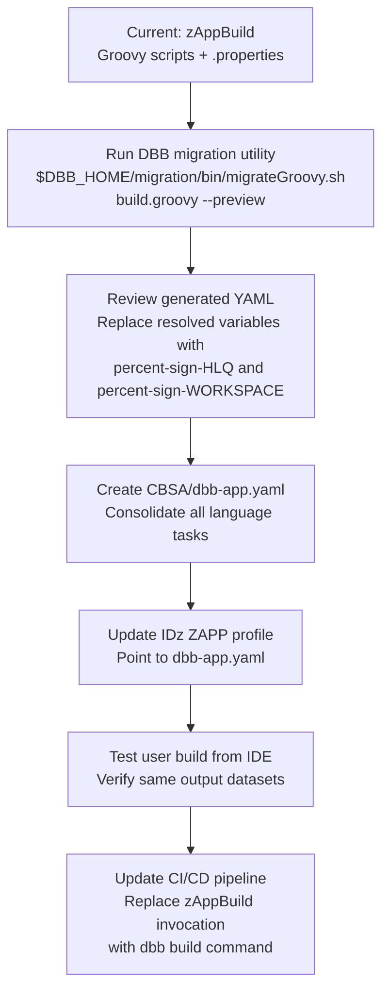

# zAppBuild vs DBB YAML — Build Modernization

CBSA currently builds using **zAppBuild** — a framework of Groovy scripts driven by `.properties` files. IBM DBB 3.x introduces **zBuilder**, a declarative YAML-based approach that eliminates Groovy entirely. This page compares both approaches using CBSA's actual build configuration.

<div class="callout callout-green">
<strong>Key message:</strong> The COBOL source does not change. The build toolchain evolves. Both pipelines produce the same load modules — the difference is maintainability, readability, and IDE integration.
</div>

## What Changes, What Stays the Same

<table class="compare-table">
<thead>
<tr>
  <th style="width:30%">Dimension</th>
  <th class="col-legacy" style="width:35%">zAppBuild / Groovy (Current)</th>
  <th class="col-modern" style="width:35%">DBB YAML / zBuilder (Modern)</th>
</tr>
</thead>
<tbody>
<tr>
  <td><strong>Build definition</strong></td>
  <td class="col-legacy">Groovy scripts per language (<code>Cobol.groovy</code>, <code>BMS.groovy</code>…)</td>
  <td class="col-modern">YAML language tasks in <code>dbb-app.yaml</code> — no Groovy</td>
</tr>
<tr>
  <td><strong>Configuration</strong></td>
  <td class="col-legacy">15+ <code>.properties</code> files in <code>application-conf/</code></td>
  <td class="col-modern">One <code>dbb-app.yaml</code> alongside the source</td>
</tr>
<tr>
  <td><strong>DBB version</strong></td>
  <td class="col-legacy">DBB 1.x / 2.x compatible</td>
  <td class="col-modern">DBB 3.0.4+ required (zBuilder API)</td>
</tr>
<tr>
  <td><strong>IDE integration</strong></td>
  <td class="col-legacy">IDz user build via <code>zapp.yaml</code> + Groovy bridge</td>
  <td class="col-modern">Native IDz 17+ user build — reads <code>dbb-app.yaml</code> directly</td>
</tr>
<tr>
  <td><strong>File flags</strong></td>
  <td class="col-legacy"><code>isCICS=true :: **/cobol/PROG.cbl</code> in <code>file.properties</code></td>
  <td class="col-modern">Inline condition in YAML: <code>when: "${IS_CICS} == true"</code></td>
</tr>
<tr>
  <td><strong>Build order</strong></td>
  <td class="col-legacy">Defined in <code>buildOrder=BMS.groovy,Cobol.groovy…</code></td>
  <td class="col-modern">Task dependencies in YAML — <code>dependsOn: bms-compile</code></td>
</tr>
<tr>
  <td><strong>z/OS Connect deploy</strong></td>
  <td class="col-legacy">Manual SAR/AAR file copy via separate script</td>
  <td class="col-modern">Dedicated deploy task in <code>dbb-app.yaml</code> — part of the pipeline</td>
</tr>
</tbody>
</table>

## Side-by-Side: COBOL Compile Step

The same COBOL compile step expressed in both approaches:

### zAppBuild (current — `CBSA/application-conf/Cobol.properties`)

```properties
cobol_compilerVersion=V6
cobol_compileParms=LIB
cobol_compileCICSParms=CICS
cobol_compileSQLParms=SQL
cobol_compileMaxRC=4
cobol_linkEditParms=MAP,RENT,COMPAT(PM5)
cobol_linkEditMaxRC=0
cobol_deployType=LOAD
cobol_deployTypeCICS=CICSLOAD
cobol_storeSSI=true
```

Plus `file.properties` for per-file flags:
```properties
isCICS=true :: **/cobol/BNKMENU.cbl
isSQL=true  :: **/cobol/CREACC.cbl
isDLI=true  :: **/cobol/DBCRFUN.cbl
```

### DBB YAML (modern — `CBSA/dbb-app.yaml`)

```yaml
language-tasks:
  - name: cobol-compile
    type: cobol
    source-files:
      - pattern: "CBSA/cobol/*.cbl"
    options:
      compiler-version: V6
      compile-params: LIB
      cics-compile-params: CICS          # applied when IS_CICS == true
      sql-compile-params: SQL            # applied when IS_SQL == true
      link-edit-params: MAP,RENT,COMPAT(PM5)
      store-ssi: true
    datasets:
      syslib:
        - "GITLAB.CBSA.COBOL.COPYLIB"
      syslmod:
        - "GITLAB.CBSA.CICSLOAD"         # IS_CICS == true
        - "GITLAB.CBSA.LOAD"             # IS_CICS == false
    max-rc:
      compile: 4
      link-edit: 0
```

## The Full `dbb-app.yaml` for CBSA

The file at `CBSA/dbb-app.yaml` covers the complete build pipeline including z/OS Connect artifact deployment:

```
dbb-app.yaml
├── datasets:          HLQ, SYSLIB, LOAD, CICSLOAD, DBRM, ZUNIT datasets
├── language-tasks:
│   ├── bms-compile    BMS maps → load modules + DSECT copybooks
│   ├── cobol-compile  COBOL → object + load modules (IS_CICS/IS_SQL/IS_DLI aware)
│   ├── asm-compile    Assembler → DFHNCOPT load module
│   ├── link-edit      Link-only programs
│   └── zunit-run      zUnit test execution (BZUPLAY)
└── deploy-tasks:
    └── zosconnect-deploy  Copy SAR/AAR files to z/OS Connect EE resources/ via USS
```

## Migration Path



<div class="callout callout-yellow">
<strong>Migration utility:</strong> DBB 3.0.4+ ships <code>$DBB_HOME/migration/bin/migrateGroovy.sh</code> which can listen to a live zAppBuild run and auto-generate the equivalent YAML. The generated YAML will contain <code>TODO:</code> markers for conditions that need manual review.
</div>

## What You Gain with DBB YAML

1. **One file instead of 15** — the entire build configuration in a single readable YAML
2. **No Groovy knowledge required** — declarative syntax understood by the whole team
3. **Native IDz 17+ integration** — user builds work without a Groovy bridge script
4. **z/OS Connect deploy included** — SAR/AAR deployment is a first-class pipeline task
5. **Conditions as first-class citizens** — `IS_CICS`, `IS_SQL`, `IS_DLI` are built-in zBuilder variables, not custom Groovy logic
