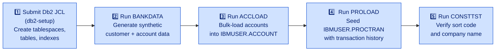

# Batch and Utility Programs

<strong>These programs run offline.</strong> They execute as batch jobs or are utility programs invoked outside the CICS region. They support data loading, offline processing, and environment validation. None are invoked by z/OS Connect EE or BMS screen handlers.

---

## Batch Program Inventory

<table class="compare-table">
<thead>
<tr>
  <th>Program</th>
  <th>Type</th>
  <th>JCL</th>
  <th>Purpose</th>
</tr>
</thead>
<tbody>
<tr>
  <td><code>BANKDATA</code></td>
  <td>Batch COBOL</td>
  <td><code>jclInstall/BANKDATA.jcl</code></td>
  <td>Synthetic data generator — creates initial customer and account records</td>
</tr>
<tr>
  <td><code>ACCLOAD</code></td>
  <td>Batch COBOL + Db2 (<code>CBL SQL</code>)</td>
  <td>n/a</td>
  <td>Bulk load accounts into <code>IBMUSER.ACCOUNT</code></td>
</tr>
<tr>
  <td><code>ACCOFFL</code></td>
  <td>Batch COBOL</td>
  <td>n/a</td>
  <td>Offline interest calculation and statement processing</td>
</tr>
<tr>
  <td><code>ACCTCTRL</code></td>
  <td>CICS utility</td>
  <td>n/a</td>
  <td>Account Named Counter (<code>HBNKACCT</code>) management</td>
</tr>
<tr>
  <td><code>CUSTCTRL</code></td>
  <td>CICS utility</td>
  <td>n/a</td>
  <td>Customer Named Counter (<code>HBNKCUST</code>) management</td>
</tr>
<tr>
  <td><code>PROLOAD</code></td>
  <td>Batch COBOL + Db2</td>
  <td>n/a</td>
  <td>Load initial <code>IBMUSER.PROCTRAN</code> transaction history</td>
</tr>
<tr>
  <td><code>PROOFFL</code></td>
  <td>Batch COBOL + Db2</td>
  <td>n/a</td>
  <td>Archive and purge old <code>IBMUSER.PROCTRAN</code> records</td>
</tr>
<tr>
  <td><code>CONSTTST</code></td>
  <td>Diagnostic</td>
  <td>n/a</td>
  <td>Verify CBSA constants (sort code, company name) are correctly configured</td>
</tr>
<tr>
  <td><code>DPAYTST</code></td>
  <td>Test driver</td>
  <td>n/a</td>
  <td>Exercise <code>DPAYAPI</code> without z/OS Connect EE</td>
</tr>
<tr>
  <td><code>DFHNCOPT</code></td>
  <td>HLASM</td>
  <td>n/a</td>
  <td>CICS Named Counter options table — controls counter initial values and increment</td>
</tr>
</tbody>
</table>

---

## BANKDATA — Bank Data Generator

| | |
|---|---|
| **Program ID** | `BANKDATA` |
| **Type** | Batch COBOL |
| **JCL** | `jclInstall/BANKDATA.jcl` |
| **Source** | `CBSA/cobol/BANKDATA.cbl` |
| **Outputs** | Sequential dataset(s) consumed by `ACCLOAD` and `PROLOAD` |

Generates a synthetic population of bank customers and accounts. Produces a deterministic set of records suitable for populating a fresh demo environment. Run once during initial environment setup before loading any data into Db2 or VSAM.

**When to run:** Once, immediately after the Db2 tablespaces and VSAM files have been defined but before any application has touched them.

---

## ACCLOAD — Account Loader

| | |
|---|---|
| **Program ID** | `ACCLOAD` |
| **Type** | Batch COBOL + Db2 (`CBL SQL`) |
| **Source** | `CBSA/cobol/ACCLOAD.cbl` |
| **Inputs** | Sequential file produced by `BANKDATA` |
| **Outputs** | Rows inserted into `IBMUSER.ACCOUNT` |

Reads the sequential account file produced by `BANKDATA` and bulk-loads each record into `IBMUSER.ACCOUNT` via `EXEC SQL INSERT`. Also populates the Named Counter `HBNKACCT` to a value consistent with the highest account number loaded, so that `CREACC` will not try to reuse an already-allocated account number.

**When to run:** After `BANKDATA` completes and `IBMUSER.ACCOUNT` is empty. Reload from scratch by dropping and recreating the table, then rerunning `BANKDATA` → `ACCLOAD`.

---

## ACCOFFL — Account Offline Processing

| | |
|---|---|
| **Program ID** | `ACCOFFL` |
| **Type** | Batch COBOL |
| **Source** | `CBSA/cobol/ACCOFFL.cbl` |
| **Inputs** | `IBMUSER.ACCOUNT` rows read via Db2 cursor |
| **Outputs** | Updated balances in `IBMUSER.ACCOUNT`; statement records |

Performs offline processing against the account portfolio — applies periodic interest calculations and generates statement data. Intended to be scheduled as a recurring batch job (e.g., nightly or end-of-month). Must not run while the CICS region is actively updating accounts, or a Db2 deadlock / stale data issue may result.

**When to run:** Periodically in a maintenance window, with the CICS application quiesced or at a quiet period.

---

## ACCTCTRL — Account Named Counter Control

| | |
|---|---|
| **Program ID** | `ACCTCTRL` |
| **Type** | CICS utility |
| **Copybook** | `CBSA/copylib/ACCTCTRL.cpy` |
| **Source** | `CBSA/cobol/ACCTCTRL.cbl` |
| **Counter managed** | `HBNKACCT` |

Manages the account number Named Counter. Used during environment setup and recovery to read, set, or reset the `HBNKACCT` counter value. Ensures that the counter is aligned with the highest existing `ACCOUNT_NUMBER` in `IBMUSER.ACCOUNT` so that `CREACC` allocates numbers sequentially without gaps or collisions.

**When to run:** After `ACCLOAD`, or any time the counter state needs to be reconciled with the database (e.g., after a partial load failure).

---

## CUSTCTRL — Customer Named Counter Control

| | |
|---|---|
| **Program ID** | `CUSTCTRL` |
| **Type** | CICS utility |
| **Copybook** | `CBSA/copylib/CUSTCTRL.cpy` |
| **Source** | `CBSA/cobol/CUSTCTRL.cbl` |
| **Counter managed** | `HBNKCUST` |

Companion to `ACCTCTRL` — manages the customer number Named Counter `HBNKCUST`. Ensures the counter is aligned with the highest customer number in the VSAM KSDS Customer file, so that `CRECUST` allocates numbers without collisions.

**When to run:** After loading the VSAM Customer file, or after any recovery procedure that touches customer numbers.

---

## PROLOAD — PROCTRAN Loader

| | |
|---|---|
| **Program ID** | `PROLOAD` |
| **Type** | Batch COBOL + Db2 |
| **Source** | `CBSA/cobol/PROLOAD.cbl` |
| **Inputs** | Sequential file of historical transaction records |
| **Outputs** | Rows inserted into `IBMUSER.PROCTRAN` |

Seeds the `IBMUSER.PROCTRAN` table with initial transaction history records for the demo environment. Without this step, the account enquiry and transfer screens show no prior transaction activity. Run after `ACCLOAD` so that the account numbers referenced in PROCTRAN rows already exist in `IBMUSER.ACCOUNT`.

**When to run:** Once during initial environment setup, after `ACCLOAD`.

---

## PROOFFL — PROCTRAN Offline (Archive/Purge)

| | |
|---|---|
| **Program ID** | `PROOFFL` |
| **Type** | Batch COBOL + Db2 |
| **Source** | `CBSA/cobol/PROOFFL.cbl` |
| **Inputs** | `IBMUSER.PROCTRAN` rows (filtered by age or date) |
| **Outputs** | Deleted rows from `IBMUSER.PROCTRAN`; optional archive sequential dataset |

Archives or purges old processed-transaction records from `IBMUSER.PROCTRAN`. In a long-running demo or development environment, PROCTRAN can accumulate a large number of rows; this job trims it back. In a production scenario it would archive to tape or an offload dataset before deleting.

**When to run:** Periodically, or when `IBMUSER.PROCTRAN` space is exhausted.

---

## CONSTTST — Constants Test

| | |
|---|---|
| **Program ID** | `CONSTTST` |
| **Type** | Diagnostic / validation |
| **Source** | `CBSA/cobol/CONSTTST.cbl` |
| **Inputs** | Db2 `IBMUSER.CONTROL` (sort code), `GETCOMPY` COMMAREA (company name) |
| **Outputs** | Printed report to SYSOUT |

Diagnostic program that validates CBSA constants by calling `GETSCODE` and `GETCOMPY` and printing their returned values. Used during environment bring-up to confirm that the `IBMUSER.CONTROL` table has been populated with the correct sort code and that the company name hardcode in `GETCOMPY` matches expectations.

**When to run:** After the Db2 setup step (`db2-setup` JCL) and before running any application traffic. Also useful after any change to the `CONTROL` table.

---

## DPAYTST — Direct Payment Test Driver

| | |
|---|---|
| **Program ID** | `DPAYTST` |
| **Type** | Test driver |
| **Source** | `CBSA/cobol/DPAYTST.cbl` |
| **Inputs** | Hardcoded or customised test COMMAREA values |
| **Outputs** | Calls `DPAYAPI`; result reported to SYSOUT or CICS terminal |

Exercises `DPAYAPI` directly without going through z/OS Connect EE. Useful for verifying the payment pipeline at the COBOL level in isolation — for example, confirming that `DPAYAPI` → `CONSENT` → `DBCRFUN` all behave correctly after a code change, before deploying z/OS Connect EE service bindings.

**When to run:** During development or post-change verification of the payment path.

---

## DFHNCOPT — Named Counter Configuration

<strong>Rebuild and reinstall DFHNCOPT only when you need to reset the counter initial values</strong> — for example, after dropping and recreating the VSAM files and Db2 tables in a fresh environment. Changing and reinstalling this module while the CICS region is running will disrupt the Named Counter Server.

| | |
|---|---|
| **Source** | `CBSA/asm/DFHNCOPT.assemble` |
| **Type** | HLASM (IBM High Level Assembler) |
| **Built by** | `Assembler.groovy` in the DBB pipeline |
| **Counters configured** | `HBNKACCT` (account numbers), `HBNKCUST` (customer numbers) |

`DFHNCOPT` is an HLASM source file that generates the CICS Named Counter Server options table. It controls:

- **Initial value** — the starting counter value for a freshly defined counter.
- **Increment** — how much each `COUNTER NEXT` call advances the counter.
- **Maximum** — the upper limit before the counter wraps or returns an error.

The two counters it configures are used by CBSA to generate sequential, unique identifiers:

| Counter | Used by | Protects |
|---|---|---|
| `HBNKACCT` | `CREACC` | `ACCOUNT_NUMBER` in `IBMUSER.ACCOUNT` |
| `HBNKCUST` | `CRECUST` | `CUSTOMER_NUMBER` in VSAM KSDS Customer file |

Both counters are guarded by `EXEC CICS ENQ` / `EXEC CICS DEQ` in the calling programs to ensure that the counter read + data store write is an atomic unit under concurrent load.

**Rebuild procedure:**

1. Edit `CBSA/asm/DFHNCOPT.assemble` with the desired initial values and increment.
2. Submit through the DBB Assembler pipeline (`Assembler.groovy`).
3. NEWCOPY the resulting load module in CICS: `EXEC CICS PERFORM NEWCOPY PROGRAM(DFHNCOPT)`.
4. Restart the Named Counter Server to pick up the new options table.

---

## Environment Setup Sequence

Run the following programs in order when setting up a fresh CBSA environment. Each step depends on the previous one completing successfully.

<strong>VSAM files must be defined before running BANKDATA.</strong> The VSAM KSDS Customer file and any other VSAM datasets referenced by CBSA must be allocated (via IDCAMS or the supplied JCL) before any batch program attempts to write to them. See the <a href="../installation-and-setup/vsam-setup.html">VSAM Setup</a> page for allocation JCL.

| Step | Program / Job | Prerequisite |
|---|---|---|
| 1 | Db2 setup JCL (`db2-setup`) | Db2 subsystem `DBCG` accessible, user ID `IBMUSER` has DDL authority |
| 2 | `BANKDATA` | Step 1 complete; VSAM files allocated |
| 3 | `ACCLOAD` | Step 2 output dataset available |
| 4 | `PROLOAD` | Step 3 complete (`IBMUSER.ACCOUNT` populated) |
| 5 | `CONSTTST` | Steps 1–4 complete; `IBMUSER.CONTROL` populated with sort code |
