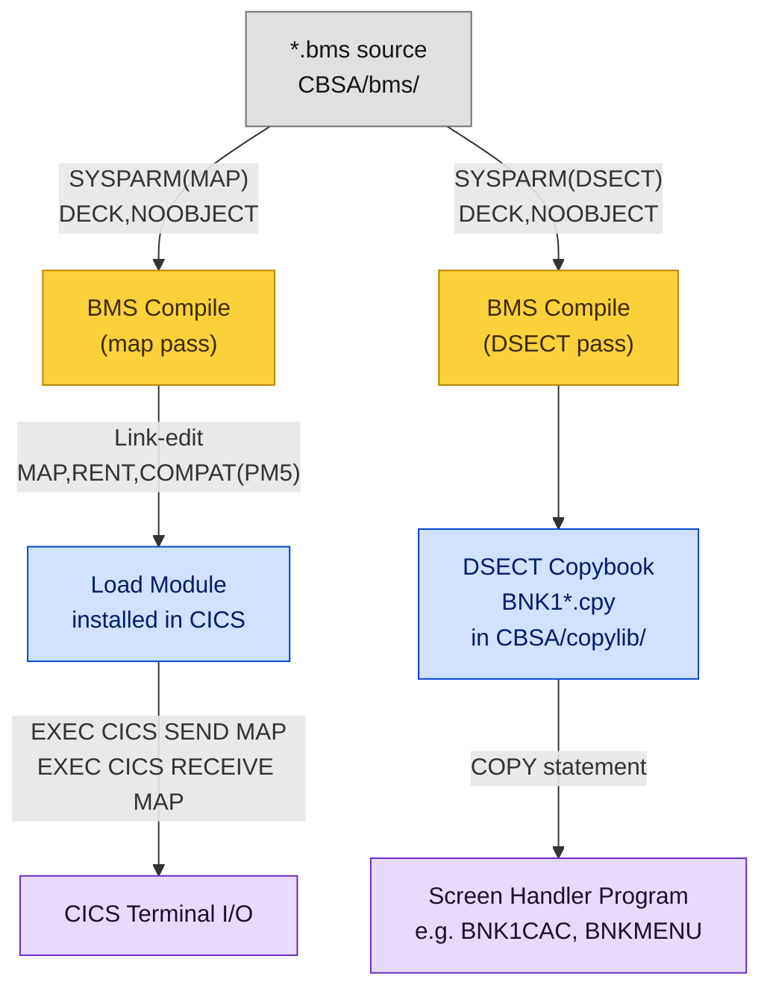

# BMS Maps

BMS (Basic Mapping Support) map definitions live in `CBSA/bms/`. They define the 3270 terminal screens used by the CICS screen-handler programs. During the build, each `.bms` source file is compiled **twice** — once to produce a load module and once to produce a DSECT copybook.

<div class="callout callout-green">
<strong>10 BMS map definitions define the 3270 terminal screens.</strong> Each <code>.bms</code> file generates a load module <em>AND</em> a DSECT copybook during the build. The copybooks are generated artifacts — never hand-edit them. Edit the <code>.bms</code> source and rebuild.
</div>

---

## BMS Compilation Flow



**Legend:** Gray = source · Yellow = compile step · Blue = generated artifact · Purple = CICS runtime

---

## Map Inventory

<table class="compare-table">
<thead>
<tr>
  <th style="width:17%">BMS Source</th>
  <th style="width:13%">Map Set</th>
  <th style="width:12%">Map Name</th>
  <th style="width:16%">Screen Handler</th>
  <th>Purpose</th>
</tr>
</thead>
<tbody>
<tr>
  <td><code>BNK1MAI.bms</code></td>
  <td><code>BNK1MAI</code></td>
  <td><code>BNK1ME</code></td>
  <td><code>BNKMENU</code></td>
  <td>Main menu — transaction selector</td>
</tr>
<tr>
  <td><code>BNK1CAM.bms</code></td>
  <td><code>BNK1CAM</code></td>
  <td><code>BNK1CA</code></td>
  <td><code>BNK1CAC</code></td>
  <td>Create account form</td>
</tr>
<tr>
  <td><code>BNK1CCM.bms</code></td>
  <td><code>BNK1CCM</code></td>
  <td><code>BNK1CC</code></td>
  <td><code>BNK1CCA</code></td>
  <td>Create customer + account form</td>
</tr>
<tr>
  <td><code>BNK1CDM.bms</code></td>
  <td><code>BNK1CDM</code></td>
  <td><code>BNK1CD</code></td>
  <td><code>BNK1CCS</code></td>
  <td>Create customer form</td>
</tr>
<tr>
  <td><code>BNK1ACC.bms</code></td>
  <td><code>BNK1ACC</code></td>
  <td><code>BNK1AC</code></td>
  <td><code>BNK1CRA</code></td>
  <td>Account list display</td>
</tr>
<tr>
  <td><code>BNK1DAM.bms</code></td>
  <td><code>BNK1DAM</code></td>
  <td><code>BNK1DA</code></td>
  <td><code>BNK1DAC</code></td>
  <td>Delete account confirmation</td>
</tr>
<tr>
  <td><code>BNK1DCM.bms</code></td>
  <td><code>BNK1DCM</code></td>
  <td><code>BNK1DC</code></td>
  <td><code>BNK1DCS</code></td>
  <td>Delete customer confirmation</td>
</tr>
<tr>
  <td><code>BNK1TFM.bms</code></td>
  <td><code>BNK1TFM</code></td>
  <td><code>BNK1TF</code></td>
  <td><code>BNK1TFN</code></td>
  <td>Transfer funds form</td>
</tr>
<tr>
  <td><code>BNK1UAM.bms</code></td>
  <td><code>BNK1UAM</code></td>
  <td><code>BNK1UA</code></td>
  <td><code>BNK1UAC</code></td>
  <td>Update account form</td>
</tr>
<tr>
  <td><code>BNK1B2M.bms</code></td>
  <td><code>BNK1B2M</code></td>
  <td><code>BNK1B2</code></td>
  <td>(secondary)</td>
  <td>Secondary account display</td>
</tr>
</tbody>
</table>

---

## Generated Artifacts

Each `.bms` source produces two artifacts during the DBB build. The table below maps each source file to its outputs.

| BMS Source | Load Module (CICS) | Generated Copybook (`CBSA/copylib/`) |
|---|---|---|
| `BNK1MAI.bms` | `BNK1MAI` | `BNK1MAI.cpy` |
| `BNK1CAM.bms` | `BNK1CAM` | `BNK1CAM.cpy` |
| `BNK1CCM.bms` | `BNK1CCM` | `BNK1CCM.cpy` |
| `BNK1CDM.bms` | `BNK1CDM` | `BNK1CDM.cpy` |
| `BNK1ACC.bms` | `BNK1ACC` | `BNK1ACC.cpy` |
| `BNK1DAM.bms` | `BNK1DAM` | `BNK1DAM.cpy` |
| `BNK1DCM.bms` | `BNK1DCM` | `BNK1DCM.cpy` |
| `BNK1TFM.bms` | `BNK1TFM` | `BNK1TFM.cpy` |
| `BNK1UAM.bms` | `BNK1UAM` | `BNK1UAM.cpy` |
| `BNK1B2M.bms` | `BNK1B2M` | `BNK1DDM.cpy` |

<div class="callout callout-yellow">
<strong>Generated copybooks are overwritten on every BMS build.</strong> Files matching <code>CBSA/copylib/BNK1*.cpy</code> are produced by the BMS DSECT compilation pass. If you need to change a screen field, edit the <code>.bms</code> source file and rebuild — do not edit the copybooks directly.
</div>

---

## BMS Compile Parameters

From [`CBSA/application-conf/BMS.properties`](../../../CBSA/application-conf/BMS.properties):

```properties
# Produces the map load module
bms_compileParms=SYSPARM(MAP),DECK,NOOBJECT

# Produces the DSECT copybook
bms_copyGenParms=SYSPARM(DSECT),DECK,NOOBJECT

# Link-edit parameters for the map load module
bms_linkEditParms=MAP,RENT,COMPAT(PM5)

# Maximum acceptable return code from BMS assembly
bms_maxRC=4
```

The `SYSPARM(MAP)` pass assembles the map definition into a load module that CICS loads at runtime. The `SYSPARM(DSECT)` pass produces a COBOL DSECT structure (the copybook) that screen-handler programs include with a `COPY` statement to access map field names symbolically.

---

## Screen Layout Conventions

All CBSA BMS maps follow a common 3270 Model 2 layout:

| Row(s) | Content |
|---|---|
| Row 1, col 1–6 | Transaction identifier (e.g., `BNK1MA`) |
| Row 1, col 20–59 | Company name — populated at runtime by `GETCOMPY` |
| Row 2 | Screen title / heading |
| Rows 3–20 | Input and output fields |
| Row 23 | Error or success message area |
| Row 24 | PF key legend |

**Screen dimensions:** 24 rows × 80 columns (standard 3270 Model 2).

**PF key conventions used across all screens:**

| Key | Action |
|---|---|
| `PF3` | Return / cancel — go back to previous screen |
| `PF12` | Abend test — reserved for debug; triggers controlled abend |
| `Enter` | Submit form / execute selected action |

---

## DBB vs zAppBuild BMS Build

Both zAppBuild (current) and DBB YAML (modern) execute the same two-pass BMS compilation. The difference is how that step is expressed.

<table class="compare-table">
<thead>
<tr>
  <th style="width:25%">Aspect</th>
  <th class="col-legacy" style="width:37%">zAppBuild / Groovy (Current)</th>
  <th class="col-modern" style="width:38%">DBB YAML / zBuilder (Modern)</th>
</tr>
</thead>
<tbody>
<tr>
  <td><strong>Build script</strong></td>
  <td class="col-legacy"><code>dbb-zappbuild/language/BMS.groovy</code></td>
  <td class="col-modern">Inline task block in <code>dbb-app.yaml</code></td>
</tr>
<tr>
  <td><strong>Parameters</strong></td>
  <td class="col-legacy">Read from <code>CBSA/application-conf/BMS.properties</code></td>
  <td class="col-modern">Declared in YAML task properties — single file</td>
</tr>
<tr>
  <td><strong>Build order</strong></td>
  <td class="col-legacy"><code>buildOrder=BMS.groovy,Cobol.groovy,…</code> in <code>application.properties</code></td>
  <td class="col-modern"><code>dependsOn: bms-compile</code> in COBOL task — explicit DAG</td>
</tr>
<tr>
  <td><strong>Map pass</strong></td>
  <td class="col-legacy"><code>bms_compileParms=SYSPARM(MAP),DECK,NOOBJECT</code></td>
  <td class="col-modern"><code>options: SYSPARM(MAP)</code> in BMS language task</td>
</tr>
<tr>
  <td><strong>DSECT pass</strong></td>
  <td class="col-legacy"><code>bms_copyGenParms=SYSPARM(DSECT),DECK,NOOBJECT</code></td>
  <td class="col-modern">Separate <code>copyGen</code> sub-task in the same YAML block</td>
</tr>
</tbody>
</table>

See [Build Modernization — zAppBuild vs DBB YAML](../../modernization/zappbuild-vs-dbb-yaml.html) for the full comparison.
