# CICS Screen Handler Programs

<strong>These 9 programs own the 3270 terminal layer.</strong> They handle all BMS map interaction and are the ONLY programs invoked by CICS transactions (<code>BMNU</code>, <code>BCAC</code>, etc.). z/OS Connect EE bypasses them entirely and calls the underlying service programs directly — a 3270 terminal user and a REST API consumer ultimately reach the same COBOL business logic via different entry paths.

---

## Screen Handler Overview

```mermaid
flowchart TD
    T["🖥️ 3270 Terminal\n(End User)"]

    subgraph CICS ["CICS Region"]
        subgraph TXN ["CICS Transactions"]
            BMNU["BMNU"]
            BCAC["BCAC"]
            BCCA["BCCA"]
            BCCS["BCCS"]
            BCRA["BCRA"]
            BDAC["BDAC"]
            BDCS["BDCS"]
            BTFN["BTFN"]
            BUAC["BUAC"]
        end

        subgraph Handlers ["BMS Screen Handlers"]
            BNKMENU["BNKMENU\nMain Menu"]
            BNK1CAC["BNK1CAC\nCreate Account"]
            BNK1CCA["BNK1CCA\nCreate Customer+Account"]
            BNK1CCS["BNK1CCS\nCreate Customer"]
            BNK1CRA["BNK1CRA\nCustomer+Accounts List"]
            BNK1DAC["BNK1DAC\nDelete Account"]
            BNK1DCS["BNK1DCS\nDelete Customer"]
            BNK1TFN["BNK1TFN\nTransfer Funds"]
            BNK1UAC["BNK1UAC\nUpdate Account"]
        end

        subgraph BMS ["BMS Maps"]
            BNK1MAI["BNK1MAI"]
            BNK1CAM["BNK1CAM"]
            BNK1CCM["BNK1CCM"]
            BNK1CDM["BNK1CDM"]
            BNK1ACC["BNK1ACC"]
            BNK1DAM["BNK1DAM"]
            BNK1DCM["BNK1DCM"]
            BNK1TFM["BNK1TFM"]
            BNK1UAM["BNK1UAM"]
        end

        subgraph SvcPrograms ["Service Programs (shared)"]
            CREACC["CREACC"]
            CRECUST["CRECUST"]
            INQCUST["INQCUST"]
            INQACCCU["INQACCCU"]
            DELACC["DELACC"]
            DELCUS["DELCUS"]
            XFRFUN["XFRFUN"]
            UPDACC["UPDACC"]
        end
    end

    T -->|"TN3270 / VTAM"| TXN

    BMNU --> BNKMENU
    BCAC --> BNK1CAC
    BCCA --> BNK1CCA
    BCCS --> BNK1CCS
    BCRA --> BNK1CRA
    BDAC --> BNK1DAC
    BDCS --> BNK1DCS
    BTFN --> BNK1TFN
    BUAC --> BNK1UAC

    BNKMENU <-->|"SEND/RECEIVE MAP"| BNK1MAI
    BNK1CAC <-->|"SEND/RECEIVE MAP"| BNK1CAM
    BNK1CCA <-->|"SEND/RECEIVE MAP"| BNK1CCM
    BNK1CCS <-->|"SEND/RECEIVE MAP"| BNK1CDM
    BNK1CRA <-->|"SEND/RECEIVE MAP"| BNK1ACC
    BNK1DAC <-->|"SEND/RECEIVE MAP"| BNK1DAM
    BNK1DCS <-->|"SEND/RECEIVE MAP"| BNK1DCM
    BNK1TFN <-->|"SEND/RECEIVE MAP"| BNK1TFM
    BNK1UAC <-->|"SEND/RECEIVE MAP"| BNK1UAM

    BNK1CAC -->|"EXEC CICS LINK"| CREACC
    BNK1CCA -->|"EXEC CICS LINK"| CRECUST
    BNK1CCA -->|"EXEC CICS LINK"| CREACC
    BNK1CCS -->|"EXEC CICS LINK"| CRECUST
    BNK1CRA -->|"EXEC CICS LINK"| INQCUST
    BNK1CRA -->|"EXEC CICS LINK"| INQACCCU
    BNK1DAC -->|"EXEC CICS LINK"| DELACC
    BNK1DCS -->|"EXEC CICS LINK"| DELCUS
    BNK1TFN -->|"EXEC CICS LINK"| XFRFUN
    BNK1UAC -->|"EXEC CICS LINK"| UPDACC

    classDef terminal fill:#dde1e7,stroke:#697077,color:#161616
    classDef txn      fill:#fcf4d6,stroke:#f1c21b,color:#3c2a00
    classDef handler  fill:#d0e2ff,stroke:#0043ce,color:#001d6c
    classDef bms      fill:#d9fbfb,stroke:#005d5d,color:#001f1f
    classDef service  fill:#e8daff,stroke:#6929c4,color:#1c0f30

    class T terminal
    class BMNU,BCAC,BCCA,BCCS,BCRA,BDAC,BDCS,BTFN,BUAC txn
    class BNKMENU,BNK1CAC,BNK1CCA,BNK1CCS,BNK1CRA,BNK1DAC,BNK1DCS,BNK1TFN,BNK1UAC handler
    class BNK1MAI,BNK1CAM,BNK1CCM,BNK1CDM,BNK1ACC,BNK1DAM,BNK1DCM,BNK1TFM,BNK1UAM bms
    class CREACC,CRECUST,INQCUST,INQACCCU,DELACC,DELCUS,XFRFUN,UPDACC service
```

**Legend:** Gray = 3270 terminal · Yellow = CICS transactions · Blue = screen handler programs · Teal = BMS maps · Purple = service programs

---

## Handler Inventory

<table class="compare-table">
<thead>
<tr>
  <th>Program</th>
  <th>Transaction</th>
  <th>BMS Map</th>
  <th>Service Programs Called</th>
  <th>Operation</th>
</tr>
</thead>
<tbody>
<tr>
  <td><code>BNKMENU</code></td>
  <td><code>BMNU</code></td>
  <td><code>BNK1MAI</code></td>
  <td>(routes only)</td>
  <td>Main banking menu</td>
</tr>
<tr>
  <td><code>BNK1CAC</code></td>
  <td><code>BCAC</code></td>
  <td><code>BNK1CAM</code></td>
  <td><code>CREACC</code></td>
  <td>Create new account</td>
</tr>
<tr>
  <td><code>BNK1CCA</code></td>
  <td><code>BCCA</code></td>
  <td><code>BNK1CCM</code></td>
  <td><code>CRECUST</code>, <code>CREACC</code></td>
  <td>Create customer then account</td>
</tr>
<tr>
  <td><code>BNK1CCS</code></td>
  <td><code>BCCS</code></td>
  <td><code>BNK1CDM</code></td>
  <td><code>CRECUST</code></td>
  <td>Create new customer only</td>
</tr>
<tr>
  <td><code>BNK1CRA</code></td>
  <td><code>BCRA</code></td>
  <td><code>BNK1ACC</code></td>
  <td><code>INQCUST</code>, <code>INQACCCU</code></td>
  <td>Customer + accounts enquiry list</td>
</tr>
<tr>
  <td><code>BNK1DAC</code></td>
  <td><code>BDAC</code></td>
  <td><code>BNK1DAM</code></td>
  <td><code>DELACC</code></td>
  <td>Delete an account</td>
</tr>
<tr>
  <td><code>BNK1DCS</code></td>
  <td><code>BDCS</code></td>
  <td><code>BNK1DCM</code></td>
  <td><code>DELCUS</code></td>
  <td>Delete a customer</td>
</tr>
<tr>
  <td><code>BNK1TFN</code></td>
  <td><code>BTFN</code></td>
  <td><code>BNK1TFM</code></td>
  <td><code>XFRFUN</code></td>
  <td>Transfer funds between accounts</td>
</tr>
<tr>
  <td><code>BNK1UAC</code></td>
  <td><code>BUAC</code></td>
  <td><code>BNK1UAM</code></td>
  <td><code>UPDACC</code></td>
  <td>Update account attributes</td>
</tr>
</tbody>
</table>

---

## BNKMENU — Main Menu

| | |
|---|---|
| **Program ID** | `BNKMENU` |
| **Transaction** | `BMNU` |
| **BMS Map** | `BNK1MAI` (`CBSA/copylib/BNK1MAI.cpy`) |
| **Service Programs Called** | None — routes to other transactions |
| **Source** | `CBSA/cobol/BNKMENU.cbl` |

The first program a 3270 terminal user reaches. Displays the main banking menu via `EXEC CICS SEND MAP(BNK1MAI)`. Validates the user's numeric menu selection and issues `EXEC CICS RETURN TRANSID(...)` to route to the appropriate transaction.

**Input fields:**

| Field | Description |
|---|---|
| Menu selection | Single digit identifying the desired operation |

**PF key handling:**

| Key | Action |
|---|---|
| Enter | Process menu selection and route to chosen transaction |
| PF3 | Return / Exit application |
| PF12 | Force abend (test / debug path) |

---

## BNK1CAC — Create Account Screen

| | |
|---|---|
| **Program ID** | `BNK1CAC` |
| **Transaction** | `BCAC` |
| **BMS Map** | `BNK1CAM` (`CBSA/copylib/BNK1CAM.cpy`) |
| **Service Programs Called** | `CREACC` |
| **Source** | `CBSA/cobol/BNK1CAC.cbl` |

Collects new account details from the terminal user and calls `CREACC` via `EXEC CICS LINK`. On success, clears the input fields and displays the newly assigned account number. On failure, displays the error reason code returned in `COMM-FAIL-CODE`.

**Input fields:**

| Field | Description |
|---|---|
| Sort code | Bank sort code (pre-filled from `GETSCODE`) |
| Customer number | Existing customer to own the account |
| Account type | Up to 8 characters — e.g., `CURRENT`, `SAVINGS` |
| Interest rate | `9(4)V99` — annual interest rate |
| Overdraft limit | `9(8)` — authorised overdraft |

**PF key handling:**

| Key | Action |
|---|---|
| Enter | Submit account creation request |
| PF3 | Return to main menu |
| PF12 | Force abend (test path) |

---

## BNK1CCA — Create Customer and Account Screen

| | |
|---|---|
| **Program ID** | `BNK1CCA` |
| **Transaction** | `BCCA` |
| **BMS Map** | `BNK1CCM` (`CBSA/copylib/BNK1CCM.cpy`) |
| **Service Programs Called** | `CRECUST`, then `CREACC` |
| **Source** | `CBSA/cobol/BNK1CCA.cbl` |

Two-step screen that creates a customer and an account in a single interaction. First calls `CRECUST` to create the customer record and obtain the customer number; if that succeeds, immediately calls `CREACC` with the new customer number to open the first account. If `CREACC` fails after `CRECUST` has already succeeded, the customer record exists but has no account — the user must use `BCAC` to open an account separately.

**Input fields:**

| Field | Description |
|---|---|
| Customer name | `PIC X(60)` |
| Customer address | `PIC X(160)` |
| Date of birth | `DDMMYYYY` |
| Account type | `PIC X(8)` |
| Interest rate | `9(4)V99` |
| Overdraft limit | `9(8)` |

**PF key handling:**

| Key | Action |
|---|---|
| Enter | Submit both create operations |
| PF3 | Return to main menu |
| PF12 | Force abend (test path) |

---

## BNK1CCS — Create Customer Screen

| | |
|---|---|
| **Program ID** | `BNK1CCS` |
| **Transaction** | `BCCS` |
| **BMS Map** | `BNK1CDM` (`CBSA/copylib/BNK1CDM.cpy`) |
| **Service Programs Called** | `CRECUST` |
| **Source** | `CBSA/cobol/BNK1CCS.cbl` |

Creates a customer record only (no account). Collects name, address, and date of birth, then calls `CRECUST` via `EXEC CICS LINK`. On success, displays the assigned customer number. Use `BCAC` afterwards to open an account for the new customer.

**Input fields:**

| Field | Description |
|---|---|
| Customer name | `PIC X(60)` |
| Customer address | `PIC X(160)` |
| Date of birth | `DDMMYYYY` |

**PF key handling:**

| Key | Action |
|---|---|
| Enter | Submit customer creation request |
| PF3 | Return to main menu |
| PF12 | Force abend (test path) |

---

## BNK1CRA — Customer and Accounts List Screen

| | |
|---|---|
| **Program ID** | `BNK1CRA` |
| **Transaction** | `BCRA` |
| **BMS Map** | `BNK1ACC` (`CBSA/copylib/BNK1ACC.cpy`) |
| **Service Programs Called** | `INQCUST`, `INQACCCU` |
| **Source** | `CBSA/cobol/BNK1CRA.cbl` |

Read-only enquiry screen. Accepts a customer number, calls `INQCUST` to retrieve customer header data (name, address, date of birth, credit score), then calls `INQACCCU` to retrieve all accounts. Displays a scrollable list of up to 20 accounts. The `NUMBER-OF-ACCOUNTS` ODO field in the `INQACCCU` COMMAREA controls how many rows are rendered.

**Input fields:**

| Field | Description |
|---|---|
| Customer number | `9(10)` — key passed to `INQCUST` and `INQACCCU` |

**PF key handling:**

| Key | Action |
|---|---|
| Enter | Submit enquiry |
| PF3 | Return to main menu |
| PF12 | Force abend (test path) |

---

## BNK1DAC — Delete Account Screen

| | |
|---|---|
| **Program ID** | `BNK1DAC` |
| **Transaction** | `BDAC` |
| **BMS Map** | `BNK1DAM` (`CBSA/copylib/BNK1DAM.cpy`) |
| **Service Programs Called** | `DELACC` |
| **Source** | `CBSA/cobol/BNK1DAC.cbl` |

Deletes a single account. The user enters the sort code and account number; the screen handler calls `DELACC` via `EXEC CICS LINK`. `DELACC` rejects the request if the account balance is non-zero and returns the failure code — the screen handler then displays an appropriate error message. A confirmation interaction ensures the user explicitly confirms the deletion before `DELACC` is called.

**Input fields:**

| Field | Description |
|---|---|
| Sort code | `9(6)` |
| Account number | `9(8)` |

**PF key handling:**

| Key | Action |
|---|---|
| Enter | Submit delete request (or confirm deletion on second press) |
| PF3 | Return to main menu / cancel |
| PF12 | Force abend (test path) |

---

## BNK1DCS — Delete Customer Screen

| | |
|---|---|
| **Program ID** | `BNK1DCS` |
| **Transaction** | `BDCS` |
| **BMS Map** | `BNK1DCM` (`CBSA/copylib/BNK1DCM.cpy`) |
| **Service Programs Called** | `DELCUS` |
| **Source** | `CBSA/cobol/BNK1DCS.cbl` |

Deletes a customer. Calls `DELCUS` which internally deletes all remaining accounts before removing the customer from VSAM. If any account deletion fails, `DELCUS` abends rather than leaving records in an inconsistent state. The screen handler displays the outcome on return.

**Input fields:**

| Field | Description |
|---|---|
| Customer number | `9(10)` |

**PF key handling:**

| Key | Action |
|---|---|
| Enter | Submit delete request |
| PF3 | Return to main menu |
| PF12 | Force abend (test path) |

---

## BNK1TFN — Transfer Funds Screen

| | |
|---|---|
| **Program ID** | `BNK1TFN` |
| **Transaction** | `BTFN` |
| **BMS Map** | `BNK1TFM` (`CBSA/copylib/BNK1TFM.cpy`) |
| **Service Programs Called** | `XFRFUN` |
| **Source** | `CBSA/cobol/BNK1TFN.cbl` |

Handles fund transfers between two accounts. Populates the `XFRFUN` COMMAREA with source account (`COMM-FACCNO`/`COMM-FSCODE`), destination account (`COMM-TACCNO`/`COMM-TSCODE`), and amount (`COMM-AMT`), then calls `XFRFUN` via `EXEC CICS LINK`. On success, displays the updated available and actual balances for both accounts. On failure, displays the reason code.

**Input fields:**

| Field | Description |
|---|---|
| From sort code | `9(6)` — source account sort code |
| From account number | `9(8)` — source account number |
| To sort code | `9(6)` — destination account sort code |
| To account number | `9(8)` — destination account number |
| Amount | `S9(10)V99` — transfer amount |

**PF key handling:**

| Key | Action |
|---|---|
| Enter | Submit transfer request |
| PF3 | Return to main menu |
| PF12 | Force abend (test path) |

---

## BNK1UAC — Update Account Screen

| | |
|---|---|
| **Program ID** | `BNK1UAC` |
| **Transaction** | `BUAC` |
| **BMS Map** | `BNK1UAM` (`CBSA/copylib/BNK1UAM.cpy`) |
| **Service Programs Called** | `UPDACC` |
| **Source** | `CBSA/cobol/BNK1UAC.cbl` |

Updates modifiable account attributes. The user enters the account key (sort code + account number) and the fields to change; the screen calls `UPDACC` via `EXEC CICS LINK`. `UPDACC` updates `IBMUSER.ACCOUNT` and writes a `PROCTRAN` audit record. The screen handler re-displays the updated values on success.

**Input fields:**

| Field | Description |
|---|---|
| Sort code | `9(6)` |
| Account number | `9(8)` |
| Interest rate | `9(4)V99` — new annual interest rate |
| Overdraft limit | `9(8)` — new overdraft limit |

**PF key handling:**

| Key | Action |
|---|---|
| Enter | Submit update request |
| PF3 | Return to main menu |
| PF12 | Force abend (test path) |

---

## Common PF Key Conventions

All BMS screen handlers follow the same PF key layout. This consistency is intentional — every screen responds to the same keys in the same way, reducing operator training overhead.

<table class="compare-table">
<thead>
<tr>
  <th>Key</th>
  <th>Action on all screens</th>
</tr>
</thead>
<tbody>
<tr>
  <td><strong>Enter</strong></td>
  <td>Submit the current form / process selection</td>
</tr>
<tr>
  <td><strong>PF3</strong></td>
  <td>Return to previous screen or main menu; cancel without submitting</td>
</tr>
<tr>
  <td><strong>PF12</strong></td>
  <td>Force a CICS abend — used in testing and debug scenarios</td>
</tr>
</tbody>
</table>

---

## BMS vs REST Access

<table class="compare-table">
<thead>
<tr>
  <th>Access Path</th>
  <th>Entry Point</th>
  <th>Invokes</th>
  <th>Used By</th>
</tr>
</thead>
<tbody>
<tr>
  <td><strong>3270 Terminal</strong></td>
  <td>CICS Transaction (<code>BMNU</code>, <code>BCAC</code>, …)</td>
  <td>BMS Screen Handler → <code>EXEC CICS LINK</code> → Service Program</td>
  <td>Terminal users on a 3270 emulator or direct TN3270 connection</td>
</tr>
<tr>
  <td><strong>REST / Browser</strong></td>
  <td>z/OS Connect EE REST API (<code>POST /creacc/insert</code>, …)</td>
  <td>Service Program directly (no BMS handler, no map)</td>
  <td>Spring Boot Customer Services UI, REST clients, automation scripts</td>
</tr>
</tbody>
</table>

<strong>The COBOL service programs are shared.</strong> They have no knowledge of whether they were invoked by a BMS screen handler or by z/OS Connect EE. The COMMAREA interface is identical in both cases — the same copybook, the same field layout, the same <code>COMM-SUCCESS</code> / <code>COMM-FAIL-CODE</code> protocol. This is what makes the modernization non-invasive: the service programs do not need to change when a new access path (REST, gRPC, etc.) is added.

