# Business Service Programs

<div class="callout callout-green">
<strong>Core banking logic lives here.</strong> These 18 programs implement the business rules for CBSA. They are invoked via <code>EXEC CICS LINK</code> from BMS screen handlers (terminal users) or z/OS Connect EE (REST API consumers). The COBOL source is unchanged across all modernization stages — only the access path to them changes.
</div>

---

## Service Program Inventory

```mermaid
flowchart TD
    subgraph Callers ["Callers"]
        BMS["🖥️ BMS Screen Handlers\n(BNKMENU, BNK1CAC, …)"]
        ZC["🔌 z/OS Connect EE\nREST APIs"]
    end

    subgraph Account ["Account Programs"]
        CREACC["CREACC\nCreate Account"]
        INQACC["INQACC\nEnquire Account"]
        INQACCCU["INQACCCU\nList Accounts"]
        UPDACC["UPDACC\nUpdate Account"]
        DELACC["DELACC\nDelete Account"]
    end

    subgraph Customer ["Customer Programs"]
        CRECUST["CRECUST\nCreate Customer"]
        INQCUST["INQCUST\nEnquire Customer"]
        UPDCUST["UPDCUST\nUpdate Customer"]
        DELCUS["DELCUS\nDelete Customer"]
    end

    subgraph Payment ["Payment Programs"]
        XFRFUN["XFRFUN\nTransfer Funds"]
        DBCRFUN["DBCRFUN\nDebit/Credit"]
        DPAYAPI["DPAYAPI\nDirect Payment API"]
    end

    subgraph Utility ["Utility Programs"]
        GETSCODE["GETSCODE\nGet Sort Code"]
        GETCOMPY["GETCOMPY\nGet Company Name"]
        ABNDPROC["ABNDPROC\nAbend Processor"]
        CONSENT["CONSENT\nConsent Handler"]
    end

    subgraph Credit ["Credit Agency Simulators"]
        CRDTAGY1["CRDTAGY1"]
        CRDTAGY2["CRDTAGY2"]
        CRDTAGY3["CRDTAGY3"]
        CRDTAGY4["CRDTAGY4"]
        CRDTAGY5["CRDTAGY5"]
    end

    subgraph DataStores ["Data Stores"]
        DB2["🗄️ Db2\nIBMUSER.ACCOUNT\nIBMUSER.PROCTRAN\nIBMUSER.CONTROL\nIBMUSER.CONSENT"]
        VSAM["📁 VSAM KSDS\nCustomer File"]
        NCS["🔢 Named Counter Server\nHBNKACCT · HBNKCUST"]
    end

    BMS -->|"EXEC CICS LINK"| Account
    BMS -->|"EXEC CICS LINK"| Customer
    BMS -->|"EXEC CICS LINK"| Payment
    BMS -->|"EXEC CICS LINK"| Utility
    ZC  -->|"EXEC CICS LINK"| Account
    ZC  -->|"EXEC CICS LINK"| Customer
    ZC  -->|"EXEC CICS LINK"| Payment
    ZC  -->|"EXEC CICS LINK"| Utility

    CREACC -->|"EXEC SQL INSERT"| DB2
    CREACC -->|"EXEC CICS COUNTER"| NCS
    CREACC -->|"EXEC CICS LINK"| CRDTAGY1
    CREACC -->|"EXEC CICS LINK"| CRDTAGY2
    CREACC -->|"EXEC CICS LINK"| CRDTAGY3
    CREACC -->|"EXEC CICS LINK"| CRDTAGY4
    CREACC -->|"EXEC CICS LINK"| CRDTAGY5
    INQACC -->|"EXEC SQL SELECT"| DB2
    INQACCCU -->|"EXEC SQL cursor"| DB2
    UPDACC -->|"EXEC SQL UPDATE"| DB2
    DELACC -->|"EXEC SQL DELETE"| DB2

    CRECUST -->|"EXEC CICS WRITE"| VSAM
    CRECUST -->|"EXEC CICS COUNTER"| NCS
    INQCUST -->|"EXEC CICS READ"| VSAM
    UPDCUST -->|"EXEC CICS REWRITE"| VSAM
    DELCUS  -->|"EXEC CICS DELETE"| VSAM

    XFRFUN  -->|"EXEC CICS LINK"| DBCRFUN
    DBCRFUN -->|"EXEC SQL UPDATE/INSERT"| DB2
    DPAYAPI -->|"EXEC CICS LINK"| DBCRFUN

    GETSCODE -->|"EXEC SQL SELECT"| DB2
    CONSENT  -->|"EXEC SQL"| DB2

    classDef caller   fill:#dde1e7,stroke:#697077,color:#161616
    classDef account  fill:#d9fbfb,stroke:#005d5d,color:#001f1f
    classDef customer fill:#e8daff,stroke:#6929c4,color:#1c0f30
    classDef payment  fill:#ffd7d9,stroke:#da1e28,color:#2d0709
    classDef utility  fill:#f4f4f4,stroke:#697077,color:#161616
    classDef credit   fill:#fcf4d6,stroke:#f1c21b,color:#3c2a00
    classDef data     fill:#defbe6,stroke:#198038,color:#0e3818

    class BMS,ZC caller
    class CREACC,INQACC,INQACCCU,UPDACC,DELACC account
    class CRECUST,INQCUST,UPDCUST,DELCUS customer
    class XFRFUN,DBCRFUN,DPAYAPI payment
    class GETSCODE,GETCOMPY,ABNDPROC,CONSENT utility
    class CRDTAGY1,CRDTAGY2,CRDTAGY3,CRDTAGY4,CRDTAGY5 credit
    class DB2,VSAM,NCS data
```



**Legend:** Gray = callers · Teal = account programs · Purple = customer programs · Red = payment programs · Gray = utilities · Yellow = credit simulators · Green = data stores

---

## Account Programs

### CREACC — Create Account

| | |
|---|---|
| **Program ID** | `CREACC` |
| **COMMAREA copybook** | `CBSA/copylib/CREACC.cpy` |
| **Data stores** | Db2 `IBMUSER.ACCOUNT`, Db2 `IBMUSER.PROCTRAN`, Named Counter `HBNKACCT` |
| **CICS commands** | `ENQ`, `DEQ`, `COUNTER NEXT`, `LINK` (×5 credit agencies) |

Creates a new bank account for an existing customer. Workflow:

1. `EXEC CICS ENQ` on Named Counter `HBNKACCT` — prevents duplicate account numbers under concurrent load.
2. `EXEC CICS COUNTER NEXT` to obtain the next sequential account number.
3. `EXEC CICS LINK` to `CRDTAGY1`–`CRDTAGY5` (credit agency simulators) to gather credit scores.
4. `EXEC SQL INSERT INTO IBMUSER.ACCOUNT` — persists the new account row.
5. `EXEC SQL INSERT INTO IBMUSER.PROCTRAN` — writes the audit record.
6. `EXEC CICS DEQ` — releases the Named Counter lock.

**Error path:** if the Db2 INSERT fails, the Named Counter is decremented back to its previous value before `DEQ`.

---

### INQACC — Enquire Account

| | |
|---|---|
| **Program ID** | `INQACC` |
| **COMMAREA copybook** | `CBSA/copylib/INQACC.cpy` |
| **Data stores** | Db2 `IBMUSER.ACCOUNT` |
| **CICS commands** | None (pure Db2 read) |

Reads a single account record. Issues `EXEC SQL SELECT` from `IBMUSER.ACCOUNT` keyed on `(ACCOUNT_SORTCODE, ACCOUNT_NUMBER)`. Returns all account fields in the COMMAREA, or sets the failure flag if the row is not found.

---

### INQACCCU — List Accounts for Customer

| | |
|---|---|
| **Program ID** | `INQACCCU` |
| **COMMAREA copybook** | `CBSA/copylib/INQACCCU.cpy` |
| **Data stores** | Db2 `IBMUSER.ACCOUNT` |
| **CICS commands** | None (pure Db2 cursor read) |

Returns all accounts for a given customer number. Opens a Db2 cursor over `IBMUSER.ACCOUNT` filtered by `ACCOUNT_CUSTOMER_NUMBER` and fetches up to 20 rows into the variable-length `ACCOUNT-DETAILS` array in the COMMAREA. The `NUMBER-OF-ACCOUNTS` field controls the ODO (OCCURS DEPENDING ON) bound.

---

### UPDACC — Update Account

| | |
|---|---|
| **Program ID** | `UPDACC` |
| **COMMAREA copybook** | `CBSA/copylib/UPDACC.cpy` |
| **Data stores** | Db2 `IBMUSER.ACCOUNT`, Db2 `IBMUSER.PROCTRAN` |
| **CICS commands** | None (pure Db2 update) |

Updates modifiable account fields — interest rate (`COMM-INT-RATE`), overdraft limit (`COMM-OVERDRAFT`), and account type (`COMM-ACC-TYPE`). Issues `EXEC SQL UPDATE IBMUSER.ACCOUNT` followed by `EXEC SQL INSERT INTO IBMUSER.PROCTRAN` for the audit trail.

---

### DELACC — Delete Account

| | |
|---|---|
| **Program ID** | `DELACC` |
| **COMMAREA copybook** | `CBSA/copylib/DELACC.cpy` |
| **Data stores** | Db2 `IBMUSER.ACCOUNT`, Db2 `IBMUSER.PROCTRAN` |
| **CICS commands** | None (pure Db2 delete) |

Deletes an account from `IBMUSER.ACCOUNT`. Rejects deletion if `ACCOUNT_AVAILABLE_BALANCE` or `ACCOUNT_ACTUAL_BALANCE` is non-zero — the caller must bring the balance to zero first. On success: `EXEC SQL DELETE FROM IBMUSER.ACCOUNT` then `EXEC SQL INSERT INTO IBMUSER.PROCTRAN`.

---

## Customer Programs

<div class="callout">
<strong>Customer data lives in VSAM — not Db2.</strong> All four customer programs access the VSAM KSDS Customer file via <code>EXEC CICS FILE</code> commands. There is no <code>IBMUSER.CUSTOMER</code> Db2 table.
</div>

### CRECUST — Create Customer

| | |
|---|---|
| **Program ID** | `CRECUST` |
| **COMMAREA copybook** | `CBSA/copylib/CRECUST.cpy` |
| **Data stores** | VSAM KSDS Customer file, Named Counter `HBNKCUST`, Db2 `IBMUSER.PROCTRAN` |
| **CICS commands** | `ENQ`, `DEQ`, `COUNTER NEXT`, `WRITE FILE('CUSTOMER')` |

Creates a new customer record. Workflow:

1. `EXEC CICS ENQ` on Named Counter `HBNKCUST`.
2. `EXEC CICS COUNTER NEXT` to get the next sequential customer number.
3. Calls credit agency stubs (async) and aggregates credit scores.
4. `EXEC CICS WRITE FILE('CUSTOMER')` — writes the customer record to the VSAM KSDS.
5. `EXEC SQL INSERT INTO IBMUSER.PROCTRAN` — writes the audit record.
6. `EXEC CICS DEQ` — releases the Named Counter lock.

**Error path:** if the VSAM WRITE fails, the Named Counter is decremented and `DEQ` is issued before returning failure to the caller.

---

### INQCUST — Enquire Customer

| | |
|---|---|
| **Program ID** | `INQCUST` |
| **COMMAREA copybook** | `CBSA/copylib/INQCUST.cpy` |
| **Data stores** | VSAM KSDS Customer file |
| **CICS commands** | `READ FILE('CUSTOMER')` |

Reads a single customer record from the VSAM KSDS. The key is a composite of sortcode (`INQCUST-SCODE`) + customer number (`INQCUST-CUSTNO`). Returns all customer fields including name, address, date of birth, and credit score, or sets `INQCUST-INQ-FAIL-CD` if the record is not found.

---

### UPDCUST — Update Customer

| | |
|---|---|
| **Program ID** | `UPDCUST` |
| **COMMAREA copybook** | `CBSA/copylib/UPDCUST.cpy` |
| **Data stores** | VSAM KSDS Customer file |
| **CICS commands** | `READ FILE('CUSTOMER')`, `REWRITE FILE('CUSTOMER')` |

Updates customer name and address fields in the VSAM KSDS. Uses a `READ … UPDATE` / `REWRITE` sequence to ensure exclusive access during the update. No PROCTRAN record is written — the source comments note that only a limited subset of fields may be changed.

---

### DELCUS — Delete Customer

| | |
|---|---|
| **Program ID** | `DELCUS` |
| **COMMAREA copybook** | `CBSA/copylib/DELCUS.cpy` |
| **Data stores** | VSAM KSDS Customer file, Db2 `IBMUSER.ACCOUNT`, Db2 `IBMUSER.PROCTRAN` |
| **CICS commands** | `READ FILE('CUSTOMER')`, `DELETE FILE('CUSTOMER')` |

Deletes a customer from the VSAM KSDS. First retrieves all associated accounts via a Db2 query; if any accounts remain, it deletes them one by one (writing a PROCTRAN record for each), then issues `EXEC CICS DELETE FILE('CUSTOMER')` for the customer record itself. An abend is raised if any deletion fails mid-sequence to prevent records from going out of step.

---

## Payment Programs

### XFRFUN — Transfer Funds

| | |
|---|---|
| **Program ID** | `XFRFUN` |
| **COMMAREA copybook** | `CBSA/copylib/XFRFUN.cpy` |
| **Compiler options** | `PROCESS CICS,NODYNAM,NSYMBOL(NATIONAL),TRUNC(STD)` · `CBL CICS('SP,EDF,DLI')` · `CBL SQL` |
| **Data stores** | Via `DBCRFUN`: Db2 `IBMUSER.ACCOUNT`, Db2 `IBMUSER.PROCTRAN` |
| **CICS commands** | `LINK` (×2 to DBCRFUN), `SYNCPOINT`, `SYNCPOINT ROLLBACK` |

Transfers funds between two accounts. Calls `DBCRFUN` twice within the same CICS Unit of Work — first to debit the source account (`COMM-FACCNO`/`COMM-FSCODE`), then to credit the destination (`COMM-TACCNO`/`COMM-TSCODE`). Both calls must succeed. If either fails, `EXEC CICS SYNCPOINT ROLLBACK` backs out all changes. On full success, `EXEC CICS SYNCPOINT` commits the Unit of Work.

---

### DBCRFUN — Debit/Credit Function

| | |
|---|---|
| **Program ID** | `DBCRFUN` |
| **COMMAREA copybook** | `CBSA/copylib/PAYDBCR.cpy` |
| **Compiler options** | `PROCESS CICS,NODYNAM,NSYMBOL(NATIONAL),TRUNC(STD)` · `CBL CICS('SP,EDF,DLI')` · `CBL SQL` |
| **Data stores** | Db2 `IBMUSER.ACCOUNT`, Db2 `IBMUSER.PROCTRAN` |
| **CICS commands** | None (pure Db2 update) |

Applies a single debit or credit to an account. Issues `EXEC SQL UPDATE IBMUSER.ACCOUNT` to adjust `ACCOUNT_AVAILABLE_BALANCE` and `ACCOUNT_ACTUAL_BALANCE`, then `EXEC SQL INSERT INTO IBMUSER.PROCTRAN` to record the transaction. Called by both `XFRFUN` (twice per transfer) and `DPAYAPI`.

---

### DPAYAPI — Direct Payment API

| | |
|---|---|
| **Program ID** | `DPAYAPI` |
| **COMMAREA copybook** | `CBSA/copylib/CONSTAPI.cpy` |
| **Data stores** | Via `DBCRFUN`: Db2 `IBMUSER.ACCOUNT`, Db2 `IBMUSER.PROCTRAN` |
| **CICS commands** | `LINK` to `DBCRFUN`, `LINK` to `CONSENT` |

Entry point for the z/OS Connect EE `makepayment` REST service. Receives the full Open Banking payment structure (consent ID, debit/credit account details, amount) via the `CONSTAPI` COMMAREA. Validates consent via `CONSENT`, then delegates the debit/credit operation to `DBCRFUN`.

---

## Utility Programs

### GETSCODE — Get Sort Code

| | |
|---|---|
| **Program ID** | `GETSCODE` |
| **COMMAREA copybook** | `CBSA/copylib/GETSCODE.cpy` |
| **Data stores** | Db2 `IBMUSER.CONTROL` |
| **CICS commands** | `CBL CICS('SP,EDF')` |

Returns the bank's sort code. Issues `EXEC SQL SELECT` from `IBMUSER.CONTROL` where `CONTROL_NAME` equals the sort code key. Called by screen handlers and service programs that need the sort code at runtime rather than hardcoding it.

---

### GETCOMPY — Get Company Name

| | |
|---|---|
| **Program ID** | `GETCOMPY` |
| **COMMAREA copybook** | `CBSA/copylib/GETCOMPY.cpy` |
| **Data stores** | None |
| **CICS commands** | `CBL CICS('SP,EDF')` |

Returns the bank company name string (`company-name PIC X(40)`) to the caller. The value is a hardcoded constant in the program's working storage. Used by BMS screen handlers to populate the display header on every map.

---

### ABNDPROC — Abend Processor

| | |
|---|---|
| **Program ID** | `ABNDPROC` |
| **COMMAREA copybook** | `CBSA/copylib/ABNDINFO.cpy` |
| **Data stores** | VSAM abend log file |
| **CICS commands** | `WRITE FILE` |

CICS abend handler. Receives abend information in the `ABNDINFO` COMMAREA — including task number, transaction ID, program name, RESP/RESP2 codes, SQLCODE, and a 600-byte freeform message. Writes a timestamped record to the abend log VSAM file. Invoked by the CICS error handling mechanism in all other programs.

---

### CONSENT — Consent Handler

| | |
|---|---|
| **Program ID** | `CONSENT` |
| **COMMAREA copybook** | `CBSA/copylib/CONSENT.cpy` |
| **Data stores** | Db2 `IBMUSER.CONSENT` |
| **CICS commands** | None (pure Db2 read/update) |

Reads and updates consent records in `IBMUSER.CONSENT`. The table holds Open Banking payment consent state — consent ID, status, debit/credit account identifiers, amount, currency, and timestamps. Called by `DPAYAPI` during payment processing to validate that consent is active before executing the debit/credit.

---

## Credit Agency Simulators

### CRDTAGY1–CRDTAGY5

| | |
|---|---|
| **Program IDs** | `CRDTAGY1`, `CRDTAGY2`, `CRDTAGY3`, `CRDTAGY4`, `CRDTAGY5` |
| **Called by** | `CREACC` (sequentially, via `EXEC CICS LINK`) |
| **Data stores** | None |

Five credit scoring stub programs called sequentially by `CREACC` during account creation. Each returns a randomized credit score. `CREACC` aggregates and averages the scores to produce the final `COMM-CREDIT-SCORE` stored in the account record.

<div class="callout callout-yellow">
<strong>Not production-grade.</strong> These programs return random values — they are simulation stubs only. Replace them with calls to a real credit bureau before using CBSA in any production or compliance-sensitive context. The COMMAREA interface must be preserved so that <code>CREACC</code> can call them without modification.
</div>

---

## COMMAREA Pattern

All service programs communicate via a fixed-length COMMAREA — the same interface is used whether the caller is a BMS screen handler or z/OS Connect EE. The caller populates the **request fields** before issuing `EXEC CICS LINK`, and reads the **response fields** after return.

A typical COMMAREA copybook has three zones:

```cobol
* ── KEY (caller populates before LINK) ────────────────────────────
03 COMM-KEY.
   05 COMM-SORTCODE    PIC 9(6) DISPLAY.   * bank sort code
   05 COMM-NUMBER      PIC 9(10) DISPLAY.  * account or customer number

* ── DATA (caller populates for create/update; program fills for read) ─
03 COMM-ACC-TYPE       PIC X(8).
03 COMM-INT-RT         PIC 9(4)V99.
03 COMM-OVERDR-LIM     PIC 9(8).
03 COMM-AVAIL-BAL      PIC S9(10)V99.
03 COMM-ACT-BAL        PIC S9(10)V99.

* ── RESULT (program fills on return) ──────────────────────────────
03 COMM-SUCCESS        PIC X.              * 'Y' = success
03 COMM-FAIL-CODE      PIC X.              * reason code on failure
```

The COMMAREA is passed by reference — both caller and callee share the same storage. After `EXEC CICS RETURN`, the screen handler or z/OS Connect EE JSON binding reads the result fields.

<div class="callout">
<strong>Impact analysis:</strong> Changing any field in a COMMAREA copybook affects every caller — BMS screen handlers, z/OS Connect EE service bindings, and any zUnit test cases. See <a href="../analysis/impact-analysis-with-bob.html">Impact Analysis with Bob</a> for a worked example of tracing the blast radius of a COMMAREA change.
</div>
