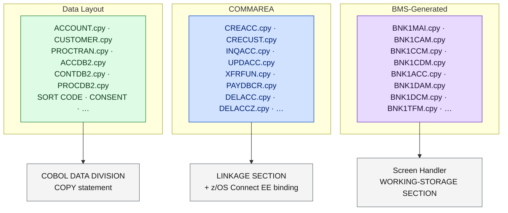

# Copybook Inventory

<strong>51 copybooks in <code>CBSA/copylib/</code>.</strong> They fall into three categories: <strong>Data Layout</strong> (structures for Db2 tables and VSAM records), <strong>COMMAREA</strong> (interface contracts between programs and z/OS Connect EE), and <strong>BMS-Generated</strong> (DSECT layouts produced by BMS map compilation — never edit these directly).

---

## Copybook Categories

**Legend:** Green = Data Layout · Blue = COMMAREA · Purple = BMS-Generated · Gray = usage site

---

## Data Layout Copybooks

Data layout copybooks define the physical record structure for Db2 rows and VSAM records. They are COPYed into the `DATA DIVISION` of programs that access those data stores.

<table class="compare-table">
<thead>
<tr>
  <th style="width:18%">Copybook</th>
  <th style="width:22%">Data Store</th>
  <th style="width:30%">Used By</th>
  <th style="width:30%">Description</th>
</tr>
</thead>
<tbody>
<tr>
  <td><code>ACCOUNT.cpy</code></td>
  <td>Db2 <code>IBMUSER.ACCOUNT</code></td>
  <td>INQACC, UPDACC, DELACC, CREACC</td>
  <td>Db2 ACCOUNT row layout (12 columns)</td>
</tr>
<tr>
  <td><code>CUSTOMER.cpy</code></td>
  <td>VSAM KSDS</td>
  <td>CRECUST, INQCUST, UPDCUST, DELCUS, INQACCCU</td>
  <td>VSAM Customer record layout — customers are stored in VSAM, not Db2</td>
</tr>
<tr>
  <td><code>PROCTRAN.cpy</code></td>
  <td>Db2 <code>IBMUSER.PROCTRAN</code></td>
  <td>All state-changing programs</td>
  <td>Db2 PROCTRAN audit record (9 columns)</td>
</tr>
<tr>
  <td><code>ACCDB2.cpy</code></td>
  <td>Db2 <code>IBMUSER.ACCOUNT</code></td>
  <td>Account programs</td>
  <td>DB2 host variable area for ACCOUNT</td>
</tr>
<tr>
  <td><code>CONTDB2.cpy</code></td>
  <td>Db2 <code>IBMUSER.CONTROL</code></td>
  <td>GETSCODE</td>
  <td>DB2 host variable area for CONTROL</td>
</tr>
<tr>
  <td><code>CONSTDB2.cpy</code></td>
  <td>Multiple Db2 tables</td>
  <td>Multiple</td>
  <td>Db2 constant definitions</td>
</tr>
<tr>
  <td><code>PROCDB2.cpy</code></td>
  <td>Db2 <code>IBMUSER.PROCTRAN</code></td>
  <td>Programs writing PROCTRAN</td>
  <td>DB2 host variable area for PROCTRAN</td>
</tr>
<tr>
  <td><code>SORTCODE.cpy</code></td>
  <td>n/a</td>
  <td>All programs</td>
  <td>Bank sort code constant (6-char, <code>987654</code>)</td>
</tr>
<tr>
  <td><code>BANKMAP.cpy</code></td>
  <td>n/a</td>
  <td>Multiple</td>
  <td>Bank-level map definitions</td>
</tr>
<tr>
  <td><code>CUSTMAP.cpy</code></td>
  <td>n/a</td>
  <td>Customer programs</td>
  <td>Customer screen map definitions</td>
</tr>
<tr>
  <td><code>DATASTR.cpy</code></td>
  <td>n/a</td>
  <td>CREACC, CRECUST</td>
  <td>Shared intermediate data structures</td>
</tr>
<tr>
  <td><code>ABNDINFO.cpy</code></td>
  <td>n/a</td>
  <td>ABNDPROC</td>
  <td>Abend information record structure</td>
</tr>
<tr>
  <td><code>CONSENT.cpy</code></td>
  <td>Db2 <code>IBMUSER.CONSENT</code></td>
  <td>CONSENT</td>
  <td>Consent table record layout</td>
</tr>
<tr>
  <td><code>CONSTAPI.cpy</code></td>
  <td>n/a</td>
  <td>DPAYAPI</td>
  <td>Payment API COMMAREA structure</td>
</tr>
<tr>
  <td><code>WAZI.cpy</code></td>
  <td>n/a</td>
  <td>(build testing)</td>
  <td>IBM Wazi test support copybook</td>
</tr>
<tr>
  <td><code>COPYRGHT.cpy</code></td>
  <td>n/a</td>
  <td>(all)</td>
  <td>IBM copyright header</td>
</tr>
</tbody>
</table>

---

## COMMAREA Copybooks

COMMAREA copybooks define the interface contract between a caller and a called CICS program. They are COPYed into the `LINKAGE SECTION` of the called program and are also used directly by z/OS Connect EE JSON binding.

<table class="compare-table">
<thead>
<tr>
  <th style="width:18%">Copybook</th>
  <th style="width:16%">Program</th>
  <th style="width:20%">Interface</th>
  <th style="width:46%">Description</th>
</tr>
</thead>
<tbody>
<tr>
  <td><code>CREACC.cpy</code></td>
  <td>CREACC</td>
  <td>Request + Response</td>
  <td>Create account COMMAREA</td>
</tr>
<tr>
  <td><code>CRECUST.cpy</code></td>
  <td>CRECUST</td>
  <td>Request + Response</td>
  <td>Create customer COMMAREA</td>
</tr>
<tr>
  <td><code>DELACC.cpy</code></td>
  <td>DELACC</td>
  <td>Request</td>
  <td>Delete account COMMAREA (request variant)</td>
</tr>
<tr>
  <td><code>DELACCZ.cpy</code></td>
  <td>DELACC</td>
  <td>Response</td>
  <td>Delete account COMMAREA (response variant)</td>
</tr>
<tr>
  <td><code>DELCUS.cpy</code></td>
  <td>DELCUS</td>
  <td>Request + Response</td>
  <td>Delete customer COMMAREA</td>
</tr>
<tr>
  <td><code>INQACC.cpy</code></td>
  <td>INQACC</td>
  <td>Response</td>
  <td>Enquire account response fields</td>
</tr>
<tr>
  <td><code>INQACCCU.cpy</code></td>
  <td>INQACCCU</td>
  <td>Response</td>
  <td>List accounts for customer</td>
</tr>
<tr>
  <td><code>INQACCCZ.cpy</code></td>
  <td>INQACCCU</td>
  <td>Response variant</td>
  <td>Enquire accounts (z/OS Connect variant)</td>
</tr>
<tr>
  <td><code>INQACCZ.cpy</code></td>
  <td>INQACC</td>
  <td>Response variant</td>
  <td>Enquire account (z/OS Connect variant)</td>
</tr>
<tr>
  <td><code>INQCUST.cpy</code></td>
  <td>INQCUST</td>
  <td>Response</td>
  <td>Enquire customer response fields</td>
</tr>
<tr>
  <td><code>INQCUSTZ.cpy</code></td>
  <td>INQCUST</td>
  <td>Response variant</td>
  <td>Enquire customer (z/OS Connect variant)</td>
</tr>
<tr>
  <td><code>UPDACC.cpy</code></td>
  <td>UPDACC</td>
  <td>Request + Response</td>
  <td>Update account COMMAREA</td>
</tr>
<tr>
  <td><code>UPDCUST.cpy</code></td>
  <td>UPDCUST</td>
  <td>Request + Response</td>
  <td>Update customer COMMAREA</td>
</tr>
<tr>
  <td><code>XFRFUN.cpy</code></td>
  <td>XFRFUN</td>
  <td>Request + Response</td>
  <td>Transfer funds COMMAREA</td>
</tr>
<tr>
  <td><code>PAYDBCR.cpy</code></td>
  <td>DPAYAPI / DBCRFUN</td>
  <td>Request + Response</td>
  <td>Payment debit/credit COMMAREA</td>
</tr>
<tr>
  <td><code>ACCTCTRL.cpy</code></td>
  <td>ACCTCTRL</td>
  <td>Control</td>
  <td>Account Named Counter control area</td>
</tr>
<tr>
  <td><code>CUSTCTRL.cpy</code></td>
  <td>CUSTCTRL</td>
  <td>Control</td>
  <td>Customer Named Counter control area</td>
</tr>
<tr>
  <td><code>CONTROLI.cpy</code></td>
  <td>Control programs</td>
  <td>Control</td>
  <td>Control table interface COMMAREA</td>
</tr>
<tr>
  <td><code>PROCISRT.cpy</code></td>
  <td>All UoW programs</td>
  <td>Helper</td>
  <td>PROCTRAN insert helper structure</td>
</tr>
<tr>
  <td><code>NEWACCNO.cpy</code></td>
  <td>CREACC</td>
  <td>Internal</td>
  <td>New account number workspace</td>
</tr>
<tr>
  <td><code>NEWCUSNO.cpy</code></td>
  <td>CRECUST</td>
  <td>Internal</td>
  <td>New customer number workspace</td>
</tr>
<tr>
  <td><code>STCUSTNO.cpy</code></td>
  <td>Multiple</td>
  <td>Internal</td>
  <td>Store customer number workspace</td>
</tr>
<tr>
  <td><code>RESPSTR.cpy</code></td>
  <td>Multiple</td>
  <td>Internal</td>
  <td>Response string structure</td>
</tr>
<tr>
  <td><code>GETCOMPY.cpy</code></td>
  <td>GETCOMPY</td>
  <td>Response</td>
  <td>Company name response</td>
</tr>
<tr>
  <td><code>GETSCODE.cpy</code></td>
  <td>GETSCODE</td>
  <td>Response</td>
  <td>Sort code response</td>
</tr>
</tbody>
</table>

---

## BMS-Generated Copybooks

BMS-generated copybooks are produced automatically during the BMS map compile step. They contain the DSECT layout for each map's field offsets and attributes.

<table class="compare-table">
<thead>
<tr>
  <th style="width:18%">Copybook</th>
  <th style="width:20%">Generated from</th>
  <th style="width:22%">Used by Screen Handler</th>
  <th style="width:40%">Notes</th>
</tr>
</thead>
<tbody>
<tr>
  <td><code>BNK1MAI.cpy</code></td>
  <td><code>BNK1MAI.bms</code></td>
  <td>BNKMENU</td>
  <td>Main menu DSECT</td>
</tr>
<tr>
  <td><code>BNK1CAM.cpy</code></td>
  <td><code>BNK1CAM.bms</code></td>
  <td>BNK1CAC</td>
  <td>Create account DSECT</td>
</tr>
<tr>
  <td><code>BNK1CCM.cpy</code></td>
  <td><code>BNK1CCM.bms</code></td>
  <td>BNK1CCA</td>
  <td>Create customer + account DSECT</td>
</tr>
<tr>
  <td><code>BNK1CDM.cpy</code></td>
  <td><code>BNK1CDM.bms</code></td>
  <td>BNK1CCS</td>
  <td>Create customer DSECT</td>
</tr>
<tr>
  <td><code>BNK1ACC.cpy</code></td>
  <td><code>BNK1ACC.bms</code></td>
  <td>BNK1CRA</td>
  <td>Account list DSECT</td>
</tr>
<tr>
  <td><code>BNK1DAM.cpy</code></td>
  <td><code>BNK1DAM.bms</code></td>
  <td>BNK1DAC</td>
  <td>Delete account DSECT</td>
</tr>
<tr>
  <td><code>BNK1DCM.cpy</code></td>
  <td><code>BNK1DCM.bms</code></td>
  <td>BNK1DCS</td>
  <td>Delete customer DSECT</td>
</tr>
<tr>
  <td><code>BNK1DDM.cpy</code></td>
  <td>(secondary map)</td>
  <td>(secondary)</td>
  <td>Secondary display DSECT</td>
</tr>
<tr>
  <td><code>BNK1TFM.cpy</code></td>
  <td><code>BNK1TFM.bms</code></td>
  <td>BNK1TFN</td>
  <td>Transfer DSECT</td>
</tr>
<tr>
  <td><code>BNK1UAM.cpy</code></td>
  <td><code>BNK1UAM.bms</code></td>
  <td>BNK1UAC</td>
  <td>Update account DSECT</td>
</tr>
</tbody>
</table>

<strong>Do not edit generated copybooks.</strong> Files matching <code>BNK1*.cpy</code> are overwritten by the BMS build step. Any manual edits will be silently lost on the next build. Edit the corresponding <code>.bms</code> source file instead.

