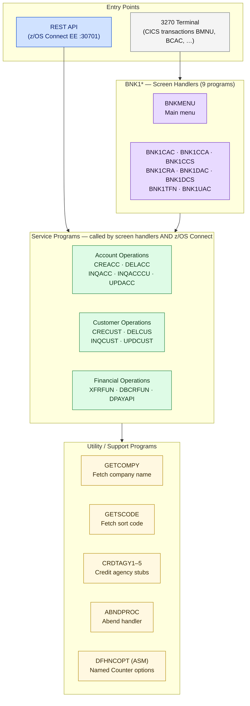

# Reference

This section contains quick-reference material for every aspect of the CBSA codebase — copybooks, BMS maps, naming patterns, and a glossary of platform terms.

---

## What's in This Section

  

    

      <svg viewBox="0 0 32 32" fill="none" xmlns="http://www.w3.org/2000/svg"><path d="M6 4h20v24H6z" stroke="#0043CE" stroke-width="2" fill="none"/><path d="M10 10h12M10 15h12M10 20h8" stroke="#0043CE" stroke-width="1.5" stroke-linecap="round"/></svg>
    

    <h3>Copybook Inventory</h3>
    
All 51 copybooks in three categories: data layout copybooks (DB2 row structures), COMMAREA copybooks (interface contracts), and BMS-generated DSECT copybooks. Includes which programs use each copybook.

    
<a href="copybooks.html">Browse Copybooks →</a>

  

  

    

      <svg viewBox="0 0 32 32" fill="none" xmlns="http://www.w3.org/2000/svg"><rect x="4" y="4" width="24" height="20" rx="2" stroke="#0043CE" stroke-width="2" fill="none"/><path d="M4 10h24M10 4v20" stroke="#0043CE" stroke-width="1.5"/></svg>
    

    <h3>BMS Maps Reference</h3>
    
Quick reference for all 10 BMS map sets, their map set names, map names, screen handlers, and generated copybooks. Includes the BMS compilation flow and screen layout conventions.

    
<a href="bms-maps.html">Browse BMS Maps →</a>

  

  

    

      <svg viewBox="0 0 32 32" fill="none" xmlns="http://www.w3.org/2000/svg"><path d="M8 8h16v4H8zM8 16h10v4H8z" stroke="#0043CE" stroke-width="2" fill="none"/><path d="M26 18l3 2-3 2" stroke="#0043CE" stroke-width="1.5" stroke-linecap="round" stroke-linejoin="round"/></svg>
    

    <h3>Naming Conventions</h3>
    
8-character program names, BMS map naming patterns (<code>BNK1xxx</code>), working-storage prefixes (<code>WS-</code>, <code>LS-</code>, <code>DB-</code>), and DB2 column naming patterns (<code>TABLE_FIELD</code>).

    
<a href="naming-conventions.html">Browse Naming Conventions →</a>

  

  

    

      <svg viewBox="0 0 32 32" fill="none" xmlns="http://www.w3.org/2000/svg"><circle cx="16" cy="16" r="12" stroke="#0043CE" stroke-width="2" fill="none"/><path d="M16 10v6l4 2" stroke="#0043CE" stroke-width="1.5" stroke-linecap="round"/></svg>
    

    <h3>Glossary</h3>
    
20+ terms defined: BMS, COMMAREA, DBB, HLQ, IPIC, Named Counter, SAR/AAR, UoW, zUnit, and more. Each entry includes a plain-English definition grounded in CBSA's actual usage.

    
<a href="glossary.html">Browse Glossary →</a>

  

---

## Quick Reference

At-a-glance values for the CBSA installation — useful when reading logs, JCL, or connection parameters.

<table class="compare-table">
<thead>
<tr>
  <th style="width:35%">Parameter</th>
  <th>Value</th>
</tr>
</thead>
<tbody>
<tr>
  <td><strong>Sort code</strong></td>
  <td><code>987654</code> — defined in <code>CBSA/copylib/SORTCODE.cpy</code></td>
</tr>
<tr>
  <td><strong>Db2 subsystem</strong></td>
  <td><code>DBCG</code></td>
</tr>
<tr>
  <td><strong>Db2 database</strong></td>
  <td><code>CBSA</code></td>
</tr>
<tr>
  <td><strong>Db2 collection / package</strong></td>
  <td><code>PCBSA</code></td>
</tr>
<tr>
  <td><strong>CICS region</strong></td>
  <td><code>CBSA</code></td>
</tr>
<tr>
  <td><strong>JVM server — Spring Boot UI</strong></td>
  <td><code>CBSAWLP</code> · HTTP port <code>19080</code></td>
</tr>
<tr>
  <td><strong>JVM server — z/OS Connect EE</strong></td>
  <td>Separate Liberty JVM server · HTTP port <code>30701</code> / HTTPS <code>30702</code></td>
</tr>
<tr>
  <td><strong>CICS IPIC port</strong></td>
  <td><code>30709</code> — IPCONN resource in CICS</td>
</tr>
<tr>
  <td><strong>Named Counter — accounts</strong></td>
  <td><code>HBNKACCT</code> — used by <code>CREACC</code> to generate account numbers</td>
</tr>
<tr>
  <td><strong>Named Counter — customers</strong></td>
  <td><code>HBNKCUST</code> — used by <code>CRECUST</code> to generate customer numbers</td>
</tr>
<tr>
  <td><strong>COBOL program count</strong></td>
  <td>39 COBOL programs + 1 Assembler program (<code>DFHNCOPT</code>)</td>
</tr>
<tr>
  <td><strong>Copybook count</strong></td>
  <td>51 copybooks in <code>CBSA/copylib/</code></td>
</tr>
<tr>
  <td><strong>REST API count</strong></td>
  <td>10 z/OS Connect EE services (OAS2) · 1 unified OAS3 spec (migration target)</td>
</tr>
<tr>
  <td><strong>BMS map count</strong></td>
  <td>10 BMS map definitions in <code>CBSA/bms/</code></td>
</tr>
</tbody>
</table>

---

## Program Naming Hierarchy

CBSA program names encode their role. The diagram below shows the naming groups and how they relate to the two entry points (3270 terminal and REST API).

**Legend:** Gray = external entry · Blue = REST layer · Purple = screen handlers · Green = service programs · Yellow = utilities

See [Screen Handlers](../programs/screen-handlers.html) and [Service Programs](../programs/service-programs.html) for the full program-level documentation.
