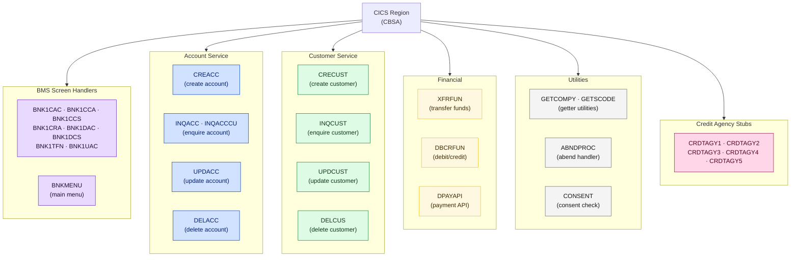

# Naming Conventions

<strong>All names in CBSA follow an 8-character uppercase z/OS convention.</strong> Understanding the naming patterns lets you immediately know what any program, copybook, or variable does — before opening a single source file.

---

## Program Name Patterns

**Legend:** Purple = BMS screen handlers · Blue = Account service · Green = Customer service · Yellow = Financial · Gray = Utilities · Pink = Credit agency stubs

---

## Program Naming Table

<table class="compare-table">
<thead>
<tr>
  <th style="width:12%">Prefix</th>
  <th style="width:20%">Category</th>
  <th style="width:20%">Meaning</th>
  <th style="width:48%">Examples</th>
</tr>
</thead>
<tbody>
<tr>
  <td><code>BNK1</code></td>
  <td>BMS Screen Handler</td>
  <td>BMS screen handler — has a paired BMS map and transaction definition</td>
  <td><code>BNK1CAC</code>, <code>BNK1CCA</code>, <code>BNK1CCS</code>, <code>BNK1CRA</code>, <code>BNK1DAC</code>, <code>BNK1DCS</code>, <code>BNK1TFN</code>, <code>BNK1UAC</code></td>
</tr>
<tr>
  <td><code>BNKMENU</code></td>
  <td>BMS Screen Handler</td>
  <td>Main menu — entry point for 3270 terminal sessions</td>
  <td><code>BNKMENU</code></td>
</tr>
<tr>
  <td><code>CREA</code></td>
  <td>Account Service</td>
  <td>Create Account</td>
  <td><code>CREACC</code></td>
</tr>
<tr>
  <td><code>INQA</code></td>
  <td>Account Service</td>
  <td>Enquire Account</td>
  <td><code>INQACC</code>, <code>INQACCCU</code></td>
</tr>
<tr>
  <td><code>UPDA</code></td>
  <td>Account Service</td>
  <td>Update Account</td>
  <td><code>UPDACC</code></td>
</tr>
<tr>
  <td><code>DELA</code></td>
  <td>Account Service</td>
  <td>Delete Account</td>
  <td><code>DELACC</code></td>
</tr>
<tr>
  <td><code>CREC</code></td>
  <td>Customer Service</td>
  <td>Create Customer</td>
  <td><code>CRECUST</code></td>
</tr>
<tr>
  <td><code>INQC</code></td>
  <td>Customer Service</td>
  <td>Enquire Customer</td>
  <td><code>INQCUST</code></td>
</tr>
<tr>
  <td><code>UPDC</code></td>
  <td>Customer Service</td>
  <td>Update Customer</td>
  <td><code>UPDCUST</code></td>
</tr>
<tr>
  <td><code>DELC</code></td>
  <td>Customer Service</td>
  <td>Delete Customer</td>
  <td><code>DELCUS</code></td>
</tr>
<tr>
  <td><code>XFR</code></td>
  <td>Financial</td>
  <td>Transfer function</td>
  <td><code>XFRFUN</code></td>
</tr>
<tr>
  <td><code>DBCR</code></td>
  <td>Financial</td>
  <td>Debit/Credit function</td>
  <td><code>DBCRFUN</code></td>
</tr>
<tr>
  <td><code>DPAY</code></td>
  <td>Financial</td>
  <td>Payment API entry point</td>
  <td><code>DPAYAPI</code></td>
</tr>
<tr>
  <td><code>GET</code></td>
  <td>Utility</td>
  <td>Getter utility — returns a single value to the caller</td>
  <td><code>GETCOMPY</code>, <code>GETSCODE</code></td>
</tr>
<tr>
  <td><code>ABND</code></td>
  <td>Utility</td>
  <td>Abend handler</td>
  <td><code>ABNDPROC</code></td>
</tr>
<tr>
  <td><code>CONS</code></td>
  <td>Utility</td>
  <td>Consent check / control</td>
  <td><code>CONSENT</code></td>
</tr>
<tr>
  <td><code>CRDT</code></td>
  <td>Credit Agency Stub</td>
  <td>Credit agency stub — five implementations for testing</td>
  <td><code>CRDTAGY1</code>–<code>CRDTAGY5</code></td>
</tr>
<tr>
  <td><code>T</code> (prefix)</td>
  <td>zUnit Test Case</td>
  <td>zUnit test case — located in <code>testcase/</code></td>
  <td><code>TBNKMENU</code></td>
</tr>
</tbody>
</table>

---

## BMS Map Naming

BMS map sets follow the pattern `BNK1xxx` where `xxx` is a 3-character suffix identifying the screen. The compiled map set produces both a load module and a generated copybook of the same name.

<table class="compare-table">
<thead>
<tr>
  <th style="width:14%">Suffix</th>
  <th style="width:20%">Map Set Name</th>
  <th style="width:20%">Map Name</th>
  <th style="width:22%">Screen Handler Program</th>
  <th style="width:24%">Screen Purpose</th>
</tr>
</thead>
<tbody>
<tr>
  <td><code>MAI</code></td>
  <td><code>BNK1MAI</code></td>
  <td><code>BNK1MAI</code></td>
  <td>BNKMENU</td>
  <td>Main menu</td>
</tr>
<tr>
  <td><code>CAM</code></td>
  <td><code>BNK1CAM</code></td>
  <td><code>BNK1CAM</code></td>
  <td>BNK1CAC</td>
  <td>Create account</td>
</tr>
<tr>
  <td><code>CCM</code></td>
  <td><code>BNK1CCM</code></td>
  <td><code>BNK1CCM</code></td>
  <td>BNK1CCA</td>
  <td>Create customer + account</td>
</tr>
<tr>
  <td><code>CDM</code></td>
  <td><code>BNK1CDM</code></td>
  <td><code>BNK1CDM</code></td>
  <td>BNK1CCS</td>
  <td>Create customer (display)</td>
</tr>
<tr>
  <td><code>ACC</code></td>
  <td><code>BNK1ACC</code></td>
  <td><code>BNK1ACC</code></td>
  <td>BNK1CRA</td>
  <td>Account list</td>
</tr>
<tr>
  <td><code>DAM</code></td>
  <td><code>BNK1DAM</code></td>
  <td><code>BNK1DAM</code></td>
  <td>BNK1DAC</td>
  <td>Delete account</td>
</tr>
<tr>
  <td><code>DCM</code></td>
  <td><code>BNK1DCM</code></td>
  <td><code>BNK1DCM</code></td>
  <td>BNK1DCS</td>
  <td>Delete customer</td>
</tr>
<tr>
  <td><code>TFM</code></td>
  <td><code>BNK1TFM</code></td>
  <td><code>BNK1TFM</code></td>
  <td>BNK1TFN</td>
  <td>Transfer funds</td>
</tr>
<tr>
  <td><code>UAM</code></td>
  <td><code>BNK1UAM</code></td>
  <td><code>BNK1UAM</code></td>
  <td>BNK1UAC</td>
  <td>Update account</td>
</tr>
<tr>
  <td><code>B2M</code></td>
  <td><code>BNK1B2M</code></td>
  <td><code>BNK1B2M</code></td>
  <td>(secondary)</td>
  <td>Secondary account map</td>
</tr>
</tbody>
</table>

---

## Working-Storage Prefix Conventions

All field names within COBOL programs use a 2–3 character prefix that identifies the section and purpose of the field.

<table class="compare-table">
<thead>
<tr>
  <th style="width:15%">Prefix</th>
  <th style="width:35%">Section / Area</th>
  <th style="width:50%">Examples</th>
</tr>
</thead>
<tbody>
<tr>
  <td><code>WS-</code></td>
  <td>Working-Storage fields</td>
  <td><code>WS-ACCOUNT-NUMBER</code>, <code>WS-SORT-CODE</code></td>
</tr>
<tr>
  <td><code>LS-</code></td>
  <td>Linkage Section fields (COMMAREA)</td>
  <td><code>LS-COMMAREA</code>, <code>LS-ACCOUNT-NUMBER</code></td>
</tr>
<tr>
  <td><code>IO-</code></td>
  <td>File I/O record areas (VSAM)</td>
  <td><code>IO-CUSTOMER-RECORD</code></td>
</tr>
<tr>
  <td><code>DB-</code></td>
  <td>DB2 host variable areas</td>
  <td><code>DB-ACCOUNT-NUMBER</code>, <code>DB-SORT-CODE</code></td>
</tr>
<tr>
  <td><code>ERR-</code></td>
  <td>Error handling fields</td>
  <td><code>ERR-MSG</code>, <code>ERR-RESP</code>, <code>ERR-RESP2</code></td>
</tr>
</tbody>
</table>

---

## Db2 Naming Patterns

All CBSA Db2 objects are owned by `IBMUSER` and follow `<QUALIFIER>.<ENTITY>` conventions.

<table class="compare-table">
<thead>
<tr>
  <th style="width:25%">Object Type</th>
  <th style="width:40%">Name</th>
  <th style="width:35%">Notes</th>
</tr>
</thead>
<tbody>
<tr>
  <td><strong>Subsystem</strong></td>
  <td><code>DBCG</code></td>
  <td>Db2 for z/OS subsystem name</td>
</tr>
<tr>
  <td><strong>Collection (plan)</strong></td>
  <td><code>PCBSA</code></td>
  <td><code>P</code> prefix = package/plan. Used in BIND statements</td>
</tr>
<tr>
  <td><strong>Table — accounts</strong></td>
  <td><code>IBMUSER.ACCOUNT</code></td>
  <td>Primary account table (12 columns)</td>
</tr>
<tr>
  <td><strong>Table — audit</strong></td>
  <td><code>IBMUSER.PROCTRAN</code></td>
  <td>Processing transaction audit log</td>
</tr>
<tr>
  <td><strong>Table — control</strong></td>
  <td><code>IBMUSER.CONTROL</code></td>
  <td>Bank control record (sort code etc.)</td>
</tr>
<tr>
  <td><strong>Table — consent</strong></td>
  <td><code>IBMUSER.CONSENT</code></td>
  <td>Customer consent flags</td>
</tr>
<tr>
  <td><strong>Index — account PK</strong></td>
  <td><code>IBMUSER.ACCTINDX</code></td>
  <td>Primary key index on ACCOUNT_NUMBER</td>
</tr>
<tr>
  <td><strong>Index — account-by-customer</strong></td>
  <td><code>IBMUSER.ACCTCUST</code></td>
  <td>Index on ACCOUNT_CUSTOMER_NUMBER — supports INQACCCU</td>
</tr>
<tr>
  <td><strong>Index — control PK</strong></td>
  <td><code>IBMUSER.CONTINDX</code></td>
  <td>Primary key index on CONTROL table</td>
</tr>
</tbody>
</table>

Column names follow the pattern `<TABLE>_<FIELD>` in uppercase:

- `ACCOUNT_NUMBER`, `ACCOUNT_TYPE`, `ACCOUNT_ACTUAL_BALANCE`
- `CUSTOMER_NUMBER`, `CUSTOMER_NAME`, `CUSTOMER_DATE_OF_BIRTH`
- `PROCTRAN_DATE`, `PROCTRAN_AMOUNT`, `PROCTRAN_TYPE`

---

## z/OS Connect EE Service Naming

z/OS Connect EE service names follow the pattern `CS<entity><operation>` where `entity` encodes the domain (`acc` = account, `cust` = customer) and `operation` encodes the action (`cre`, `enq`, `upd`, `del`, `acc`).

<table class="compare-table">
<thead>
<tr>
  <th style="width:20%">Service Name</th>
  <th style="width:16%">Entity</th>
  <th style="width:16%">Operation</th>
  <th style="width:22%">CICS Program</th>
  <th style="width:26%">HTTP Method + Path</th>
</tr>
</thead>
<tbody>
<tr>
  <td><code>CSacccre</code></td>
  <td>Account</td>
  <td>Create</td>
  <td>CREACC</td>
  <td><code>POST /creacc/insert</code></td>
</tr>
<tr>
  <td><code>CSaccdel</code></td>
  <td>Account</td>
  <td>Delete</td>
  <td>DELACC</td>
  <td><code>DELETE /delacc/delete/{accountNumber}</code></td>
</tr>
<tr>
  <td><code>CSaccenq</code></td>
  <td>Account</td>
  <td>Enquire</td>
  <td>INQACC</td>
  <td><code>GET /inqacc/enquire/{accountNumber}</code></td>
</tr>
<tr>
  <td><code>CSaccupd</code></td>
  <td>Account</td>
  <td>Update</td>
  <td>UPDACC</td>
  <td><code>PUT /updacc/update</code></td>
</tr>
<tr>
  <td><code>CScustacc</code></td>
  <td>Customer</td>
  <td>List accounts</td>
  <td>INQACCCU</td>
  <td><code>GET /inqacccu/enquire/{customerNumber}</code></td>
</tr>
<tr>
  <td><code>CScustcre</code></td>
  <td>Customer</td>
  <td>Create</td>
  <td>CRECUST</td>
  <td><code>POST /crecust/insert</code></td>
</tr>
<tr>
  <td><code>CScustdel</code></td>
  <td>Customer</td>
  <td>Delete</td>
  <td>DELCUS</td>
  <td><code>DELETE /delcus/delete/{customerNumber}</code></td>
</tr>
<tr>
  <td><code>CScustenq</code></td>
  <td>Customer</td>
  <td>Enquire</td>
  <td>INQCUST</td>
  <td><code>GET /inqcust/enquire/{customerNumber}</code></td>
</tr>
<tr>
  <td><code>CScustupd</code></td>
  <td>Customer</td>
  <td>Update</td>
  <td>UPDCUST</td>
  <td><code>PUT /updcust/update</code></td>
</tr>
<tr>
  <td><code>Pay</code></td>
  <td>Payment</td>
  <td>Payment</td>
  <td>DPAYAPI</td>
  <td><code>POST /dpayapi/payment</code></td>
</tr>
</tbody>
</table>

Service names are case-sensitive in z/OS Connect EE. The <code>CS</code> prefix is uppercase; entity and operation segments are lowercase. The <code>Pay</code> service is an exception — it was registered separately from the <code>CS*</code> naming convention.

---

## Copybook Naming

<table class="compare-table">
<thead>
<tr>
  <th style="width:25%">Pattern</th>
  <th style="width:35%">Rule</th>
  <th style="width:40%">Examples</th>
</tr>
</thead>
<tbody>
<tr>
  <td>Matches program name</td>
  <td>COMMAREA copybooks share the name of the program they interface</td>
  <td><code>CREACC.cpy</code> → CREACC, <code>INQACC.cpy</code> → INQACC</td>
</tr>
<tr>
  <td><code>Z</code> suffix</td>
  <td>z/OS Connect EE variant — adjusted field lengths or padding for JSON mapping</td>
  <td><code>INQACCZ.cpy</code>, <code>INQCUSTZ.cpy</code>, <code>INQACCCZ.cpy</code>, <code>DELACCZ.cpy</code></td>
</tr>
<tr>
  <td><code>DB2</code> suffix</td>
  <td>Db2 host variable area for the named table</td>
  <td><code>ACCDB2.cpy</code>, <code>CONTDB2.cpy</code>, <code>PROCDB2.cpy</code>, <code>CONSTDB2.cpy</code></td>
</tr>
<tr>
  <td><code>BNK1*</code></td>
  <td>BMS-generated DSECT — name matches the BMS map set exactly. Never edit directly</td>
  <td><code>BNK1MAI.cpy</code>, <code>BNK1CAM.cpy</code>, <code>BNK1TFM.cpy</code></td>
</tr>
<tr>
  <td>Descriptive name</td>
  <td>Data layout and helper copybooks use an abbreviated descriptive name (max 8 chars)</td>
  <td><code>SORTCODE.cpy</code>, <code>DATASTR.cpy</code>, <code>ABNDINFO.cpy</code>, <code>PROCTRAN.cpy</code></td>
</tr>
</tbody>
</table>

---

## JCL Job Name Patterns

| Pattern | Purpose |
|---|---|
| `CRExx##.jcl` | Create Db2 object (xx = object type abbreviation, ## = sequence number) |
| `DRPxx##.jcl` | Drop Db2 object |
| `RUNZUNIT.jcl` | Job card for zUnit test execution |
