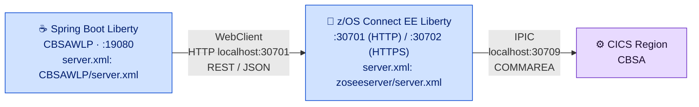

# Liberty Server Configuration

The z/OS Connect EE Liberty server is the REST gateway between the Spring Boot UI and the CICS application programs. Its configuration lives in [`zoseeserver/server.xml`](../../../zoseeserver/server.xml).

<div class="callout callout-green">
<strong>Two Liberty servers, one LPAR.</strong> The z/OS Connect EE Liberty server (<code>zoseeserver/server.xml</code>) is the REST gateway. It runs as a separate Liberty JVM server from the Spring Boot UI — both are inside the same z/OS LPAR, communicating over <code>localhost</code>.
</div>

---

## Server Architecture



Both servers are Liberty JVM servers hosted inside the CICS region. They do not share a `server.xml` — each has its own configuration and lifecycle.

---

## Liberty Features

The z/OS Connect EE server requires exactly three Liberty features. No additional features (e.g., `servlet`, `webProfile`) are needed.

```xml
<featureManager>
    <feature>zosconnect:zosConnect-2.0</feature>
    <feature>zosconnect:cicsService-1.0</feature>
    <feature>zosconnect:zosConnectCommands-1.0</feature>
</featureManager>
```

| Feature | Purpose |
|---|---|
| `zosconnect:zosConnect-2.0` | Core z/OS Connect EE 2.0 runtime — REST API gateway, JSON transformation, request routing |
| `zosconnect:cicsService-1.0` | CICS service provider — manages the IPIC connection to the CICS region and COMMAREA marshalling |
| `zosconnect:zosConnectCommands-1.0` | Admin commands support — enables the `ZCON` CICS transaction for refresh and status commands |

---

## HTTP Endpoint

```xml
<!-- To access this server from a remote client add a host attribute to the following element, e.g. host="*" -->
<httpEndpoint id="defaultHttpEndpoint"
              host="*"
              httpPort="30701"
              httpsPort="30702" />
```

| Attribute | Value | Notes |
|---|---|---|
| `host` | `*` | Binds to **all** network interfaces — change to the specific hostname in production |
| `httpPort` | `30701` | Used by Spring Boot `WebClient` (localhost calls) |
| `httpsPort` | `30702` | TLS endpoint — requires `defaultKeyStore` to be configured |

---

## CICS IPIC Connection

```xml
<zosconnect_cicsIpicConnection id="cicsConn" host="localhost" port="30709" />
```

The IPIC (IP interconnectivity) connection routes z/OS Connect EE service calls to the CICS region using the standard CICS IPIC protocol. The matching CICS resource — an `IPCONN` definition — must be installed in the CICS region listening on port `30709`.

<div class="callout">
<strong>CICS IPCONN resource:</strong> Ensure a CICS <code>IPCONN</code> resource is defined and installed for port <code>30709</code> before starting the z/OS Connect EE server. Without it, all service invocations fail with a connection error.
</div>

---

## Security Configuration

### KeyStore

```xml
<keyStore id="defaultKeyStore" password="Liberty"/>
```

The default keystore protects the HTTPS endpoint on port 30702. The password `Liberty` is the Liberty default — **change it before deploying to any non-development environment**.

### Basic Registry

```xml
<basicRegistry id="basic1" realm="zosConnect">
    <user name="ibmuser" password="SYS1" />
</basicRegistry>
```

The basic registry defines a single user `ibmuser` with password `SYS1`. This is a development-only credential. See the [Production Hardening Checklist](#production-hardening-checklist) for the replacement steps.

<div class="callout callout-yellow">
<strong>Not for production:</strong> The basic registry with <code>ibmuser/SYS1</code> ships as a demo credential. Replace it with an SAF-backed registry or an LDAP registry in any environment accessible beyond the development LPAR.
</div>

### Authorization Role

```xml
<authorization-roles id="zos.connect.access.roles">
    <security-role name="zosConnectAccess">
        <user name="ibmuser"/>
    </security-role>
</authorization-roles>
```

Only users assigned the `zosConnectAccess` role can invoke z/OS Connect EE services. The current configuration grants that role to `ibmuser` alone.

---

## CORS Configuration

```xml
<!-- add cors to allow cross origin access, e.g. when using swagger UI to fetch swagger doc -->
<cors id="defaultCORSConfig"
      domain="/"
      allowedOrigins="*"
      allowedMethods="GET, POST, PUT, DELETE, OPTIONS"
      allowedHeaders="Origin, Content-Type, Authorization"
      allowCredentials="true"
      maxAge="3600"/>
```

| CORS Attribute | Current Value | Purpose |
|---|---|---|
| `allowedOrigins` | `*` | Allows any origin — development convenience only |
| `allowedMethods` | `GET, POST, PUT, DELETE, OPTIONS` | All HTTP methods needed by the 10 CBSA APIs |
| `allowedHeaders` | `Origin, Content-Type, Authorization` | Standard headers including Basic Auth header |
| `allowCredentials` | `true` | Required when Spring Boot passes `Authorization` header |
| `maxAge` | `3600` | Pre-flight cache duration in seconds (1 hour) |

<div class="callout callout-yellow">
<strong>Restrict <code>allowedOrigins</code> in production.</strong> The wildcard <code>*</code> allows any browser or client to invoke the REST APIs. In production, restrict <code>allowedOrigins</code> to the Spring Boot UI hostname (e.g., <code>https://cbsa.example.com:19080</code>).
</div>

---

## Configuration Polling

Automatic polling for configuration changes is **disabled** in this server — this is the recommended setting for z/OS Connect EE as noted in the `server.xml` comments.

```xml
<!-- config requires updateTrigger="mbean" for REFRESH command support -->
<config updateTrigger="mbean" monitorInterval="500"/>

<!-- zosConnect APIs -->
<zosconnect_zosConnectAPIs updateTrigger="disabled" pollingRate="5s"/>

<!-- zosConnect Services -->
<zosconnect_services updateTrigger="disabled" pollingRate="5s"/>

<!-- applicationMonitor is not applicable for zCEE servers -->
<applicationMonitor updateTrigger="disabled" dropinsEnabled="false"/>
```

The `server.xml` comment explains the rationale: *"Disabling automatic polling for changes to configuration files, deployed services and APIs is a prudent option for z/OS Connect EE. Polling might be convenient for iterative development and test systems, but not for production."*

**To apply configuration changes without restarting Liberty:**

1. Edit `zoseeserver/server.xml` on USS.
2. Issue the CICS `ZCON` transaction with the `REFRESH` command — this triggers the MBean-based refresh (`updateTrigger="mbean"`).
3. Verify the change was applied by checking the Liberty messages log.

Alternatively, restart the Liberty JVM server through CICS (`CEMT SET JVMSERVER(zoseeserver) DISABLED` then `ENABLED`).

---

## Manager Configuration

```xml
<zosconnect_zosConnectManager
    requireAuth="false"
    requireSecure="false"
    setUTF8ResponseEncoding="true"/>
```

| Attribute | Current Value | Production Recommendation |
|---|---|---|
| `requireAuth` | `false` | Set to `true` — enforce authentication on all API calls |
| `requireSecure` | `false` | Set to `true` — reject plain HTTP requests, require HTTPS |
| `setUTF8ResponseEncoding` | `true` | Keep `true` — ensures correct character encoding in JSON responses |

<div class="callout callout-yellow">
<strong>Set <code>requireAuth=true</code> and <code>requireSecure=true</code> in production.</strong> The current values disable authentication and TLS enforcement for development convenience. Both must be enabled before the server is accessible from outside the development LPAR.
</div>

---

## Production Hardening Checklist

Before exposing the z/OS Connect EE server beyond the development LPAR:

- [ ] **Change keystore password** — replace `password="Liberty"` in `<keyStore>` with a strong password and update the corresponding keystore file.
- [ ] **Replace basic registry credentials** — remove `ibmuser/SYS1` from `<basicRegistry>` and configure an SAF-backed or LDAP registry.
- [ ] **Restrict CORS origins** — change `allowedOrigins="*"` to the exact Spring Boot UI host:port.
- [ ] **Set `requireAuth="true"`** — in `<zosconnect_zosConnectManager>` — enforces authentication on all REST calls.
- [ ] **Set `requireSecure="true"`** — in `<zosconnect_zosConnectManager>` — rejects plain HTTP requests.
- [ ] **Restrict `httpEndpoint` host** — change `host="*"` to the specific server hostname or IP to prevent unintended binding.
