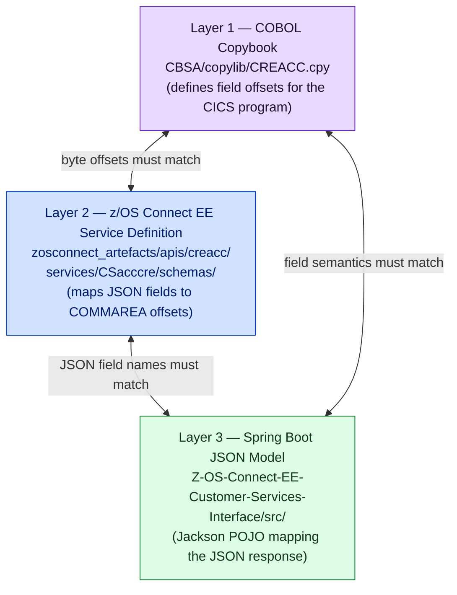

# z/OS Connect EE Services Reference

The z/OS Connect EE service definitions expose the CICS application programs as standard REST APIs that the Spring Boot UI (and any other HTTP client) can call without any COBOL knowledge.

<div class="callout callout-green">
<strong>10 z/OS Connect EE services expose CICS programs as REST APIs.</strong> Each service maps a REST endpoint to a CICS COMMAREA via an IPIC connection. The service definitions live in <code>zosconnect_artefacts/services/</code> and <code>zosconnect_artefacts/apis/</code>.
</div>

---

## Service Architecture

```mermaid
flowchart LR
    HTTP["🌐 HTTP Request\n(Spring Boot WebClient\nor any REST client)"]:::external

    subgraph ZC ["z/OS Connect EE Liberty (:30701)"]
        ROUTE["Request Router\n(OAS2 path matching)"]:::jvm
        XFORM["JSON ↔ COMMAREA\nTransformation Layer\n(request.map / mapping.xml)"]:::jvm
    end

    subgraph CICS ["CICS Region (CBSA)"]
        LINK["EXEC CICS LINK\nvia IPIC :30709"]:::cobol
        PROG["COBOL Program\ne.g. CREACC, INQACC"]:::cobol
    end

    DATA1["🗄️ Db2 for z/OS\n(ACCOUNT, PROCTRAN)"]:::data
    DATA2["📁 VSAM KSDS\n(CUSTOMER)"]:::data

    HTTP -->|"JSON body / path params"| ROUTE
    ROUTE --> XFORM
    XFORM -->|"COMMAREA bytes"| LINK
    LINK --> PROG
    PROG -->|"EXEC SQL"| DATA1
    PROG -->|"EXEC CICS FILE"| DATA2
    DATA1 -.->|"result rows"| PROG
    DATA2 -.->|"record bytes"| PROG
    PROG -.->|"COMMAREA response"| XFORM
    XFORM -.->|"JSON response body"| HTTP

    classDef external fill:#f4f4f4,stroke:#697077,color:#161616
    classDef jvm     fill:#d0e2ff,stroke:#0043ce,color:#001d6c
    classDef cobol   fill:#e8daff,stroke:#6929c4,color:#1c0f30
    classDef data    fill:#defbe6,stroke:#198038,color:#0e3818
```



---

## Service Inventory

<table class="compare-table">
<thead>
<tr>
  <th style="width:12%">Service</th>
  <th style="width:13%">API Directory</th>
  <th style="width:8%">HTTP</th>
  <th style="width:22%">OAS2 Path</th>
  <th style="width:13%">CICS Program</th>
  <th style="width:17%">Data Store</th>
  <th>Spring Boot Route</th>
</tr>
</thead>
<tbody>
<tr>
  <td><code>CSacccre</code></td>
  <td><code>creacc</code></td>
  <td><code>POST</code></td>
  <td><code>/creacc/insert</code></td>
  <td><code>CREACC</code></td>
  <td>Db2 ACCOUNT</td>
  <td><code>/creacc</code></td>
</tr>
<tr>
  <td><code>CSaccdel</code></td>
  <td><code>delacc</code></td>
  <td><code>DELETE</code></td>
  <td><code>/delacc/remove/{accno}</code></td>
  <td><code>DELACC</code></td>
  <td>Db2 ACCOUNT</td>
  <td><code>/delacct</code></td>
</tr>
<tr>
  <td><code>CSaccenq</code></td>
  <td><code>inqaccz</code></td>
  <td><code>GET</code></td>
  <td><code>/inqaccz/enquiry/{accno}</code></td>
  <td><code>INQACC</code></td>
  <td>Db2 ACCOUNT</td>
  <td><code>/enqacct</code></td>
</tr>
<tr>
  <td><code>CSaccupd</code></td>
  <td><code>updacc</code></td>
  <td><code>PUT</code></td>
  <td><code>/updacc/update</code></td>
  <td><code>UPDACC</code></td>
  <td>Db2 ACCOUNT</td>
  <td><code>/updacc</code></td>
</tr>
<tr>
  <td><code>CScustacc</code></td>
  <td><code>inqacccz</code></td>
  <td><code>GET</code></td>
  <td><code>/inqacccz/list/{custno}</code></td>
  <td><code>INQACCCU</code></td>
  <td>Db2 ACCOUNT</td>
  <td><code>/listaccts</code></td>
</tr>
<tr>
  <td><code>CScustcre</code></td>
  <td><code>crecust</code></td>
  <td><code>POST</code></td>
  <td><code>/crecust/insert</code></td>
  <td><code>CRECUST</code></td>
  <td>VSAM KSDS</td>
  <td><code>/crecust</code></td>
</tr>
<tr>
  <td><code>CScustdel</code></td>
  <td><code>delcus</code></td>
  <td><code>DELETE</code></td>
  <td><code>/delcus/remove/{custno}</code></td>
  <td><code>DELCUS</code></td>
  <td>VSAM KSDS</td>
  <td><code>/delcust</code></td>
</tr>
<tr>
  <td><code>CScustenq</code></td>
  <td><code>inqcustz</code></td>
  <td><code>GET</code></td>
  <td><code>/inqcustz/enquiry/{custno}</code></td>
  <td><code>INQCUST</code></td>
  <td>VSAM KSDS</td>
  <td><code>/enqcust</code></td>
</tr>
<tr>
  <td><code>CScustupd</code></td>
  <td><code>updcust</code></td>
  <td><code>PUT</code></td>
  <td><code>/updcust/update</code></td>
  <td><code>UPDCUST</code></td>
  <td>VSAM KSDS</td>
  <td><code>/updcust</code></td>
</tr>
<tr>
  <td><code>Pay</code></td>
  <td><code>makepayment</code></td>
  <td><code>PUT</code></td>
  <td><code>/makepayment/dbcr</code></td>
  <td><code>DPAYAPI</code></td>
  <td>Db2 ACCOUNT + PROCTRAN</td>
  <td><code>/payment</code></td>
</tr>
</tbody>
</table>

---

## Repository Structure

Service and API definitions are stored as source in `zosconnect_artefacts/`. Pre-built SAR/AAR binary archives are **not** committed to the repository — deploy from the source definitions.

```
zosconnect_artefacts/
├── apis/                         ← OAS2 API definitions (one directory per API)
│   ├── creacc/
│   │   ├── api-docs/swagger.json ← OAS2 Swagger document
│   │   ├── api/insert/POST/      ← mapping.xml + request.map
│   │   ├── services/CSacccre/    ← service schemas and manifest
│   │   └── package.xml
│   ├── delacc/
│   ├── inqaccz/
│   ├── inqacccz/
│   ├── updacc/
│   ├── crecust/
│   ├── delcus/
│   ├── inqcustz/
│   ├── updcust/
│   └── makepayment/              ← (10 API directories total)
├── services/                     ← Standalone service definitions (10 total)
└── openapi3/                     ← NEW: unified OAS3 specification
    └── cbsa-banking-api.yaml     ← Single spec replacing all 10 swagger.json files
```

<div class="callout">
<strong>SAR/AAR files are not stored in the repository.</strong> The <code>zosconnect_artefacts/</code> directory contains the source definitions — not pre-built binary archives. Build and deploy the SAR/AAR files from the service definitions when installing or updating z/OS Connect EE services.
</div>

---

## COMMAREA Contract — The Three-Layer Rule

A CICS COMMAREA is a fixed-length byte buffer. Every field's offset is computed at compile time. Changing any COMMAREA field — adding, removing, or resizing — requires **three synchronised updates**. Missing any one of them produces a silent data corruption at runtime.



| Layer | Location | Change Required |
|---|---|---|
| **1 — COBOL copybook** | `CBSA/copylib/<prog>.cpy` | Update the field definition; recompile and redeploy the COBOL program |
| **2 — z/OS Connect EE service definition** | `zosconnect_artefacts/apis/<api>/services/<svc>/schemas/` | Update the request/response JSON schema; rebuild and redeploy the SAR |
| **3 — Spring Boot JSON model** | `Z-OS-Connect-EE-Customer-Services-Interface/src/` | Update the Java POJO field; rebuild and redeploy the WAR |

<div class="callout">
<strong>Use Bob's impact-analysis skill to trace all 3 layers automatically.</strong> Ask: <em>"Show me all files that need to change if I resize the ACCOUNT_ACTUAL_BALANCE field in CREACC's COMMAREA."</em> Bob will trace the copybook dependency, the z/OS Connect schema, and the Spring Boot model class in a single analysis pass.
</div>

---

## Verifying Services

Use the z/OS Connect EE admin endpoints to verify that services and APIs loaded correctly after deployment:

```bash
# List all installed APIs
GET http://localhost:30701/zosConnect/apis

# List all installed services
GET http://localhost:30701/zosConnect/services

# Check a specific API
GET http://localhost:30701/zosConnect/apis/creacc

# Fetch the OAS2 Swagger document for an API
GET http://localhost:30701/creacc/api-docs
```

After deploying or refreshing, verify:
1. The API and service names appear in the list responses.
2. The `swagger.json` document is reachable from the admin endpoint.
3. A test invocation returns HTTP 200 (or the expected 4xx) rather than a 404 or 500.

---

## OAS3 Modernization Path

The 10 OAS2 `swagger.json` files in `zosconnect_artefacts/apis/*/api-docs/` are the current production API contracts. A unified OAS3 specification is available in `zosconnect_artefacts/openapi3/cbsa-banking-api.yaml`.

<table class="compare-table">
<thead>
<tr>
  <th style="width:25%">Dimension</th>
  <th class="col-legacy" style="width:37%">OAS2 / Swagger 2.0 (Current)</th>
  <th class="col-modern" style="width:38%">OAS3 / OpenAPI 3.0 (Target)</th>
</tr>
</thead>
<tbody>
<tr>
  <td><strong>Spec format</strong></td>
  <td class="col-legacy">10 separate <code>swagger.json</code> files (one per API)</td>
  <td class="col-modern">Single <code>cbsa-banking-api.yaml</code> covering all operations</td>
</tr>
<tr>
  <td><strong>Example endpoint (create account)</strong></td>
  <td class="col-legacy"><code>POST /creacc/insert</code></td>
  <td class="col-modern"><code>POST /accounts</code> — RESTful resource naming</td>
</tr>
<tr>
  <td><strong>Error responses</strong></td>
  <td class="col-legacy">Only HTTP 200 defined per swagger.json</td>
  <td class="col-modern">400, 404, 409, 500 with dedicated schemas</td>
</tr>
<tr>
  <td><strong>z/OS Connect version</strong></td>
  <td class="col-legacy">z/OS Connect EE 2.0 (<code>cicsService-1.0</code>)</td>
  <td class="col-modern">z/OS Connect 3.0 — new API config format</td>
</tr>
</tbody>
</table>

See [OAS3 Migration with Bob](../../modernization/oas3-migration-with-bob.html) for a step-by-step walkthrough of the migration using AI-assisted development.
